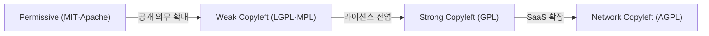
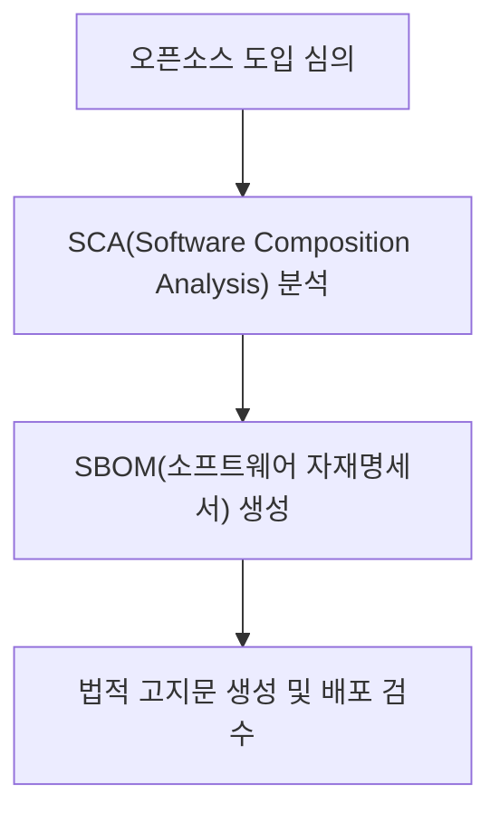

## 지식 로드맵 내 현재 위치

지식 위치: 소프트웨어 공학 → 공공 SW·거버넌스 → **오픈소스 라이선스**

## 30초 인출

- 본질: **오픈소스 라이선스(OSS License)**는 오픈소스 소프트웨어의 사용, 복제, 수정, 재배포 시 준수해야 하는 법적 권리와 의무(저작권 고지, 소스코드 공개 등)를 규정한 계약
- 메커니즘: **Permissive**(최소 조건) · **Copyleft**(동일 조건 제공) · **Source-Available**(용도 제한 가능)을 구분
- 효과: 라이선스 위반 소송 방지 · 기업 지식재산권(IP) 보호 · **SBOM** 기반 컴플라이언스 체계 확립

핵심 용어

- **Open Source License**: 저작권자가 소프트웨어 소스코드를 무상 공개하며 사용자에게 부과하는 법적 라이선스 규약
- **Permissive License(허용적 라이선스)**: 소스코드 공개 의무가 없으며, 저작권 및 라이선스 고지만 유지하면 상용 독점 소프트웨어에 자유롭게 결합 가능한 라이선스 (MIT, Apache 2.0)
- **Copyleft(카피레프트)**: 지식재산권을 공유하기 위해 이를 수정한 2차적 저작물도 동일한 라이선스로 소스코드를 공개하도록 강제하는 원칙 (GPL)
- **AGPL(Affero GPL)**: 배포(Distribution)되지 않고 네트워크 서버(SaaS) 형태로만 서비스되는 경우에도 소스코드 공개 의무를 강제하는 라이선스
- **SSPL / BSL**: 소스는 열람할 수 있으나 용도 제한이 있어 Open Source Initiative(OSI) 승인 오픈소스와 구분되는 라이선스

---

## 1교시 예상문제 (10점)

> 오픈소스 라이선스(Permissive·Copyleft)와 Source-Available 라이선스의 정의와 목적, 핵심 구조와 작동 원리를 설명하시오. (예상)

---

## 1교시 10점 답안

### 1. 정의·목적

- 정의: **오픈소스 라이선스**는 소스코드 사용, 수정, 배포 시 준수해야 할 저작권 고지 및 소스코드 공개 의무를 규정한 법적 계약
- 목적: 지식재산권 보호, 라이선스 전염 방지, 안전한 상용 소프트웨어 개발

### 2. 주요 라이선스 스펙트럼

### 3. 핵심 통제

- **SBOM 관리**: SPDX/CycloneDX 기반 오픈소스 자재명세서 작성
- **SCA 자동화**: CI/CD 파이프라인에서 GPL/AGPL 유입을 감지하여 빌드 차단
---

## 2~4교시 예상문제 (25점)

> 오픈소스 소프트웨어(OSS) 라이선스의 개념과 법적 효력을 설명하고, 허용적(Permissive) 라이선스와 카피레프트(Copyleft) 라이선스의 특징 비교, AGPL 및 최신 클라우드 대응 라이선스(SSPL, BSL)의 등장 배경과 기업의 오픈소스 컴플라이언스(SBOM) 거버넌스 방안을 제시하시오. (25점)

> (25점, 예상)

---

## 2~4교시 25점 답안

### Ⅰ. 소프트웨어 자산 보호와 준법의 핵심, 오픈소스 라이선스의 개요

> 오픈소스는 "공짜 소프트웨어"가 아니며, 라이선스 조건을 위반하면 저작권 침해로 소스코드 강제 공개와 판매 금지 소송에 직면한다.

- 정의: 오픈소스 소프트웨어 개발자가 이용자에게 소스코드의 사용, 수정, 배포 권한을 부여하면서 일정한 의무사항을 준수하도록 규정한 법적 계약
- 목적: 소프트웨어 공유 생태계 발전, 지식재산권(IP) 보호, 기업 상용화 시 라이선스 충돌 및 **독점 코드 강제 공개 리스크** 방어

### Ⅱ. 오픈소스 라이선스 유형별 의무 범위 비교

> 의무 범위는 라이선스 원문·결합 방식·배포 형태에 따라 달라지므로 개별 조건을 판정해야 한다.

### 오픈소스 라이선스 스펙트럼 및 의무 강도 비교

| 라이선스 계열 | 대표 라이선스 | 소스코드 공개 의무 범위 | 특허 조항 | 상용 소프트웨어 결합 위험도 |
|---|---|---|---|---|
| **Permissive** | MIT, BSD, Apache 2.0 | **공개 의무 없음** (고지만 유지) | Apache 2.0(특허권 명시) | **극히 낮음** (기업 친화적) |
| **Weak Copyleft** | LGPL 2.1/3.0, MPL | 해당 오픈소스 모듈 수정 시만 공개 | LGPL 3.0(특허 보증) | 보통 (동적 링크 시 안전) |
| **Strong Copyleft** | GPL 2.0/3.0 | **결합된 파생 저작물 전체 공개** | GPL 3.0(특허 보증) | **매우 높음** (독점 코드 노출 위험) |
| **Network Copyleft**| AGPL 3.0 | 수정 프로그램의 네트워크 이용자에게 대응 소스 제공 기회 | AGPL 3.0 | 서비스 방식·수정 범위 검토 필요 |

### Ⅲ. 오픈소스와 구분할 Source-Available 라이선스: SSPL·BSL

> AWS 등 거대 클라우드 기업이 오픈소스를 무료로 가져다 매니지드 서비스(SaaS)로 판매하자 원저작사들이 반격에 나섰다.

### 1. 등장 배경
- MongoDB, Redis, Elastic 등 오픈소스 기업들이 막대한 개발비를 투입했으나, 빅테크 클라우드 벤더가 수익을 독식(Free-rider 문제)
- 기존 AGPL의 허점을 파고들어 서비스 소스코드를 공개하지 않는 클라우드 벤더를 통제하기 위해 탄생

### 2. SSPL vs BSL 비교

| 구분 | SSPL (Server Side Public License) | BSL (Business Source License) |
|---|---|---|
| **제창 기업** | MongoDB, Elastic (이후 복귀) | HashiCorp (Terraform), Couchbase |
| **핵심 제약** | 소프트웨어를 서비스(SaaS)로 제공하려면, **전체 백엔드 관리 인프라 소스코드까지 전면 공개** | 비상업적 이용은 무료, 프로덕션 상업적 이용 또는 경쟁 서비스 제공 제한 |
| **전환 기간** | 영구적 규제 | 일정 기간(예: 4년) 경과 후 오픈소스(Apache)로 자동 전환 |
| **OSI 승인 여부** | **미승인 (Non-OSS)** (차별 금지 조항 위배) | **미승인 (Non-OSS)** (소스 가용성 모델) |

### Ⅳ. 오픈소스 컴플라이언스 문제점·대응책

> 엔터프라이즈 환경에서는 개발 전 과정에서 오픈소스 라이선스 오염을 감시하는 SBOM 기반 거버넌스가 필수적이다.

### 1. 오픈소스 컴플라이언스 절차

### 2. 오픈소스 라이선스 실무 위험 및 대응 통제

| 위험 | 대책 | 효과 |
|---|---|---|
| Strong Copyleft(GPL) 무단 혼입 | CI 파이프라인 내 SCA(Black Duck) 연동 및 빌드 차단 | 독점 소스코드 강제 공개 위험 원천 차단 |
| 오픈소스 고지 의무 누락 | SPDX/CycloneDX 기반 SBOM 및 라이선스 고지문 자동 생성 | 저작권 침해 분쟁 및 법적 제재 예방 |
| AI 코딩 도구 발 라이선스 오염 | 공개 코드 매칭 필터링 활성화 및 코드 정밀 검증 | 생성형 AI 기반 지식재산권 침해 방지 |

### Ⅴ. 라이선스 원문 판정 중심의 결론

> 오픈소스 관리는 개발팀의 자율에만 맡길 수 없는 전사적 법무·보안·엔지니어링 통합 거버넌스 영역이다.

### 학습자 통찰 메모 — 답안 밖

- [핵심 통찰]: 최근 AI 코딩 도구(GitHub Copilot 등)가 생성한 코드에 GPL 라이선스 코드가 무단 복제되어 상용 제품에 유입되는 'AI 라이선스 오염'이 새로운 복병으로 등장함. 코드 생성 도구의 필터링 옵션 강제와 소스코드 정밀 스캔(SCA)이 필수적임.
- 나라면: 사내 오픈소스 정책을 수립하여 외부 공개 제품에는 Permissive(MIT, Apache 2.0)만 허용하고, GPL 계열은 완전 차단하되 내부 개발 도구에만 제한적으로 승인하는 3단계 블랙리스트/화이트리스트 통제 정책을 강제하겠음.

### 실전 답안용 기술사적 제언

- **판정 기준**: 외부 배포 및 상용화 여부에 따른 라이선스 허용 목록(Whitelist) 판정 (상용: Permissive 원칙, Copyleft 전면 제한)
- **대응 방안**: **SCA 도구(Black Duck/Snyk)** 연동 CI/CD Quality Gate 구축 및 **SBOM(SPDX/CycloneDX)** 의무 발행 체계 정립
- **검증 체계**: Strong/Network Copyleft(GPL/AGPL) 유입 0건 통제 및 빌드 시 라이선스 고지문(Notice) 자동 생성 일치성 검증
- **기대 효과**: 저작권 침해 소송 및 상용 독점 소스코드 강제 공개 위험 원천 제거, 글로벌 소프트웨어 공급망 투명성 확보
---

## 출제 이력과 검증 출처

- 제134회 정보관리기술사 1교시: 오픈소스 라이선스(GPL, LGPL, Apache, MIT) 비교
- 제140회 정보관리기술사 2교시: 오픈소스 컴플라이언스 체계와 SBOM 및 AI 생성코드 라이선스 이슈
- Open Source Initiative (OSI), The Open Source Definition

## 연결 토픽

- 이전 토픽: [기술 부채](./016_technical_debt.md)
- 연관 토픽: [오픈소스 거버넌스](./112_open_source.md), [형상관리](./011_configuration_management.md)
- 다음 토픽: [UML 다이어그램 체계](./020_uml_diagrams.md)
