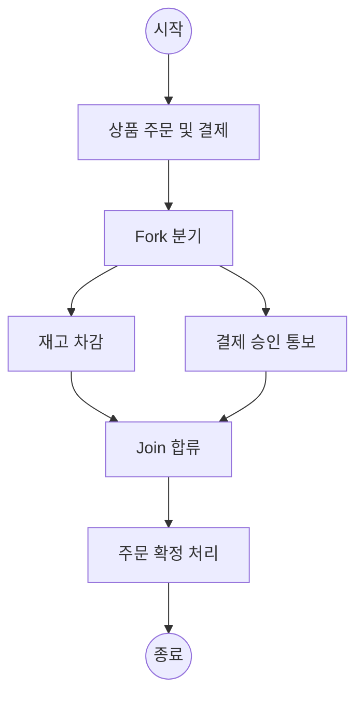

## 지식 로드맵 내 현재 위치

지식 위치: 소프트웨어 공학 → 아키텍처·설계 → **UML 다이어그램 체계(활동 다이어그램)**

## 30초 인출

- 본질: **UML(Unified Modeling Language)**은 객체지향 소프트웨어 시스템의 산출물을 가시화, 명세화, 구축, 문서화하기 위한 OMG 표준 통합 모델링 언어
- 메커니즘: **구조 다이어그램(7종)**(정적 구조: Class, Component 등) + **행위 다이어그램(7종)**(동적 흐름: Use Case, **Activity**, Sequence 등)
- 효과: 이해관계자 간 명확한 의사소통 · 아키텍처 가시화 · **활동 다이어그램(Activity Diagram)**을 통한 복잡한 비즈니스 로직 및 병렬 워크플로우 완벽 명세

핵심 용어

- **UML(Unified Modeling Language)**: Booch, Rumbaugh, Jacobson의 방법론을 통합하여 OMG에서 표준화한 객체지향 모델링 언어
- **Structural Diagram(구조 다이어그램)**: 시스템의 정적 개념, 관계, 물리적 배치를 표현하는 7종의 다이어그램
- **Behavioral Diagram(행위 다이어그램)**: 시스템 내부 요소들의 동적 행위, 시간 경과에 따른 상태 변화를 표현하는 7종의 다이어그램
- **Activity Diagram(활동 다이어그램)**: 시스템 내부 처리 과정의 제어 흐름과 데이터 흐름, 병렬 처리를 표현하는 행위 다이어그램
- **Swimlane(스윔레인)**: 활동 다이어그램에서 각 액션의 수행 주체(역할, 부서, 시스템)를 열이나 행으로 구분하는 영역

---

## 1교시 예상문제 (10점)

> UML 다이어그램 체계(구조·행위, 활동 다이어그램)의 정의와 목적, 핵심 구조와 작동 원리를 설명하시오. (예상)
---

## 1교시 10점 답안

### 1. 정의·목적

- 정의: **UML(Unified Modeling Language)**은 객체지향 시스템의 산출물을 시각적으로 가시화, 명세화, 구축, 문서화하는 표준 모델링 언어
- 목적: 설계 의사소통 표준화 및 아키텍처 구조·동적 행위의 사전 검증

### 2. 구조(7종) vs 행위(7종) 체계 요약

### 3. 활동 다이어그램 핵심 통제

- **Fork / Join**: 굵은 가로선을 통해 병렬 흐름의 분기와 동기화 대기를 정형화
- **Swimlane**: 처리 주체(부서, 시스템)별 책임 구획선 명확화
---

## 2~4교시 예상문제 (25점)

> UML(Unified Modeling Language) 2.x의 14가지 다이어그램 체계를 구조(Structural)와 행위(Behavioral) 관점으로 분류하여 설명하고, 비즈니스 프로세스 모델링에 사용되는 활동 다이어그램(Activity Diagram)의 주요 구성요소와 포크/조인(Fork/Join) 표기법을 제시하시오. (25점)

> (25점, 예상)
---

## 2~4교시 25점 답안

### Ⅰ. 소프트웨어 설계 시각화의 국제 표준, UML의 개요

> 복잡한 소프트웨어 시스템을 자연어로만 기술하면 모호성과 오해가 발생하므로, 정형화된 시각적 표준 언어로 명세해야 한다.

- 정의: 객체지향 시스템을 모델링하기 위해 산출물을 시각적으로 가시화(Visualizing), 명세화(Specifying), 구축(Constructing), 문서화(Documenting)하는 표준 모델링 언어(ISO/IEC 19505)
- 목적: 분석가·설계자·개발자·고객 간의 공통 언어 확립, 구현 전 아키텍처 검증, 유지보수 용이성 및 설계 추적성 확보

### Ⅱ. UML 2.x 14종 다이어그램 체계

> 시스템의 정적 청사진을 나타내는 구조 다이어그램과 동적 실행 흐름을 나타내는 행위 다이어그램으로 체계화된다.

| 분류 | 다이어그램 | 표현 초점 |
|---|---|---|
| **구조 (7종) · 정적** | Class | 클래스 및 관계 |
| 구조 | Object | 객체 인스턴스 |
| 구조 | Package | 모듈 구조 |
| 구조 | Component | 컴포넌트/인터페이스 |
| 구조 | Composite Structure | 복합체 구조 |
| 구조 | Deployment | 배치/인프라 노드 |
| 구조 | Profile | UML 확장 메커니즘 |
| **행위 (7종) · 동적** | Use Case | 요구기능/액터 |
| 행위 | **Activity** | 업무 흐름/병렬 |
| 행위 | State Machine | 상태 전이 |
| 행위 | Sequence | 시간순 메시지 교환 |
| 행위 | Communication | 객체 간 관계 중심 |
| 행위 | Timing | 시간 제약/상태 |
| 행위 | Interaction Overview | 상호작용 개요 |

### Ⅲ. 활동 다이어그램(Activity Diagram)의 구조 및 구성요소

> 전통적 순서도(Flowchart)를 객체지향 관점으로 확장하여 병렬 처리와 책임 주체를 명확히 표현한다.

### 활동 다이어그램(Activity Diagram) 표기법 및 스윔레인(Swimlane)

| 구성요소 | 표기법 심볼 | 설명 및 역할 |
|---|---|---|
| **Action Node** | 모서리가 둥근 사각형 | 더 이상 분할할 수 없는 최소 단위의 실행 단계 |
| **Control Flow** | 실선 화살표 (`→`) | 액션 간의 실행 제어 흐름 전달 |
| **Decision / Merge** | 마름모 (`◇`) | 조건에 따른 분기(가드 조건 `[조건]`) 및 분기 흐름 결합 |
| **Fork Node** | 굵은 직선 (1:N) | 병렬 처리를 위해 단일 흐름을 여러 개의 동시 흐름으로 분기 |
| **Join Node** | 굵은 직선 (N:1) | 모든 병렬 흐름이 도달할 때까지 동기화 대기 후 진행 |
| **Swimlane (스윔레인)** | 수직/수평 분할 구획선 | 액션을 수행하는 주체(예: 고객, 주문시스템, 결제사)를 역할별로 구분 |

### Ⅳ. UML 모델링 문제점·대응책

> 시스템 모델링 시 표현하려는 관점에 따라 가장 적합한 다이어그램을 선택해야 한다.

### 1. 주요 행위 다이어그램 비교

| 비교 항목 | 유스케이스 다이어그램 | 순차 다이어그램 (Sequence) | 활동 다이어그램 (Activity) | 상태 다이어그램 (State) |
|---|---|---|---|---|
| **주요 관점** | 시스템 **외부 기능 요구** | 객체 간 **시간순 메시지 교환** | 시스템 내부 **업무 처리 절차** | 단일 객체의 **상태 변화 생명주기** |
| **적합한 단계** | 요구사항 분석 초기 | 상세 분석 및 설계 단계 | 비즈니스 프로세스 분석 | 복잡한 생명주기를 갖는 엔티티 |
| **병렬 표현** | 불가능 | 가능하나 복잡함 | **Fork/Join으로 매우 우수** | 동시성 복합 상태로 표현 |
| **주요 활용** | 과업 범위 확정 | API 시퀀스, 인터페이스 설계 | 업무 흐름도, 알고리즘 로직 | 주문/결제 상태 머신 설계 |

### 2. UML 모델링 실무 위험 및 대응 통제

| 위험 | 대책 | 효과 |
|---|---|---|
| 코드 변경 시 UML 다이어그램 동기화 누락 | PlantUML/Mermaid 기반 Docs-as-Code 및 Git 연동 | 설계 문서 최신성 및 형상 일관성 유지 |
| 비즈니스 병렬 흐름 표기 오류(데드락) | 활동 다이어그램 내 Fork-Join 쌍 일치성 및 완료 조건 검증 | 동시성 흐름 설계 오류 및 교착상태 사전 차단 |
| 14종 전 다이어그램 작성에 따른 공수 낭비 | 분석·설계 목적별 핵심 3종(Class, Sequence, Activity) 선별 표준화 | 모델링 생산성 향상 및 실효적 의사소통 집중 |

### Ⅴ. 목적별 뷰 일관성 중심의 결론

> UML 다이어그램은 목적별 이해관계자의 관점을 표현하고 모델 간 일관성을 관리하는 소프트웨어 자산이다.

### 학습자 통찰 메모 — 답안 밖

- [핵심 통찰]: 현업에서 UML이 사장된 이유는 '그려놓고 코드가 바뀌면 문서를 갱신하지 않아 문서가 쓰레기가 되는' 동기화 실패 때문임. 현대에는 14종 다이어그램을 모두 그리는 대신, 의사소통에 필수적인 3종(Class, Sequence, Activity)만 선별 작성하고, Mermaid나 PlantUML처럼 '코드로 관리하는 다이어그램(Docs-as-Code)' 체계로 전환해야 함.
- 나라면: CI/CD 파이프라인에서 Git 커밋 시 Markdown 내 Mermaid 다이어그램을 자동 렌더링하도록 설정하고, 소스코드 변경 시 아키텍처 문서가 함께 버전 관리되도록 체계화하겠음.

### 실전 답안용 기술사적 제언

- **판정 기준**: 분석·설계 단계별 의사소통 목적에 따른 핵심 3종(클래스, 시퀀스, 활동) 다이어그램 선별 표준화 판정
- **대응 방안**: **Docs-as-Code(PlantUML/Mermaid)** 기반 코드형 다이어그램 체계 도입 및 소스코드와 단일 형상 관리
- **검증 체계**: 요구사항(SRS)-UML 다이어그램-구현 코드 간 RTM 100% 추적성 및 Git 커밋 시 다이어그램 자동 빌드 검증
- **기대 효과**: 형식적 모델링 공수 60% 절감, 아키텍처 문서의 최신성 보장 및 비즈니스 동시성(Fork/Join) 설계 무결성 달성
---

## 출제 이력과 검증 출처

- 제137회 정보관리기술사 1교시: UML 2.x 다이어그램 체계 및 활동 다이어그램
- ISO/IEC 19505:2012 Information technology - OMG Unified Modeling Language (OMG UML)
- Martin Fowler, UML Distilled: A Brief Guide to the Standard Object Modeling Language (3rd Edition)

## 연결 토픽

- 이전 토픽: [오픈소스 라이선스](./018_open_source_license.md)
- 연관 토픽: [클래스 다이어그램](./045_class_diagram.md), [유스케이스 다이어그램](./026_use_case_diagram.md)
- 다음 토픽: [Open API](./022_open_api.md)
