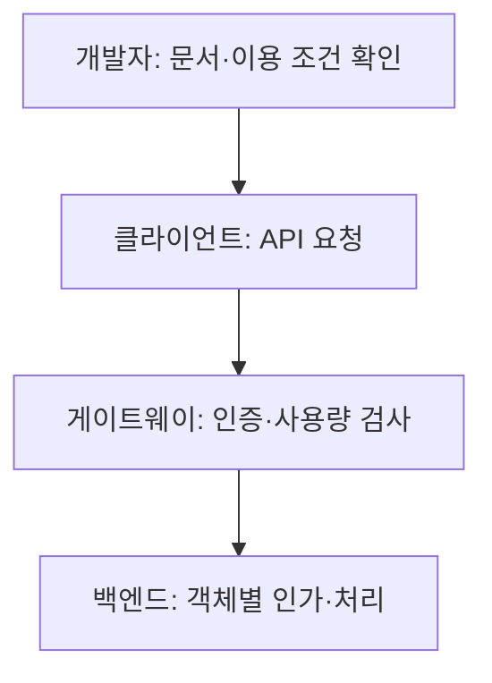
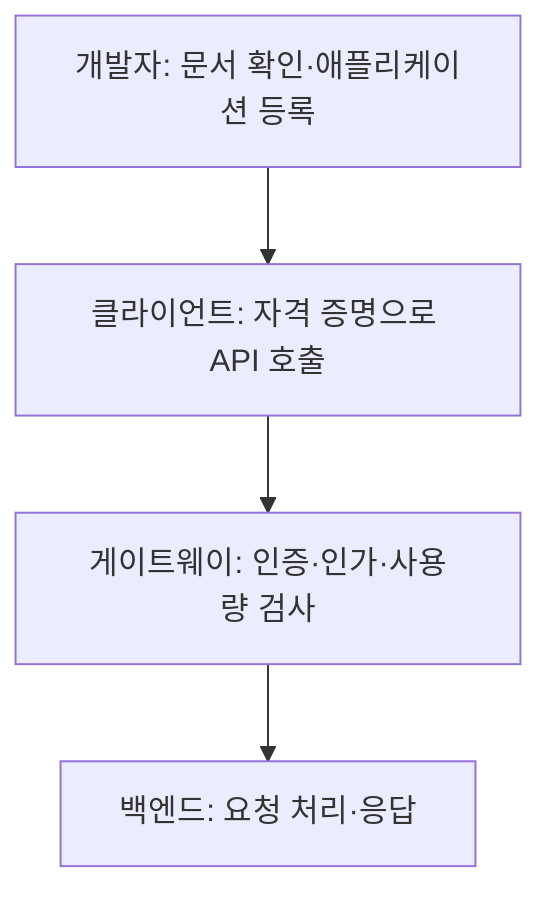

## 지식 로드맵 내 현재 위치

지식 위치: 소프트웨어 공학 → 구현·객체지향·API → **Open API(API 일반)**

## 30초 인출

- 본질: **Open API**는 기업·기관이 보유한 데이터와 비즈니스 기능을 외부 개발자 및 파트너가 자유롭게 활용할 수 있도록 표준 규격으로 공개한 프로그래밍 인터페이스
- 메커니즘: 표준화된 프로토콜(REST/JSON) + 보안 인가(**OAuth 2.0/API Key**) + 제어/모니터링(**API Gateway**)
- 효과: 디지털 생태계 확장 · 마이데이터 활성화 · 서비스 융합 혁신 · 신규 수익 모델(Monetization) 창출

핵심 용어

- **Open API**: 외부 개발자에게 플랫폼의 핵심 데이터와 기능을 프로그래밍 방식으로 개방하는 공개 인터페이스
- **API Gateway**: 인증, 인가, 라우팅, 속도 제한, 로깅, 분석을 중앙에서 일괄 처리하는 관문 컴포넌트
- **OAuth 2.0**: 제3자 애플리케이션이 사용자 비밀번호 노출 없이 리소스에 제한적으로 접근할 수 있도록 권한을 위임하는 표준 프레임워크
- **Rate Limiting / Throttling**: 서비스 가용성 보장을 위해 클라이언트별 단위 시간당 호출 횟수를 제한하는 기법
- **API 경제(API Economy)**: API를 독립된 제품(Product)으로 간주하여 플랫폼 간 상호연결을 통해 가치를 창출하는 비즈니스 패러다임

---

## 1교시 예상문제 (10점)

> Open API의 개념과 외부 호출 흐름, 접근 통제 방법을 설명하시오. (예상)

---

## 1교시 10점 답안

### Ⅰ. 정의·목적

- 정의: **Open API**는 외부 개발자가 공개된 계약과 권한에 따라 기능·데이터를 호출할 수 있는 인터페이스다.
- 목적: 외부 연계를 늘리면서 호출 권한과 사용량을 관리한다.

### Ⅱ. 핵심 아키텍처 요소

### Ⅲ. 핵심 통제

- **인가**: 토큰 범위뿐 아니라 요청한 객체에 대한 권한을 확인한다.
- **호출 제한**: 이용 주체별 속도·할당량을 정해 백엔드를 보호한다.

제언: 공개 문서와 실제 권한·응답 계약이 일치하는지 연계 시험으로 확인한다.
---

## 2~4교시 예상문제 (25점)

> Open API의 개념과 외부 호출 구조, 개방 범위별 운영 차이를 설명하고 객체별 인가·호출량·개인정보 노출 위험에 대한 대응 방안을 제시하시오. (예상)

> (25점, 예상)

---

## 2~4교시 25점 답안

### Ⅰ. 디지털 생태계 확장의 관문, Open API의 개요

> Open API는 외부 개발자가 정해진 계약과 권한에 따라 서비스 기능·데이터를 호출할 수 있도록 공개한 인터페이스다.

| 구분 | 핵심 |
|---|---|
| 정의 | 호출 방법·입출력·접근 조건을 공개해 외부 애플리케이션과 연계 |
| 목적 | 기능 재사용과 서비스 연계를 늘리되 접근 권한과 사용량을 통제 |

### Ⅱ. Open API 아키텍처 및 핵심 구성요소

> 개발자는 문서와 이용 자격을 확인한 뒤 API를 호출하고, 게이트웨이는 인증·사용량을 검사해 백엔드로 전달한다.

### Open API 3계층 아키텍처 및 API Gateway 보안·제어 흐름

| 핵심 구성요소 | 주요 기술 및 메커니즘 | 실무 역할 |
|---|---|---|
| **인증/인가 (Auth)** | **OAuth 2.0, OpenID Connect, JWT, API Key** | 사용자 권한 위임 및 API 호출 클라이언트 검증 |
| **트래픽 제어** | **Rate Limiting, Throttling, Quota** | 클라이언트별 사용량 제한과 백엔드 보호 |
| **명세 제공** | **OAS(OpenAPI Specification)** 등 | 요청·응답 계약과 오류 정의 공유 |
| **모니터링/분석** | ELK 스택, Prometheus, Distributed Tracing | API 사용 패턴 분석, 과금(Billing) 데이터 집계, 장애 감지 |

### Ⅲ. 프라이빗 API vs 파트너 API vs 오픈 API 비교

> 서비스 대상과 개방 수준에 따라 거버넌스와 보안 요구사항이 차등화된다.

| 구분 | 프라이빗 API (Private) | 파트너 API (Partner) | 퍼블릭 Open API (Public) |
|---|---|---|---|
| **이용 대상** | 사내 내부 개발팀 | 전략적 제휴사, 특정 B2B 파트너 | **불특정 다수 외부 개발자, 일반 대중** |
| **개방 목적** | 시스템 간 결합도 완화 및 재사용 | 비즈니스 파트너십 및 공동 서비스 | **플랫폼 생태계 확장 및 비즈니스 혁신** |
| **보안 통제** | 내부 이용자 인증·인가 | 계약 범위에 맞는 접근 제어 | 이용자·애플리케이션 단위 인증·인가와 사용량 제한 |
| **운영 기준** | 내부 버전 관리 | 계약·접근 범위 관리 | 공개 문서·버전·사용량·오류 정책 관리 |

### Ⅳ. Open API 운영 문제점·대응책

> 외부 호출이 늘어날수록 객체별 인가·호출량·응답 데이터 범위를 서버에서 확인해야 한다.

| 위험 | 대책 | 효과 |
|---|---|---|
| BOLA(객체 수준 인가 손상) | 요청 주체가 대상 객체에 접근할 권한이 있는지 서버에서 검사 | 다른 이용자의 데이터 접근 차단 |
| 대량 호출 | 이용 주체·자원별 속도와 할당량 제한 | 백엔드 과부하 완화 |
| 민감정보 과다 응답 | 목적에 필요한 필드만 응답하고 접근 기록 점검 | 불필요한 정보 노출 축소 |

### Ⅴ. 외부 연계 운영을 위한 제언

> 호출 방법을 쉽게 제공하되 주체·객체·사용량을 각각 확인하고 변경 시 이용자에게 미리 알린다.

| 문제 | 해결 방안 |
|---|---|
| API 계약이 서비스마다 달라 외부 이용자가 변경 영향을 예측하기 어려움 | 제언: 새 API 공개 전에 요청·응답 스키마와 호환성 정책을 정하고, 소비자 계약시험과 종료 안내를 릴리스 승인 기준에 포함한다. |
---

## 출제 이력과 검증 출처

- 제133회 정보관리기술사 1교시: Open API 개념 및 API Gateway
- 제134회 정보관리기술사 2교시: 금융 마이데이터와 Open API 보안 대책
- OWASP API Security Top 10 (2023)

## 연결 토픽

- 이전 토픽: [UML 다이어그램 체계](./020_uml_diagrams.md)
- 연관 토픽: [REST](./015_rest.md), [API Gateway](./075_api_gateway.md)
- 다음 토픽: [정보은닉](./024_information_hiding.md)
