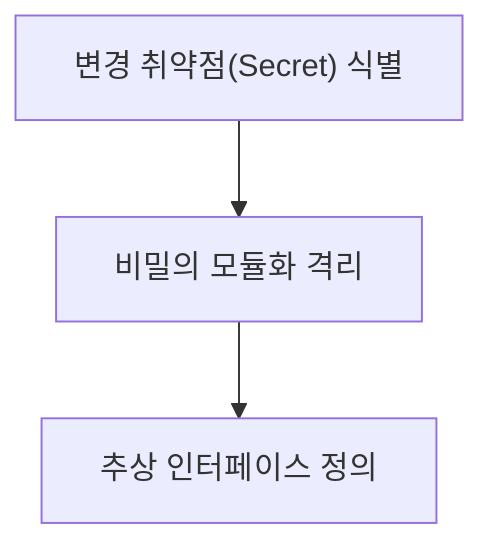

## 지식 로드맵 내 현재 위치

지식 위치: 소프트웨어 공학 → 아키텍처·설계 → **정보은닉(Information Hiding)**

## 30초 인출

- 본질: **정보은닉(Information Hiding)**은 데이비드 파나스(David Parnas)가 제안한 모듈화의 기본 원리로, 변경될 가능성이 높은 내부 구현 상세(자료구조, 알고리즘)를 감추고 안정적인 공개 인터페이스만을 외부에 노출하는 설계 원칙
- 메커니즘: 내부 상태 비공개(**Private**) + 공개 메서드(**Public Interface**) 노출 + 구현 상세의 캡슐화
- 효과: 모듈 간 결합도(Coupling) 최소화 · 파급 효과(Ripple Effect) 차단 · 독립적 모듈 변경 및 유지보수성 극대화

핵심 용어

- **Information Hiding(정보은닉)**: 모듈 내부의 복잡한 구현이나 변경되기 쉬운 설계 결정을 비밀(Secret)로 유지하여 외부로부터 숨기는 원칙
- **Encapsulation(캡슐화)**: 연관된 데이터와 행위를 하나의 논리적 단위로 묶고 접근 제어자를 통해 정보은닉을 물리적으로 구현하는 기제
- **Interface(인터페이스)**: 모듈이 외부와 통신할 수 있도록 공개한 최소한의 계약 규격
- **Ripple Effect(파급 효과)**: 소프트웨어의 한 모듈을 변경했을 때 다른 모듈까지 연쇄적으로 오류가 전파되는 현상
- **Parnas Principles**: 변경 가능성이 높은 결정사항(자료구조, 하드웨어 의존성)을 모듈의 비밀로 삼아 설계하라는 데이비드 파나스의 분할 원칙

---

## 1교시 예상문제 (10점)

> 정보은닉(Information Hiding)의 정의와 목적, 핵심 구조와 작동 원리를 설명하시오. (예상)
---

## 1교시 10점 답안

### 1. 정의·목적

- 정의: **정보은닉(Information Hiding)**은 변경되기 쉬운 내부 구현 상세를 비밀로 보호하고 불변의 인터페이스만 외부에 제공하는 모듈화 설계 원리
- 목적: 모듈 간 결합도 최소화 및 변경에 따른 파급 효과(Ripple Effect) 차단

### 2. 핵심 메커니즘 (Public vs Private)

### 3. 핵심 통제

- **Parnas 분할**: 기능 순서가 아닌 '숨겨야 할 비밀'을 기준으로 모듈 경계 획정
- **Tell, Don't Ask**: 객체의 내부 상태를 묻지 말고 행동을 지시하여 데이터 은닉 보장
---

## 2~4교시 예상문제 (25점)

> 객체지향 및 모듈화 설계의 핵심 원리인 정보은닉(Information Hiding)의 개념과 파나스(Parnas)의 모듈 분할 기준을 설명하고, 캡슐화(Encapsulation)와의 차이점 및 정보은닉이 소프트웨어 유지보수성과 결합도에 미치는 영향을 제시하시오. (25점)

> (25점, 예상)
---

## 2~4교시 25점 답안

### Ⅰ. 변경의 파급을 차단하는 소프트웨어 설계의 근간, 정보은닉의 개요

> 정보은닉은 단순히 변수를 숨기는 접근 제어가 아니라, 소프트웨어의 변경 취약점을 국소화하는 아키텍처적 방어벽이다.

- 정의: 모듈 내부의 세부 구현 사항(자료구조, 하드웨어 인터페이스, 알고리즘)을 모듈의 **비밀(Secret)**로 보호하고, 변경되지 않는 인터페이스만 외부에 공개하는 설계 원리
- 목적: 모듈 간 상호 의존성을 낮추어 변경에 따른 **파급 효과(Ripple Effect)**를 차단하고, 병렬 개발 및 소프트웨어 재사용성을 극대화

### Ⅱ. 파나스(Parnas)의 모듈 분할 원칙과 정보은닉 메커니즘

> 데이비드 파나스는 처리 순서(Flowchart)에 따라 시스템을 쪼개지 말고, '숨겨야 할 비밀'을 기준으로 모듈을 분할하라고 역설했다.

### 파나스(Parnas) 모듈 분할 3단계 절차

### 정보은닉(Information Hiding) 캡슐화 및 파급 효과(Ripple Effect) 차단 구조

### 모듈 내부에 은닉해야 할 4대 핵심 비밀
1. **자료구조의 비밀**: 데이터가 배열인지, 연결리스트인지, B-Tree인지 여부
2. **알고리즘의 비밀**: 특정 수치 계산 공식이나 최적화 알고리즘의 세부 구현
3. **하드웨어 인터페이스의 비밀**: 특정 디바이스나 센서 제어용 저수준 통신 규격
4. **외부 소프트웨어 의존성의 비밀**: 서드파티 라이브러리, 특정 벤더의 DBMS 의존성

### Ⅲ. 정보은닉(Information Hiding) vs 캡슐화(Encapsulation)

> 두 개념은 혼용되기 쉬우나 '설계의 원리(목적)'와 '구현의 기제(수단)'라는 명확한 차이가 있다.

| 비교 항목 | 정보은닉 (Information Hiding) | 캡슐화 (Encapsulation) |
|---|---|---|
| **개념적 위상** | 아키텍처적 **원리 및 설계 철학 (Why)** | 객체지향 프로그래밍 **구현 메커니즘 (How)** |
| **핵심 목적** | 변경 취약점을 감추어 파급 효과 최소화 | 연관된 데이터와 행위를 묶고 외부 직접 접근 제어 |
| **구현 수단** | 모듈 분할 설계, 인터페이스 분리 원칙 | 클래스(Class), 접근 제어자(`private`, `protected`) |
| **적용 범위** | 객체지향뿐만 아니라 함수형, 시스템 공학 전반 | 주로 객체지향 프로그래밍 언어의 문법 단위 |
| **상호 관계** | **캡슐화는 정보은닉을 달성하기 위한 가장 대표적인 도구임** |

### Ⅳ. 정보은닉 적용 문제점·대응책

> 정보은닉을 엄격히 준수하면 객체지향 5대 설계 원칙(SOLID)이 자연스럽게 달성된다.

### 1. 결합도(Coupling)와 응집도(Cohesion)에 미치는 영향

| 소프트웨어 품질 축 | 정보은닉 준수 시 효과 | 정보은닉 위반 시 위험 (안티패턴) |
|---|---|---|
| **결합도 (Coupling)** | 모듈 간 공개 인터페이스로만 통신하므로 **결합도가 최저(데이터/메시지 결합도)**로 감소 | 내부 변수를 직접 참조하여 변경 시 연쇄 오류 발생 (내용 결합도) |
| **응집도 (Cohesion)** | 비밀을 지키기 위해 연관된 기능만 집중되므로 **응집도가 최고(기능적 응집도)**로 향상 | 엉뚱한 부가 로직이 침범하여 응집도 훼손 |
| **테스트 용이성** | 모듈이 인터페이스에만 의존하므로 가짜 객체(Mock) 주입이 용이함 | 내부 상태가 강결합되어 단위 테스트 분리 불가 |

### 2. 정보은닉 실무 위험 및 대응 통제

| 위험 | 대책 | 효과 |
|---|---|---|
| Getter/Setter 남발로 인한 내부 상태 노출 | 'Tell, Don't Ask' 원칙 준수 및 비즈니스 행위 메서드 캡슐화 | 객체 자율성 보장 및 캡슐화 파괴 방지 |
| 내부 자료구조 변경 시 호출 모듈 연쇄 오류 | 모듈 간 인터페이스 분리 및 추상화 계층 도입 | 파급 효과(Ripple Effect) 차단 및 독립적 수정 보장 |
| 마이크로서비스 간 공용 DB 참조 강결합 | Database-per-service 패턴 및 API 기반 데이터 교환 강제 | 서비스 독립 배포성 확보 및 스키마 변경 격리 |

### Ⅴ. 변경 파급 차단 중심의 결론

> 정보은닉은 클래스 레벨을 넘어 마이크로서비스(MSA)의 독립적 배포성을 담보하는 최상위 원칙이다.

### 학습자 통찰 메모 — 답안 밖

- [핵심 통찰]: 마이크로서비스 아키텍처에서 가장 흔히 범하는 치명적 실수가 '데이터베이스 공유(Shared DB)'임. 이는 서비스 내부의 데이터 모델 비밀을 다른 서비스에 그대로 노출하여 정보은닉을 전면 파괴하는 행위임. 각 서비스는 독립된 DB를 소유하고 오직 API로만 상태를 공유해야 진정한 정보은닉이 완성됨.
- 나라면: 엔터프라이즈 설계 시 getter/setter를 무분별하게 생성하는 관행(Lombok `@Data` 남용)을 금지하고, 객체가 스스로 책임을 다하도록 "묻지 말고 시켜라(Tell, Don't Ask)" 원칙을 코드 리뷰 표준으로 삼겠음.

### 실전 답안용 기술사적 제언

- **판정 기준**: 변경 가능성이 높은 기술적 설계 결정(자료구조, 외부 DB, 벤더 종속 라이브러리)의 은닉 여부 판정
- **대응 방안**: **Parnas 분할 기준** 적용, 'Tell, Don't Ask' 원칙 준수 및 마이크로서비스 간 **Database-per-service** 아키텍처 강제
- **검증 체계**: 모듈 간 결합도 지표(내용/공통 결합도 제로화) 정적 분석 및 공개 인터페이스 기반 단위 Mock 테스트 통과
- **기대 효과**: 변경에 따른 파급 효과(Ripple Effect) 원천 차단, 모듈 독립 배포성 확보 및 소프트웨어 유지보수 공수 50% 절감
---

## 출제 이력과 검증 출처

- 제134회 정보관리기술사 1교시: 모듈화 원리로서의 정보은닉
- David L. Parnas, On the Criteria To Be Used in Decomposing Systems into Modules (CACM 1972)
- Steve McConnell, Code Complete (2nd Edition), Chapter 5: Design in Construction

## 연결 토픽

- 이전 토픽: [Open API](./022_open_api.md)
- 연관 토픽: [캡슐화](./051_encapsulation.md), [모듈성(결합도·응집도)](./190_modularity.md)
- 다음 토픽: [스크럼](./025_scrum.md)
