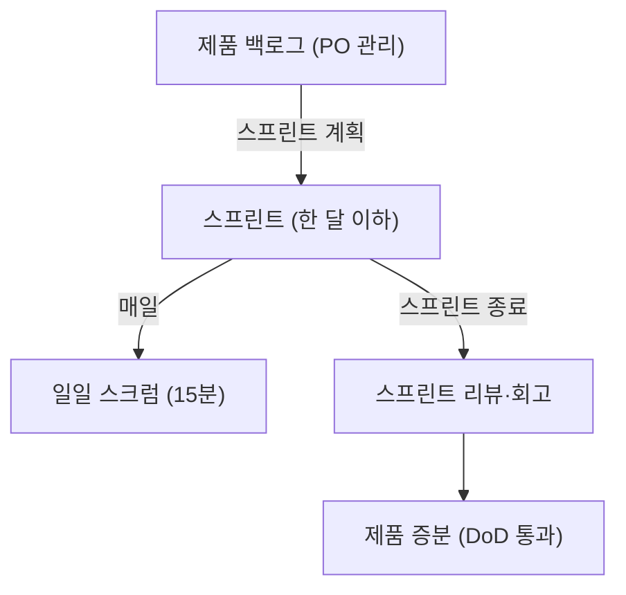
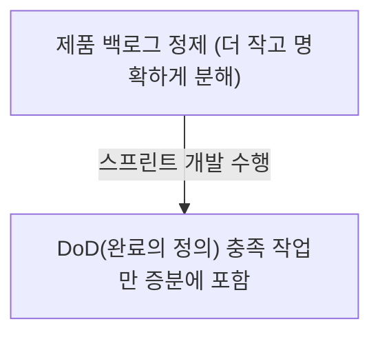

## 지식 로드맵 내 현재 위치

지식 위치: 소프트웨어 공학 → 개발 방법론 → **스크럼(Scrum)**

## 30초 인출

- 본질: **스크럼(Scrum)**은 불확실성이 높은 프로젝트 환경에서 1~4주의 짧은 반복 주기인 **스프린트(Sprint)**를 통해 동작 가능한 소프트웨어를 점진적으로 출시하는 경험주의 기반 애자일 프레임워크
- 메커니즘: **3대 역할(PO, SM, Dev)** + **5대 이벤트(Sprint, Planning, Daily, Review, Retro)** + **3대 산출물(PB, SB, Increment)**
- 효과: 고객 피드백 조기 수용 · 개발 리스크 분산 · 비즈니스 가치 전달 속도(Time-to-Market) 극대화

핵심 용어

- **Scrum**: 복잡한 적응형 문제를 해결하며 최상의 가치를 창출하도록 돕는 가벼운 애자일 프레임워크
- **Product Owner (PO)**: 제품의 가치를 극대화하고 제품 백로그의 우선순위를 결정하는 최종 의사결정자
- **Scrum Master (SM)**: 스크럼 원칙을 전파하고 개발팀의 장애(Impediment)를 제거하는 서번트 리더
- **Sprint(스프린트)**: 동작 가능한 제품 증분을 만들기 위한 1개월 이하의 고정된 기간(Time-box)
- **DoD(Definition of Done, 완료의 정의)**: 증분이 충족해야 할 품질 상태를 설명하는 공통 기준

---

## 1교시 예상문제 (10점)

> 스크럼의 개념과 3대 책무·5개 이벤트·3개 산출물의 관계를 설명하시오. (예상)

---

## 1교시 10점 답안

### Ⅰ. 정의·목적

- 정의: **스크럼(Scrum)**은 한 달 이하의 스프린트에서 증분을 만들고 점검·적응하는 경험주의 기반 프레임워크다.
- 목적: 불확실한 과업의 진행 상태를 드러내고 제품 가치를 점진적으로 높인다.

### Ⅱ. 스크럼 구성

| 구성 | 핵심 |
|---|---|
| 책무 | PO·Scrum Master·Developers |
| 이벤트 | 스프린트 안에서 계획·일일 점검·리뷰·회고 |
| 산출물 | 제품 백로그·스프린트 백로그·증분과 각 산출물의 약속 |

### Ⅲ. 핵심 통제

- **완료의 정의(DoD)**: 품질 타협 없는 제품 증분 판정 기준선
- **점검·적응**: 증분과 목표를 검토해 다음 작업 계획을 조정한다.

제언: 리뷰에서 제품 목표와 증분의 차이를 확인하고 다음 백로그에 반영한다.
---

## 2~4교시 예상문제 (25점)

> 스크럼의 경험주의 원리와 3대 책무·5개 이벤트·3개 산출물의 관계를 설명하고, 완료의 정의(DoD)와 스프린트 목표를 운영에 적용하는 방안을 제시하시오. (예상)

> (25점, 예상)

---

## 2~4교시 25점 답안

### Ⅰ. 불확실성을 극복하는 경험적 프로세스, 스크럼의 개요

> 스크럼은 짧은 스프린트마다 결과를 점검하고 계획을 조정하는 경험주의 기반 프레임워크다.

| 구분 | 핵심 |
|---|---|
| 정의 | 스크럼 팀이 스프린트에서 증분을 만들고 검토·적응하도록 역할·이벤트·산출물을 정한 틀 |
| 목적 | 불확실한 과업에서 진행 상태를 드러내고 제품 가치를 점진적으로 높임 |
| 경험주의 | 산출물과 진행 상태의 **투명성**을 바탕으로 **점검**하고 계획을 **적응**시킴 |

### Ⅱ. 스크럼의 3-5-3 체계 구조

> 스크럼은 3가지 책무, 5가지 이벤트, 3가지 산출물과 각 산출물의 약속으로 구성된다.

| 체계 | 구성요소 | 핵심 내용 |
|---|---|---|
| **3대 책무** | Product Owner (PO) | 제품 가치 극대화 및 제품 백로그 관리 |
| 3대 책무 | Scrum Master (SM) | 스크럼이 이해·적용되도록 지원하고 장애 제거 촉진 |
| 3대 책무 | Developers | 스프린트 백로그 계획·조정과 사용 가능한 증분 생성 |
| **3대 산출물** | Product Backlog | 제품 목표(Product Goal) 약속 |
| 3대 산출물 | Sprint Backlog | 스프린트 목표(Sprint Goal) 약속 |
| 3대 산출물 | Increment | 완료의 정의(DoD) 약속 |
| **5대 이벤트** | The Sprint | 다른 이벤트를 포함하는 한 달 이하의 고정 길이 기간 |
| 5대 이벤트 | Sprint Planning | 스프린트 계획 수립 |
| 5대 이벤트 | Daily Scrum | 일일 15분 점검 |
| 5대 이벤트 | Sprint Review | 이해관계자 검토 및 피드백 |
| 5대 이벤트 | Sprint Retrospective | 팀 프로세스 개선 회고 |

### 스크럼(Scrum) 생명주기 및 3-5-3 프로세스 루프

| 산출물 | 내포된 약속 (Commitment) | 핵심 통제 내용 |
|---|---|---|
| **제품 백로그 (Product Backlog)** | **제품 목표 (Product Goal)** | 제품의 미래 상태를 정의하며, PO가 가치 기반 우선순위 정렬 |
| **스프린트 백로그 (Sprint Backlog)** | **스프린트 목표 (Sprint Goal)** | 이번 스프린트에서 완수할 단일 비즈니스 목적 및 개발 태스크 |
| **제품 증분 (Increment)** | **완료의 정의 (Definition of Done)** | 릴리스 가능한 품질 수준을 완벽히 만족한 소프트웨어 실체 |

### Ⅲ. 전통적 폭포수 모델 vs 스크럼 프레임워크 비교

> 두 방법론은 요구사항 고정과 일정 관리의 접근 방식에서 근본적인 차이를 보인다.

| 비교 항목 | 전통적 폭포수 모델 (Waterfall) | 스크럼 프레임워크 (Scrum) |
|---|---|---|
| **기반 철학** | 계획 주도형 (Predictive, 통제 중심) | **경험주의 (Empirical, 점검·적응)** |
| **계획 조정** | 단계별 기준선과 변경 절차를 따름 | 스프린트 목표를 지키며 작업 범위를 협의·조정 |
| **결과 확인** | 계획된 단계의 산출물 검토 | 매 스프린트 사용 가능한 증분 검토 |
| **이해관계자 참여** | 프로젝트 계획에 맞춘 검토 | 스프린트 리뷰에서 결과와 다음 방향 논의 |

### Ⅳ. 스크럼 운영 문제점·대응책

> 완료의 정의(DoD)는 증분이 충족해야 할 품질 상태를 스크럼 팀이 공유하게 한다.

### 1. 백로그 정제와 완료의 정의(DoD)

### 2. 스크럼 프로젝트 실무 위험 및 대응 통제

| 위험 | 대책 | 효과 |
|---|---|---|
| 형식적인 일일 스크럼 | 스프린트 목표를 향한 진행·장애를 점검해 다음 작업 계획 조정 | 이벤트의 점검·적응 목적 유지 |
| 완료 기준이 불명확함 | 증분의 DoD를 팀이 공유하고 충족 여부 확인 | 완료 여부를 같은 기준으로 판단 |
| 새 정보가 생겨도 계획을 못 바꿈 | PO와 협의해 목표를 해치지 않는 범위에서 스프린트 백로그 조정 | 학습 결과를 계획에 반영 |

### Ⅴ. 점검·적응을 위한 제언

> 각 이벤트의 목적에 맞게 증분과 진행 상태를 점검하고, 목표를 유지하면서 계획을 조정한다.

| 문제 | 해결 방안 |
|---|---|
| 스프린트 중 새 정보가 생길 때 목표와 작업 범위 중 무엇을 우선할지 불명확함 | 제언: Developers와 Product Owner가 스프린트 목표를 기준으로 범위를 조정하고, 목표가 더 이상 유효하지 않다면 Product Owner가 취소 여부를 결정한다. |
---

## 출제 이력과 검증 출처

- 제123회 정보관리기술사 1교시: 스크럼의 3대 역할 및 5대 이벤트
- 제129회 정보관리기술사 2교시: 애자일 스크럼의 성공 요인과 DoD의 중요성
- [Ken Schwaber, Jeff Sutherland, The Scrum Guide (2020)](https://scrumguides.org/scrum-guide.html)

## 연결 토픽

- 이전 토픽: [정보은닉](./024_information_hiding.md)
- 연관 토픽: [칸반](./090_kanban.md), [애자일 방법론](./119_agile_methodology.md)
- 다음 토픽: [유스케이스 다이어그램](./026_use_case_diagram.md)
