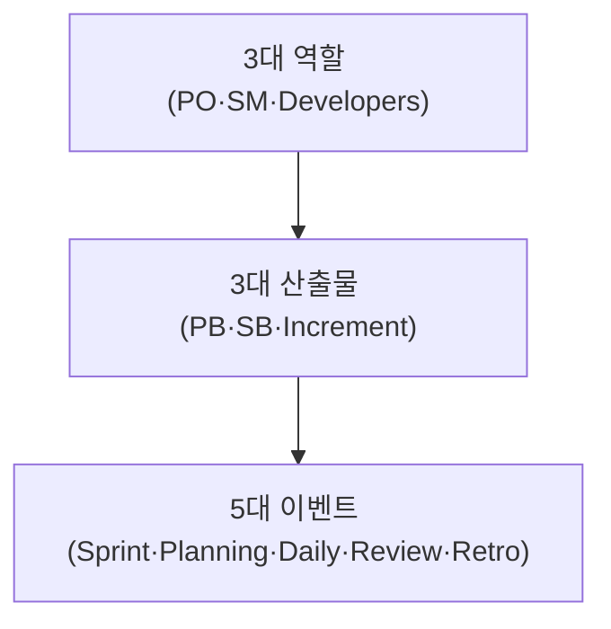
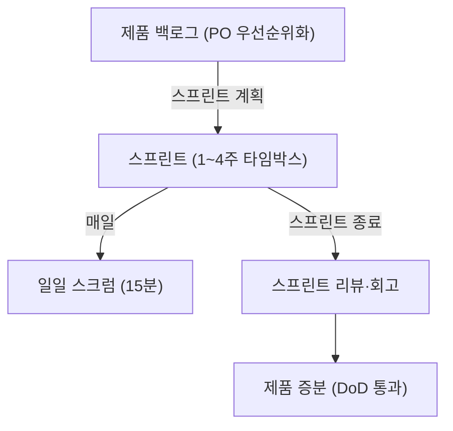
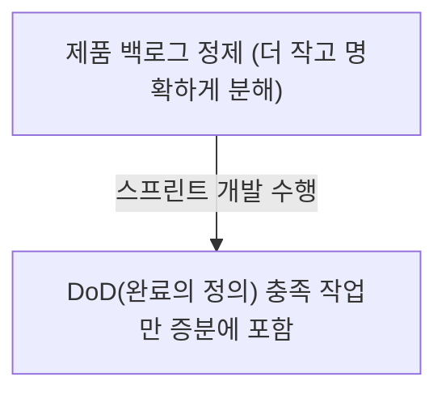

## 지식 로드맵 내 현재 위치

지식 위치: 소프트웨어 공학 → 개발 방법론 → **스크럼(Scrum)**

## 30초 인출

- 본질: **스크럼(Scrum)**은 불확실성이 높은 프로젝트 환경에서 1~4주의 짧은 반복 주기인 **스프린트(Sprint)**를 통해 동작 가능한 소프트웨어를 점진적으로 출시하는 경험주의 기반 애자일 프레임워크
- 메커니즘: **3대 역할(PO, SM, Dev)** + **5대 이벤트(Sprint, Planning, Daily, Review, Retro)** + **3대 산출물(PB, SB, Increment)**
- 효과: 고객 피드백 조기 수용 · 개발 리스크 분산 · 비즈니스 가치 전달 속도(Time-to-Market) 극대화

핵심 용어

- **Scrum**: 복잡한 적응형 문제를 해결하며 최상의 가치를 창출하도록 돕는 가벼운 애자일 프레임워크
- **Product Owner (PO)**: 제품의 가치를 극대화하고 제품 백로그의 우선순위를 결정하는 최종 의사결정자
- **Scrum Master (SM)**: 스크럼 원칙을 전파하고 개발팀의 장애(Impediment)를 제거하는 서번트 리더
- **Sprint(스프린트)**: 동작 가능한 제품 증분을 만들기 위한 1개월 이하의 고정된 기간(Time-box)
- **DoD(Definition of Done, 완료의 정의)**: 증분이 제품으로서 요구되는 품질 기준을 충족했음을 보증하는 공식 체크리스트

---

## 1교시 예상문제 (10점)

> 스크럼(Scrum)의 정의와 목적, 핵심 구조와 작동 원리를 설명하시오. (예상)
---

## 1교시 10점 답안

### 1. 정의·목적

- 정의: **스크럼(Scrum)**은 1~4주의 스프린트를 통해 잠재적으로 출시 가능한 제품 증분을 점진적으로 완성하는 경험주의 애자일 프레임워크
- 목적: 변화하는 시장 요구에 민첩 대응하고 지속적인 비즈니스 가치 조기 인도

### 2. 스크럼 3-5-3 체계 요약

### 3. 핵심 통제

- **완료의 정의(DoD)**: 품질 타협 없는 제품 증분 판정 기준선
- **Time-boxing**: 모든 이벤트의 최대 시간을 고정하여 집중력 및 효율 극대화
---

## 2~4교시 예상문제 (25점)

> 애자일 개발 방법론의 대표적인 프레임워크인 스크럼(Scrum)의 3대 경험주의 기둥(투명성, 점검, 적응)을 설명하고, 3대 역할, 5대 이벤트, 3대 산출물의 상호 작용 구조 및 성공적인 스크럼 정착을 위한 완료의 정의(DoD)의 역할을 제시하시오. (25점)

> (25점, 예상)
---

## 2~4교시 25점 답안

### Ⅰ. 불확실성을 극복하는 경험적 프로세스, 스크럼의 개요

> 스크럼은 미래를 예측하여 완벽한 계획을 세우는 것이 아니라, 잦은 점검과 적응을 통해 올바른 제품을 찾아가는 프레임워크다.

- 정의: 복잡한 적응형 문제(Complex Adaptive Problems)를 해결하면서 높은 비즈니스 가치를 전달하기 위한 **경험주의(Empiricism)** 기반 애자일 프레임워크
- 목적: 변화하는 고객 요구에 민첩 대응, 릴리스 주기 단축, 팀 자율성과 협업 문화 증진, 프로젝트 가시성 확보

### Ⅱ. 스크럼의 3-5-3 체계 구조

> 스크럼은 3가지 역할(Role), 5가지 이벤트(Event), 3가지 산출물(Artifact)의 유기적 결합으로 완성된다.

| 체계 | 구성요소 | 핵심 내용 |
|---|---|---|
| **3대 역할** | Product Owner (PO) | 제품 가치 극대화 및 제품 백로그 우선순위 결정 |
| 3대 역할 | Scrum Master (SM) | 프로세스 촉진 및 장애(Impediment) 제거, 서번트 리더십 |
| 3대 역할 | Developers | 동작 가능한 제품 증분 개발 전문가 |
| **3대 산출물** | Product Backlog | 제품 목표(Product Goal) 약속 |
| 3대 산출물 | Sprint Backlog | 스프린트 목표(Sprint Goal) 약속 |
| 3대 산출물 | Increment | 완료의 정의(DoD) 약속 |
| **5대 이벤트** | The Sprint | 모든 이벤트의 컨테이너 (1~4주 타임박스) |
| 5대 이벤트 | Sprint Planning | 스프린트 계획 수립 |
| 5대 이벤트 | Daily Scrum | 일일 15분 점검 |
| 5대 이벤트 | Sprint Review | 이해관계자 검토 및 피드백 |
| 5대 이벤트 | Sprint Retrospective | 팀 프로세스 개선 회고 |

### 스크럼(Scrum) 생명주기 및 3-5-3 프로세스 루프

| 산출물 | 내포된 약속 (Commitment) | 핵심 통제 내용 |
|---|---|---|
| **제품 백로그 (Product Backlog)** | **제품 목표 (Product Goal)** | 제품의 미래 상태를 정의하며, PO가 가치 기반 우선순위 정렬 |
| **스프린트 백로그 (Sprint Backlog)** | **스프린트 목표 (Sprint Goal)** | 이번 스프린트에서 완수할 단일 비즈니스 목적 및 개발 태스크 |
| **제품 증분 (Increment)** | **완료의 정의 (Definition of Done)** | 릴리스 가능한 품질 수준을 완벽히 만족한 소프트웨어 실체 |

### Ⅲ. 전통적 폭포수 모델 vs 스크럼 프레임워크 비교

> 두 방법론은 요구사항 고정과 일정 관리의 접근 방식에서 근본적인 차이를 보인다.

| 비교 항목 | 전통적 폭포수 모델 (Waterfall) | 스크럼 프레임워크 (Scrum) |
|---|---|---|
| **기반 철학** | 계획 주도형 (Predictive, 통제 중심) | **경험주의 (Empirical, 점검·적응)** |
| **삼각 제약 (Iron Triangle)** | **요구사항(범위) 고정**, 일정/비용 변동 | **일정(Timebox)/비용 고정**, 범위(Scope) 변동 |
| **가치 인도 시점** | 프로젝트 최종 종료 시점 (빅뱅) | **매 스프린트 종료 시점 (점진적 출시)** |
| **고객 참여** | 요구분석 및 최종 인수 시점에 국한 | **매 스프린트 리뷰마다 지속적 참여 및 피드백** |
| **리스크 노출** | 후반부 통합 및 테스트 시 폭증 | **초기부터 조기 분산 및 완화** |

### Ⅳ. 스크럼 운영 문제점·대응책

> 스크럼이 단순한 '날림 개발'로 전락하지 않기 위한 가장 강력한 공학적 안전장치가 DoD이다.

### 1. 백로그 정제와 완료의 정의(DoD)

### 2. 스크럼 프로젝트 실무 위험 및 대응 통제

| 위험 | 대책 | 효과 |
|---|---|---|
| 형식적 일일 미팅(좀비 스크럼) 및 몰입 저하 | 스프린트 목표(Sprint Goal) 중심 15분 타임박스 운영 및 장애 제거 집중 | 팀 주도성 및 비즈니스 가치 몰입도 향상 |
| 불명확한 품질 기준으로 결함 누적 | DoD(코드리뷰, 단위/통합테스트, 정적분석) 체크리스트 엄격 적용 | 잠재적 출시 가능한 고품질 제품 증분 확보 |
| 스프린트 도중 무분별한 과업 추가 및 변경 | 스프린트 타임박스 보호 규칙 적용 및 차기 스프린트 백로그 이관 | 개발팀 개발 집중도 유지 및 일정 예측 가능성 확보 |

### Ⅴ. 경험주의 정착 중심의 결론

> 단일 스크럼을 넘어 다수 팀이 참여하는 엔터프라이즈 환경에서는 스케일드 애자일(SAFe, LeSS) 거버넌스가 필요하다.

### 학습자 통찰 메모 — 답안 밖

- [핵심 통찰]: 스크럼을 도입하고도 실패하는 조직의 공통점은 "형식만 흉내 내는 좀비 스크럼(Zombie Scrum)"임. 매일 모여 15분 동안 어제 한 일, 오늘 할 일을 기계적으로 읊기만 할 뿐 스프린트 목표(Sprint Goal)에 대한 주도적 몰입이 없음. 스크럼 마스터는 단순 진행자가 아니라 조직의 구조적 장애를 타파하는 변화 관리자여야 함.
- 나라면: 스프린트 기간 동안에는 PO조차도 스프린트 백로그를 함부로 변경할 수 없도록 '스프린트 타임박스 보호 규칙'을 엄격히 적용하여 개발팀의 몰입도를 보호하겠음.

### 실전 답안용 기술사적 제언

- **판정 기준**: 프로젝트 요구사항 변동성 및 시장 출시 속도(Time-to-Market) 긴급도에 따른 스크럼 프레임워크 채택 판정
- **대응 방안**: **완료의 정의(DoD)** 체크리스트(코드리뷰, 단위테스트, 정적분석) 엄격화 및 스프린트 타임박스 보호 규칙 강제
- **검증 체계**: 스프린트 번다운 차트(Burn-down Chart) 및 속도(Velocity) 안정성 모니터링, 매 스프린트 동작하는 증분 검증
- **기대 효과**: 형식적 좀비 스크럼 탈피, 고객 피드백 반영 리드타임 50% 단축 및 지속가능한 고품질 소프트웨어 적시 출시 달성
---

## 출제 이력과 검증 출처

- 제123회 정보관리기술사 1교시: 스크럼의 3대 역할 및 5대 이벤트
- 제129회 정보관리기술사 2교시: 애자일 스크럼의 성공 요인과 DoD의 중요성
- Ken Schwaber, Jeff Sutherland, The Scrum Guide (2020)

## 연결 토픽

- 이전 토픽: [정보은닉](./024_information_hiding.md)
- 연관 토픽: [칸반](./090_kanban.md), [애자일 방법론](./119_agile_methodology.md)
- 다음 토픽: [유스케이스 다이어그램](./026_use_case_diagram.md)
