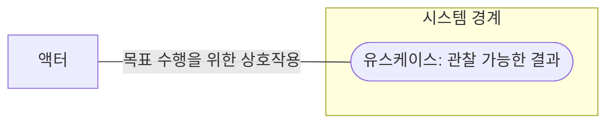
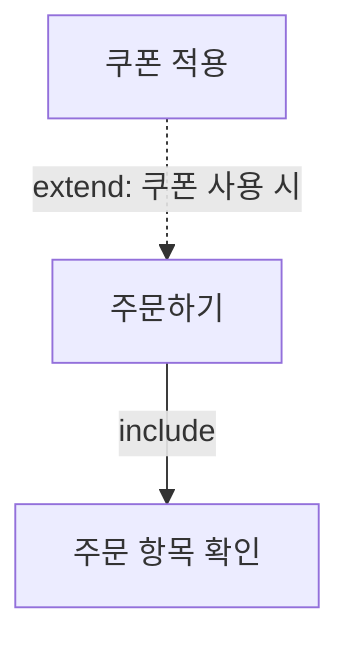
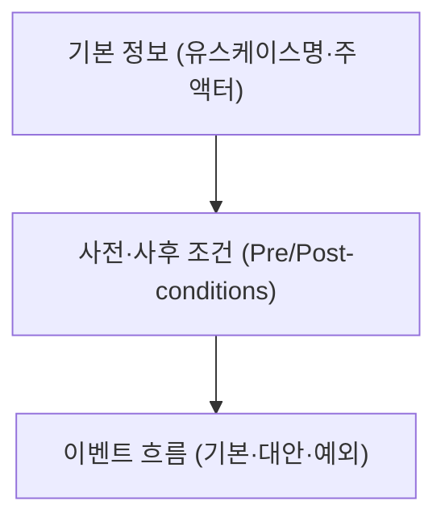

## 지식 로드맵 내 현재 위치

지식 위치: 소프트웨어 공학 → 요구공학 → **유스케이스 다이어그램(유스케이스 명세)**

## 30초 인출

- 본질: **유스케이스 다이어그램(Use Case Diagram)**은 사용자(액터) 관점에서 시스템이 제공해야 하는 기능적 요구사항과 시스템 경계를 시각적으로 모델링하는 행위 다이어그램
- 메커니즘: **시스템 경계** + **액터(Actor)** + **유스케이스(Use Case)** + **관계(연관, 포함 `<include>`, 확장 `<extend>`, 일반화)**
- 효과: 시스템 개발 범위(Scope) 확정 · 사용자 관점의 요구사항 가시화 · **유스케이스 명세서(Use Case Specification)** 작성을 통한 분석·설계·테스트 기준선 제공

핵심 용어

- **Use Case**: 사용자에게 측정 가능한 가치의 결과를 전달하기 위해 시스템이 수행하는 일련의 작업 흐름
- **Actor**: 시스템과 상호작용하는 외부의 모든 주체 (주 액터: 사용자, 부 액터: 연계 시스템/관리자)
- **&lt;&lt;include&gt;&gt; (포함 관계)**: 하나의 유스케이스가 다른 유스케이스의 실행을 반드시 포함하는 필수적 의존 관계
- **&lt;&lt;extend&gt;&gt; (확장 관계)**: 기본 유스케이스의 특정 확장 지점(Extension Point)에서 조건이 만족될 때만 선택적으로 실행되는 관계
- **Use Case Specification**: 유스케이스 다이어그램의 타원 하나를 상세히 기술한 문서(기본 흐름, 대안 흐름, 예외 흐름 등)

---

## 1교시 예상문제 (10점)

> 유스케이스 다이어그램의 구성요소와 include·extend 관계를 설명하시오. (예상)

---

## 1교시 10점 답안

### Ⅰ. 유스케이스 다이어그램의 개요

| 구분 | 핵심 |
|---|---|
| 정의 | **유스케이스 다이어그램** 은 액터·시스템 경계·유스케이스 간의 기능 관계를 나타내는 행위 모델 |
| 목적 | 외부에서 필요한 기능 범위를 확인하고 명세·시험의 공통 기준 마련 |

### Ⅱ. 포함·확장 관계

| 관계 | 화살표 | 의미 |
|---|---|---|
| include | 기본 → 포함 동작 | 기본 유스케이스에 필요한 동작을 포함 |
| extend | 확장 → 기본 | 확장 지점에서 조건에 따라 동작을 더함 |

### Ⅲ. 핵심 통제

- **명세서 연계**: 사전·사후 조건 및 기본·예외 흐름의 상세 기술을 통한 모호성 감소
- **경계 확인**: 액터가 얻는 관찰 가능한 결과를 기준으로 한 유스케이스 분할

- 한 줄 제언: 기본·대안·예외 흐름을 명세해 기능 범위와 인수 시험의 연결
---

## 2~4교시 예상문제 (25점)

> 유스케이스 다이어그램의 구성요소와 포함(&lt;&lt;include&gt;&gt;)·확장(&lt;&lt;extend&gt;&gt;) 관계, 유스케이스 명세서의 핵심 항목을 설명하시오. (25점, 예상)

---

## 2~4교시 25점 답안

## Ⅰ. 사용자 관점의 기능 요구사항 모델, 유스케이스 다이어그램의 개요

> 유스케이스는 액터가 시스템과 상호작용해 얻는 기능적 결과를 표현한다.

| 구분 | 핵심 |
|---|---|
| 정의 | **유스케이스 다이어그램** 은 액터·시스템 경계·유스케이스 간의 기능 관계를 나타내는 행위 모델 |
| 목적 | 외부에서 필요한 기능 범위를 확인하고 명세·시험의 공통 기준 마련 |

### Ⅱ. 유스케이스 다이어그램의 4대 핵심 구성요소 및 관계

> 다이어그램은 큰 그림을 보여주고, 세부적인 입출력과 조건은 유스케이스 명세서에 위임한다.

| 관계 유형 | 표기법 (Stereotype) | 화살표 방향 | 핵심 의미 및 동작 조건 |
|---|---|---|---|
| **연관 (Association)** | 실선 (`―`) | 방향성 없거나 단방향 | 액터와 유스케이스 간의 상호작용 통로 |
| **포함 (&lt;&lt;include&gt;&gt;)** | 점선 화살표 + `<<include>>` | **포함하는 쪽 → 포함되는 쪽** | 기본 유스케이스에 필요한 동작을 재사용 |
| **확장 (&lt;&lt;extend&gt;&gt;)** | 점선 화살표 + `<<extend>>` | **확장 → 기본** | 기본 유스케이스의 확장 지점에서 조건에 따라 선택 실행 |
| **일반화 (Generalization)**| 실선 + 빈 삼각형 화살표 | 하위 → 상위 | 유스케이스나 액터 간의 상속(Inheritance) 관계 |

### Ⅲ. 포함(&lt;&lt;include&gt;&gt;)과 확장(&lt;&lt;extend&gt;&gt;)의 비교

> include는 필요한 동작을 포함하고, extend는 기본 유스케이스에 확장 지점의 동작을 더한다.

### 포함(include)과 확장(extend) 관계 메커니즘

| 비교 항목 | 포함 관계 (&lt;&lt;include&gt;&gt;) | 확장 관계 (&lt;&lt;extend&gt;&gt;) |
|---|---|---|
| **기본 동작과의 관계** | 기본 유스케이스의 실행에 포함되는 동작 | 기본 유스케이스가 독립적으로 성립하며 조건에 따라 추가되는 동작 |
| **화살표 출발/도착** | 기본 유스케이스 **→** 포함 유스케이스 | 확장 유스케이스 **→** 기본 유스케이스 |
| **확장점** | 불필요 | 기본 유스케이스에서 확장 위치와 조건을 지정 |
| **주요 목적** | 공통 기능 재사용 (중복 제거) | 기본 흐름을 훼손하지 않는 예외/부가 기능 분리 |
| **구체적 사례** | `[주문하기] ──<<include>>──> [주문 항목 확인]` | `[쿠폰 적용] ──<<extend>>──> [주문하기]` |

## Ⅳ. 유스케이스 모델링 문제점·대응책

> 다이어그램은 목차에 불과하며, 실질적인 소프트웨어 설계와 테스트의 기준은 명세서 본문이다.

### 1. 유스케이스 명세서 기술 항목

### 2. 유스케이스 모델링 실무 위험 및 대응 통제

| 위험 | 대책 | 효과 |
|---|---|---|
| 기능 분해(Functional Decomposition)로 복잡도 폭증 | 사용자 관점의 완전한 목적 달성 단위로 유스케이스 통합 | 순서도식 나열 방지 및 본질적 요구사항 가시화 |
| 포함과 확장 관계의 화살표 방향·개념 오용 | include(기본→포함, 필수), extend(확장→기본, 선택) 표준 가이드 확립 | 모델링 표기 오류 방지 및 의사소통 왜곡 차단 |
| 명세서 부실로 인한 예외 흐름 누락 | 기본/대안/예외 흐름 및 사전·사후조건 정형화 템플릿 적용 | 개발자 자의적 구현 방지 및 인수 테스트 기준 확립 |

## Ⅴ. 기능 범위와 명세 연결을 위한 제언

> 다이어그램으로 기능 경계를 확인하고, 각 유스케이스의 예외·대안 흐름을 명세와 시험에 연결한다.

| 문제 | 해결 방안 |
|---|---|
| 유스케이스 경계가 분석자마다 달라 기능 범위 비교가 어려움 | 액터의 관찰 가능한 목표를 경계 기준으로 삼고 필수 공통 행위와 조건부 선택 행위를 구분하며 상세 흐름은 명세에 기술 |
---

## 출제 이력과 검증 출처

- 제137회 정보관리기술사 1교시: 유스케이스 다이어그램과 관계(&lt;&lt;include&gt;&gt;, &lt;&lt;extend&gt;&gt;)
- [OMG, Unified Modeling Language 2.5.1](https://www.omg.org/spec/UML/2.5.1/PDF)
- Ivar Jacobson, Object-Oriented Software Engineering: A Use Case Driven Approach
- Craig Larman, Applying UML and Patterns: An Introduction to Object-Oriented Analysis and Design
- [OMG, Unified Modeling Language 2.5.1](https://www.omg.org/spec/UML/2.5.1/PDF)

## 연결 토픽

- 이전 토픽: [스크럼](./025_scrum.md)
- 연관 토픽: [UML 다이어그램 체계](./020_uml_diagrams.md), [요구공학](./040_requirements_engineering.md)
- 다음 토픽: [SW 규모·비용 산정](./027_sw_cost_estimation.md)
