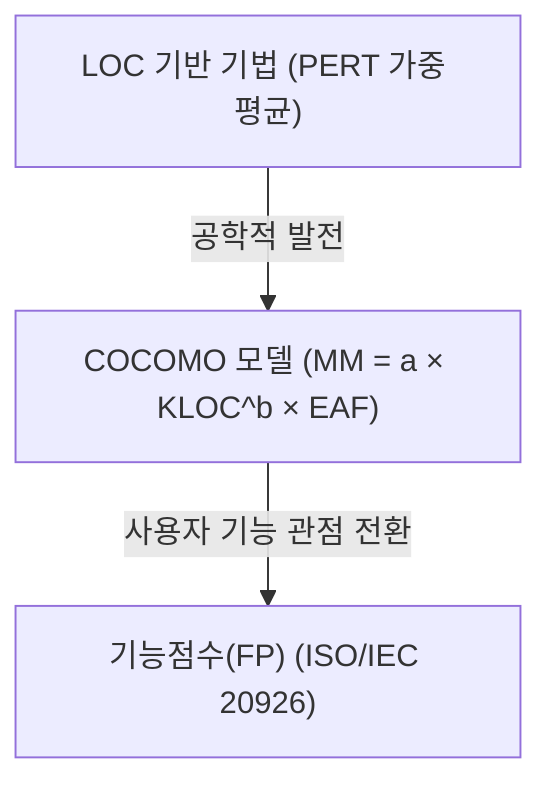
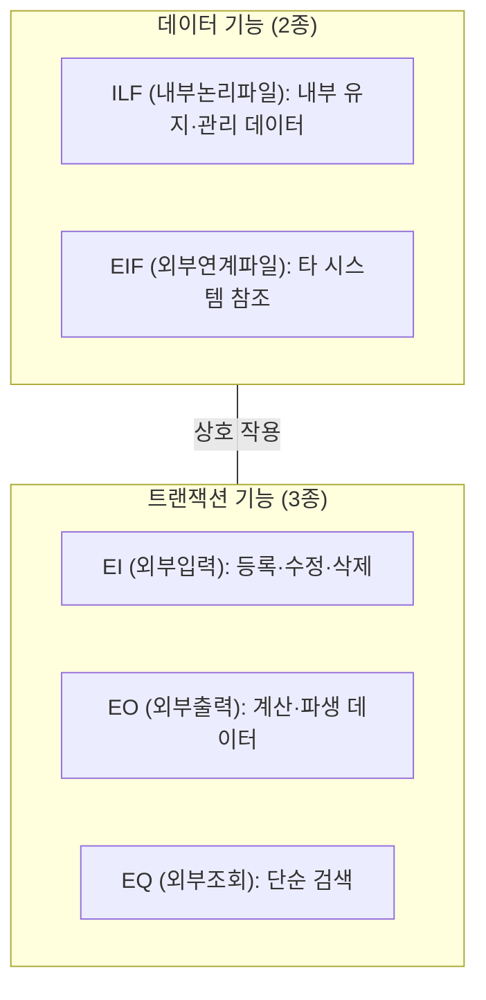

## 지식 로드맵 내 현재 위치

지식 위치: 소프트웨어 공학 → 공공 SW·거버넌스 → **SW 규모·비용 산정**

## 30초 인출

- 본질: **SW 규모·비용 산정**은 소프트웨어 개발 프로젝트의 공수, 일정, 소요 예산을 합리적으로 예측하여 예산 왜곡과 사업 부실을 방지하는 정량적 측정 체계
- 메커니즘: 규모 측정(**LOC, FP, 스토리 포인트**) → 노력(Man-Month) 추정(**COCOMO II, Putnam, 기능점수 단가법**) → 개발 원가 산출
- 효과: 합리적 발주 예산 확정 · 과업 변경 대가 산정 기준선(Baseline) 마련 · 개발 생산성 평가

핵심 용어

- **Function Point (기능점수, FP)**: 사용자가 요구한 기능의 논리적 크기를 데이터 기능(ILF, EIF)과 트랜잭션 기능(EI, EO, EQ)으로 측정하는 표준 기법
- **LOC(Lines of Code)**: 원시 소스코드의 총 라인 수를 기준으로 소프트웨어 규모를 측정하는 전통적 기법
- **COCOMO (Constructive Cost Model)**: Boehm이 제안한 모델로, 규모(KLOC)와 프로젝트 복잡도(비용동인)를 수학 공식에 대입해 공수(M/M)를 산출하는 기법
- **COCOMO II**: 현대 소프트웨어 공학(객체지향, 재사용, RAD)을 반영하여 Application Composition, Early Design, Post-Architecture 3단계로 발전된 모델
- **SW사업 대가산정 가이드**: 과학기술정보통신부와 한국소프트웨어산업협회(KOSA)에서 공공 SW 사업의 예산 수립 및 계약 대가를 산정하기 위해 고시한 표준 기준

## 예상문제

> 소프트웨어 규모 및 비용 산정 기법의 발전 과정을 설명하고, LOC 기법, COCOMO 모델의 프로젝트 유형(Organic, Semi-detached, Embedded), 기능점수(Function Point)의 5대 기능 구성요소 및 공공 SW 사업 대가산정 가이드에 따른 FP 단가법 적용 방안을 제시하시오. (25점)

## Ⅰ. 합리적 예산 수립과 발주 정상화의 초석, SW 비용 산정의 개요

> 소프트웨어는 비가시적 특성으로 인해 과소 산정 시 사업 파행을, 과대 산정 시 예산 낭비를 초래하므로 과학적 정량 산정이 필수적이다.

- 정의: 소프트웨어 개발에 소요되는 규모, 투입 공수(Man-Month), 일정, 직접비 및 간접비를 수학적·통계적 모델을 통해 사전에 추정하는 공학적 활동
- 목적: 합리적인 발주 예산 편성, 프로젝트 일정 및 자원 계획 수립, 과업 변경 시 객관적 추가 대가 산정 근거 확보

## Ⅱ. 3대 주요 비용 산정 기법: LOC, COCOMO, 기능점수(FP)

> 규모 측정 단위가 원시 코드 라인 수(LOC)에서 사용자 관점의 논리적 기능 단위(FP)로 진화하였다.

| 비교 항목 | LOC 기법 | COCOMO 기법 | 기능점수 (Function Point) |
|---|---|---|---|
| **측정 기준** | 소스코드 물리적 라인 수 | KLOC + 15~17개 비용동인 계수 | **사용자 관점 논리적 기능 수** |
| **적용 시점** | 구현 중반~종료 시점 (사후적) | 기본 설계 이후 | **기획, 요구분석 초기 단계부터 가능** |
| **언어 독립성** | 언어에 종속적 (C vs Python 편차) | 언어에 종속적 | **완벽한 언어 독립성 (동등 비교 가능)** |
| **특성·근거** | 구현 후 측정 용이 | 경험 데이터 보정 필요 | 국제 표준·공공 대가산정 가이드에서 활용 |

## Ⅲ. 기능점수(FP)의 5대 기능 구성요소와 산정 체계

> 공공 SW 사업의 대가산정 가이드는 기능점수를 단일 표준으로 채택하고 있다.

### 기능점수(FP) 5대 기능 분류 및 개발비 산정 메커니즘

### 공공 SW 사업 기능점수 단가법 산식
- **SW 개발비** = 기능점수(FP) × 해당 연도 기능점수당 단가 × 보정계수 + 직접경비 + 이윤

## Ⅳ. 소프트웨어 비용 산정 문제점·대응책

> 요구사항 불명확성과 정치적 예산 삭감이 프로젝트 부실의 가장 큰 원인이다.

| 위험 | 대책 | 효과 |
|---|---|---|
| 요구사항 조기 고정 실패로 인한 비용 오차 | 기획 시 간이법(평균 복잡도 FP) 적용 후 ISMP/설계 시 정밀법 재산정 | 프로젝트 단계별 산정 정밀도 및 예산 현실성 확보 |
| 비기능 요구사항 누락 및 대가 왜곡 | 성능·보안·품질 요구수준에 따른 법정 품질 보정계수 전면 반영 | 비기능 구현 공수 정당 보상 및 시스템 품질 보증 |
| 무상 과업 변경으로 인한 사업자 부실화 | 요구사항 추적표(RTM) 및 변경 FP 기반 과업심의위원회 공식 상정 | 과업 변경에 대한 정당한 추가 대가 수령 및 공정 계약 달성 |

## Ⅴ. 추정 근거·변경 정산 중심의 결론

> 비용 산정은 계약을 위한 요식 행위가 아니라, 소프트웨어 산업의 공정 생태계를 지키는 법적 안전장치여야 한다.

### 학습자 통찰 메모 — 답안 밖

- [핵심 통찰]: 기능점수(FP)가 만능은 아님. 고난도 AI 알고리즘 개발이나 대규모 분산 아키텍처 리팩토링은 사용자 인터페이스 상 FP가 거의 나오지 않는 'FP의 맹점'이 존재함. 이러한 연구개발형 또는 인프라성 사업에서는 투입공수 방식(M/M)이나 헤드카운트 모델을 병행 적용하는 유연성이 요구됨.
- 나라면: 공공 사업 발주 시 ISP/ISMP 단계에서 도출된 상세 요구사항 명세서를 기반으로 1차 기능점수를 산출하고, 구축 사업 완료 시점의 실제 구현 FP와 비교하여 변경된 과업에 대해 법정 대가를 정산하는 '사후 정산형 계약 거버넌스'를 정착시키겠음.

### 실전 답안용 기술사적 제언

- **판정 기준**: 프로젝트 단계별 요구명세 구체화 수준에 따른 산정 기법 차등 적용 (기획/발주: 간이 FP, 상세설계: 정밀 FP)
- **대응 방안**: 과학기술정보통신부/KOSA **SW사업 대가산정 가이드** 단가법 표준 준수 및 **과업심의위원회** 연계 변경 대가 지급 보장
- **검증 체계**: ILF/EIF 및 EI/EO/EQ 복잡도 매트릭스 100% 검증 및 법정 4대 품질 보정계수(규모, 연계, 성능, 다국어) 객관적 산출
- **기대 효과**: 소프트웨어 개발 사업자 적정 대가 보장, 무상 과업 변경 관행 타파 및 공정 소프트웨어 생태계 기반 고품질 산출물 확보

## 1교시 10점 답안 발췌

### 1. 정의·목적

- 정의: **SW 규모·비용 산정**은 요구사항을 기반으로 크기(FP/LOC)를 정량화하고 투입 공수와 사업비를 수학적 모델로 산출하는 활동
- 목적: 합리적인 발주 예산 편성 및 과업 변경에 따른 객관적 정산 기준 확보

### 2. 기능점수(FP) 5대 기능 구성

### 3. 핵심 통제

- **COCOMO 모델**: KLOC 기반 수학적 공수 산정 및 비용동인(Cost Driver) 반영
- **가이드라인 준수**: 과기정통부 및 KOSA 소프트웨어 사업 대가산정 가이드 준수
- **위험 통제**: 간이법/정밀법 단계별 적용 및 과업심의위원회 연계로 대가 보장

## 출제 이력과 검증 출처

- 제132회 정보관리기술사 1교시: 기능점수(Function Point)의 데이터 및 트랜잭션 기능
- 제137회 정보관리기술사 2교시: 소프트웨어 사업 대가산정 가이드 및 FP 단가법 적용 절차
- 과학기술정보통신부 / 한국소프트웨어산업협회(KOSA), SW사업 대가산정 가이드 (2025년판)

## 학습 체크

- [ ] LOC, COCOMO, 기능점수(FP)의 측정 기준과 장단점을 비교할 수 있는가?
- [ ] 기능점수의 5대 기능(ILF, EIF, EI, EO, EQ)의 개념과 차이를 설명할 수 있는가?
- [ ] 공공 SW 대가산정 가이드에서 기능점수 단가법의 계산 공식을 제시할 수 있는가?

## 연결 토픽

- 이전 토픽: [유스케이스 다이어그램](./026_use_case_diagram.md)
- 연관 토픽: [기능점수](./130_function_point.md), [과업심의위원회](./048_task_deliberation_committee.md)
- 다음 토픽: [SW 안전성 분석](./028_sw_safety_analysis.md)
