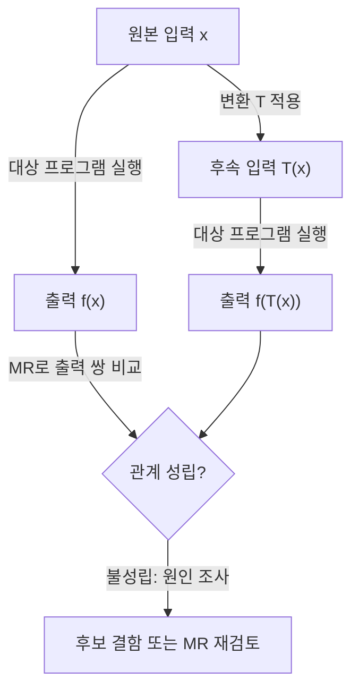
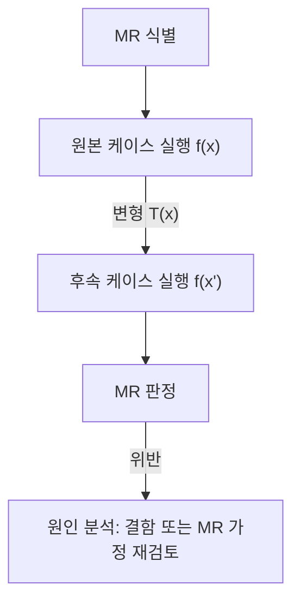

## 지식 로드맵 내 현재 위치

지식 위치: 소프트웨어 공학 → 테스트·검증 → **메타모픽 테스트(Metamorphic Test)**

## 30초 인출

- 본질: **메타모픽 테스트**는 정답을 직접 판정하기 어려울 때 여러 실행 결과 사이에 성립해야 할 관계를 검사하는 테스트 기법이다.
- 메커니즘: 원본 입력 실행 → 관계를 보존하거나 정해진 방식으로 변환한 입력 실행 → 결과 쌍이 **메타모픽 관계(MR)** 를 만족하는지 확인한다.

핵심 용어

- **Test Oracle Problem(테스트 오라클 문제)**: 주어진 입력에 대한 소프트웨어의 실제 출력이 참인지 거짓인지 판단할 수 있는 기준(정답)이 없거나 산출 비용이 너무 비싼 문제
- **Metamorphic Testing(메타모픽 테스트)**: 개별 실행 결과의 절대적 정답을 검증하는 대신, 여러 실행 간의 상대적 관계(MR)를 검증하는 기법
- **Metamorphic Relation(메타모픽 관계, MR)**: 원본 입력과 그 입력을 변형한 후속 입력에 대해 프로그램 결과가 반드시 만족해야 하는 성질이나 불변식
- **Source Test Case**: 최초에 시스템에 인가하는 원본 테스트 케이스
- **Follow-up Test Case**: 메타모픽 변형 함수를 통해 원본 테스트 케이스로부터 파생된 후속 테스트 케이스

---

## 1교시 예상문제 (10점)

> 메타모픽 테스트(Metamorphic Test)의 정의와 목적, 핵심 구조와 작동 원리를 설명하시오. (예상)

---

## 1교시 10점 답안

### Ⅰ. 정의·목적

- 정의: **메타모픽 테스트(Metamorphic Testing)**는 테스트 오라클이 없는 환경에서 입력 변형에 따른 출력 간의 **메타모픽 관계(MR)** 성립 여부를 검증하는 기법
- 목적: 정답을 미리 알 수 없는 AI, 검색 엔진, 과학 시뮬레이션의 결함 자동 검출

### Ⅱ. 핵심 메커니즘

### Ⅲ. 핵심 통제

- 변환이 업무 의미와 정답 라벨을 보존하는지 확인한 뒤 MR을 정한다. 모든 회전·노이즈 변환이 같은 분류 결과를 내야 하는 것은 아니다.
---

## 2~4교시 예상문제 (25점)

> 인공지능(AI), 검색 엔진, 자율주행 등 복잡한 시스템에서 발생하는 테스트 오라클 문제(Test Oracle Problem)의 개념을 설명하고, 이를 해결하기 위한 메타모픽 테스트(Metamorphic Testing)의 핵심 원리, 수행 절차, 대표적인 메타모픽 관계(MR) 유형 및 적용 사례를 제시하시오. (25점)

> (25점, 예상)

---

## 2~4교시 25점 답안

### Ⅰ. 테스트 오라클 부재를 극복하는 메타모픽 테스트의 개요

> 개별 실행의 정답을 판정하기 어려울 때도, 도메인 규칙으로 정당화한 입력·출력 관계를 보조 오라클로 검사할 수 있다.

- 정의: 테스트 대상 프로그램의 정답을 직접 판정하기 어려울 때, 관련 입력·출력 사이에 성립해야 할 **메타모픽 관계(Metamorphic Relation, MR)**를 정해 검사하는 테스트 기법
- 목적: 복잡한 수학 연산, 머신러닝/딥러닝 모델, 시뮬레이션, 검색 엔진 등 **테스트 오라클이 부재한 영역의 결함 검출력 확보**

### Ⅱ. 메타모픽 테스트의 4단계 수행 프로세스

> 원본 테스트 케이스에 도메인 규칙에 맞는 변환을 적용해 후속 테스트를 만들고, 출력 관계를 확인한다.

### Ⅲ. 대표적인 메타모픽 관계(MR) 유형 및 도메인 적용 사례

> 시스템의 수학적 성질에 따라 다양한 MR을 다층적으로 정의할 수 있다.

| MR 유형 | 핵심 수학적 성질 | 구체적 입력 변형 및 출력 기대치 | 적용 도메인 사례 |
|---|---|---|---|
| **동등성 (Equivalence)** | 의미를 보존하는 입력 변환에 대해 결과가 같음 | 정렬 함수의 입력 순서를 바꾸어도 정렬 결과는 같아야 함 | 정렬·계산 프로그램 |
| **대칭성 (Symmetry)** | 입력 대칭 변환이 출력에도 대응 | 무방향 그래프에서 간선 가중치가 대칭이면 `Dist(A,B) = Dist(B,A)` | 최단 경로 알고리즘 |
| **단조성 (Monotonicity)** | 조건을 완화할 때 결과가 정해진 방향으로 변함 | 최대화 문제에서 허용 자원을 늘리면 최적 목적값은 감소하지 않아야 함 | 제약 최적화 |
| **불변성 (Invariance)** | 과업 의미를 바꾸지 않는 입력 변환에서 지정 출력이 유지됨 | 해당 변환에 불변이어야 한다는 요구가 있는 영상 분류에서만 적용 | 컴퓨터 비전 |

### Ⅳ. 메타모픽 테스트 문제점·대응책

> 전통적 테스팅은 단일 실행의 절대값 검증이지만, 메타모픽 테스팅은 다중 실행의 관계적 검증이다.

### 1. 전통적 테스팅 vs 메타모픽 테스팅 비교

| 비교 항목 | 전통적 테스팅 (Traditional Testing) | 메타모픽 테스팅 (Metamorphic Testing) |
|---|---|---|
| **오라클 의존성** | 개별 입력의 예상 출력 판정 필요 | 개별 정답 대신 원본·후속 출력 간 관계를 보조 오라클로 활용 |
| **검증 방식** | 입력 x에 대해 `Actual(x) == Expected(x)` 검증 | 입력 x, x'에 대해 `Relation(f(x), f(x'))` 성립 검증 |
| **테스트 케이스 생성**| 테스터가 수작업 또는 도구로 개별 케이스 작성 | 원본 케이스에서 정해 둔 변환 규칙으로 유한한 후속 케이스 생성 |
| **주요 한계** | 오라클이 없는 AI/시뮬레이션 시스템 검증 불가 | 잘못 정의된 MR은 결함을 누락할 위험(위음성) 존재 |

### 2. 메타모픽 테스팅 실무 위험 및 대응 통제

| 위험 | 대책 | 효과 |
|---|---|---|
| 부적절한 MR 정의로 결함 누락 | 도메인 전문가 참여 하 다차원 불변식(대칭·단조·동등성) 도출 | 테스트 위음성(False Negative) 방지 및 검증력 확보 |
| 후속 케이스 폭증에 따른 자원 낭비 | 중요도 및 커버리지 기반 후속 케이스 생성 알고리즘 최적화 | 테스트 실행 비용 절감 및 핵심 결함 조기 발견 |
| AI 미세 노이즈에 대한 과민 반응 | 통계적 유의수준 기반 허용 오차 한계(Threshold) 설정 | 정상 모델의 거짓 결함 판정(위양성) 방지 |

### Ⅴ. 관계 기반 오라클 보완의 결론

> 메타모픽 테스트는 적절한 입력·출력 관계가 정의되는 범위에서 기존 오라클 기반 테스트를 보완한다.

### 실전 답안용 기술사적 제언

| 문제 | 해결 방안 |
|---|---|
| 변환된 입력에서 기대 결과가 어떻게 달라져야 하는지 정의되지 않음 | 제언: 과업의 불변·변화 관계를 먼저 명시하고, 대표 입력과 변환 입력 쌍을 시험해 위반 사례를 원인별로 검토한다. 메타모픽 시험은 기준 정답을 완전히 대체하지 않으므로 가능한 경우 오라클 기반 시험과 함께 쓴다. |
---

## 출제 이력과 검증 출처

- 제135회 정보관리기술사 1교시: 메타모픽 테스팅(Metamorphic Testing)
- 제140회 정보관리기술사 2교시: AI 소프트웨어 품질보증과 메타모픽 테스트 적용 방안
- T.Y. Chen et al., Metamorphic Testing: A New Approach for Generating Next Test Cases (1998)

## 연결 토픽

- 이전 토픽: [SW 안전성 분석](./028_sw_safety_analysis.md)
- 연관 토픽: [AI SW 품질보증 테스트](./093_ai_sw_quality_assurance_testing.md), [화이트박스 테스트](./013_white_box_test.md)
- 다음 토픽: [플랫폼 엔지니어링](./033_platform_engineering.md)
