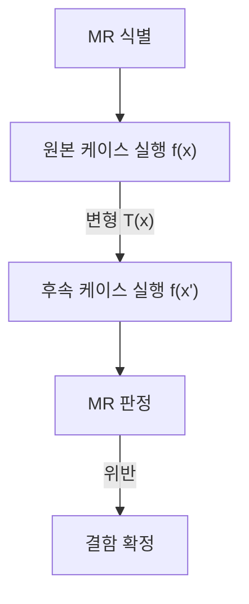

## 지식 로드맵 내 현재 위치

지식 위치: 소프트웨어 공학 → 테스트·검증 → **메타모픽 테스트(Metamorphic Test)**

## 30초 인출

- 본질: **메타모픽 테스트(MT: Metamorphic Testing)**는 테스트 오라클(Test Oracle)이 없거나 판별 비용이 극도로 높은 시스템(AI, 검색, 그래픽, 과학 연산)에서 입력의 변형과 출력 간의 **메타모픽 관계(MR: Metamorphic Relation)**를 정의하여 결함을 검출하는 기법
- 메커니즘: 원본 입력(Source Input) 실행 → 변형 규칙 적용(Follow-up Input) 실행 → 결과 간 **MR 불변성 검증**
- 산출/효과: 오라클 부재 한계 극복 · AI/LLM 모델 신뢰성 검증 · 자율주행 및 검색 엔진의 잠재 결함 적발

핵심 용어

- **Test Oracle Problem(테스트 오라클 문제)**: 주어진 입력에 대한 소프트웨어의 실제 출력이 참인지 거짓인지 판단할 수 있는 기준(정답)이 없거나 산출 비용이 너무 비싼 문제
- **Metamorphic Testing(메타모픽 테스트)**: 개별 실행 결과의 절대적 정답을 검증하는 대신, 여러 실행 간의 상대적 관계(MR)를 검증하는 기법
- **Metamorphic Relation(메타모픽 관계, MR)**: 원본 입력과 그 입력을 변형한 후속 입력에 대해 프로그램 결과가 반드시 만족해야 하는 성질이나 불변식
- **Source Test Case**: 최초에 시스템에 인가하는 원본 테스트 케이스
- **Follow-up Test Case**: 메타모픽 변형 함수를 통해 원본 테스트 케이스로부터 파생된 후속 테스트 케이스

---

## 1교시 예상문제 (10점)

> 메타모픽 테스트(Metamorphic Test)의 정의와 목적, 핵심 구조와 작동 원리를 설명하시오. (예상)

---

## 1교시 10점 답안

### 1. 정의·목적

- 정의: **메타모픽 테스트(Metamorphic Testing)**는 테스트 오라클이 없는 환경에서 입력 변형에 따른 출력 간의 **메타모픽 관계(MR)** 성립 여부를 검증하는 기법
- 목적: 정답을 미리 알 수 없는 AI, 검색 엔진, 과학 시뮬레이션의 결함 자동 검출

### 2. 핵심 메커니즘

### 3. 핵심 통제

- **MR 다변화**: 동등성, 대칭성, 단조성 등 다양한 수학적 불변식을 정의하여 결함 검출력 극대화
- **AI 신뢰성 연계**: 영상 회전, 노이즈 추가 등 섭동 후 AI 분류 일관성 검증
---

## 2~4교시 예상문제 (25점)

> 인공지능(AI), 검색 엔진, 자율주행 등 복잡한 시스템에서 발생하는 테스트 오라클 문제(Test Oracle Problem)의 개념을 설명하고, 이를 해결하기 위한 메타모픽 테스트(Metamorphic Testing)의 핵심 원리, 수행 절차, 대표적인 메타모픽 관계(MR) 유형 및 적용 사례를 제시하시오. (25점)

> (25점, 예상)

---

## 2~4교시 25점 답안

### Ⅰ. 테스트 오라클 부재를 극복하는 메타모픽 테스트의 개요

> 절대적 정답을 모른다면, 입력의 변형에 따른 출력의 상대적 관계(불변식)를 검증하는 것이 유일한 해법이다.

- 정의: 테스트 대상 프로그램의 정답(Oracle)을 사전에 알 수 없을 때, 복수의 입력 간에 성립해야 하는 **메타모픽 관계(Metamorphic Relation, MR)**를 정의하고 이를 위반하는지 검증하는 테스트 기법
- 목적: 복잡한 수학 연산, 머신러닝/딥러닝 모델, 시뮬레이션, 검색 엔진 등 **테스트 오라클이 부재한 영역의 결함 검출력 확보**

### Ⅱ. 메타모픽 테스트의 4단계 수행 프로세스

> 원본 테스트 케이스를 바탕으로 도메인 불변식을 도출하고 후속 테스트 케이스를 자동 생성한다.

### Ⅲ. 대표적인 메타모픽 관계(MR) 유형 및 도메인 적용 사례

> 시스템의 수학적 성질에 따라 다양한 MR을 다층적으로 정의할 수 있다.

| MR 유형 | 핵심 수학적 성질 | 구체적 입력 변형 및 출력 기대치 | 적용 도메인 사례 |
|---|---|---|---|
| **동등성 (Equivalence)** | 입력 순서나 무관한 요소 추가에도 결과 불변 | 텍스트 검색 시 불용어(Stopword) 추가: `f("AI 기술사") = f("AI 그리고 기술사")` | 검색 엔진, 자연어 처리 |
| **대칭성 (Symmetry)** | 입력의 대칭적 변환 시 출력도 대칭적 변환 | 최단 경로 탐색: A→B 최단거리와 B→A 최단거리는 동일해야 함 `Dist(A,B) = Dist(B,A)` | 내비게이션, 최단경로 알고리즘 |
| **단조성 (Monotonicity)** | 입력이 증가하면 출력도 단조 증가/감소 | 최적화 문제: 자원 제한이 완화되면 목적 함수 값은 기존보다 나빠질 수 없음 | 스케줄링, 금융 리스크 모델 |
| **변환 불변성 (Invariance)** | 기하학적 회전/반전 시 분류 결과 유지 | 자율주행 카메라 영상의 좌우 반전: 차량 인식 결과(Vehicle)는 동일해야 함 | 컴퓨터 비전, 자율주행 객체 인식 |

### Ⅳ. 메타모픽 테스트 문제점·대응책

> 전통적 테스팅은 단일 실행의 절대값 검증이지만, 메타모픽 테스팅은 다중 실행의 관계적 검증이다.

### 1. 전통적 테스팅 vs 메타모픽 테스팅 비교

| 비교 항목 | 전통적 테스팅 (Traditional Testing) | 메타모픽 테스팅 (Metamorphic Testing) |
|---|---|---|
| **오라클 의존성** | 개별 입력의 예상 출력 판정 필요 | 개별 정답 대신 원본·후속 출력 간 관계를 보조 오라클로 활용 |
| **검증 방식** | 입력 x에 대해 `Actual(x) == Expected(x)` 검증 | 입력 x, x'에 대해 `Relation(f(x), f(x'))` 성립 검증 |
| **테스트 케이스 생성**| 테스터가 수작업 또는 도구로 개별 케이스 작성 | 원본 케이스 1개로부터 **후속 케이스를 무한 자동 생성** |
| **주요 한계** | 오라클이 없는 AI/시뮬레이션 시스템 검증 불가 | 잘못 정의된 MR은 결함을 누락할 위험(위음성) 존재 |

### 2. 메타모픽 테스팅 실무 위험 및 대응 통제

| 위험 | 대책 | 효과 |
|---|---|---|
| 부적절한 MR 정의로 결함 누락 | 도메인 전문가 참여 하 다차원 불변식(대칭·단조·동등성) 도출 | 테스트 위음성(False Negative) 방지 및 검증력 확보 |
| 후속 케이스 폭증에 따른 자원 낭비 | 중요도 및 커버리지 기반 후속 케이스 생성 알고리즘 최적화 | 테스트 실행 비용 절감 및 핵심 결함 조기 발견 |
| AI 미세 노이즈에 대한 과민 반응 | 통계적 유의수준 기반 허용 오차 한계(Threshold) 설정 | 정상 모델의 거짓 결함 판정(위양성) 방지 |

### Ⅴ. 관계 기반 오라클 보완의 결론

> LLM과 생성형 AI의 등장으로 소프트웨어 공학의 검증 패러다임이 오라클 중심에서 메타모픽 중심으로 급격히 이동하고 있다.

### 학습자 통찰 메모 — 답안 밖

- [핵심 통찰]: 챗GPT나 자율주행차에게 "이 프롬프트의 정답이 무엇인가?"를 묻는 오라클 검증은 불가능함. 그러나 "질문 순서를 바꿔도 핵심 결론이 유지되는가?", "이미지의 밝기를 조금 낮춰도 보행자를 인식하는가?"와 같은 메타모픽 불변성은 얼마든지 검증할 수 있음. 메타모픽 관계를 얼마나 다양하고 정밀하게 정의하느냐가 AI QA의 핵심 경쟁력임.
- 나라면: AI 소프트웨어 품질 평가 파이프라인에 메타모픽 테스트 슈트를 결합하여, 모델 배포 전 섭동(Perturbation) 변형을 가한 수천 개의 후속 케이스에서 MR 위반율(Inconsistency Rate)을 측정해 품질 게이트 통과 기준으로 삼겠음.

### 실전 답안용 기술사적 제언

- **판정 기준**: 오라클 부재 도메인(AI/자율주행/빅데이터 검색/수학 시뮬레이션) 여부에 따른 메타모픽 테스트 도입 판정
- **대응 방안**: **다차원 메타모픽 관계(MR: 동등·대칭·단조성)** 정의 및 CI 파이프라인 내 자동화 퍼징(Fuzzing) 도구 결합
- **검증 체계**: 모델 배포 전 섭동(Perturbation) 후속 케이스에 대한 MR 불변성 위반율(Violation Rate) 0% 게이트 강제
- **기대 효과**: 테스트 오라클 문제 원천 극복, 고비용 수작업 라벨링 없이 무한 테스트 케이스 자동 증강 및 AI 소프트웨어 고신뢰성 확보
---

## 출제 이력과 검증 출처

- 제135회 정보관리기술사 1교시: 메타모픽 테스팅(Metamorphic Testing)
- 제140회 정보관리기술사 2교시: AI 소프트웨어 품질보증과 메타모픽 테스트 적용 방안
- T.Y. Chen et al., Metamorphic Testing: A New Approach for Generating Next Test Cases (1998)

## 연결 토픽

- 이전 토픽: [SW 안전성 분석](./028_sw_safety_analysis.md)
- 연관 토픽: [AI SW 품질보증 테스트](./093_ai_sw_quality_assurance_testing.md), [화이트박스 테스트](./013_white_box_test.md)
- 다음 토픽: [플랫폼 엔지니어링](./033_platform_engineering.md)
