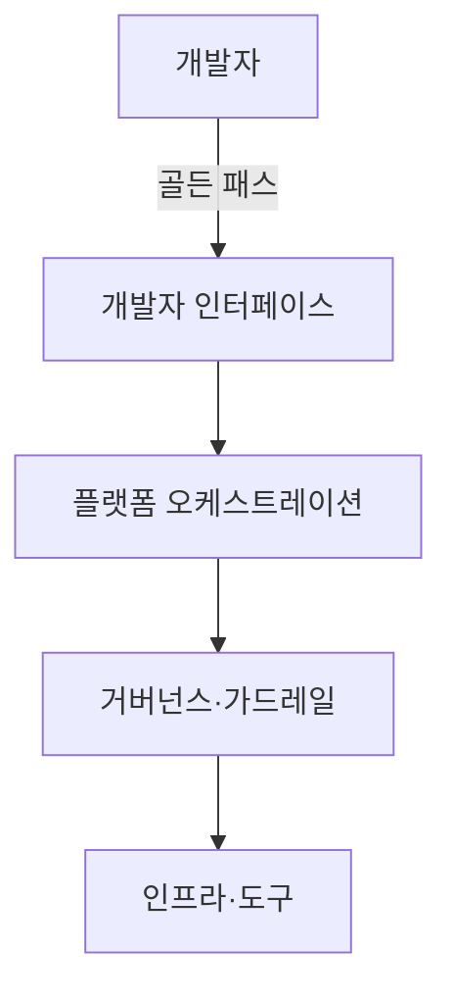

## 지식 로드맵 내 현재 위치

지식 위치: 소프트웨어 공학 → 빌드·배포·DevOps → **플랫폼 엔지니어링(Platform Engineering)**

## 30초 인출

- 본질: **플랫폼 엔지니어링(Platform Engineering)**은 클라우드 네이티브 환경에서 개발자의 인지 부하(Cognitive Load)를 줄이고 셀프서비스 역량을 제공하기 위해 **내부 개발자 플랫폼(IDP: Internal Developer Platform)**을 구축·운영하는 공학 학문
- 메커니즘: 전담 플랫폼 팀(Platform Team)이 플랫폼을 제품(Product)으로 취급 → **골든 패스(Golden Path)** 포장 → 셀프서비스 포털 제공
- 산출/효과: 개발자 인지 부하 감소 · 온보딩 시간 단축 · 보안/컴플라이언스 기본 내재화 · 개발 생산성(Velocity) 극대화

핵심 용어

- **Platform Engineering**: 현대 소프트웨어 엔지니어링 조직에서 개발자의 생산성을 극대화하기 위해 툴체인과 워크플로우를 설계하고 지원하는 기술 분야
- **IDP(Internal Developer Platform)**: 플랫폼 팀이 구축하여 개발자가 필요로 하는 인프라, 환경, 배포를 스스로 프로비저닝할 수 있게 해주는 셀프서비스 계층
- **Golden Path (황금 경로)**: 보안, 신뢰성, 모범 사례가 이미 검증되어 개발자가 고민 없이 따라가기만 하면 되는 표준화된 권장 개발 경로
- **Cognitive Load(인지 부하)**: 개발자가 쿠버네티스, 테라폼, 보안 등 복잡한 인프라 도구를 다루면서 비즈니스 코드에 집중하지 못하게 되는 정신적 부담
- **Platform as a Product**: 내부 플랫폼을 사내 개발자(고객)를 위한 하나의 독립된 제품으로 취급하고 지속적으로 개선하는 접근법

## 예상문제

> DevOps의 성숙과 함께 대두된 플랫폼 엔지니어링(Platform Engineering)의 개념 및 등장 배경(개발자 인지 부하 문제)을 설명하고, 내부 개발자 플랫폼(IDP)의 핵심 아키텍처 구성요소, 골든 패스(Golden Path)의 역할 및 전통적 DevOps 모델과의 차이점을 제시하시오. (25점)

## Ⅰ. DevOps 피로도를 극복하는 플랫폼 엔지니어링의 개요

> "You build it, you run it"의 이상은 개발자에게 감당할 수 없는 인프라 인지 부하를 안겨주었으며, 플랫폼 엔지니어링이 이를 해결한다.

- 정의: 개발자가 복잡한 클라우드 인프라를 직접 조작하지 않고도 셀프서비스로 애플리케이션을 빌드, 배포, 운영할 수 있도록 **내부 개발자 플랫폼(IDP)**을 제품처럼 구축하는 공학 체계
- 목적: **개발자의 인지 부하(Cognitive Load) 최소화**, 개발 생산성 및 출시 속도 가속, 인프라 보안/컴플라이언스 가드레일 자동 적용

## Ⅱ. 내부 개발자 플랫폼(IDP)의 학습용 4계층 관점

> IDP는 복잡한 하부 클라우드 기술(K8s, Terraform)을 추상화하여 개발자에게 단순한 인터페이스를 제공한다.

## Ⅲ. 전통적 DevOps vs 플랫폼 엔지니어링 비교

> 플랫폼 엔지니어링은 DevOps를 대체하는 것이 아니라, DevOps 문화를 대규모 조직에서 실현 가능하게 만드는 진화 형태이다.

| 비교 항목 | 전통적 DevOps ("You build it, you run it") | 플랫폼 엔지니어링 (IDP 기반) |
|---|---|---|
| **개발자의 역할** | 비즈니스 로직과 인프라 도구를 직접 조합 | 셀프서비스 경로로 인지 부하를 줄이고 제품 개발에 집중 |
| **인지 부하** | **극도로 높음 (DevOps 피로도 누적)** | **극도로 낮음 (추상화된 셀프서비스)** |
| **인프라 상호작용** | 각 팀마다 K8s YAML 및 테라폼 복사-붙여넣기 파편화 | **골든 패스(Golden Path) 템플릿 기반 원클릭 생성** |
| **보안 및 규정** | 개별 개발팀의 역량과 양심에 의존 | 플랫폼 레벨에서 **보안 가드레일 자동 강제** |
| **적합한 규모** | 10~20명 규모의 소수 정예 스타트업 | **수백~수천 명 규모의 대형 엔터프라이즈** |

## Ⅳ. 플랫폼 엔지니어링 문제점·대응책

> 골든 패스는 강제가 아니라 개발자가 가장 편하게 따를 수 있는 '최소 저항의 경로'로 설계되어야 한다.

### 1. 골든 패스 핵심 원칙

- **포장된 도로(Paved Road)**: 표준 기술 스택, CI/CD, 모니터링, 보안이 사전 구성된 기성품 템플릿 제공
- **자율성 보장(Freedom of Choice)**: 골든 패스를 따르는 것이 가장 쉽지만, 특별한 요구가 있다면 벗어날 자유(오프로드) 허용
- **가드레일 내재화(Invisible Guardrails)**: 개발자가 실수하더라도 보안 취약점이나 인프라 파괴가 일어나지 않도록 정책적 격리

### 2. 플랫폼 엔지니어링 실무 위험 및 대응 통제

| 위험 | 대책 | 효과 |
|---|---|---|
| 플랫폼 강제로 인한 개발자 반발 및 우회 | 최소 저항의 골든 패스 제공 및 예외적 오프로드 허용 | 개발자 자율성 존중 및 플랫폼 자발적 채택 유도 |
| 중앙 인프라 병목 현상 및 환경 배포 지연 | 셀프서비스 포털(IDP) 기반 인프라·환경 프로비저닝 자동화 | 온보딩 및 환경 구성 리드타임 대폭 단축 |
| 개발팀별 보안·컴플라이언스 설정 누락 | OPA(Open Policy Agent) 기반 코드화된 가드레일 내재화 | 인프라 취약점 사전 차단 및 규정 준수 보증 |

## Ⅴ. 개발자 경험·자율성 중심의 결론

> 플랫폼 엔지니어링이 실패하는 가장 큰 이유는 플랫폼 팀이 과거의 중앙집중식 인프라 관리팀처럼 군림하기 때문이다.

### 학습자 통찰 메모 — 답안 밖

- [핵심 통찰]: 플랫폼 팀의 성패는 "개발자를 고객으로 대우하는 제품 사고방식(Product Mindset)"에 달려 있음. 플랫폼을 구축해놓고 사내에 강제 배포하면 개발자들은 우회로를 찾음. Spotify의 Backstage처럼 개발자가 진심으로 사용하고 싶어 하는 매력적인 기능을 제공하고, 개발자 만족도(Net Promoter Score)를 플랫폼 팀의 핵심 KPI로 삼아야 함.
- 나라면: 신규 개발자 온보딩 시간(Time-to-First-PR)을 기존 2주에서 1일로 단축하는 것을 목표로 설정하고, 골든 패스 템플릿을 통해 서비스 등록, CI 파이프라인 생성, 스테이징 DB 생성이 10분 만에 끝나는 셀프서비스를 구축하겠음.

### 실전 답안용 기술사적 제언

- **판정 기준**: 엔터프라이즈 개발자 규모(50인 이상) 및 클라우드 네이티브 인프라 복잡도로 인한 인지 부하 심화 시 전환 판정
- **대응 방안**: **Spotify Backstage** 기반 IDP 구축 및 사전 검증된 **골든 패스(Golden Path)** 템플릿과 OPA 가드레일 내재화
- **검증 체계**: 신규 개발자 첫 PR 도달 시간(Time-to-First-PR) 80% 단축 및 DORA 지표(배포 빈도, 변경 리드타임) 지속 측정
- **기대 효과**: 개발자 인지 부하 해소, 섀도우 인프라(Shadow IT) 제거 및 비즈니스 기능 출시 속도(Velocity) 극대화

## 1교시 10점 답안 발췌

### 1. 정의·목적

- 정의: **플랫폼 엔지니어링**은 개발자의 인지 부하를 줄이고 셀프서비스 환경을 제공하기 위해 내부 개발자 플랫폼(IDP)을 제품으로 구축하는 기술 분야
- 목적: 복잡한 인프라 조작을 추상화하여 비즈니스 개발 생산성과 출시 속도 극대화

### 2. 핵심 3대 구성요소

### 3. 핵심 통제

- **Product Mindset**: 플랫폼 팀을 서비스 제공 부서가 아닌 사내 제품 개발팀으로 운영
- **Cognitive Load 해소**: 쿠버네티스/인프라 설정을 감추고 원클릭 프로비저닝 지원

## 출제 이력과 검증 출처

- Gartner Top Strategic Technology Trends for 2024: Platform Engineering
- Manuel Pais, Matthew Skelton, Team Topologies: Organizing Business and Technology Teams for Fast Flow
- CNCF Platforms White Paper (Cloud Native Computing Foundation)

## 학습 체크

- [ ] 플랫폼 엔지니어링이 전통적 DevOps 모델의 피로도에서 출발한 배경을 설명할 수 있는가?
- [ ] 내부 개발자 플랫폼(IDP)을 인터페이스·오케스트레이션·플랫폼 서비스·인프라 관점으로 설명할 수 있는가?
- [ ] 골든 패스(Golden Path)의 개념과 자율성 보장 원칙을 설명할 수 있는가?

## 연결 토픽

- 이전 토픽: [메타모픽 테스트](./030_metamorphic_test.md)
- 연관 토픽: [DevOps](./002_devops.md), [CI/CD](./095_ci_cd.md)
- 다음 토픽: [MSA](./035_msa.md)
