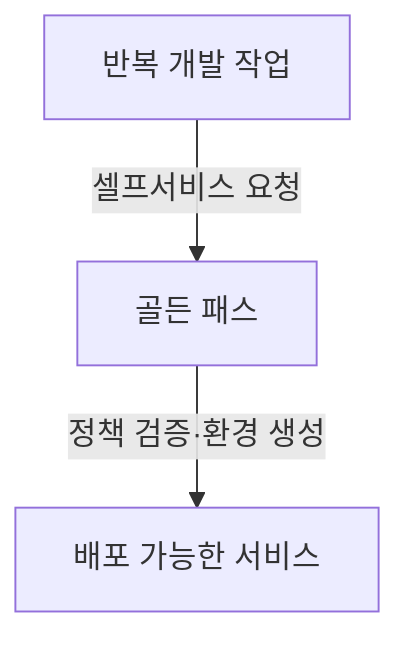
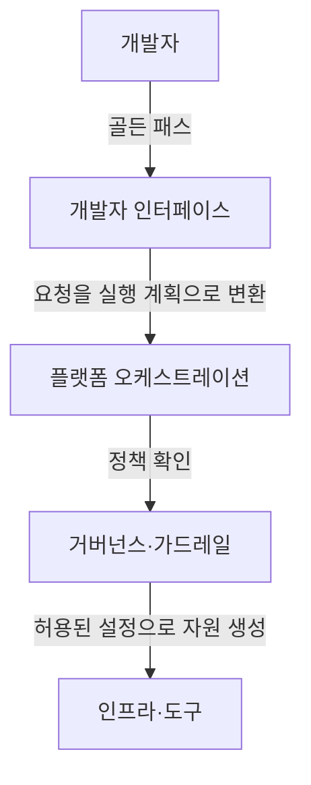

## 지식 로드맵 내 현재 위치

지식 위치: 소프트웨어 공학 → 빌드·배포·DevOps → **플랫폼 엔지니어링(Platform Engineering)**

## 30초 인출

- 본질: **플랫폼 엔지니어링(Platform Engineering)**은 클라우드 네이티브 환경에서 개발자의 인지 부하(Cognitive Load)를 줄이고 셀프서비스 역량을 제공하기 위해 **내부 개발자 플랫폼(IDP: Internal Developer Platform)**을 구축·운영하는 공학 학문
- 메커니즘: 전담 플랫폼 팀(Platform Team)이 플랫폼을 제품(Product)으로 취급 → **골든 패스(Golden Path)** 포장 → 셀프서비스 포털 제공
- 산출/효과: 개발자 인지 부하 감소 · 온보딩 시간 단축 · 보안/컴플라이언스 기본 내재화 · 개발 생산성(Velocity) 극대화

핵심 용어

- **Platform Engineering**: 현대 소프트웨어 엔지니어링 조직에서 개발자의 생산성을 극대화하기 위해 툴체인과 워크플로우를 설계하고 지원하는 기술 분야
- **IDP(Internal Developer Platform)**: 플랫폼 팀이 구축하여 개발자가 필요로 하는 인프라, 환경, 배포를 스스로 프로비저닝할 수 있게 해주는 셀프서비스 계층
- **Golden Path (황금 경로)**: 보안, 신뢰성, 모범 사례가 이미 검증되어 개발자가 고민 없이 따라가기만 하면 되는 표준화된 권장 개발 경로
- **Cognitive Load(인지 부하)**: 개발자가 쿠버네티스, 테라폼, 보안 등 복잡한 인프라 도구를 다루면서 비즈니스 코드에 집중하지 못하게 되는 정신적 부담
- **Platform as a Product**: 내부 플랫폼을 사내 개발자(고객)를 위한 하나의 독립된 제품으로 취급하고 지속적으로 개선하는 접근법

---

## 1교시 예상문제 (10점)

> 플랫폼 엔지니어링(Platform Engineering)의 정의와 목적, 핵심 구조와 작동 원리를 설명하시오. (예상)

---

## 1교시 10점 답안

### Ⅰ. 정의·목적

- 정의: **플랫폼 엔지니어링**은 개발자의 인지 부하를 줄이고 셀프서비스 환경을 제공하기 위해 내부 개발자 플랫폼(IDP)을 제품으로 구축하는 기술 분야
- 목적: 복잡한 인프라 조작을 추상화하여 비즈니스 개발 생산성과 출시 속도 극대화

### Ⅱ. 핵심 구성요소

### Ⅲ. 핵심 통제

- **Product Mindset**: 플랫폼 팀을 서비스 제공 부서가 아닌 사내 제품 개발팀으로 운영
- **Cognitive Load 해소**: 쿠버네티스/인프라 설정을 감추고 원클릭 프로비저닝 지원
---

## 2~4교시 예상문제 (25점)

> DevOps의 성숙과 함께 대두된 플랫폼 엔지니어링(Platform Engineering)의 개념 및 등장 배경(개발자 인지 부하 문제)을 설명하고, 내부 개발자 플랫폼(IDP)의 핵심 아키텍처 구성요소, 골든 패스(Golden Path)의 역할 및 전통적 DevOps 모델과의 차이점을 제시하시오. (25점)

> (25점, 예상)

---

## 2~4교시 25점 답안

### Ⅰ. DevOps 피로도를 극복하는 플랫폼 엔지니어링의 개요

> 팀이 서비스 운영 책임까지 맡으면 도구·환경 관리 부담이 커질 수 있어, 플랫폼 팀은 반복되는 기반 작업을 셀프서비스로 제공한다.

- 정의: **플랫폼 엔지니어링**은 개발자가 복잡한 인프라를 직접 다루지 않도록 내부 개발자 플랫폼(IDP)을 제품처럼 설계·운영하는 분야다.
- 목적: **개발자의 인지 부하(Cognitive Load) 최소화**, 개발 생산성 및 출시 속도 가속, 인프라 보안/컴플라이언스 가드레일 자동 적용

| 플랫폼이 제공하는 것 | 개발자에게 주는 가치 |
|---|---|
| 공통 개발·배포 경로 | 환경 설정 반복 감소 |
| 자동화된 정책 확인 | 기본 통제 준수와 피드백 |

### Ⅱ. 내부 개발자 플랫폼(IDP)의 학습용 4계층 관점

> IDP는 복잡한 하부 클라우드 기술(K8s, Terraform)을 추상화하여 개발자에게 단순한 인터페이스를 제공한다.

### Ⅲ. 전통적 DevOps vs 플랫폼 엔지니어링 비교

> 플랫폼 엔지니어링은 DevOps를 대체하는 것이 아니라, DevOps 문화를 대규모 조직에서 실현 가능하게 만드는 진화 형태이다.

| 비교 항목 | 전통적 DevOps ("You build it, you run it") | 플랫폼 엔지니어링 (IDP 기반) |
|---|---|---|
| **개발자의 역할** | 비즈니스 로직과 인프라 도구를 직접 조합 | 셀프서비스 경로로 인지 부하를 줄이고 제품 개발에 집중 |
| **인지 부하** | 개발팀이 운영 도구·환경 책임을 직접 맡을 수 있음 | 공통 작업을 셀프서비스로 제공해 반복 부담을 줄일 수 있음 |
| **인프라 상호작용** | 각 팀이 도구·환경 설정을 직접 관리 | 골든 패스 템플릿으로 권장 경로를 제공 |
| **보안 및 규정** | 개별 개발팀의 역량과 양심에 의존 | 플랫폼 레벨에서 **보안 가드레일 자동 강제** |
| **적합한 상황** | 공통 개발·운영 기반이 단순한 경우 | 반복되는 기반 작업과 조정 부담이 커져 공통 셀프서비스가 유용한 경우 |

### Ⅳ. 플랫폼 엔지니어링 문제점·대응책

> 골든 패스는 강제가 아니라 개발자가 가장 편하게 따를 수 있는 '최소 저항의 경로'로 설계되어야 한다.

### 1. 골든 패스 핵심 원칙

- **포장된 도로(Paved Road)**: 표준 기술 스택, CI/CD, 모니터링, 보안이 사전 구성된 기성품 템플릿 제공
- **자율성 보장(Freedom of Choice)**: 골든 패스를 따르는 것이 가장 쉽지만, 특별한 요구가 있다면 벗어날 자유(오프로드) 허용
- **가드레일 내재화(Invisible Guardrails)**: 개발자가 실수하더라도 보안 취약점이나 인프라 파괴가 일어나지 않도록 정책적 격리

### 2. 플랫폼 엔지니어링 실무 위험 및 대응 통제

| 위험 | 대책 | 효과 |
|---|---|---|
| 플랫폼 강제로 인한 개발자 반발 및 우회 | 최소 저항의 골든 패스 제공 및 예외적 오프로드 허용 | 개발자 자율성 존중 및 플랫폼 자발적 채택 유도 |
| 중앙 인프라 병목 현상 및 환경 배포 지연 | 셀프서비스 포털(IDP) 기반 인프라·환경 프로비저닝 자동화 | 온보딩 및 환경 구성 리드타임 대폭 단축 |
| 개발팀별 보안·컴플라이언스 설정 누락 | OPA(Open Policy Agent) 기반 코드화된 가드레일 내재화 | 인프라 취약점 사전 차단 및 규정 준수 보증 |

### 실전 답안용 기술사적 제언

| 문제 | 해결 방안 |
|---|---|
| 플랫폼 투자 범위가 실제 개발자 업무의 반복 부담과 어긋날 수 있음 | 제언: 반복 빈도가 높은 개발·배포 작업 하나를 골라 셀프서비스 경로로 제공하고, 도입 전후의 처리시간·오류와 사용자 피드백을 비교해 다음 기능을 정한다. |
---

## 출제 이력과 검증 출처

- Gartner Top Strategic Technology Trends for 2024: Platform Engineering
- Manuel Pais, Matthew Skelton, Team Topologies: Organizing Business and Technology Teams for Fast Flow
- CNCF Platforms White Paper (Cloud Native Computing Foundation)

## 연결 토픽

- 이전 토픽: [메타모픽 테스트](./030_metamorphic_test.md)
- 연관 토픽: [DevOps](./002_devops.md), [CI/CD](./095_ci_cd.md)
- 다음 토픽: [MSA](./035_msa.md)
