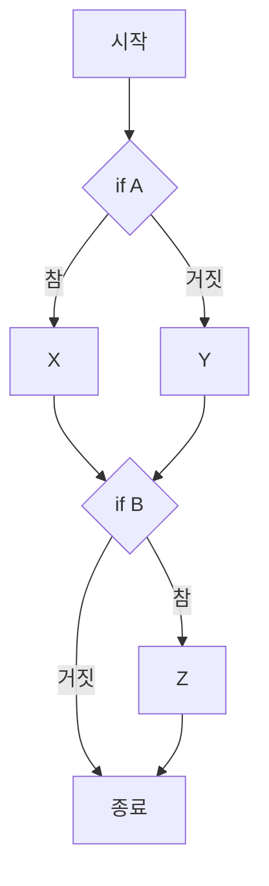
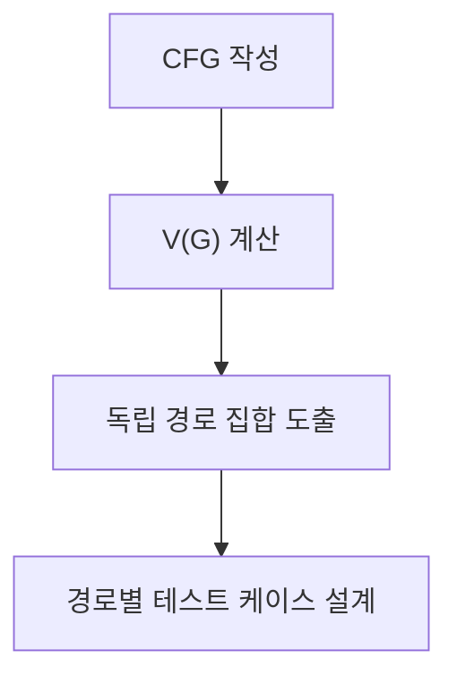

## 지식 로드맵 내 현재 위치

지식 위치: 소프트웨어 공학 → 테스트·검증 → **McCabe 순환복잡도**

## 30초 인출

- 본질: **McCabe 순환복잡도(Cyclomatic Complexity)**는 프로그램의 제어 흐름 그래프(CFG)를 바탕으로 선형적으로 독립적인 기본 경로(Basis Path)의 수를 정량적으로 측정하는 소프트웨어 복잡도 메트릭
- 메커니즘: 그래프 이론 기반 계산 `V(G) = E - N + 2P = P + 1 = R` (Edge 수, Node 수, 분기 노드 수, 면 수)
- 산출/효과: 화이트박스 테스트의 **기본 경로 테스팅(Basis Path Testing)** 케이스 수 도출 · 결함 발생 위험 예측 · 리팩토링 기준선(10 이하) 확립

핵심 용어

- **Cyclomatic Complexity(순환복잡도)**: Thomas McCabe가 제안한 메트릭으로, 제어 흐름 내의 선형 독립 경로 수를 수치화한 지표
- **CFG(Control Flow Graph)**: 노드(실행 문장 블록)와 엣지(제어 이동 경로)로 프로그램 논리를 표현한 그래프
- **Basis Path(기본 경로)**: 프로그램 내의 다른 독립 경로들의 조합으로 표현될 수 없는 최소한 하나의 새로운 엣지를 포함하는 독립 실행 경로
- **Predicate Node(서술 노드/분기 노드)**: 둘 이상의 엣지가 나가는 분기문(if, while, for 등)을 포함하는 노드
- **Complexity Threshold(복잡도 임계치)**: 통상 1~10은 매우 양호(단순), 11~20은 중간 위험, 21 이상은 고위험 리팩토링 대상으로 판정

---

## 1교시 예상문제 (10점)

> McCabe 순환복잡도의 정의와 목적, 핵심 구조와 작동 원리를 설명하시오. (예상)

---

## 1교시 10점 답안

### Ⅰ. 정의·목적

- 정의: **McCabe 순환복잡도(Cyclomatic Complexity)**는 제어 흐름 그래프(CFG)를 기반으로 프로그램 내 선형 독립 경로 수를 정량화한 지표
- 목적: 화이트박스 테스트 케이스 최소 수량 도출 및 복잡 코드 리팩토링 기준선 제공

### Ⅱ. 핵심 계산 공식

| 계산 방식 | 공식 | 비고 |
|---|---|---|
| 간선·노드 기반 | `V(G) = E - N + 2P` | 단일 모듈은 P=1이므로 `V(G) = E - N + 2` |
| 분기 노드 기반 | `V(G) = P + 1` | P는 출력 간선 2개 이상인 서술 노드 수 |
| 영역 기반 | `V(G) = R` | 닫힌 영역 수 + 외부 개방 영역 1개 |

### Ⅲ. 핵심 통제

- **임계치 관리**: V(G) ≤ 10 (안정), 10 초과 시 Extract Method 리팩토링 의무화
- **Basis Path**: 도출된 복잡도 수만큼 독립 경로를 설계하여 결정 커버리지 100% 달성
---

## 2~4교시 예상문제 (25점)

> Thomas McCabe의 순환복잡도(Cyclomatic Complexity)의 개념 및 목적을 설명하고, 제어 흐름 그래프(CFG)를 통한 3가지 계산 공식, 복잡도 수치에 따른 프로그램 위험도 판정 기준 및 화이트박스 기본 경로 테스팅(Basis Path Testing)에의 적용 방안을 제시하시오. (25점)

> (25점, 예상)

---

## 2~4교시 25점 답안

### Ⅰ. 소프트웨어 논리 복잡도의 정량적 척도, McCabe 순환복잡도의 개요

> 순환복잡도는 제어 흐름의 독립 경로 수를 나타내는 지표이며, 단독으로 결함이나 유지보수성을 판정하지 않는다.

- 정의: **McCabe 순환복잡도**는 프로그램의 제어 흐름 그래프(CFG)에 있는 선형 독립 실행 경로의 수를 나타내는 지표다.
- 목적: 소프트웨어 **테스트 용이성(Testability)** 평가, 필요 최소 테스트 케이스 수 도출, **리팩토링(Refactoring)** 대상 함수 식별

| 순환복잡도가 나타내는 것 | 나타내지 않는 것 |
|---|---|
| 제어 흐름의 선형 독립 경로 수 | 결함 수나 코드 전체의 품질 |

### Ⅱ. 제어 흐름 그래프(CFG) 모델링과 3대 계산 공식

> 순환복잡도는 그래프의 간선(E), 노드(N), 분기 노드(P), 영역(R)을 통해 동일한 결과값으로 도출된다.

| 계산 방식 | 공식 | 비고 |
|---|---|---|
| 간선·노드 기반 | `V(G) = E - N + 2P` | 단일 모듈은 P=1이므로 `V(G) = E - N + 2` |
| 분기 노드 기반 | `V(G) = P + 1` | P는 출력 간선 2개 이상인 서술 노드(Predicate Node) 수, 실무 계산에 적합 |
| 영역 기반 | `V(G) = R` | CFG가 분할하는 닫힌 영역 수 + 외부 개방 영역 1개 |

### 계산 예시: `if (A) then X; else Y; if (B) then Z;`

- 서술 노드 P = 2개 (조건식 A, 조건식 B)
- 순환복잡도 `V(G) = 2 + 1 = 3`
- 의미: 제어 흐름 그래프의 **선형 독립 경로 수는 3개**이며 기본 경로 테스트 설계 기준으로 활용

### Ⅲ. 순환복잡도 수치에 따른 위험도 판정 기준

> 복잡도 구간은 위험 선별의 참고값으로만 쓰며, 수치만으로 결함이나 설계 책임을 단정하지 않는다.

| 복잡도 V(G) 수치 | 구조적 상태 평가 | 결함 발생 위험도 | 조치 가이드라인 |
|---|---|---|---|
| **낮은 값** | 그래프상 독립 경로 수가 적음 | 복잡도만으로 실제 위험을 단정할 수 없음 | 요구사항 중요도·변경 이력과 함께 검토 |
| **높은 값** | 분기 경로가 많아 독립 경로 시험 설계에 부담 | 시험·이해 비용이 커질 수 있음 | 조직 기준에 따라 검토 대상과 시험 범위를 정함 |

### Ⅳ. 순환복잡도 활용 문제점·대응책

> 화이트박스 테스팅에서 중복 없이 모든 분기를 커버하는 테스트 스위트를 설계하는 기준이 된다.

### 1. 기본 경로 테스팅 4단계

### 2. 순환복잡도 관리 실무 위험 및 대응 통제

| 위험 | 대책 | 효과 |
|---|---|---|
| 높은 복잡도 코드의 독립 경로가 충분히 시험되지 않음 | CFG와 독립 경로를 확인해 위험한 조건 조합을 시험 | 빠진 분기 경로를 찾아 보완 |
| 복잡도만 낮추려다 동작을 바꾸거나 책임을 부적절하게 분리 | 동작을 고정하는 시험을 먼저 확보하고 변경 후 결과 비교 | 구조 개선 중 회귀 여부 확인 |
| 복잡도 기준을 모든 모듈에 똑같이 적용 | 시스템 영향도와 조직 기준에 맞춰 검토 임계치·예외 절차 결정 | 측정치가 리뷰 우선순위를 지원 |

### 실전 답안용 기술사적 제언

| 문제 | 해결 방안 |
|---|---|
| 단일 임계치를 모든 모듈에 적용하면 중요한 코드와 단순 코드를 같은 방식으로 취급함 | 제언: 복잡도가 높고 변경·결함 영향도도 큰 모듈을 먼저 검토 대상으로 삼고, 조직의 시험·리뷰 기준에 맞는 임계치를 정해 예외와 조치 근거를 기록한다. |
---

## 출제 이력과 검증 출처

- 제139회 정보관리기술사 1교시: 맥케이브 순환복잡도 계산 및 활용 방안
- Thomas J. McCabe, A Complexity Measure (IEEE Transactions on Software Engineering 1976)
- Roger S. Pressman, Software Engineering: A Practitioner's Approach

## 연결 토픽

- 이전 토픽: [MSA](./035_msa.md)
- 연관 토픽: [화이트박스 테스트](./013_white_box_test.md), [리팩토링](./006_refactoring.md)
- 다음 토픽: [SOAP](./037_soap.md)
