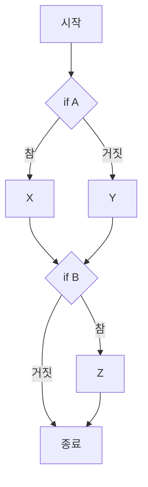
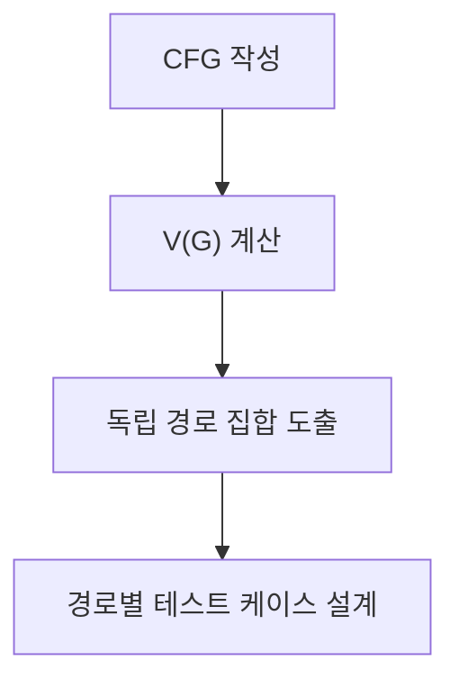

## 지식 로드맵 내 현재 위치

지식 위치: 소프트웨어 공학 → 테스트·검증 → **McCabe 순환복잡도**

## 30초 인출

- 본질: **McCabe 순환복잡도(Cyclomatic Complexity)**는 프로그램의 제어 흐름 그래프(CFG)를 바탕으로 선형적으로 독립적인 기본 경로(Basis Path)의 수를 정량적으로 측정하는 소프트웨어 복잡도 메트릭
- 메커니즘: 그래프 이론 기반 계산 `V(G) = E - N + 2P = P + 1 = R` (Edge 수, Node 수, 분기 노드 수, 면 수)
- 산출/효과: 화이트박스 테스트의 **기본 경로 테스팅(Basis Path Testing)** 케이스 수 도출 · 결함 발생 위험 예측 · 리팩토링 기준선(10 이하) 확립

핵심 용어

- **Cyclomatic Complexity(순환복잡도)**: Thomas McCabe가 제안한 메트릭으로, 제어 흐름 내의 선형 독립 경로 수를 수치화한 지표
- **CFG(Control Flow Graph)**: 노드(실행 문장 블록)와 엣지(제어 이동 경로)로 프로그램 논리를 표현한 그래프
- **Basis Path(기본 경로)**: 프로그램 내의 다른 독립 경로들의 조합으로 표현될 수 없는 최소한 하나의 새로운 엣지를 포함하는 독립 실행 경로
- **Predicate Node(서술 노드/분기 노드)**: 둘 이상의 엣지가 나가는 분기문(if, while, for 등)을 포함하는 노드
- **Complexity Threshold(복잡도 임계치)**: 통상 1~10은 매우 양호(단순), 11~20은 중간 위험, 21 이상은 고위험 리팩토링 대상으로 판정

---

## 1교시 예상문제 (10점)

> McCabe 순환복잡도의 정의와 목적, 핵심 구조와 작동 원리를 설명하시오. (예상)
---

## 1교시 10점 답안

### 1. 정의·목적

- 정의: **McCabe 순환복잡도(Cyclomatic Complexity)**는 제어 흐름 그래프(CFG)를 기반으로 프로그램 내 선형 독립 경로 수를 정량화한 지표
- 목적: 화이트박스 테스트 케이스 최소 수량 도출 및 복잡 코드 리팩토링 기준선 제공

### 2. 핵심 계산 공식 3가지

| 계산 방식 | 공식 | 비고 |
|---|---|---|
| 간선·노드 기반 | `V(G) = E - N + 2P` | 단일 모듈은 P=1이므로 `V(G) = E - N + 2` |
| 분기 노드 기반 | `V(G) = P + 1` | P는 출력 간선 2개 이상인 서술 노드 수 |
| 영역 기반 | `V(G) = R` | 닫힌 영역 수 + 외부 개방 영역 1개 |

### 3. 핵심 통제

- **임계치 관리**: V(G) ≤ 10 (안정), 10 초과 시 Extract Method 리팩토링 의무화
- **Basis Path**: 도출된 복잡도 수만큼 독립 경로를 설계하여 결정 커버리지 100% 달성
---

## 2~4교시 예상문제 (25점)

> Thomas McCabe의 순환복잡도(Cyclomatic Complexity)의 개념 및 목적을 설명하고, 제어 흐름 그래프(CFG)를 통한 3가지 계산 공식, 복잡도 수치에 따른 프로그램 위험도 판정 기준 및 화이트박스 기본 경로 테스팅(Basis Path Testing)에의 적용 방안을 제시하시오. (25점)

> (25점, 예상)
---

## 2~4교시 25점 답안

### Ⅰ. 소프트웨어 논리 복잡도의 정량적 척도, McCabe 순환복잡도의 개요

> "복잡한 코드는 필연적으로 버그를 품고 있다." 순환복잡도는 주관적 코드 평가를 객관적 수치로 증명하는 공학 지표다.

- 정의: 프로그램의 제어 흐름 그래프(CFG)를 분석하여 선형적으로 독립적인 실행 경로의 개수를 측정하는 그래프 이론 기반의 소프트웨어 척도
- 목적: 소프트웨어 **테스트 용이성(Testability)** 평가, 필요 최소 테스트 케이스 수 도출, **리팩토링(Refactoring)** 대상 함수 식별

### Ⅱ. 제어 흐름 그래프(CFG) 모델링과 3대 계산 공식

> 순환복잡도는 그래프의 간선(E), 노드(N), 분기 노드(P), 영역(R)을 통해 동일한 결과값으로 도출된다.

| 계산 방식 | 공식 | 비고 |
|---|---|---|
| 간선·노드 기반 | `V(G) = E - N + 2P` | 단일 모듈은 P=1이므로 `V(G) = E - N + 2` |
| 분기 노드 기반 | `V(G) = P + 1` | P는 출력 간선 2개 이상인 서술 노드(Predicate Node) 수, 실무 계산에 적합 |
| 영역 기반 | `V(G) = R` | CFG가 분할하는 닫힌 영역 수 + 외부 개방 영역 1개 |

### 계산 예시: `if (A) then X; else Y; if (B) then Z;`

- 서술 노드 P = 2개 (조건식 A, 조건식 B)
- 순환복잡도 `V(G) = 2 + 1 = 3`
- 의미: 제어 흐름 그래프의 **선형 독립 경로 수는 3개**이며 기본 경로 테스트 설계 기준으로 활용

### Ⅲ. 순환복잡도 수치에 따른 위험도 판정 기준

> 복잡도 임계치는 조직·언어·도구별 품질 기준으로 정하며, 수치만으로 결함을 단정하지 않는다.

| 복잡도 V(G) 수치 | 구조적 상태 평가 | 결함 발생 위험도 | 조치 가이드라인 |
|---|---|---|---|
| **1 ~ 10** | 구조가 단순하고 명확한 프로그램 | **낮음 (Low Risk)** | 매우 안정적, 유지보수 및 테스트 용이 |
| **11 ~ 20** | 다소 복잡한 분기 구조 보유 | **중간 (Moderate Risk)** | 부분적 리팩토링 검토, 집중 테스트 필요 |
| **21 ~ 50** | 매우 복잡하고 이해하기 어려운 코드 | **높음 (High Risk)** | 메서드 추출 등 리팩토링 우선 검토 |
| **50 초과** | 경로 분석·테스트 비용이 큰 코드 | **매우 높음** | 모듈 분리·재설계 타당성 검토 |

### Ⅳ. 순환복잡도 활용 문제점·대응책

> 화이트박스 테스팅에서 중복 없이 모든 분기를 커버하는 테스트 스위트를 설계하는 기준이 된다.

### 1. 기본 경로 테스팅 4단계

### 2. 순환복잡도 관리 실무 위험 및 대응 통제

| 위험 | 대책 | 효과 |
|---|---|---|
| 과도한 분기문으로 복잡도 폭증(V(G)>10) | 메서드 추출(Extract Method) 및 다형성(Strategy 패턴) 리팩토링 | 코드 가독성 향상 및 잠재 결함 발생률 감소 |
| 기본 경로(Basis Path) 누락으로 미검증 분기 발생 | 순환복잡도 수치 기반 선형 독립 경로 전수 도출 및 테스트 | 분기 커버리지 100% 달성 및 회귀 버그 예방 |
| 고복잡도 코드의 지속적 커밋 방치 | CI 파이프라인 내 SonarQube 복잡도 Quality Gate(V(G)≤10) 연동 | 고복잡도 코드의 운영 환경 유입 원천 차단 |

### Ⅴ. 지표·리뷰 결합 통제의 결론

> 개발자의 코딩 습관에만 맡기지 말고, CI 파이프라인에서 복잡도를 자동 측정하여 기준치를 강제해야 한다.

### 학습자 통찰 메모 — 답안 밖

- [핵심 통찰]: 순환복잡도는 단순히 테스트 케이스 수를 세는 공식이 아니라, 객체지향 설계에서 '단일 책임 원칙(SRP)'이 무너졌는지를 가늠하는 리트머스 시험지임. 함수 하나의 복잡도가 15를 넘어간다면 그 함수는 최소 2~3가지 이상의 서로 다른 비즈니스 책임을 동시에 수행하고 있다는 명백한 증거임.
- 나라면: SonarQube 정적 분석 규칙에 메서드 복잡도 임계치를 10으로 설정하고, 신규 PR에서 V(G) > 10인 코드가 발견되면 자동으로 빌드를 실패(Quality Gate Fail)시켜 개발자가 메서드 분할을 하지 않고는 머지할 수 없도록 강제하겠음.

### 실전 답안용 기술사적 제언

- **판정 기준**: 메서드 단위 순환복잡도 V(G) ≤ 10 엄격 준수, 초과 시 기술부채 티켓 자동 발급 및 PR 머지 차단
- **대응 방안**: SonarQube/Checkstyle CI 자동 검사 연동, 다중 if/switch 분기문을 Strategy/Command 패턴 다형성으로 리팩토링
- **검증 체계**: 전사 코드베이스 평균 V(G) ≤ 5 유지 검증, V(G) > 15 고위험 메서드 제로화(Zero-defect) 정기 감사
- **기대 효과**: 소스코드 결함 밀도 50% 감소, 단위 테스트 케이스 최소 필수 수치 명확화로 테스트 공수 40% 절감
---

## 출제 이력과 검증 출처

- 제139회 정보관리기술사 1교시: 맥케이브 순환복잡도 계산 및 활용 방안
- Thomas J. McCabe, A Complexity Measure (IEEE Transactions on Software Engineering 1976)
- Roger S. Pressman, Software Engineering: A Practitioner's Approach

## 연결 토픽

- 이전 토픽: [MSA](./035_msa.md)
- 연관 토픽: [화이트박스 테스트](./013_white_box_test.md), [리팩토링](./006_refactoring.md)
- 다음 토픽: [SOAP](./037_soap.md)
