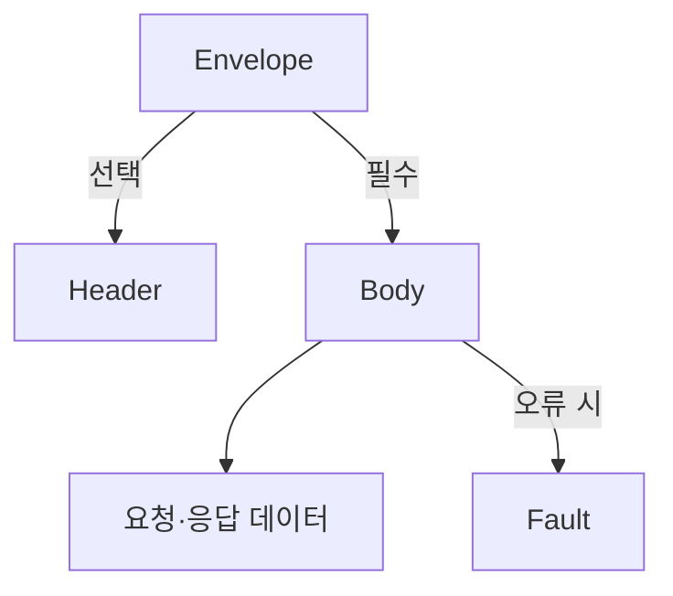
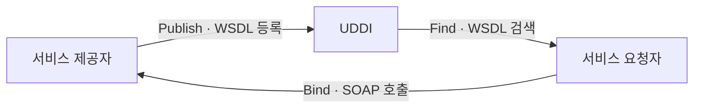

## 지식 로드맵 내 현재 위치

지식 위치: 소프트웨어 공학 → 구현·객체지향·API → **SOAP**

## 30초 인출

- 본질: **SOAP(Simple Object Access Protocol)**은 분산 환경에서 구조화된 정보(XML)를 교환하기 위해 W3C에서 표준화한 XML 기반의 엄격한 메시징 프로토콜
- 메커니즘: **SOAP Envelope**(봉투) + **Header**(보안·트랜잭션) + **Body**(요청/응답 데이터) + **WSDL**(서비스 명세 계약) + **UDDI**(서비스 등록/탐색)
- 산출/효과: 전송 프로토콜 독립성(HTTP, SMTP 등) · **WS-Security** 기반 엔터프라이즈 보안 · 엄격한 계약(Contract) 기반 상호운용성

핵심 용어

- **SOAP**: 플랫폼과 프로그래밍 언어에 독립적으로 XML 기반 메시지를 교환하기 위한 W3C 표준 분산 프로토콜
- **WSDL(Web Services Description Language)**: 웹 서비스의 위치, 제공하는 메서드, 매개변수 타입을 XML로 엄격히 기술한 인터페이스 계약서
- **UDDI(Universal Description, Discovery, and Integration)**: 웹 서비스를 등록하고 검색할 수 있는 전역 비즈니스 레지스트리 표준
- **SOAP Fault**: SOAP 메시지 처리 중 오류가 발생했을 때 상세 에러 정보를 표준 규격으로 반환하는 Body 하위 엘리먼트
- **WS-Security**: 메시지 수준(Message-level)에서 XML 서명 및 암호화를 제공하여 전송 프로토콜과 무관하게 종단 간 보안을 보장하는 표준

## 예상문제

> 엔터프라이즈 SOA(Service-Oriented Architecture)의 핵심 통신 프로토콜인 SOAP의 개념 및 메시지 구조(Envelope, Header, Body, Fault)를 설명하고, WSDL/UDDI와의 연계 메커니즘 및 현대 RESTful 웹 서비스와의 다각적 비교를 제시하시오. (25점)

## Ⅰ. 엄격한 계약 기반 엔터프라이즈 메시징, SOAP의 개요

> 웹의 유연함보다는 기업 간(B2B) 금융·공공 거래의 엄격한 보안과 형식적 계약 무결성이 최우선일 때 SOAP이 채택된다.

- 정의: 분산 환경에서 서로 다른 기종의 시스템 간에 구조화된 정보(XML)를 전송 프로토콜(HTTP, SMTP, JMS 등)에 독립적으로 교환할 수 있도록 정의한 W3C 표준 프로토콜
- 목적: 분산 객체 간 상호운용성 보장, **WS-* 표준(보안, 트랜잭션, 신뢰성)** 기반 엔터프라이즈 B2B 연계, 엄격한 인터페이스 계약 준수

## Ⅱ. SOAP 메시지 구조: Envelope·Header·Body·Fault

> 모든 SOAP 메시지는 단일 XML 문서로 구성되며, 봉투(Envelope) 안에 헤더와 바디가 중첩된다.

## Ⅲ. 웹 서비스 3대 표준 스택: SOAP, WSDL, UDDI

> 세 기술은 서비스 출판(Publish), 검색(Find), 바인딩(Bind)의 삼각관계를 형성한다.

## Ⅳ. SOAP 적용 문제점·대응책

> 경량성과 모바일 확장을 중시하는 웹 환경은 REST로 재편되었으나, 레거시 금융과 보안 연계에서는 여전히 SOAP이 공존한다.

| 비교 항목 | SOAP (Simple Object Access Protocol) | REST (Representational State Transfer) |
|---|---|---|
| **본질적 위상** | **엄격한 프로토콜 (Protocol)** | **유연한 아키텍처 스타일 (Style)** |
| **데이터 포맷** | **오직 XML만 지원** (장황함, 무거움) | **JSON**, XML, Text 등 다양한 포맷 지원 (경량) |
| **인터페이스 계약**| **WSDL 기반 강력한 사전 계약 강제** | 자유로움 (OpenAPI/Swagger로 사후 문서화) |
| **전송 프로토콜** | 프로토콜 독립적 (HTTP, SMTP, TCP, JMS) | **HTTP 프로토콜에 전적으로 종속** |
| **보안 메커니즘** | **WS-Security (메시지 레벨 암호화/무결성)** | 전송 레벨 HTTPS(TLS) 및 애플리케이션 JWT |
| **성능 및 복잡도** | 파싱 오버헤드 큼, 학습 곡선 높음 | 빠르고 단순함, 브라우저/모바일 친화적 |

| 위험 | 대책 | 효과 |
|---|---|---|
| 대용량 XML 처리 비용 | 메시지 크기 제한 · 스트리밍 파서 · 압축 적용 | 자원 고갈·지연 완화 |
| 계약 변경으로 소비자 장애 | WSDL 버전 관리 · 호환성 테스트 | 연계 시스템 회귀 방지 |
| 메시지 보안 설정 오류 | WS-Security 프로파일 검증 · 키 수명주기 통제 | 종단 간 무결성·기밀성 확보 |

## Ⅴ. 계약·상호운용성 중심의 결론

> SOAP을 무조건적인 레거시로 배척할 것이 아니라, 고도의 B2B 금융 컴플라이언스 환경에 맞는 적재적소 운용이 필요하다.

### 학습자 통찰 메모 — 답안 밖

- [핵심 통찰]: REST가 웹과 모바일의 천하통일을 이룬 이유는 JSON의 가벼움과 HTTP의 단순성 덕분임. 하지만 중간 프록시를 거치며 메시지 자체가 여러 라우터를 통과해야 하는 은행 간 망(Swift, 금융결제원) 연계에서는 전송 계층 암호화(HTTPS)만으로는 부족하며, 메시지 본문 자체를 전자서명하고 암호화하는 SOAP의 WS-Security가 여전히 강력한 기술적 정당성을 가짐.
- 나라면: 신규 대고객 서비스 및 MSA 환경에서는 REST/JSON과 gRPC를 표준으로 채택하되, 금융사 코어 뱅킹이나 대외 정부 공공 연계 시스템과의 인터페이스는 ESB(Enterprise Service Bus) 기반의 SOAP/WSDL 어댑터를 배치하여 이중화 거버넌스를 구축하겠음.

### 실전 답안용 기술사적 제언

- **판정 기준**: 대외 B2B/금융망 연계는 SOAP(WS-Security) 강제, 대고객 채널 및 MSA 내부 통신은 REST/gRPC 채택으로 분기 판정
- **대응 방안**: API Gateway 및 ESB 멀티 프로토콜 변환 어댑터를 구축하여 기존 SOAP 백엔드를 신규 REST 인터페이스로 래핑
- **검증 체계**: WS-Security 전자서명/암호화 유효성 및 WSDL 스키마 준수율 100% 검증, 프로토콜 변환 지연 30ms 이내 통제
- **기대 효과**: 레거시 코어 자산의 연속성 보장과 현대적 MSA 클라우드 생태계 간 무중단 상호운용성 확보

## 1교시 10점 답안 발췌

### 1. 정의·목적

- 정의: **SOAP(Simple Object Access Protocol)**은 분산 환경에서 프로토콜 독립적으로 XML 기반 구조화된 메시지를 교환하는 W3C 표준 프로토콜
- 목적: 엄격한 인터페이스 계약(WSDL)과 메시지 수준 보안(WS-Security) 기반 B2B 연계

### 2. SOAP 메시지 구조

### 3. 핵심 통제

- **WSDL 계약**: 서비스 규격, 오퍼레이션, 파라미터 타입을 사전 엄격 통제
- **WS-Security**: XML 서명/암호화로 중간 매개체 통과 시에도 종단 간 기밀성 보증

## 출제 이력과 검증 출처

- 제134회 정보관리기술사 2교시: 웹 서비스(SOAP)와 RESTful 아키텍처의 심층 비교
- W3C SOAP Version 1.2 Specification
- OASIS Web Services Security (WSS) TC Standard

## 학습 체크

- [ ] Envelope 내부의 선택적 Header·필수 Body와 Body 내부 Fault 관계를 설명할 수 있는가?
- [ ] SOAP, WSDL, UDDI가 형성하는 웹 서비스 3각 아키텍처를 설명할 수 있는가?
- [ ] SOAP과 REST의 차이점을 메시지 포맷, 계약 강제성, 보안 관점에서 비교할 수 있는가?

## 연결 토픽

- 이전 토픽: [McCabe 순환복잡도](./036_mccabe_cyclomatic_complexity.md)
- 연관 토픽: [REST](./015_rest.md), [Open API](./022_open_api.md)
- 다음 토픽: [개발방법론 테일러링](./039_methodology_tailoring.md)
