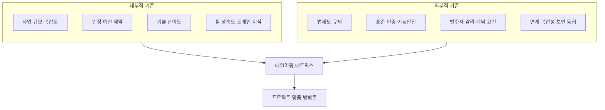
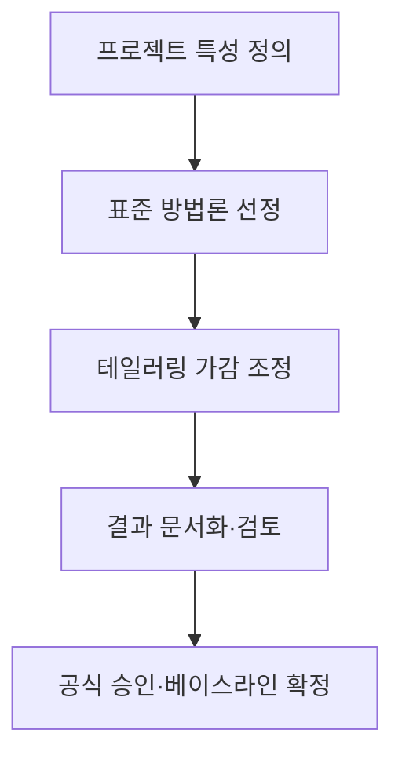

## 지식 로드맵 내 현재 위치

지식 위치: 소프트웨어 공학 → 개발 방법론 → **개발방법론 테일러링**

## 30초 인출

- 본질: **개발방법론 테일러링(Methodology Tailoring)**은 표준 소프트웨어 개발방법론을 특정 프로젝트의 규모, 성격, 기술 환경, 발주자 요구에 맞게 활동, 절차, 산출물을 가감·조정하는 최적화 활동
- 메커니즘: 프로젝트 특성 분석 → 베이스라인 방법론 선정 → 테일러링 기준 수립 → 절차/산출물 가감 조정 → **테일러링 승인 및 형상화**
- 산출/효과: 불필요한 형식적 문서 작업 제거 · 프로젝트 적합도 향상 · 개발 생산성 극대화 · 예산/일정 낭비 방지

핵심 용어

- **Methodology Tailoring(방법론 테일러링)**: 범용적인 표준 개발방법론을 특정 프로젝트의 현실적 제약과 특성에 맞도록 수정·보완하는 공학적 프로세스
- **Internal Factors(내부적 기준)**: 프로젝트 규모, 사업 기간, 기술 성숙도, 참여 인력의 도메인 지식, 개발 환경
- **External Factors(외부적 기준)**: 관련 법령, 산업 표준 규제, 보안 등급, 발주기관의 산출물 지침
- **Tailoring Matrix(테일러링 매트릭스)**: 프로젝트 특성별로 필수, 선택, 생략할 산출물과 활동을 명시한 기준표
- **Golden Rule of Tailoring**: 아무리 테일러링을 하더라도 소프트웨어의 핵심 품질 보증 및 추적성(Traceability)은 결코 생략할 수 없다는 원칙

---

## 1교시 예상문제 (10점)

> 개발방법론 테일러링의 정의와 목적, 핵심 구조와 작동 원리를 설명하시오. (예상)
---

## 1교시 10점 답안

### 1. 정의·목적

- 정의: **개발방법론 테일러링**은 조직의 표준 소프트웨어 프로세스를 개별 프로젝트의 특성에 맞게 활동과 산출물을 가감 조정하는 활동
- 목적: 형식적 문서 낭비를 제거하고 프로젝트 납기 및 품질 최적화 달성

### 2. 테일러링 2대 고려 기준

### 3. 핵심 통제

- **Do Not Tailor**: 요구사항 추적성(RTM) 및 핵심 테스트 산출물 생략 절대 불가
- **공식 승인**: 사업수행계획서에 테일러링 사유를 명시하고 발주자/감리 승인 획득
---

## 2~4교시 예상문제 (25점)

> 소프트웨어 개발 프로젝트에서 개발방법론 테일러링(Tailoring)의 개념과 필요성을 설명하고, 테일러링 시 고려해야 할 내부적/외부적 기준 요소, 표준 5단계 테일러링 절차 및 과도한 테일러링(Under/Over-tailoring) 방지를 위한 통제 방안을 제시하시오. (25점)

> (25점, 예상)
---

## 2~4교시 25점 답안

### Ⅰ. 프로젝트 성공을 위한 맞춤형 최적화, 개발방법론 테일러링의 개요

> 모든 신발이 모든 발에 맞을 수 없듯이, 모든 프로젝트에 일률적으로 적용되는 단 하나의 완벽한 방법론은 존재하지 않는다.

- 정의: 조직의 공통 표준 소프트웨어 프로세스를 개별 프로젝트의 특성(규모, 위험도, 기술, 납기)에 맞게 **단계, 활동, 태스크, 산출물을 선별적으로 조정·최적화**하는 활동
- 목적: 프로젝트 오버헤드(불필요한 형식적 문서) 제거, 자원의 효율적 집중, 프로젝트 위험 사전 완화, 납기 준수율 향상

### Ⅱ. 테일러링 시 고려해야 할 내부적 및 외부적 기준

> 테일러링은 직관이나 편의에 의해 결정되는 것이 아니며, 객관적 다차원 기준표에 의해 평가되어야 한다.

### Ⅲ. 개발방법론 테일러링 학습용 5단계 절차

> 테일러링 결과는 반드시 공식적인 사업수행계획서에 반영되어 발주자와 감리원의 승인을 득해야 한다.

### Ⅳ. 방법론 테일러링 문제점·대응책

> 테일러링이 지나치면 품질이 붕괴되고, 너무 소극적이면 문서 작업에 치여 개발이 마비된다.

| 위험 | 대책 | 효과 |
|---|---|---|
| **언더 테일러링 (품질 보증 실패)** | **최소 필수 산출물 기준선(Do Not Tailor List)** 강제 수립 | 감리 지적 방지 및 핵심 품질·유지보수성 보증 |
| **오버 테일러링 (형식주의·일정 지연)** | 프로젝트 규모별(소/중/대) **표준 간이 템플릿** 사전 제공 | 페이퍼워크 낭비 제거 및 개발 생산성 극대화 |
| **비인가 테일러링 (검수 분쟁)** | **형상관리 CCB 및 발주자 공식 변경 승인** 절차 연계 | 검수 무결성 확보 및 과업 분쟁 원천 차단 |

### Ⅴ. 근거 있는 조정·준수성 중심의 결론

> 공공 SW 및 엔터프라이즈 환경에서는 폭포수의 '거버넌스'와 애자일의 '실행력'을 결합한 하이브리드 테일러링이 대세이다.

### 학습자 통찰 메모 — 답안 밖

- [핵심 통찰]: 테일러링의 가장 큰 함정은 "바쁘니까 설계서와 테스트 결과서는 나중에 한꺼번에 쓰겠다"는 식의 생략임. 이는 테일러링이 아니라 태만임. 아무리 초경량 프로젝트라도 '요구사항 추적표(RTM)'와 '인수 테스트 결과서'는 결코 생략할 수 없는 절대 기준선임. 문서의 분량을 줄일지언정 추적성 자체를 잘라내서는 안 됨.
- 나라면: 착수 단계(착수보고회)에서 발주자 및 수탁 감리법인과 함께 '산출물 테일러링 협의체'를 가동하여, 20종의 표준 산출물 중 8종으로 통합 압축하고, 대신 프로토타입 시연과 CI/CD 자동화 보고서로 품질 증적을 대체하도록 서면 합의하겠음.

### 실전 답안용 기술사적 제언

- **판정 기준**: 프로젝트 규모/납기/도메인 위험도 기반 테일러링 매트릭스 가동 및 필수 산출물 제외 불가 원칙 판정
- **대응 방안**: 공공 단계별 마일스톤(폭포수)과 내부 스프린트(애자일)를 결합한 하이브리드 테일러링 모델 적용
- **검증 체계**: 생략·통합 산출물에 대한 CI/CD 자동화 증적 대체 및 요구사항 추적표(RTM) 100% 추적성 감리 검증
- **기대 효과**: 행정적 페이퍼워크 공수 40% 절감, 본질적 코딩/테스트 집중을 통한 납기 준수 및 결함률 50% 개선
---

## 출제 이력과 검증 출처

- 제138회 정보관리기술사 1교시: 소프트웨어 개발방법론 테일러링의 개념 및 고려사항
- ISO/IEC/IEEE 12207 Systems and software engineering - Software life cycle processes
- 한국지능정보사회진흥원(NIA), 정보시스템 구축·운영 지침 및 방법론 테일러링 가이드

## 연결 토픽

- 이전 토픽: [SOAP](./037_soap.md)
- 연관 토픽: [SW 개발방법론 비교](./139_sw_development_methodologies.md), [형상관리](./011_configuration_management.md)
- 다음 토픽: [요구공학](./040_requirements_engineering.md)
