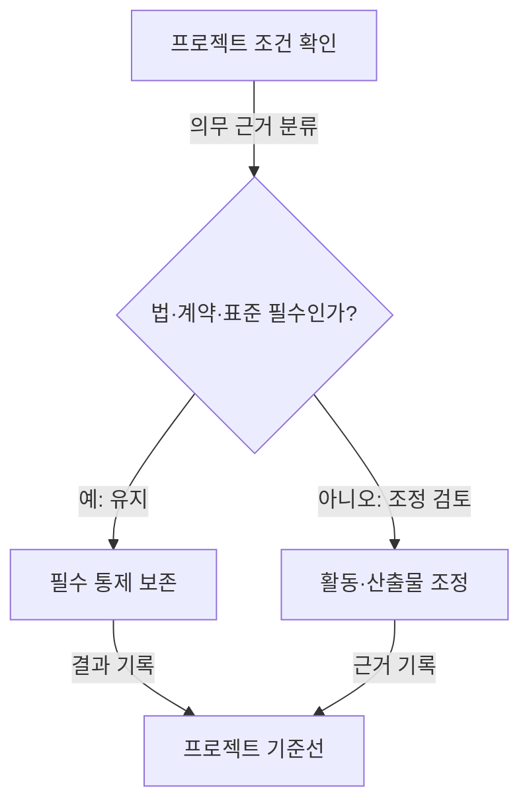
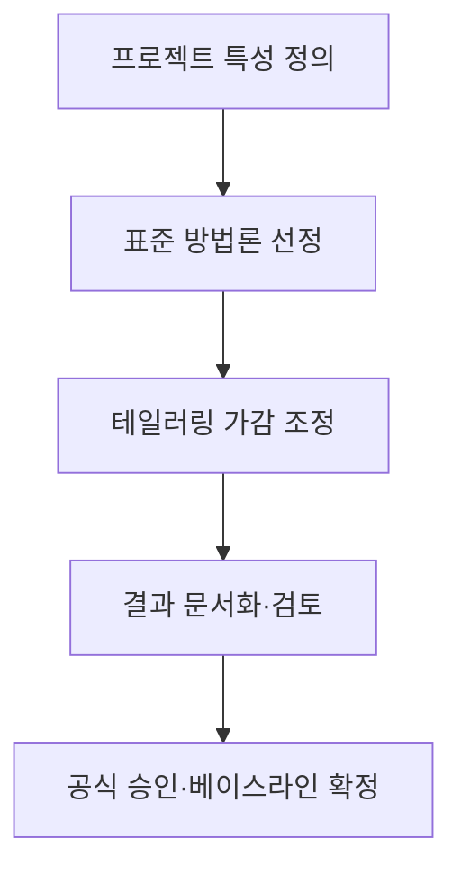

## 지식 로드맵 내 현재 위치

지식 위치: 소프트웨어 공학 → 개발 방법론 → **개발방법론 테일러링**

## 30초 인출

- 본질: **개발방법론 테일러링(Methodology Tailoring)**은 표준 소프트웨어 개발방법론을 특정 프로젝트의 규모, 성격, 기술 환경, 발주자 요구에 맞게 활동, 절차, 산출물을 가감·조정하는 최적화 활동
- 메커니즘: 프로젝트 특성 분석 → 베이스라인 방법론 선정 → 테일러링 기준 수립 → 절차/산출물 가감 조정 → **테일러링 승인 및 형상화**
- 산출/효과: 불필요한 형식적 문서 작업 제거 · 프로젝트 적합도 향상 · 개발 생산성 극대화 · 예산/일정 낭비 방지

핵심 용어

- **Methodology Tailoring(방법론 테일러링)**: 범용적인 표준 개발방법론을 특정 프로젝트의 현실적 제약과 특성에 맞도록 수정·보완하는 공학적 프로세스
- **Internal Factors(내부적 기준)**: 프로젝트 규모, 사업 기간, 기술 성숙도, 참여 인력의 도메인 지식, 개발 환경
- **External Factors(외부적 기준)**: 관련 법령, 산업 표준 규제, 보안 등급, 발주기관의 산출물 지침
- **Tailoring Matrix(테일러링 매트릭스)**: 프로젝트 특성별로 필수, 선택, 생략할 산출물과 활동을 명시한 기준표

---

## 1교시 예상문제 (10점)

> 개발방법론 테일러링의 정의와 목적, 핵심 구조와 작동 원리를 설명하시오. (예상)

---

## 1교시 10점 답안

### Ⅰ. 정의·목적

| 구분 | 핵심 |
|---|---|
| 정의 | **개발방법론 테일러링**은 조직의 표준 소프트웨어 프로세스 활동·산출물을 프로젝트 조건에 맞게 조정하는 활동 |
| 목적 | 의무 통제 보존과 프로젝트에 필요한 작업으로의 자원 배분 |

### Ⅱ. 테일러링 기준

### Ⅲ. 핵심 통제

- **필수 통제 보존**: 법·계약·조직 기준이나 위험 통제에 필요한 추적·시험 활동의 근거 없는 생략 방지
- **공식 승인**: 사업수행계획서에 테일러링 사유를 명시하고 발주자/감리 승인 획득

- 제언: 의무 통제와 조정 근거를 프로젝트 기준선에 기록하고 승인 후 적용
---

## 2~4교시 예상문제 (25점)

> 개발방법론 테일러링의 개념과 기준·절차를 설명하고, 프로젝트 특성에 맞는 조정과 승인·기록 방안을 제시하시오. (25점, 예상)

---

## 2~4교시 25점 답안

### Ⅰ. 테일러링 개요와 고려 기준

> 프로젝트에 맞는 조정은 위험을 반영하되 법·계약·필수 품질 통제를 보존해야 한다.

| 구분 | 핵심 |
|---|---|
| 정의 | **개발방법론 테일러링**은 조직의 표준 소프트웨어 프로세스 활동·산출물을 프로젝트 조건에 맞게 조정하는 활동 |
| 목적 | 의무 통제 보존과 프로젝트에 필요한 작업으로의 자원 배분 |

> 프로젝트 조건은 조정 대상을 결정하는 근거로 기록하고, 의무 통제와 선택 가능한 관행을 구분한다.

### Ⅱ. 개발방법론 테일러링 절차

> 조정 내용과 근거를 프로젝트 기준선에 기록하고, 계약·조직 절차에 따라 관련 당사자가 검토한다.

### Ⅲ. 방법론 테일러링 문제점·대응책

> 테일러링이 지나치면 품질이 붕괴되고, 너무 소극적이면 문서 작업에 치여 개발이 마비된다.

| 위험 | 대책 | 효과 |
|---|---|---|
| **언더 테일러링 (품질 보증 실패)** | **최소 필수 산출물 기준선(Do Not Tailor List)** 강제 수립 | 감리 지적 방지 및 핵심 품질·유지보수성 보증 |
| **오버 테일러링 (형식주의·일정 지연)** | 프로젝트 규모별(소/중/대) **표준 간이 템플릿** 사전 제공 | 페이퍼워크 낭비 제거 및 개발 생산성 극대화 |
| **비인가 테일러링 (검수 분쟁)** | **형상관리 CCB 및 발주자 공식 변경 승인** 절차 연계 | 검수 무결성 확보 및 과업 분쟁 원천 차단 |

| 문제 | 해결 방안 |
|---|---|
| 프로젝트별 조정에서 의무사항과 선택 가능한 작업이 뒤섞여 준수 근거가 불명확함 | 법·계약·표준의 의무 통제를 먼저 식별·보존한 뒤 나머지 활동·산출물을 규모와 위험에 맞게 조정하고 근거·검토 책임자 기록 |
---

## 출제 이력과 검증 출처

- 제138회 정보관리기술사 1교시: 소프트웨어 개발방법론 테일러링의 개념 및 고려사항
- ISO/IEC/IEEE 12207 Systems and software engineering - Software life cycle processes
- 한국지능정보사회진흥원(NIA), 정보시스템 구축·운영 지침 및 방법론 테일러링 가이드

## 연결 토픽

- 이전 토픽: [SOAP](./037_soap.md)
- 연관 토픽: [SW 개발방법론 비교](./139_sw_development_methodologies.md), [형상관리](./011_configuration_management.md)
- 다음 토픽: [요구공학](./040_requirements_engineering.md)
