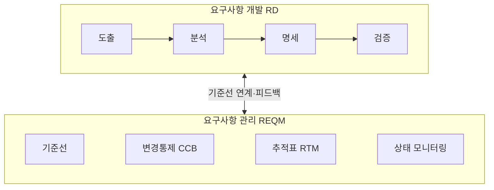

## 지식 로드맵 내 현재 위치

지식 위치: 소프트웨어 공학 → 분석·설계 → **요구공학**

## 30초 인출

- 본질: **요구공학(Requirements Engineering)**은 고객의 모호한 요구를 정확히 수집·분석·명세·검증하고, 소프트웨어 생애주기 전반에 걸쳐 요구사항의 변경과 추적성을 체계적으로 관리하는 공학적 프로세스
- 메커니즘: **요구사항 개발(RD: 도출 → 분석 → 명세 → 검증)** + **요구사항 관리(REQM: 기준선 수립 · 형상관리 · 변경통제 CCB · 추적표 RTM)**
- 산출/효과: 완결된 요구사항 명세서(SRS) · 프로젝트 납기/예산 초과 방지 · 결함 조기 발견을 통한 재작업 비용 극소화(보엠의 법칙 방어)

핵심 용어

- **SRS(Software Requirements Specification)**: 시스템이 수행해야 할 기능적·비기능적 요구사항과 제약 조건을 표준(ISO/IEC/IEEE 29148)에 따라 명확히 기술한 공식 명세서
- **RTM(Requirements Traceability Matrix)**: 요구사항 ID를 설계서, 소스코드, 테스트 케이스 ID와 양방향(Forward/Backward) 매핑하여 누락과 파급 효과를 통제하는 매트릭스
- **CCB(Configuration Control Board)**: 요구사항 기준선 변경 요청(CR)에 대해 기술적·비용적 타당성과 파급 영향을 심의·승인하는 공식 협의체
- **Scope Creep(범위 잠식)**: 공식 변경 절차 없이 요구사항이 비공식적으로 계속 팽창하여 프로젝트 일정과 예산이 파탄 나는 현상
- **Boehm's Cost of Change Principle**: 요구사항 단계의 결함이 운영 단계에서 발견될 경우 수정 비용이 100~200배 이상 폭증한다는 소프트웨어 공학 법칙

---

## 1교시 예상문제 (10점)

> 요구공학의 정의와 목적, 핵심 구조와 작동 원리를 설명하시오. (예상)
---

## 1교시 10점 답안

### 1. 정의·목적

- 정의: **요구공학(Requirements Engineering)**은 사용자의 요구사항을 도출·분석·명세·검증하고 생애주기 동안 변경을 관리하는 공학적 프로세스
- 목적: 모호성 제거, 변경 통제, 재작업 비용 절감 및 프로젝트 성공률 제고

### 2. 요구공학 2대 프레임워크

### 3. 핵심 통제

- **SRS 표준화**: ISO/IEC/IEEE 29148 규격 기반 기능/비기능 요구 명확 분리 명세
- **RTM 추적성**: 요구사항-설계-코드-시험 간 양방향 추적성 보장으로 누락 방지
---

## 2~4교시 예상문제 (25점)

> 소프트웨어 프로젝트의 성패를 좌우하는 요구공학(Requirements Engineering)의 개념과 중요성을 설명하고, 요구사항 개발(RD) 4단계와 요구사항 관리(REQM) 체계, 그리고 불명확한 요구사항으로 인한 위험 통제 방안을 제시하시오. (25점)

> (25점, 예상)
---

## 2~4교시 25점 답안

### Ⅰ. 불명확한 요구사항 병목 해소, 요구공학의 개요

> 사용자는 자기가 무엇을 원하는지 실제로 완성된 화면을 보기 전까지 정확히 알지 못한다.

- 정의: 사용자의 모호한 요구사항을 공학적 기법으로 정제하여 명세화하고, 소프트웨어 생애주기 전반에 걸쳐 지속적으로 변경을 통제·관리하는 체계적 학문 및 실천 프로세스
- 필요성:
  - **비용 폭증 방어**: 요구사항 결함 조기 식별을 통한 하류 공정 재작업 비용 절감
  - **소통 기준 수립**: 발주자와 개발자 간 단일한 진실 공급원(Single Source of Truth) 확보
  - **검수 무결성 확보**: 명문화된 인수 조건(Acceptance Criteria) 기반 분쟁 원천 차단

### Ⅱ. 요구공학의 2대 체계: 개발(RD)과 관리(REQM)

> 요구사항은 생성(Engineering)하는 것만큼이나 생애주기 동안 변질되지 않도록 통제(Governance)하는 것이 중요하다.

### Ⅲ. 요구사항 개발(RD) 4단계 상세 프로세스

> 도출-분석-명세-검증은 순차적 일회성이 아닌, 피드백 루프를 갖는 반복적 점진 프로세스이다.

| 단계 | 핵심 활동 | 주요 산출물 | 검증 및 품질 기법 |
|---|---|---|---|
| **1. 도출 (Elicitation)** | 이해관계자 식별, 인터뷰, 브레인스토밍, 사용자 관찰 | 요구사항 수집 목록, 인터뷰 녹취록 | 비기능 요구 조기 질의, 페르소나 기법 |
| **2. 분석 (Analysis)** | 요구사항 분류(기능/비기능), 도메인 모델링, 모순 제거 | DFD, UML 유스케이스, 클래스 다이어그램 | MoSCoW 우선순위화, 요구사항 타당성 평가 |
| **3. 명세 (Specification)** | 정형화된 언어로 SRS 작성, 인수 조건 상세화 | 소프트웨어 요구사항 명세서(SRS) | ISO/IEC/IEEE 29148 표준 템플릿 준수 |
| **4. 검증 (Validation)** | 명세서의 완전성, 일관성, 검증 가능성 점검 | 요구사항 검토 보고서, 인스펙션 결함표 | Fagan Inspection, 프로토타입 시연 검증 |

### Ⅳ. 요구공학 문제점·대응책

> 요구사항 결함은 프로젝트 후반부로 갈수록 비용이 기하급수적으로 폭증하므로 조기 통제가 절대적이다.

| 위험 | 대책 | 효과 |
|---|---|---|
| **범위 잠식 (Scope Creep)** | **공식 변경 통제 위원회(CCB)** 심의 및 변경 계약 강제 | 무단 과업 변경 원천 차단 및 납기·비용 안정화 |
| **명세 불명확·해석 왜곡** | **프로토타이핑 시연** · 정량적 비기능 수치화(SLO) | 해석 차이 조기 발견 |
| **구현 누락·미검증** | **요구사항 추적표(RTM)**로 설계·구현·테스트 연결 | 누락·고아 산출물 식별 |

### Ⅴ. 검증 가능성·추적성 중심의 결론

> 문서 중심의 무거운 폭포수 요구공학에서, 실행 가능한 코드와 자동화된 추적성을 제공하는 살아있는 요구공학으로 진화해야 한다.

### 학습자 통찰 메모 — 답안 밖

- [핵심 통찰]: 요구사항 명세서를 워드 파일로 두껍게 작성해 파일 서버에 묻어두는 SI 관행은 반드시 실패함. 개발자는 코딩하며 문서를 보지 않고, 고객은 검수 때 문서를 근거로 분쟁을 일으킴. 요구사항은 살아 움직이는 Jira 티켓(User Story)과 BDD(Behavior-Driven Development) 인수 테스트 코드로 변환되어 CI/CD 파이프라인에서 매 빌드마다 자동 검증되어야 함.
- 나라면: 프로젝트 착수 시 요구공학 체계를 '디지털 스펙 거버넌스'로 정의하고, 이슈 트래커(Jira) - 형상관리(Git PR) - 자동화 테스트(Cucumber/Playwright)를 요구사항 ID로 단일 연계하여, 요구사항 변경 시 영향받는 코드와 테스트가 자동으로 탐지되도록 파이프라인을 구축하겠음.

### 실전 답안용 기술사적 제언

- **판정 기준**: 요구사항 자산의 코드화(Specification as Code) 및 Jira-Git 연계 기준선 강제 판정
- **대응 방안**: User Story + BDD(Given-When-Then) 기반 실행 가능한 명세 및 RTM 자동 추적 체계 도입
- **검증 체계**: Git 커밋-PR-테스트 연계 RTM 전수 검증 및 BDD 자동화 시나리오 통과율 100% 확인
- **기대 효과**: 문서-코드 간 불일치 원천 해소 및 후반부 결함 수정 재작업 비용 80% 절감
---

## 출제 이력과 검증 출처

- 제133회 정보관리기술사 3교시: 소프트웨어 요구공학(Requirement Engineering)의 개요 및 프로세스
- 제130회 정보관리기술사 1교시: 요구사항명세서(SRS) 기술 항목 및 작성 기준
- ISO/IEC/IEEE 29148 Systems and software engineering - Life cycle processes - Requirements engineering

## 연결 토픽

- 이전 토픽: [개발방법론 테일러링](./039_methodology_tailoring.md)
- 연관 토픽: [소프트웨어 비용산정](./027_sw_cost_estimation.md), [형상관리](./011_configuration_management.md)
- 다음 토픽: [요구사항 도출](./041_requirements_elicitation.md)
