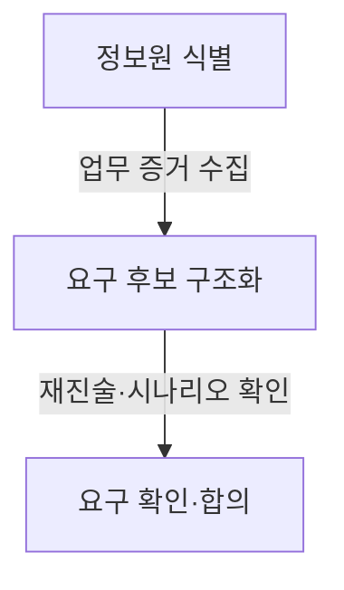

## 지식 로드맵 내 현재 위치

지식 위치: 소프트웨어 공학 → 요구공학 · 요구사항 개발 → **요구사항 도출 기법**

## 30초 인출

- 본질: **Requirements Elicitation(요구사항 도출)**은 이해관계자의 표현된 요구와 업무에 숨은 요구를 발견하는 활동
- 메커니즘: 이해관계자 식별 → 목적과 불확실성에 맞는 기법 조합 → 사실·가정·갈등 확인
- 산출: 출처가 식별된 요구 후보 · 용어집 · 미결정 쟁점 · 확인 기록

핵심 용어

- **Requirements Elicitation(요구사항 도출)**: 이해관계자와 업무 환경에서 요구·제약·가정을 발견하고 확인하는 요구사항 개발 활동
- **Stakeholder(이해관계자)**: 시스템에 영향을 주거나 결과의 영향을 받는 요구의 출처·승인자
- **JAD(Joint Application Development)**: 사용자·개발자·의사결정자가 촉진자와 집중 합의하는 워크숍 기법
- **Prototype(프로토타입)**: 추상 요구를 조기 모형으로 가시화하여 이해 차이와 누락을 확인하는 수단
- **Observation(관찰)**: 실제 업무와 예외를 현장에서 살펴 언어화되지 않은 요구를 발견하는 기법

---

## 1교시 예상문제 (10점)

> 요구사항 도출 기법(Requirements Elicitation)의 정의와 목적, 핵심 구조와 작동 원리를 설명하시오. (예상)

---

## 1교시 10점 답안

### Ⅰ. 정의·목적

| 구분 | 핵심 |
|---|---|
| 정의 | **Requirements Elicitation(요구사항 도출)**은 이해관계자와 운영 환경에서 요구·제약·가정을 발견해 요구 후보로 구조화하는 활동이다. |
| 목적 | 표현된 요청과 실제 업무의 차이를 확인해 누락·오해·충돌을 줄인다. |

### Ⅱ. 도출 핵심 흐름

### Ⅲ. 위험·통제

| 위험 | 대책 | 효과 |
|---|---|---|
| **대표자 편향** | 역할별 인터뷰 및 익명 설문 병행 | 핵심 사용자 역할별 요구사항 균형 반영 |
| **암묵 요구 누락** | 현장 관찰 및 화면 프로토타이핑 병행 | 미표현된 숨은 요구 발굴 및 예외 시나리오 완비 |

- 제언: 업무 영향과 불확실성이 큰 요구부터 정보원을 정해 교차 확인하고 출처·가정·미결정 상태 기록
---

## 2~4교시 예상문제 (25점)

> 요구사항 도출의 개념과 주요 기법을 설명하고, 이해관계자·상황에 맞는 기법 선택과 도출 결과 검증 방안을 제시하시오. (25점, 예상)

---

## 2~4교시 25점 답안

### Ⅰ. 잠재 요구를 검증 가능한 요구 후보로 바꾸는 요구사항 도출

> 도출은 요청의 기록을 넘어 목적과 업무 증거를 교차 확인하는 탐색이며, 품질은 출처·가정·갈등의 명시성으로 판단

| 구분 | 핵심 |
|---|---|
| 정의 | **Requirements Elicitation(요구사항 도출)**은 이해관계자와 운영 환경에서 요구·제약·가정을 발견해 요구 후보로 구조화하는 활동이다. |
| 목적 | 표현된 요청과 실제 업무의 차이를 확인해 누락·오해·충돌을 줄인다. |

| 요구 후보에 기록할 정보 | 활용 |
|---|---|
| 출처·근거 | 요구가 나온 사람·업무·자료 확인 |
| 가정·확인 상태 | 미결정 조건과 합의 여부 구분 |

### Ⅱ. 불확실성에 맞춰 조합하는 도출 기법

> 한 기법으로 줄일 수 있는 편향은 제한적이므로 넓이·깊이·현장성·가시화 중 필요한 증거에 따른 기법 조합

| 기법 | 적합 조건 | 활동 | 산출·주의점 |
|---|---|---|---|
| **인터뷰** | 의사결정 근거·예외의 깊이 탐색 | 개방형 질문 후 폐쇄형 확인 | 발언 근거 · 질문자 편향 통제 |
| **설문조사** | 다수 집단의 경향 확인 | 표본·문항 설계 후 정량 수집 | 응답 분포 · 심층 맥락 보완 |
| **JAD** | 부서 간 요구 충돌의 집중 합의 | 촉진자가 의제·시간·결정권 통제 | 합의안 · 소수 의견과 미결정 기록 |
| **관찰** | 실제 업무·우회가 언어화되지 않음 | 현장 행동과 업무 산출물 대조 | 업무 흐름 · 관찰 효과 통제 |
| **프로토타이핑** | 화면·상호작용 요구가 추상적임 | 조기 모형으로 과업 수행 확인 | 피드백 · 완성품 오인 방지 |

### Ⅲ. 발견에서 합의까지 이어지는 도출 통제

> 도출 품질의 확인 기준은 요구별 출처·목적·확인 결과와 미해결 충돌의 결정권자 전달 여부

| 단계 | 활동 | 산출 |
|---|---|---|
| **1. 도출 준비** | 목표·범위·정보원·기법·질문 설계 | 도출 계획, 질문지, 업무 자료 목록 |
| **2. 증거 수집** | 발언과 관찰 사실 분리, 예외·가정 기록 | 원시 기록, 요구 후보, 용어집 |
| **3. 정제·분류** | 중복 병합, 유형 분류, 충돌 식별 | 구조화 요구, 충돌·미결정 목록 |
| **4. 확인·결정** | 재진술·시나리오·프로토타입으로 이해 검증 | 확인 요구, 결정 근거, 후속 조치 |

### Ⅳ. 요구사항 도출 문제점·대응책

> 요구 누락·충돌 통제를 위한 출처 추적·다중 기법 교차 확인·결정 규칙의 품질 게이트 적용

| 위험 | 대책 | 효과 |
|---|---|---|
| **대표자 편향 (요구 왜곡)** | 관리자·실무자 등 **역할별 표본화 및 익명 설문** 병행 | 특정 역할에 치우친 관점을 줄이고 실제 업무 근거를 보완 |
| **암묵 요구 누락 (기능 결함)** | **현장 관찰(Observation) 및 프로토타이핑** 결합 | 말로 표현되지 않은 업무·예외 흐름을 확인 |
| **요구 충돌 방치 (일정 지연)** | **JAD 워크숍** 및 이해관계자별 의사결정권자 명시 | 쟁점과 결정 책임을 드러내 후속 합의 지원 |
| **해결책 고착 (과잉 투자)** | 사용자 구현 요청을 **근본 목적·비즈니스 문제**로 재정의 | 불필요한 과잉 스펙 제거 및 최적의 공학적 대안 도출 |

| 문제 | 해결 방안 |
|---|---|
| 제한된 일정에서 모든 업무 흐름과 이해관계자를 같은 깊이로 조사하기 어려움 | 영향도·불확실성이 큰 업무와 역할을 표본으로 정해 인터뷰·관찰을 결합하고, 확인 결과에 따라 나머지 조사 범위 조정 |
---

## 출제 이력과 검증 출처

- [ISO/IEC/IEEE 29148:2018 — Requirements engineering](https://www.iso.org/standard/72089.html)
- [IIBA, A Guide to the Business Analysis Body of Knowledge](https://www.iiba.org/career-resources/a-business-analysis-professionals-foundation-for-success/babok/)

## 연결 토픽

- 이전 토픽: [요구공학](./040_requirements_engineering.md)
- 연관 토픽: [요구사항 명세](./054_requirements_specification.md), [요구사항 추적표(RTM)](./102_requirement_traceability_matrix.md)
- 다음 토픽: [의존성 주입(DI)](./042_dependency_injection.md)
