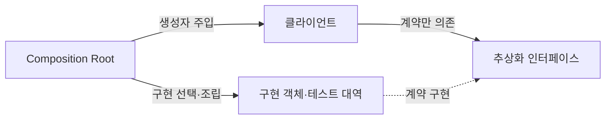

## 지식 로드맵 내 현재 위치

지식 위치: 소프트웨어 공학 → 객체지향 설계 · 결합도 관리 → **의존성 주입**

## 30초 인출

- 본질: **DI(Dependency Injection)**는 객체가 협력자를 직접 생성·탐색하지 않고 외부 조립자가 제공하게 하는 설계 기법
- 메커니즘: 구현 등록 → 의존 그래프 해결 → 생성자 등 주입 지점으로 전달 → 수명주기 관리
- 산출: 생성 책임과 사용 책임 분리 · 구현 교체 가능성 · 격리 단위 테스트

핵심 용어

- **DI(Dependency Injection)**: 객체 외부에서 협력자를 제공하여 생성 책임과 사용 책임을 분리하는 기법
- **IoC(Inversion of Control)**: 객체 생성·호출 흐름의 통제권이 애플리케이션 객체에서 프레임워크·조립자로 이동하는 원리
- **DIP(Dependency Inversion Principle)**: 상위·하위 모듈 모두 구체 구현이 아닌 추상화에 의존하게 하는 원칙
- **Composition Root**: 애플리케이션 진입부에서 객체 생성과 결합을 집중하는 조립 지점
- **Scope(범위)**: Singleton·요청·Transient처럼 인스턴스 생성과 공유 기간을 정하는 정책

## 예상문제

> 의존성 주입의 개념과 동작 구조를 설명하고, 주입 방식 비교 및 실무 적용 시 의존 그래프와 수명주기 관리 방안을 제시하시오.

## Ⅰ. 생성과 사용을 분리하는 의존성 주입

> DI는 구체 클래스 제거 자체가 아니라 객체 그래프 조립을 경계로 모으는 기법이며, 성패는 의존 관계의 명시성과 수명주기 정합성으로 판정함.

- 정의: **외부 조립자**가 객체의 **의존 객체**를 주입하여 직접 생성·탐색을 제거하는 **IoC** 구현 기법
- 목적: 생성 책임과 비즈니스 책임 분리 → 낮은 결합도 · 구현 교체 · 격리 테스트 확보

## Ⅱ. DI 구성요소와 동작 메커니즘

> 클라이언트는 계약만 알고 Composition Root가 구현 선택과 생명주기를 책임져야 변경 영향이 조립 경계에 머묾.

| 요소 | 책임 | 통제점 |
|---|---|---|
| Client | 협력자 계약 사용 | 구체 구현 생성 금지 |
| Abstraction | 행위 계약 제공 | 안정된 경계·최소 인터페이스 |
| Implementation | 계약 구현 | 대체 가능성 유지 |
| Injector·Container | 등록·해결·주입 | 누락·중복·순환 의존 검사 |
| Composition Root | 객체 그래프 조립 집중 | 비즈니스 코드와 구성 분리 |

## Ⅲ. 생성자·수정자·필드 주입 비교

> 필수 의존은 생성자로 완전한 객체를 만들고 선택 의존만 수정자로 제한하며, 숨은 의존을 만드는 필드 주입은 테스트와 검증을 어렵게 함.

| 방식 | 적합 대상 | 장점 | 위험·통제 |
|---|---|---|---|
| **생성자 주입** | 필수 의존 | 불변성 · 누락 조기 발견 · 순수 단위 테스트 | 매개변수 과다는 책임 과다 신호 |
| **수정자 주입** | 선택·재구성 의존 | 의존 교체 가능 | 불완전 상태 방지 규칙 필요 |
| **필드 주입** | 프레임워크 제한 상황 | 코드가 짧음 | 의존 은닉 · 컨테이너 없는 테스트 곤란 |

## Ⅳ. 의존성 주입 문제점·대응책

> 주입 성공만 확인하면 단기 객체를 장기 객체가 붙잡거나 순환이 숨어들 수 있으므로 그래프·범위·종료 자원을 함께 검증함.

| 위험 | 대책 | 효과 |
|---|---|---|
| **순환 의존 (생성 실패)** | 단방향 의존 그래프(DAG) 강제 및 이벤트 기반 비동기 분리 | 런타임 교착 상태 차단 및 양방향 결합 제거 |
| **범위 불일치 (상태 누출)** | Scope 정합성 규칙 강제 및 팩토리 패턴(ObjectProvider) 적용 | 장기 객체의 단기 객체 참조로 인한 메모리 누수 방지 |
| **숨은 의존 (테스트 불가)** | **생성자 주입(Constructor Injection)** 원칙 의무화 | 컨테이너 없는 순수 POJO 단위 테스트 가능성 확보 |
| **과도한 의존 (책임 팽창)** | 생성자 매개변수 임계치(최대 5개) 통제 및 Facade 패턴 도입 | 객체 응집도 극대화 및 단일 책임 원칙(SRP) 준수 |

## Ⅴ. 명시적 조립 경계의 결론

> DI 컨테이너는 설계 결함을 자동으로 해결하지 않으므로 Composition Root와 자동화된 그래프 검증을 운영 기준으로 둬야 함.

### 학습자 통찰 메모 — 답안 밖

- `[핵심 통찰]`: DI의 핵심은 프레임워크 애너테이션이 아니라 객체가 협력자를 만드는 방법을 몰라도 되게 하는 책임 분리다.
- `나라면`: 필수 의존은 생성자로 명시하고 조립 코드를 진입부에 모은 뒤, 기동 테스트로 등록 누락·순환·범위 오류를 확인하겠다.

### 실전 답안용 기술사적 제언

- **판정 기준**: 필드 주입(@Autowired) 전면 금지, 필수 의존성은 생성자 주입(Constructor Injection) 100% 강제 판정
- **대응 방안**: Composition Root 기반 단일 조립 지점 집중 및 단방향 의존 그래프(DAG) 아키텍처 수립
- **검증 체계**: CI 빌드 시 컨테이너 기동 테스트(ApplicationContext Test) 및 순환 의존·Scope 불일치 린트 정적 검증
- **기대 효과**: 객체 불변성(Immutability) 확보, 컨테이너 없는 순수 POJO 단위 테스트 커버리지 90% 이상 달성

## 1교시 10점 답안 발췌

- 정의: **DI(Dependency Injection)**는 **외부 조립자**가 객체의 **의존 객체**를 제공하여 생성과 사용 책임을 분리하는 **IoC(Inversion of Control)** 구현 기법
- 목적: 구체 구현 결합 제거 → 구현 교체 · 객체 완전성 · 격리 테스트 확보

| 방식 | 적합 대상 | 통제 |
|---|---|---|
| 생성자 주입 | 필수 의존 | 누락·순환 조기 검증 |
| 수정자 주입 | 선택 의존 | 불완전 상태 방지 |
| 필드 주입 | 프레임워크 제한 | 숨은 의존·테스트 곤란 점검 |

- 결론: 생성자 주입과 Composition Root를 기본으로 하고 등록·순환·범위 오류를 자동 검증함

## 출제 이력과 검증 출처

- [Martin Fowler, Inversion of Control Containers and the Dependency Injection pattern](https://martinfowler.com/articles/injection.html)
- [Microsoft, Dependency injection guidelines](https://learn.microsoft.com/en-us/dotnet/core/extensions/dependency-injection-guidelines)

## 학습 체크

- [ ] Ⅰ·정의와 목적: 외부 조립자·의존 객체·IoC의 관계를 두 줄로 설명할 수 있는가
- [ ] Ⅱ·동작: 등록→해결→주입 흐름과 다섯 구성요소의 책임을 재현할 수 있는가
- [ ] Ⅲ·방식: 생성자·수정자·필드 주입을 적합 대상과 위험으로 비교할 수 있는가
- [ ] Ⅳ·통제: 순환·범위 불일치·숨은 의존·책임 팽창의 판정과 대안을 연결할 수 있는가
- [ ] Ⅴ·제언: Composition Root와 자동 검증의 효과를 설명할 수 있는가

## 연결 토픽

- 이전 토픽: [요구사항 도출](./041_requirements_elicitation.md)
- 연관 토픽: [객체지향 설계원칙 SOLID](./082_solid.md), [AOP](./074_aop.md), [모듈성](./190_modularity.md)
- 다음 토픽: [정렬 알고리즘](./043_sort_algorithm.md)
