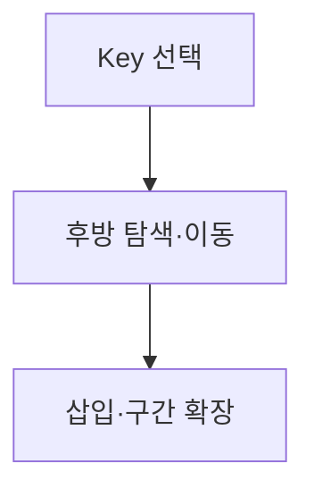
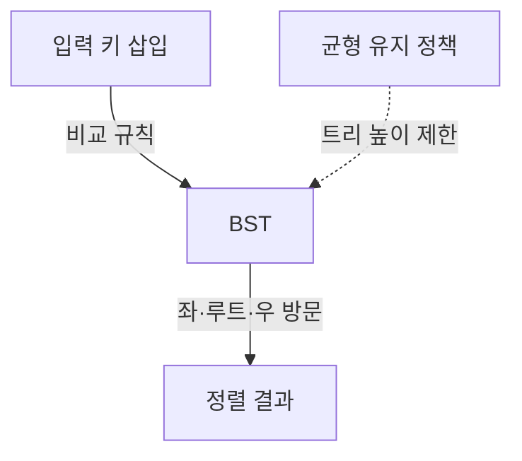

## 지식 로드맵 내 현재 위치

지식 위치: 소프트웨어 공학 → 알고리즘 · 비교 정렬 → **정렬 알고리즘**

## 딸려 나오는 하위 토픽

| 번호 | 토픽명 | 핵심 연결 |
|---|---|---|
| 02-087 | 삽입정렬 | 정렬 구간 · 이동 · 적응성 |
| 02-180 | 트리정렬 | BST 구축 · 중위 순회 · 균형 |

## 30초 인출

- 본질: **Sorting Algorithm(정렬 알고리즘)**은 키의 순서 관계에 따라 레코드를 재배치하여 탐색·병합·표시의 전제 조건을 만드는 절차
- 메커니즘: 삽입정렬은 정렬 구간에 키를 삽입하고, 트리정렬은 BST를 만든 뒤 중위 순회함
- 산출: 순서화된 레코드와 안정성·시간·공간 특성이 명시된 선택 근거

핵심 용어

- **Stable Sort(안정 정렬)**: 동등 Key의 기존 상대 순서를 보존하여 다단계 정렬 의미를 지키는 성질
- **In-place Sort(제자리 정렬)**: 입력 크기에 비례하는 별도 저장공간 없이 원배열에서 재배치하는 성질
- **BST(Binary Search Tree)**: 왼쪽 Key는 작고 오른쪽 Key는 큰 순서 불변식을 유지하는 탐색 트리
- **In-order Traversal(중위 순회)**: BST를 왼쪽·루트·오른쪽 순으로 방문하여 정렬 결과를 얻는 순회
- **Adaptive Sort(적응 정렬)**: 입력의 기존 순서를 활용해 실제 연산량을 줄이는 정렬 특성

---

## 1교시 예상문제 (10점)

> 정렬 알고리즘(삽입정렬·트리정렬)의 정의와 목적, 핵심 구조와 작동 원리를 설명하시오. (예상)

---

## 1교시 10점 답안

### Ⅰ. 정의·목적

| 구분 | 핵심 |
|---|---|
| 정의 | **정렬 알고리즘**은 키의 순서에 따라 레코드를 재배치하는 절차 |
| 목적 | 탐색·병합·범위 처리에 필요한 순서 전제 마련 |

### Ⅱ. 입력 특성에 따른 선택

| 기준 | 삽입정렬 | 트리정렬 |
|---|---|---|
| 시간 | 최선 $O(n)$·최악 $O(n^2)$ | 평균 $O(n\log n)$·편향 시 $O(n^2)$ |
| 공간 | $O(1)$ | $O(n)$ |
| 선택 | 소규모·거의 정렬 | 동적 탐색 병행·균형 통제 |

### Ⅲ. 선택 원칙

- 제언: 입력 크기·기존 질서·안정성 요구·메모리 한도를 확인해 알고리즘을 선택
---

## 2~4교시 예상문제 (25점)

> 삽입정렬과 트리정렬의 동작 원리와 시간·공간·안정성을 비교하고, 입력 특성에 따른 선택 방안을 제시하시오. (25점, 예상)

---

## 2~4교시 25점 답안

### Ⅰ. 입력 질서와 자료구조를 이용하는 비교 정렬

| 구분 | 핵심 |
|---|---|
| 정의 | **정렬 알고리즘**은 키의 순서에 따라 레코드를 재배치하는 절차 |
| 목적 | 탐색·병합·범위 처리에 필요한 순서 전제 마련 |

### Ⅱ. 정렬 구간을 확장하는 삽입정렬

> 삽입정렬은 역전 쌍이 적을수록 이동량이 줄어드는 적응 정렬이며, 소규모·거의 정렬된 입력에서 단순한 제어와 지역성이 강점임.

- **최선 $O(n)$**: 이미 정렬된 입력은 원소별 한 번의 경계 비교로 통과함
- **평균·최악 $O(n^2)$**: 역전 쌍만큼 비교·이동이 누적되며 역순 입력에서 최대가 됨
- **공간 $O(1)$·Stable**: 동일 Key를 넘겨 이동하지 않으면 제자리 안정 정렬이 됨

### Ⅲ. 탐색 트리의 순서 불변식을 이용하는 트리정렬

> 트리정렬의 성능은 순회가 아니라 BST 높이가 결정하므로, 최악 시간을 제한하려면 균형 트리를 선택해야 함.

- **평균 $O(n\log n)$**: 트리 높이가 로그 수준일 때 각 삽입 비용이 제한됨
- **최악 $O(n^2)$**: 정렬 입력이 단순 BST를 한쪽으로 편향시키면 삽입 경로가 선형화됨
- **공간 $O(n)$**: 노드·링크 저장이 필요하며 중복 Key 정책이 안정성과 결과를 좌우함

### Ⅳ. 입력 조건별 비교 및 실무 위험 대책

> 동일한 점근 복잡도라도 안정성·보조공간·기존 질서가 다르면 선택이 달라지므로 운영 입력의 분포와 상한을 먼저 고정해야 함.

| 기준 | 삽입정렬 | 트리정렬 | 병합정렬 | 퀵정렬 |
|---|---|---|---|---|
| 평균 | $O(n^2)$ | $O(n\log n)$ | $O(n\log n)$ | $O(n\log n)$ |
| 최악 | $O(n^2)$ | $O(n^2)$ | $O(n\log n)$ | $O(n^2)$ |
| 공간 | $O(1)$ | $O(n)$ | $O(n)$ | 평균 $O(\log n)$ |
| 안정성 | 안정 | 구현 정책 의존 | 안정 | 일반적으로 불안정 |
| 선택 | 소규모·거의 정렬 | 정렬과 동적 탐색 병행 | 안정성·최악 보장 | 배열·평균 성능 |

### 실무 정렬 알고리즘 운영 위험 및 대책

| 위험 | 대책 | 효과 |
|---|---|---|
| **최악 시간 복잡도 퇴화 ($O(n^2)$)** | 정렬 입력의 크기와 순서 특성에 맞춰 균형 트리 또는 최악 복잡도가 보장된 구현 검토 | 입력 편향에 따른 성능 급락 완화 |
| **메모리 초과 (OOM)** | 메모리 상한을 정하고 필요 시 외부 정렬을 검토 | 실행 환경에 맞는 메모리 사용 계획 |
| **동등 키 순서 왜곡 (불안정 정렬)** | 기존 순서 보존이 요구될 때 안정 정렬을 선택하고 동등 키 시험 | 다단계 정렬의 순서 의미 보존 |

### Ⅴ. 복잡도보다 입력 계약을 우선하는 선택

> 정렬 알고리즘은 이름으로 표준화하지 말고 데이터 크기·기존 질서·동등 Key 의미·메모리 상한을 입력 계약으로 만들어 검증해야 함.

| 문제 | 해결 방안 |
|---|---|
| 실제 입력의 크기·기존 질서·안정성 요구가 선택에 반영되지 않음 | 입력 분포와 메모리 상한을 측정하고, 작은 거의 정렬된 구간에는 삽입정렬을 검토하며 최악 시간 보장이 필요하면 보장 특성이 확인된 구현을 선택 |
---

## 출제 이력과 검증 출처

- [NIST Dictionary of Algorithms and Data Structures — insertion sort](https://xlinux.nist.gov/dads/HTML/insertionSort.html)
- [NIST Dictionary of Algorithms and Data Structures — tree sort](https://xlinux.nist.gov/dads/HTML/treeSort.html)
- [NIST Dictionary of Algorithms and Data Structures — stable sort](https://xlinux.nist.gov/dads/HTML/stableSort.html)

## 연결 토픽

- 이전 토픽: [의존성 주입(DI)](./042_dependency_injection.md)
- 연관 토픽: [알고리즘 복잡도(Big-O)](./125_algorithm_complexity_big_o.md), [BST](./001_bst.md), [McCabe 순환복잡도](./036_mccabe_cyclomatic_complexity.md)
- 다음 토픽: [클래스 다이어그램](./045_class_diagram.md)
