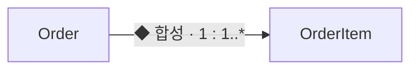

## 지식 로드맵 내 현재 위치

지식 위치: 소프트웨어 공학 → UML · 정적 구조 모델 → **클래스 다이어그램**

## 30초 인출

- 본질: **UML(Unified Modeling Language) Class Diagram**은 분류자의 특성과 관계를 표현하는 정적 구조 모델
- 메커니즘: 클래스의 이름·속성·오퍼레이션을 구획하고 연관·일반화·실체화·의존 관계를 연결함
- 산출: 책임·다중성·탐색 방향·생명주기 소유권이 명시된 설계 모델

핵심 용어

- **UML(Unified Modeling Language)**: 소프트웨어 구조와 행위를 공통 기호로 명세·시각화하는 모델링 언어
- **Multiplicity(다중성)**: 관계 끝에서 허용되는 인스턴스 수 범위를 나타내는 제약
- **Generalization(일반화)**: 하위 분류자가 상위 분류자의 특성을 상속하는 is-a 관계
- **Realization(실체화)**: 구현 분류자가 명세 분류자의 계약을 수행하는 관계
- **Aggregation(집약)**: 부분이 전체와 독립적으로 존재하고 공유될 수 있는 약한 전체-부분 관계
- **Composition(합성)**: 부분이 한 전체에 배타적으로 속하고 생명주기를 함께하는 강한 전체-부분 관계

## 예상문제

> UML 클래스 다이어그램의 구성요소와 관계 표기법을 설명하고, 집약과 합성을 비교한 후 정적 구조 모델의 품질 확보 방안을 제시하시오.

## Ⅰ. 객체지향 시스템의 정적 구조 모델

> 클래스 다이어그램은 코드 목록이 아니라 책임과 관계 제약을 합의하는 모델이며, 정확성은 기호 수보다 다중성과 소유권의 일관성으로 판정함.

- 정의: **클래스**의 특성과 **정적 관계**를 **UML 표기법**으로 명세하는 구조 다이어그램
- 목적: 책임·타입·관계 제약의 공통 이해 확보 → 설계·구현·검증 간 구조 정합성 유지

## Ⅱ. 클래스의 3단 구획과 가시성

> 구획에는 의사결정에 필요한 도메인 특성만 남기고 기계적으로 생성되는 접근자는 생략해야 모델의 책임 경계가 보임.

| 구획 | 표기 | 판정 |
|---|---|---|
| 이름 | 스테레오타입 · 클래스명 | 추상화 수준과 역할 식별 |
| 속성 | `가시성 이름: 타입` | 상태와 정보은닉 경계 |
| 오퍼레이션 | `가시성 이름(매개변수): 반환타입` | 외부에 제공하는 책임 |

- **가시성**: Public `+` · Private `-` · Protected `#` · Package `~`
- **추상 표기**: 추상 클래스·오퍼레이션은 이탤릭체, 인터페이스는 스테레오타입 등 UML 표기 적용

## Ⅲ. 관계의 의미와 표기

> 관계는 선 모양을 외우는 데서 끝나지 않고 참조 지속성·계약 이행·상속·소유권 중 무엇을 뜻하는지 코드와 일치해야 함.

| 관계 | 표기 | 의미 | 검증 질문 |
|---|---|---|---|
| **Association** | 실선 | 구조적 참조 | 다중성·역할·탐색 방향이 맞는가 |
| **Dependency** | 점선 화살표 | 일시적 사용 | 매개변수·지역 사용에 그치는가 |
| **Generalization** | 실선·빈 삼각형 | 특성 상속 | 치환 가능한 is-a 관계인가 |
| **Realization** | 점선·빈 삼각형 | 계약 구현 | 명세의 오퍼레이션을 이행하는가 |
| **Aggregation** | 전체 쪽 빈 마름모 | 공유 가능한 부분 | 부분이 독립·공유 가능한가 |
| **Composition** | 전체 쪽 채운 마름모 | 배타적 소유 | 부분의 생명주기가 전체에 종속되는가 |

## Ⅳ. 집약과 합성의 경계 판정 및 실무 위험 대책

> 전체-부분이라는 말만으로 합성을 선택하면 안 되며, 배타적 소유와 생성·삭제 책임이 모두 성립할 때만 강한 생명주기 관계를 표시함.

| 기준 | 집약 | 합성 |
|---|---|---|
| 소유 | 공유 가능 | 한 전체에 배타적 |
| 생명주기 | 부분 독립 | 전체에 종속 |
| 이동 | 다른 전체로 이전 가능 | 소유 경계 안에서 관리 |
| 표기 | 빈 마름모 | 채운 마름모 |
| 구현 판단 | 일반 참조로 충분한지 확인 | 생성·삭제·무결성 규칙 동반 |

### 실무 클래스 모델링 위험 및 대책

| 위험 | 대책 | 효과 |
|---|---|---|
| **집약·합성 소유권 혼동** | 객체 생명주기(Lifecycle) 종속성 기준 배타적 소유 엄격 판정 | 메모리 누수 및 고아 객체(Orphan) 발생 원천 차단 |
| **다중성(Multiplicity) 누락** | `1..*`, `0..1` 등 양방향 다중성 명시 및 Nullable 제약 검증 | 런타임 NullPointerException 및 데이터 정합성 결함 예방 |
| **과도한 상속 결합 (is-a 왜곡)** | 상속보다 합성(Composition over Inheritance) 원칙 우선 적용 | 클래스 폭발 방지 및 유연한 객체 확장성 확보 |

## Ⅴ. 모델과 구현의 양방향 정합성

> 클래스 다이어그램의 가치는 문서 완성이 아니라 구현 변화 뒤에도 핵심 책임·다중성·소유권이 유지되는 데 있음.

### 학습자 통찰 메모 — 답안 밖

- `[핵심 통찰]`: 집약과 합성의 차이는 마름모 색이 아니라 누가 부분의 생명주기를 소유하는가에 있다. 소유권이 모호하면 삭제와 무결성 정책도 모호해진다.
- `나라면`: 핵심 도메인 클래스와 관계 제약만 모델링하고, 코드 리뷰에서 다중성·상속·합성의 구현 정합성을 함께 확인하겠다.

### 실전 답안용 기술사적 제언

- **판정 기준**: 장식적 관계선 배제, 객체 생명주기 배타적 소유(합성)와 다중성(`1..*`, `0..1`) 표기 필수 판정
- **대응 방안**: 상속(Generalization) 남용 지양 및 합성(Composition over Inheritance) 기반 유연한 설계 원칙 적용
- **검증 체계**: 모델-코드 간 정적 분석(ArchUnit) 자동 검증 및 다중성 불일치/고아 객체 참조 여부 PR 게이트 통제
- **기대 효과**: 객체지향 무결성 확보, 런타임 NullPointerException 예방 및 시스템 리팩토링 유지보수성 50% 향상

## 1교시 10점 답안 발췌

- 정의: **UML(Unified Modeling Language) Class Diagram**은 **클래스**의 특성과 **정적 관계**를 명세하는 구조 다이어그램
- 목적: 책임·타입·관계 제약의 공통 이해 확보 → 설계와 구현의 구조 정합성 유지

| 관계 | 기호 | 의미 |
|---|---|---|
| 일반화·실체화 | `──▷` · `- -▷` | 상속 · 계약 구현 |
| 집약·합성 | `◇──` · `◆──` | 독립 생명주기 · 종속 생명주기 |
| 연관·의존 | `──` · `- ->` | 구조적 참조 · 일시적 사용 |

- 결론: **Multiplicity(다중성)**와 생명주기 소유권을 코드와 대조하여 관계의 의미를 보존함

## 출제 이력과 검증 출처

- [Object Management Group, UML 2.5.1 Specification](https://www.omg.org/spec/UML/2.5.1/About-UML)
- [Object Management Group, UML resources](https://www.omg.org/uml/)

## 학습 체크

- [ ] Ⅰ·정의와 목적: 클래스·정적 관계·UML 표기법의 관계를 두 줄로 재현할 수 있는가
- [ ] Ⅱ·구획: 이름·속성·오퍼레이션 형식과 네 가시성 기호를 쓸 수 있는가
- [ ] Ⅲ·관계: 여섯 관계의 선 표기·의미·검증 질문을 연결할 수 있는가
- [ ] Ⅳ·비교: 집약과 합성을 소유·생명주기·이동·구현으로 비교할 수 있는가
- [ ] Ⅴ·제언: 모델과 코드의 네 대조 대상을 설명할 수 있는가

## 연결 토픽

- 이전 토픽: [정렬 알고리즘](./043_sort_algorithm.md)
- 연관 토픽: [UML 다이어그램](./020_uml_diagrams.md), [객체지향 설계원칙 SOLID](./082_solid.md), [모듈성](./190_modularity.md)
- 다음 토픽: [AI Native 개발 플랫폼](./046_ai_native_dev_platform.md)
