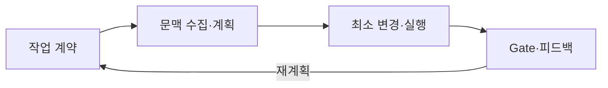

## 지식 로드맵 내 현재 위치

소프트웨어 공학지능형 개발환경 · 에이전틱 개발 수명주기<strong>AI 네이티브 개발 플랫폼</strong>

## 30초 인출

- 본질: **AI Native Development Platform**은 **SDLC(Software Development Life Cycle)**에서 모델이 코드 제안에 그치지 않고 저장소 문맥·개발 도구·검증 정책을 이용해 작업을 계획하고 실행하는 개발환경
- 메커니즘: 목표·권한 입력 → 문맥 검색·계획 → 격리 실행 → 테스트·보안 검증 → 인간 승인
- 산출: 변경 근거·실행 로그·검증 결과를 동반한 검토 가능한 변경 집합

핵심 용어

- **Agentic SDLC(Software Development Life Cycle)**: AI 에이전트가 계획·도구 실행·피드백 반영을 반복하되 개발 수명주기 통제를 따르는 방식
- **Context Engineering**: 작업에 필요한 코드·문서·정책을 선택하고 출처와 우선순위를 갖춰 모델에 제공하는 설계
- **RAG(Retrieval-Augmented Generation)**: 외부 지식을 검색해 생성 문맥에 결합하여 근거 부족을 줄이는 방식
- **Sandbox(격리 실행환경)**: 파일·프로세스·네트워크 권한을 제한해 에이전트 실행 영향을 경계 안에 두는 환경
- **Quality Gate**: 테스트·정적 분석·보안 정책의 통과 여부로 다음 단계 진입을 제어하는 판정점
- **Human-in-the-loop**: 고위험 변경의 승인·예외·중단 권한을 사람이 보유하는 통제 구조
- **SCA(Software Composition Analysis)**: 오픈소스 구성요소의 취약점·출처·라이선스를 식별해 공급망 Gate의 근거를 제공하는 분석

## 예상문제

> AI 네이티브 개발 플랫폼의 개념과 구성요소 및 동작 절차를 설명하고, 기존 AI 보조 개발과 비교하여 품질·보안 거버넌스 방안을 제시하시오.

## Ⅰ. 제안 도구에서 통제된 실행 주체로의 확장

> AI 네이티브의 기준은 생성 코드량이 아니라 저장소 문맥을 근거로 도구를 실행하고 검증 실패를 다시 계획에 반영하는 폐루프의 존재임.

- 정의: **AI 에이전트**가 **개발 도구**와 **Quality Gate**를 결합해 계획·변경·검증을 수행하는 통합 개발 플랫폼
- 목적: 반복 구현과 검증의 자동화 → 개발자는 사양·아키텍처·위험 승인에 집중

## Ⅱ. 플랫폼 구성요소와 책임 경계

> 모델·검색·도구·실행환경·정책을 분리해야 오류 원인을 추적하고 각 경계에 최소 권한을 적용할 수 있음.

| 구성 | 책임 | 통제 |
|---|---|---|
| Model·Agent | 계획·코드·도구 호출 결정 | 목표 이탈·불확실성 보고 |
| Context Layer | 코드·문서·이력 검색과 우선순위화 | 출처·최신성·민감도 필터 |
| Tool Gateway | 파일·빌드·테스트·형상관리 연결 | 허용 목록·인자 검증·감사 로그 |
| Sandbox | 변경과 명령의 격리 실행 | 파일·네트워크·자원 한계 |
| Policy Engine | 품질·보안·준법 판정 | Gate·예외 승인·중단 조건 |
| Human Control | 사양·고위험 결정·최종 승인 | 책임 소재·롤백 결정 |

## Ⅲ. 계획-실행-검증 폐루프

> 에이전트가 스스로 반복하더라도 인수 조건과 시도 한계가 없으면 실패를 확대하므로, 매 반복은 관찰 가능한 증거와 종료 조건을 가져야 함.

## Ⅳ. AI 보조 개발과 AI 네이티브 개발 비교

> 자율성은 사람을 제거하는 정도가 아니라 작업 범위와 도구 권한을 얼마나 명시적으로 위임하고 검증 가능한가로 구분해야 함.

| 기준 | AI 보조 개발 | AI 네이티브 개발 |
|---|---|---|
| 작업 단위 | 라인·함수 제안 | 이슈·변경 집합 |
| 문맥 | 편집기 주변 문맥 | 저장소·문서·정책 검색 |
| 실행 | 사람이 명령 수행 | 권한 내 도구 호출 |
| 피드백 | 사람이 결과 해석 | 결과 관찰 후 재계획 |
| 산출 | 코드 제안 | 패치·로그·검증 증거 |
| 통제 | 제안 채택 여부 | 권한 경계·Gate·승인점 |

## Ⅴ. 품질·보안 위험과 실무 방어 대책

> 비결정적 생성은 결정적 검증으로 감싸야 하며, 특히 공급망·비밀정보·과잉 권한은 코드 정확성과 별도로 차단해야 함.

| 위험 | 대책 | 효과 |
|---|---|---|
| **사양 오해 및 환각 (Hallucination)** | BDD 기반 인수 테스트 사전 정의 및 명세 범위 잠금(Spec-lock) | 요구사항 대비 임의적 코드 변조 및 결함 원천 차단 |
| **공급망 오염 (취약 패키지 도입)** | 승인된 프라이빗 Registry 강제 및 **SCA(Software Composition Analysis)** 연동 | 악성 패키지·라이선스 위반 요소 유입 100% 차단 |
| **비밀정보 및 크리덴셜 노출** | 커밋 전 비밀정보 스캐너(TruffleHog) 및 민감 데이터 마스킹 적용 | API Key, DB 비밀번호 등 크리덴셜 외부 유출 방지 |
| **과잉 권한 남용 (자원 침해)** | 컨테이너 격리 **Sandbox** 및 최소 권한 도구(Tool Gateway) 제한 | 악의적 명령어 실행 및 호스트 환경 침해 방지 |
| **자기 검증 환상 (False Safety)** | 에이전트 생성 테스트 외 독립 회귀 테스트 및 **정적 분석 Gate** 강제 | 코드 커버리지 왜곡 방지 및 프로덕션 품질 무결성 확보 |

## Ⅵ. 증거 기반 자율성 거버넌스

> 자율성은 한 번에 높이지 말고 위험 등급별 권한과 승인점을 조정하며, 실패 로그와 롤백 가능성을 운영 지표로 삼아야 함.

### 학습자 통찰 메모 — 답안 밖

- `[핵심 통찰]`: 좋은 모델도 잘못된 사양과 과도한 권한을 안전하게 만들 수 없다. 신뢰는 모델의 자신감이 아니라 독립 검증 증거와 중단 가능한 경계에서 나온다.
- `나라면`: 읽기·제안부터 시작해 검증이 축적된 작업만 쓰기·실행으로 확대하고, 배포·비밀·외부 전송은 별도 인간 승인을 유지하겠다.

### 실전 답안용 기술사적 제언

- **판정 기준**: AI 에이전트 생성 코드의 무조건적 신뢰 배제, 독립 Quality Gate 통과 및 고위험 작업 인간 승인 판정
- **대응 방안**: 컨테이너 격리 Sandbox 실행, Tool Gateway 최소 권한 통제 및 BDD 기반 Spec-lock 강제
- **검증 체계**: SCA 공급망 검사, 시크릿 스캐너, 독립 회귀 테스트 전수 통과 확인 및 감사 로그 실시간 보존
- **기대 효과**: 비결정적 생성의 결정적 통제 완성, 개발 생산성 3배 증대 및 프로덕션 보안 결함 99% 차단

## 1교시 10점 답안 발췌

- 정의: **AI Native Development Platform**은 **SDLC(Software Development Life Cycle)**에서 **AI 에이전트**가 개발 도구와 Quality Gate를 결합해 계획·변경·검증을 수행하는 환경
- 목적: 반복 구현·검증 자동화 → 개발자의 사양·아키텍처·위험 승인 집중

| 위험 | 대책 | 효과 |
|---|---|---|
| **공급망 오염** | 승인 Registry 및 **SCA 분석** 의무화 | 취약점·라이선스 위반 패키지 차단 |
| **권한 남용** | 최소 권한 **Sandbox** 및 고위험 인간 승인 | 호스트 환경 침해 및 비인가 명령 원천 방지 |

- 결론: 최소 권한과 독립 Gate로 비결정적 생성을 결정적 증거 안에 가둠

## 출제 이력과 검증 출처

- [NIST AI RMF 1.0](https://www.nist.gov/itl/ai-risk-management-framework)
- [NIST SP 800-218, Secure Software Development Framework](https://csrc.nist.gov/pubs/sp/800/218/final)
- [OWASP Top 10 for Large Language Model Applications](https://owasp.org/www-project-top-10-for-large-language-model-applications/)
- [SLSA Supply-chain Levels for Software Artifacts](https://slsa.dev/spec/)

## 학습 체크

- [ ] Ⅰ·정의와 목적: AI 에이전트·개발 도구·Quality Gate의 관계를 두 줄로 재현할 수 있는가
- [ ] Ⅱ·구성: 여섯 구성요소의 책임과 통제를 연결할 수 있는가
- [ ] Ⅲ·폐루프: 네 단계의 활동·산출·판정과 종료 조건을 설명할 수 있는가
- [ ] Ⅳ·비교: AI 보조와 AI 네이티브를 여섯 축으로 비교할 수 있는가
- [ ] Ⅴ·위험: 다섯 위험의 원인·대안·판정 기준을 연결할 수 있는가
- [ ] Ⅵ·제언: 위험 기반 권한과 독립 Gate로 점진적 자율성을 설명할 수 있는가

## 연결 토픽

- 이전 토픽: [클래스 다이어그램](./045_class_diagram.md)
- 연관 토픽: [AI 생성 코드 라이선스 준수](./063_ai_generated_code_license_compliance.md), [AI SW 품질보증과 테스트](./093_ai_sw_quality_assurance_testing.md), [CI/CD](./095_ci_cd.md)
- 다음 토픽: [과업심의위원회](./048_task_deliberation_committee.md)
