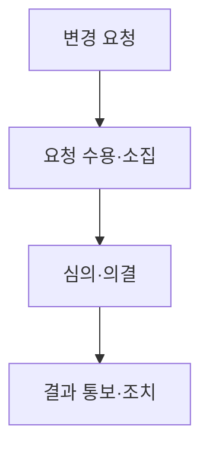

## 지식 로드맵 내 현재 위치

소프트웨어 공학공공 SW 사업관리 · 과업 통제<strong>과업심의위원회</strong>

## 30초 인출

- 본질: **과업심의위원회**는 국가기관등의 소프트웨어사업에서 과업내용의 확정·변경과 계약금액·계약기간 조정을 심의하는 법정 위원회
- 메커니즘: 과업 확정 또는 변경 요청 → 외부위원 과반의 심의·의결 → 결과와 조치계획 통보 → 계약 반영
- 산출: 확정 과업내용 · 변경 타당성 판단 · 계약금액·기간 조정안 · 조치계획

핵심 용어

- **과업내용**: 법령이 정한 공식 용어로, 계약에서 수행할 소프트웨어사업의 범위와 내용을 식별하는 기준
- **Baseline(기준선)**: 승인된 과업 범위와 계약조건을 변경 통제의 비교 기준으로 고정한 상태
- **제척·기피·회피**: 이해충돌 위원을 심의에서 배제해 의결의 공정성을 확보하는 통제
- **계약금액·계약기간 조정**: 과업내용 변경의 영향을 대가와 일정에 함께 반영하는 후속 조치

---

## 1교시 예상문제 (10점)

> 소프트웨어사업 과업심의위원회의 정의와 목적, 핵심 구조와 작동 원리를 설명하시오. (예상)
---

## 1교시 10점 답안

- 정의: **과업심의위원회**는 국가기관등의 **과업내용 확정·변경**과 **계약금액·계약기간 조정**을 심의하는 법정 위원회
- 목적: 과업 확대와 계약조건 불일치 방지 → 객관적 과업 Baseline 유지

| 구분 | 핵심 내용 |
|---|---|
| 구성 | 위원장 포함 5~10명, 소속기관 외 위원 과반 |
| 운영 | 재적 과반 출석·출석 과반 찬성 |
| 요청 | 사업자 요청일부터 14일 이내 결과·조치계획 통보 |

- 결론: 변경 범위와 대가·기간을 함께 심의하고 결과를 계약·검수 기준까지 추적함
---

## 2~4교시 예상문제 (25점)

> 소프트웨어사업 과업심의위원회의 법적 근거와 구성·운영 및 심의 절차를 설명하고, 과업 변경 통제의 실효성 확보 방안을 제시하시오.

> (25점, 예상)
---

## 2~4교시 25점 답안

### Ⅰ. 과업과 계약조건을 함께 통제하는 법정 위원회

> 과업심의는 변경 허용 여부만 판단하는 절차가 아니라 변경된 범위에 맞춰 대가와 기간을 정합화하는 계약 통제임.

- 정의: 국가기관등의 **과업내용 확정·변경**과 **계약금액·계약기간 조정**을 심의하는 **법정 위원회**
- 목적: 구두 지시·무상 과업 확대 방지 → 발주자와 사업자가 확인할 객관적 계약 Baseline 유지
- 근거: 「소프트웨어 진흥법」 제50조, 같은 법 시행령 제45조부터 제47조

### Ⅱ. 심의 대상과 구성·운영

> 위원회의 독립성은 외부위원 비율과 이해충돌 배제에서, 실효성은 결과를 계약에 반영하는 후속 조치에서 확보됨.

| 구분 | 법정 내용 | 통제점 |
|---|---|---|
| 대상 | 과업내용 확정 | 입찰 전 범위 명료화 |
| 변경 | 과업내용 변경 확정 | 변경 사유·범위·영향 증거화 |
| 조정 | 계약금액·계약기간 | 범위 변경과 대가·일정 연동 |
| 구성 | 위원장 포함 5명 이상 10명 이내 | 소속기관 외 위원 과반 |
| 의결 | 재적 과반 출석·출석 과반 찬성 | 제척·기피·회피 적용 |

### Ⅲ. 사업자 개최 요청부터 계약 반영까지

> 사업자의 개최 요청권이 실제 변경 통제로 이어지려면 요청서·영향분석·결과 통보·계약 변경이 하나의 추적 경로로 남아야 함.

- 불가피한 추가 조사 시 사업자와 협의하여 한 차례, 14일 이내 범위에서 통보기한 연기 가능
- 입찰공고에 사업자의 개최 요청권과 과업 변경 절차를 명시

### Ⅳ. 과업심의 운영 위험 및 실무 통제 대책

> 위원회 개최 건수보다 변경 근거와 계약 반영의 추적성이 중요하며, 미반영 시 특별한 사정의 근거가 남아야 함.

| 위험 | 대책 | 효과 |
|---|---|---|
| **기시공 후 사후 심의 (기정사실화)** | 변경 작업 착수 전 공식 심의 게이트 강제 | 무단 과업 변경 원천 차단 및 사업자 손실 방지 |
| **대가·기간 미연동 (무상 과업 강요)** | 과업 범위·금액·기간 3대 요소 일괄 통합 심의 | 정당한 SW 대가 지급 및 납기 지연 분쟁 예방 |
| **형식적 서면 심의 (부실 의결)** | RTM 추적표 및 FP 기반 영향도 평가서 첨부 의무화 | 객관적 공학 증거 기반의 공정한 심의 보증 |
| **발주자 중심 의결 (공정성 훼손)** | 외부 전문가 과반 참여 강제 및 제척·기피·회피 철저 | 심의의 독립성 확보 및 발주자-수행사 간 분쟁 차단 |

### Ⅴ. 변경 증거와 계약 실행을 잇는 거버넌스

> 과업심의의 종료점은 회의록 작성이 아니라 승인된 변경이 계약·일정·검수 기준에 일관되게 반영된 상태임.

### 학습자 통찰 메모 — 답안 밖

- `[핵심 통찰]`: 과업 변경은 기술 범위만의 문제가 아니다. 범위가 바뀌면 대가·기간·검수 기준도 함께 바뀌어야 Baseline이 다시 성립한다.
- `나라면`: 변경요청서에 요구사항 ID, 영향 산출물, 비용·기간 근거를 묶고 심의 결과가 계약 변경까지 이어지는지를 추적하겠다.

### 실전 답안용 기술사적 제언

- **판정 기준**: 사전 심의 원칙 강제(사후 추인 금지), 과업 변경 시 계약금액 및 납기 조정 연동 필수 판정
- **대응 방안**: 소프트웨어 진흥법 제50조 근거 외부위원 과반 위원회 구성 및 기능점수(FP) 기반 객관적 비용 산출
- **검증 체계**: 사업자 요청 후 14일 이내 심의결과 통보 준수율 및 변경계약 체결 내역 감리 전수 검증
- **기대 효과**: 구두 지시에 의한 무상 과업 추가 원천 근절, 공공 SW 제값 주기 실현 및 법적 분쟁 예방
---

## 출제 이력과 검증 출처

- [국가법령정보센터, 소프트웨어 진흥법 제50조](https://www.law.go.kr/lsLinkCommonInfo.do?lsJoLnkSeq=1031614471)
- [국가법령정보센터, 소프트웨어 진흥법 시행령 제45조~제47조](https://law.go.kr/LSW/lumLsLinkPop.do?chrClsCd=010202&lspttninfSeq=162563)

## 연결 토픽

- 이전 토픽: [AI Native 개발 플랫폼](./046_ai_native_dev_platform.md)
- 연관 토픽: [요구공학](./040_requirements_engineering.md), [요구사항 명세](./054_requirements_specification.md), [요구사항 추적표(RTM)](./102_requirement_traceability_matrix.md), [기능점수(FP)](./113_function_point.md)
- 다음 토픽: [비선형 구조](./052_non_linear_structure.md)
