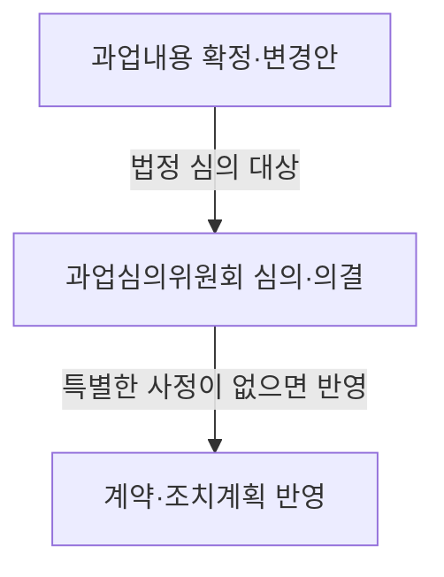
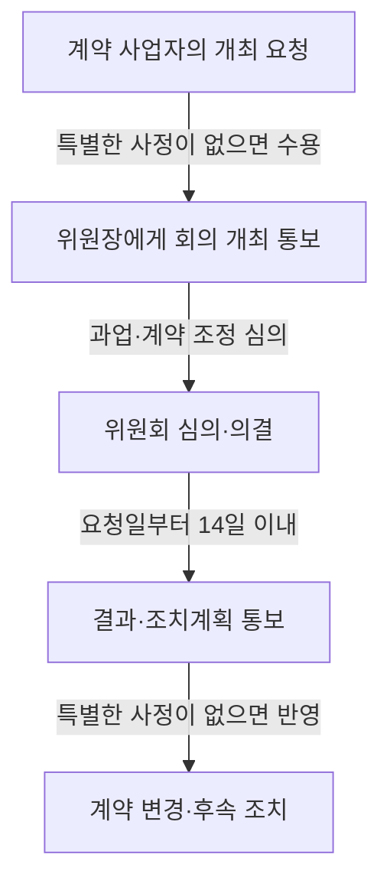

## 지식 로드맵 내 현재 위치

지식 위치: 소프트웨어 공학 → 공공 소프트웨어사업 관리 → 과업내용·계약 변경 심의

## 30초 인출

- 본질: **소프트웨어사업 과업심의위원회**는 공공 소프트웨어사업의 과업 확정·변경과 이에 따른 계약 조정을 심의하는 위원회
- 메커니즘: 과업 확정·변경안 제출 → 독립성·이해충돌을 고려한 심의·의결 → 결과의 계약 반영
- 핵심: 변경 범위와 계약금액·기간을 함께 검토하고 심의 근거를 남기는 절차

핵심 용어

- **소프트웨어사업 과업심의위원회**: 공공 소프트웨어사업의 과업내용과 과업 변경에 따른 계약 조정을 심의하는 위원회
- **과업내용**: 계약으로 수행할 소프트웨어사업의 내용과 범위
- **제척·기피·회피**: 이해충돌 또는 공정성 우려가 있는 위원의 해당 안건 심의 참여를 제한하는 제도
- **심의결과·조치계획**: 심의·의결 결과와 후속 조치 내용을 사업자에게 알리는 사항

---

## 1교시 예상문제 (10점)

> 소프트웨어사업 과업심의위원회의 목적과 법적 심의 대상, 구성·운영의 핵심을 설명하시오. (예상)

---

## 1교시 10점 답안

### Ⅰ. 개요

| 구분 | 핵심 |
|---|---|
| 정의 | **소프트웨어사업 과업심의위원회**는 공공 소프트웨어사업의 과업내용 확정·변경과 이에 따른 계약금액·기간 조정을 심의하는 위원회 |
| 목적 | 과업 변경의 타당성 심의와 변경 내용의 계약 반영을 통한 발주자·사업자 간 범위·계약조건 정합성 확보 |

### Ⅱ. 심의 대상과 절차

| 대상 | 심의 내용 |
|---|---|
| 최초 확정 | 소프트웨어사업 과업내용 |
| 변경 확정 | 변경 과업내용과 그에 따른 계약금액·계약기간 조정 |

### Ⅲ. 구성·운영의 핵심

| 구분 | 기준 |
|---|---|
| 구성 | 위원장 포함 5명 이상 10명 이내, 해당 기관 외 위원 과반수 |
| 의결 | 재적위원 과반수 출석과 출석위원 과반수 찬성 |
| 공정성 | 제척 사유 확인, 당사자의 기피 신청, 해당 위원의 회피 |

제언: 변경 착수 전 과업 범위와 계약 조정 근거를 함께 심의하는 운영 정착.

---

## 2~4교시 예상문제 (25점)

> 소프트웨어사업 과업심의위원회의 법적 근거와 심의 대상, 구성·운영 및 사업자 요청에 따른 심의 절차를 설명하고 실효성 확보 방안을 제시하시오. (예상)

---

## 2~4교시 25점 답안

## Ⅰ. 개요

| 구분 | 핵심 |
|---|---|
| 정의 | **소프트웨어사업 과업심의위원회**는 공공 소프트웨어사업의 과업내용 확정·변경과 이에 따른 계약금액·기간 조정을 심의하는 위원회 |
| 목적 | 과업 변경의 타당성 심의와 변경 내용의 계약 반영을 통한 발주자·사업자 간 범위·계약조건 정합성 확보 |

법적 근거는 「소프트웨어 진흥법」 제50조와 같은 법 시행령 제45조부터 제47조까지의 구성·운영·심의 절차.

## Ⅱ. 심의 대상과 계약 반영

| 심의 대상 | 심의 범위 | 후속 반영 |
|---|---|---|
| 과업내용 확정 | 사업 추진에 필요한 과업내용 | 확정된 과업내용의 계약 반영 |
| 과업내용 변경 | 변경 필요성과 변경 범위 | 변경 과업내용의 계약 반영 |
| 변경에 따른 조정 | 계약금액·계약기간 조정이 있는 경우 해당 내용 | 심의 결과에 따른 계약 조건 조정 |

법률상 심의 결과는 특별한 사정이 없으면 계약 등에 반영.

## Ⅲ. 위원회 구성과 공정한 의결

| 항목 | 법정 기준 | 운영상 확인 |
|---|---|---|
| 인원 | 위원장 포함 5명 이상 10명 이내 | 분야 경험을 갖춘 위원 구성 |
| 외부성 | 해당 국가기관등에 소속되지 않은 위원 과반수 | 이해관계·소속 관계 확인 |
| 의결 | 재적위원 과반수 출석, 출석위원 과반수 찬성 | 정족수와 의결 기록 확인 |
| 이해충돌 | 법령상 제척 사유, 당사자 기피 신청, 위원의 회피 | 해당 안건별 사전 확인 |

## Ⅳ. 사업자 요청부터 조치 통보까지

불가피한 사유가 있으면 사업자와 협의해 한 차례에 한정하여 14일 이내 범위에서 통보기한 연기 가능. 입찰공고에는 사업자의 개최 요청권과 과업 변경 절차를 명시.

## Ⅴ. 심의 운영 위험과 통제

| 위험 | 통제 |
|---|---|
| 변경 작업과 심의·계약 반영의 선후가 불명확한 상태 | 변경 요청, 심의 의결, 계약 반영의 증빙을 순서대로 관리 |
| 범위 변경과 대가·기간 검토의 분리 | 변경 범위와 계약금액·기간 조정 필요성을 같은 안건에서 확인 |
| 이해관계가 있는 위원의 심의 참여 | 위원별 제척 사유와 기피·회피 절차 확인 |
| 심의 결과의 후속 반영 누락 | 의결 내용과 조치계획의 계약·사업 문서 반영 상태 확인 |

## Ⅵ. 기술사적 제언 — 변경 심의의 계약 추적성 확보

| 문제 | 해결 방안 |
|---|---|
| 심의 결과가 회의 기록에만 남고 변경 계약·수행 기준에 반영되지 않을 가능성 | 변경 요청부터 의결·조치계획·계약 반영까지 식별자를 연결하고, 미반영 사유와 후속 담당자를 기록하는 변경 추적표 운영 |

## 출제 이력과 검증 출처

- 공식 문제지 원문에서 확인한 직접 기출 없음
- [국가법령정보센터, 소프트웨어 진흥법 제50조](https://www.law.go.kr/lsLinkCommonInfo.do?lsJoLnkSeq=1031614471)
- [국가법령정보센터, 소프트웨어 진흥법 시행령 제45조~제47조](https://law.go.kr/LSW/lumLsLinkPop.do?chrClsCd=010202&lspttninfSeq=162563)

## 연결 토픽

- 연관 토픽: [요구사항 명세](./054_requirements_specification.md), [요구사항 추적표](./102_requirement_traceability_matrix.md)
- 다음 토픽: [비선형 구조](./052_non_linear_structure.md)
