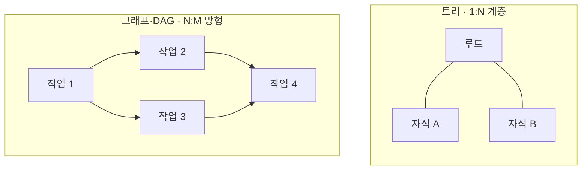

## 지식 로드맵 내 현재 위치

지식 위치: 소프트웨어 공학 → 자료구조 · 알고리즘 → **비선형 구조**

## 30초 인출

- 본질: **비선형 구조(Non-Linear Structure)**는 데이터 요소 간의 관계가 1:1이 아닌 1:N(계층형) 또는 N:M(망형)으로 연결되어 다차원적 분기와 순환을 표현하는 자료구조
- 메커니즘: **트리(Tree: 루트 존재, 무사이클, 간선 N-1)** + **그래프(Graph: 정점/간선, 방향/무방향, 사이클 허용, DAG)**
- 산출/효과: 파일시스템 디렉터리 체계 · DBMS B-Tree 색인 블록 최적화 · 분산 파이프라인(Airflow/Spark) DAG 기반 의존성 실행 보장

핵심 용어

- **Tree(트리)**: 사이클이 없는 연결 무방향 그래프로, $N$개의 노드가 $N-1$개의 간선으로 연결된 1:N 계층적 자료구조
- **Graph(그래프)**: 정점(Vertex)과 간선(Edge)의 집합으로 객체 간의 복합 네트워크(N:M) 관계를 표현하는 자료구조
- **DAG(Directed Acyclic Graph)**: 간선에 방향이 존재하지만 순환(Cycle)이 발생하지 않는 특수 그래프
- **Topological Sort(위상 정렬)**: DAG의 방향성을 거스르지 않도록 모든 정점을 선형 순서로 나열하는 알고리즘
- **B-Tree / B+Tree**: 노드 하나에 다수의 키와 자식 포인터를 배치하여 디스크 블록 단위 I/O 효율을 극대화한 다원 탐색 트리

---

## 1교시 예상문제 (10점)

> 비선형 구조(Non-Linear Structure)의 정의와 목적, 핵심 구조와 작동 원리를 설명하시오. (예상)
---

## 1교시 10점 답안

### 1. 정의·목적

- 정의: **비선형 구조(Non-Linear Structure)**는 데이터 요소 간에 1:N 또는 N:M의 다차원 연결 관계를 갖는 자료구조
- 목적: 계층성 및 네트워크 복합 관계의 완벽한 모델링과 대용량 탐색 가속

### 2. 비선형 구조 2대 축

- **트리(Tree)**: 1:N 계층 구조 · 루트 단일 · 사이클 없음 · 간선 $N-1$
- **그래프(Graph)**: N:M 망형 구조 · 루트 없음 · 사이클 가능 · DAG(비순환 방향)

### 3. 핵심 통제

- **사이클 차단**: DAG 모델링 및 위상 정렬을 통한 작업 교착 상태 예방
- **균형 유지**: Red-Black / B+Tree 구조 유지를 통한 탐색 시간 $O(\log N)$ 보장
---

### 핵심 관계

---

## 2~4교시 예상문제 (25점)

> 데이터 요소 간의 복합적 관계를 표현하는 비선형 자료구조(Non-Linear Structure)의 개념을 설명하고, 선형 구조와의 비교, 트리(Tree)와 그래프(Graph)의 핵심 메커니즘 및 실무 운영 시 발생하는 위험 통제 방안을 제시하시오. (25점)

> (25점, 예상)
---

## 2~4교시 25점 답안

### Ⅰ. 다차원 복합 관계 모델링, 비선형 구조의 개요

> 1차원 선형 나열만으로는 현실 세계의 계층적 조직도나 복잡한 네트워크 연결성을 온전히 표현할 수 없다.

- 정의: 데이터 항목 간의 전후 관계가 1:1이 아닌, 하나의 데이터 뒤에 다수의 데이터가 배치되는 1:N 또는 N:M의 다차원 연결 구조
- 필요성:
  - **계층 관계 표현**: 운영체제 디렉터리, XML/JSON DOM 트리 등 부모-자식 계층성 완벽 투영
  - **네트워크 탐색 최적화**: 통신 라우팅 경로, 소셜 네트워크 연결, 지식 그래프 모델링
  - **대용량 탐색 가속**: B+Tree 인덱스를 통한 $O(\log N)$ 탐색 및 디스크 I/O 최소화

### Ⅱ. 선형 구조 vs 비선형 구조 비교

> 데이터의 배치 형태와 탐색 메커니즘의 근본적 차이로 인해 적용 도메인이 명확히 분기된다.

| 비교 항목 | 선형 자료구조 (Linear) | 비선형 자료구조 (Non-Linear) |
|---|---|---|
| **원소 간 관계** | **1 : 1** (유일한 선행자와 후속자) | **1 : N (트리)** 또는 **N : M (그래프)** |
| **데이터 나열** | 직선상에 연속적·순차적 배치 | 계층적(Hierarchical) 또는 망형(Network) 분기 배치 |
| **탐색 방식** | 순차 탐색 ($O(N)$), 이진 탐색 ($O(\log N)$) | 전위/중위/후위 순회, 깊이우선(DFS), 너비우선(BFS) |
| **대표 구조** | 배열(Array), 연결 리스트(Linked List), 스택, 큐 | **트리(BST, AVL, B-Tree), 그래프, DAG** |
| **주 활용 분야** | 버퍼링, 실행 스택, 메시지 큐, 단순 목록 | 파일시스템, RDBMS 인덱스, 분산 워크플로우 엔진 |

### Ⅲ. 트리와 그래프의 핵심 메커니즘

> 트리는 엄격한 계층성과 순서 불변식을, 그래프는 유연한 연결성과 경로 탐색을 핵심으로 한다.

| 축 | 메커니즘 | 핵심 근거 |
|---|---|---|
| 트리 | 이진 탐색 트리(BST) 순서 불변식 | 왼쪽 < 부모 < 오른쪽 · 평균 $O(\log N)$ 탐색 |
| 트리 | 자가균형 트리(AVL·Red-Black) 노드 회전 | 높이 왜곡 방지 · 최악 $O(\log N)$ 보장 |
| 트리 | B+Tree 인덱스·리프 분리 | 리프 연결 리스트 체인 · 디스크 I/O 효율 |
| 그래프 | 인접 행렬($O(V^2)$) vs 인접 리스트($O(V+E)$) | 밀도에 따른 표현 선택 |
| 그래프 | DFS(스택·재귀) vs BFS(큐) | 깊이 탐색 vs 최단 경로 탐색 |
| 그래프 | DAG 위상 정렬 | 진입차수 기반 작업 실행 순서 확정 |

### Ⅳ. 비선형 구조 운영 위험 및 실무 통제 대책

> 복잡한 포인터 연결 구조는 메모리 누수와 무한 루프 위험을 내포하므로 엄격한 제약과 알고리즘적 통제가 필수적이다.

| 위험 | 대책 | 효과 |
|---|---|---|
| **파이프라인 데드락 (Cycle 발생)** | **위상 정렬** 및 Tarjan/Kosaraju SCC(강한 연결 요소) 사전 검출 | DAG 의존성 순환 원천 차단 및 무한 행(Hang) 예방 |
| **계층 쿼리 병목 (RDBMS 과부하)** | **클로저 테이블(Closure Table)** 또는 그래프 DB(Neo4j) 도입 | 재귀 JOIN 제거 및 홉(Hop) 수 증가에도 $O(1)$ 인접 탐색 보장 |
| **트리 편향 퇴화 ($O(N)$ 전락)** | **Red-Black Tree** 회전 및 B+Tree 분할/병합 알고리즘 적용 | 최악 상황에서도 $O(\log N)$ 탐색 성능 보증 |

### Ⅴ. 대규모 분산 환경에서의 기술사적 제언

> 비선형 자료구조는 학술적 개념에 머물지 않고, 클라우드 네이티브와 분산 데이터 엔진의 핵심 아키텍처로 작동한다.

### 학습자 통찰 메모 — 답안 밖

- [핵심 통찰]: 현대 빅데이터 및 분산 파이프라인(Apache Spark, Airflow)의 본질은 DAG(Directed Acyclic Graph) 엔진임. 태스크 간의 의존성을 DAG로 모델링하여 병렬 실행 가능한 구간을 극대화하고, 장애 발생 시 실패한 노드부터 계보(Lineage)를 역추적해 최소 비용으로 재계산(Fault Tolerance)을 달성함.
- 나라면: 마이크로서비스 간 의존성 관리 및 대규모 데이터 처리 아키텍처 설계 시, 서비스 호출 관계를 DAG 기반으로 시각화하고 순환 의존성을 빌드 타임에 차단하는 아키텍처 거버넌스를 수립하겠음.

### 실전 답안용 기술사적 제언

- **판정 기준**: 데이터 관계 특성(1:N 계층 vs N:M 네트워크) 및 순환(Cycle) 허용 여부에 따른 구조 분기 판정
- **대응 방안**: 데이터베이스 색인은 B+Tree 표준화, 분산 파이프라인/MSA 호출은 DAG 및 위상정렬 아키텍처 채택
- **검증 체계**: Tarjan 알고리즘 기반 순환 의존성 CI 정적 검출 100% 및 B+Tree 인덱스 높이(Depth ≤ 4) 정기 모니터링
- **기대 효과**: 파이프라인 교착 상태 원천 차단, 대용량 트랜잭션 $O(\log N)$ 검색 보증 및 시스템 처리율 극대화
---

## 출제 이력과 검증 출처

- 제131회 정보관리기술사 1교시: 자료구조에서 선형 구조와 비선형 구조의 비교
- Thomas H. Cormen, Introduction to Algorithms (CLRS) - Trees and Graph Algorithms
- Database Management Systems (Ramakrishnan & Gehrke) - B+Tree Indexing

## 연결 토픽

- 이전 토픽: [과업심의위원회](./048_task_deliberation_committee.md)
- 연관 토픽: [선형 구조](./053_linear_structure.md), [BST](./001_bst.md), [정렬 알고리즘](./043_sort_algorithm.md)
- 다음 토픽: [선형 구조](./053_linear_structure.md)
