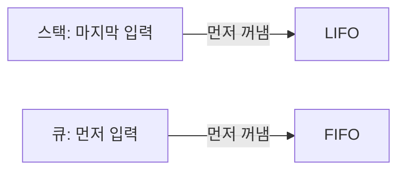
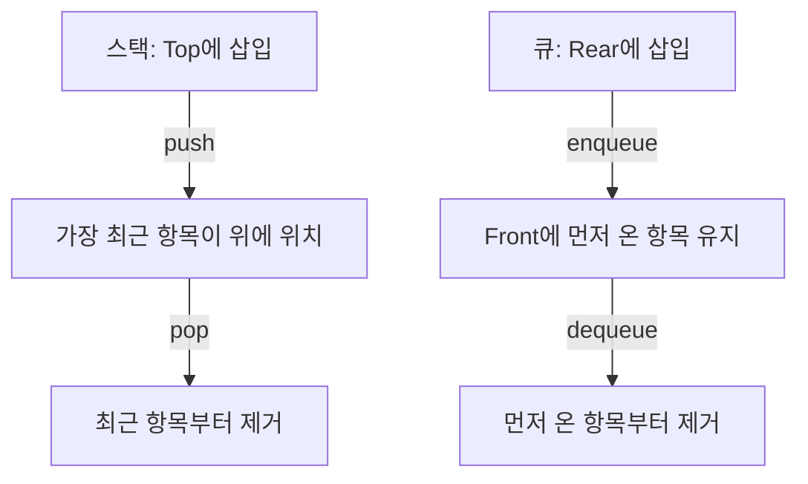

## 지식 로드맵 내 현재 위치

지식 위치: 소프트웨어 공학 → 자료구조·알고리즘 → 선형 자료구조

## 30초 인출

- 본질: **선형 자료구조**는 데이터 항목을 순서에 따라 한 줄로 연결해 저장하는 구조
- 메커니즘: 연속 메모리의 배열·동적 배열, 노드 연결의 연결 리스트, 접근 위치를 제한한 스택·큐
- 선택 기준: 인덱스 접근·삽입삭제 위치·메모리 배치·처리 순서에 맞춰 구조 선택

핵심 용어

- **선형 자료구조**: 항목을 순서에 따라 일렬로 표현하는 자료구조
- **배열(Array)**: 같은 유형의 원소를 인덱스로 접근하도록 연속된 메모리 영역에 배치한 구조
- **연결 리스트(Linked List)**: 각 노드가 다음 노드의 위치를 참조해 순서를 나타내는 구조
- **스택(Stack)**: 한쪽 끝에서 삽입·삭제하며 마지막에 넣은 항목을 먼저 꺼내는 구조
- **큐(Queue)**: 뒤에서 넣고 앞에서 꺼내 먼저 넣은 항목을 먼저 처리하는 구조
- **원형 큐(Circular Queue)**: 배열의 끝과 시작을 논리적으로 연결해 빈 공간을 재사용하는 큐
- **배압(Backpressure)**: 소비 속도보다 입력이 빠를 때 생산 속도나 입력량을 조절하는 흐름 제어

---

## 1교시 예상문제 (10점)

> 선형 자료구조의 정의와 목적, 배열·연결 리스트·스택·큐의 핵심 특징을 설명하시오. (예상)

---

## 1교시 10점 답안

### Ⅰ. 개요

| 구분 | 핵심 |
|---|---|
| 정의 | **선형 자료구조**는 데이터 항목을 순서에 따라 한 줄로 연결해 저장하는 자료구조 |
| 목적 | 순차 처리와 위치·접근 제약에 맞는 데이터 관리 |

### Ⅱ. 주요 구조 비교

| 구조 | 표현·접근 | 대표 동작 |
|---|---|---|
| 배열·동적 배열 | 연속 메모리, 인덱스 접근 | 인덱스 접근은 빠르며 중간 삽입·삭제는 원소 이동 발생 |
| 연결 리스트 | 노드와 참조로 연결 | 위치 탐색은 순차적이며 노드 위치를 아는 경우 연결 변경으로 삽입·삭제 |
| 스택 | 한쪽 끝에서만 접근 | 후입선출(LIFO) |
| 큐 | 한쪽에서 삽입하고 반대쪽에서 삭제 | 선입선출(FIFO) |

### Ⅲ. 스택과 큐의 처리 순서

제언: 접근·삽입삭제·처리 순서 요구에 맞춘 자료구조 선택.

---

## 2~4교시 예상문제 (25점)

> 선형 자료구조의 정의와 목적을 설명하고, 배열·연결 리스트·스택·큐의 구조와 동작 특성을 비교하시오. (예상)

---

## 2~4교시 25점 답안

## Ⅰ. 개요

| 구분 | 핵심 |
|---|---|
| 정의 | **선형 자료구조**는 데이터 항목을 순서에 따라 한 줄로 연결해 저장하는 자료구조 |
| 목적 | 순차 처리와 위치·접근 제약에 맞는 데이터 관리 |

## Ⅱ. 유형과 표현 방식

| 구조 | 저장 표현 | 접근 특성 | 대표 용도 |
|---|---|---|---|
| 배열 | 연속 메모리와 인덱스 | 위치를 알면 직접 접근 | 고정 크기 데이터·테이블 |
| 동적 배열 | 연속 영역을 필요에 따라 확장 | 인덱스 접근, 확장 때 재할당 가능 | 크기 변화가 있는 목록 |
| 연결 리스트 | 노드와 다음·이전 노드 참조 | 원하는 위치까지 순차 탐색 | 노드 연결 변경이 잦은 목록 |
| 스택 | 한쪽 끝의 Top | Top에서만 삽입·삭제 | 함수 호출·되돌리기 |
| 큐 | Front에서 삭제, Rear에서 삽입 | 처리 순서 유지 | 작업 대기열·메시지 처리 |

## Ⅲ. 주요 연산의 비용 비교

| 구조 | 임의 접근 | 탐색 | 끝 삽입·삭제 | 중간 삽입·삭제 |
|---|---|---|---|---|
| 배열 | 인덱스 접근 O(1) | O(n) | 끝 공간이 있으면 O(1), 확장 시 재할당 가능 | 원소 이동으로 O(n) |
| 연결 리스트 | O(n) | O(n) | 끝 참조 보유 여부에 따라 O(1) 또는 탐색 필요 | 위치 노드를 알고 있으면 연결 변경 O(1), 위치 탐색 별도 |
| 스택 | 위치 접근 미지원 | 원소 탐색은 O(n) | Top 연산 O(1) | 임의 삽입·삭제 미지원 |
| 큐 | 위치 접근 미지원 | 원소 탐색은 O(n) | Front·Rear 관리 시 기본 삽입·삭제 O(1) | 임의 삽입·삭제 미지원 |

## Ⅳ. 스택·큐의 처리 메커니즘

## Ⅴ. 큐 구현과 운영 고려사항

| 구현·상황 | 동작·문제 | 고려사항 |
|---|---|---|
| 배열 기반 선형 큐 | Front 이동 뒤 앞쪽 빈 공간을 재사용하기 어려울 수 있음 | 원형 큐 또는 이동 방식 검토 |
| 원형 큐 | 인덱스 순환으로 배열 앞·뒤 공간 재사용 | 공백·포화 상태 구분 방식 명시 |
| 무제한 입력 대기열 | 소비 지연이 누적되면 메모리 사용량 증가 | 용량 한도·초과 시 거부 또는 배압 정책 |

원소 하나를 비워 공백과 포화를 구분하는 원형 큐의 경우 `next(Rear) = (Rear + 1) mod Capacity`, `next(Rear) = Front`일 때 포화 상태.

## Ⅵ. 기술사적 제언 — 접근·변경·처리 순서 기반 선택

| 한계 | 해결 방안 |
|---|---|
| 자료 크기와 처리 방식이 달라지는데도 한 구조를 일률 적용할 가능성 | 인덱스 조회·중간 변경·입출력 순서를 요구사항으로 정리하고, 각 연산 비용과 큐 용량 정책을 기준으로 구조를 선택 |

## 출제 이력과 검증 출처

- 제131회 정보관리기술사 1교시: 선형 구조와 비선형 구조 비교
- Thomas H. Cormen et al., *Introduction to Algorithms*, MIT Press
- [Open Data Structures](https://opendatastructures.org/), University of Waterloo

## 연결 토픽

- 이전 토픽: [비선형 구조](./052_non_linear_structure.md)
- 연관 토픽: [정렬 알고리즘](./043_sort_algorithm.md)
- 다음 토픽: [요구사항 명세](./054_requirements_specification.md)
