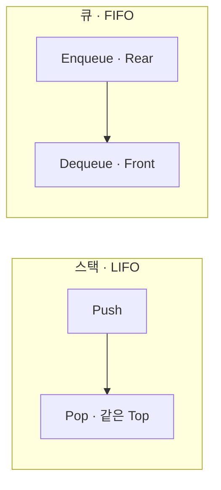

## 지식 로드맵 내 현재 위치

지식 위치: 소프트웨어 공학 → 자료구조 · 알고리즘 → **선형 구조**

## 30초 인출

- 본질: **선형 구조(Linear Structure)**는 데이터 요소 간의 관계가 1:1로 연결되어 유일한 선행자와 후속자를 갖는 일차원적 순서 나열 자료구조
- 메커니즘: **임의 접근 구조(배열, 순차 리스트)** + **참조 연결 구조(연결 리스트)** + **입출력 제약 구조(스택-LIFO, 큐-FIFO, 덱-양방향)**
- 산출/효과: CPU 캐시 공간 지역성(Spatial Locality) 극대화 · 링 버퍼(원형 큐)를 통한 메모리 재활용 및 제로 카피 스트리밍 버퍼 구현

핵심 용어

- **Linear Structure(선형 구조)**: 데이터 요소 간에 1:1 선행·후속 관계를 갖는 순차적 자료구조
- **Circular Queue(원형 큐)**: 선형 큐의 잘못된 포화(False Overflow)를 해결하기 위해 모듈로(`% Size`) 연산으로 시작과 끝을 연결한 링 버퍼
- **Spatial Locality(공간 지역성)**: 최근 접근한 메모리의 인접 영역이 연속 참조될 가능성이 높아 CPU 캐시 적중률이 극대화되는 하드웨어 특성
- **Backpressure(배압)**: 큐 버퍼 상한 도달 시 생산자의 유입 속도를 능동적으로 제어하여 OOM 크래시를 방지하는 리액티브 메커니즘
- **ArrayList vs LinkedList**: 연속된 물리 배열 기반 $O(1)$ 임의 접근 vs 힙 포인터 체인 기반 $O(1)$ 중간 삽입/삭제 구조

---

## 1교시 예상문제 (10점)

> 선형 구조(Linear Structure)의 정의와 목적, 핵심 구조와 작동 원리를 설명하시오. (예상)

---

## 1교시 10점 답안

### 1. 정의·목적

- 정의: **선형 구조(Linear Structure)**는 데이터 요소들이 1:1의 선행·후속 관계로 순차 나열되는 자료구조
- 목적: 엄격한 순서 보장, 효율적 메모리 인덱싱, 비동기 버퍼링 제어

### 2. 원형 큐 핵심 수식

- 포인터 이동: `Next = (Current + 1) % Size`
- 공백 판별: `Front == Rear` · 포화 판별: `(Rear + 1) % Size == Front`

### 3. 핵심 통제

- **False Overflow 극복**: 모듈로 연산 기반 링 버퍼를 활용해 메모리 재활용
- **배압(Backpressure)**: 큐 크기 상한 설정으로 OOM 방지 및 가용성 유지
---

### 핵심 관계

---

## 2~4교시 예상문제 (25점)

> 데이터 요소 간 1:1 관계를 갖는 선형 자료구조(Linear Structure)의 개념을 설명하고, 배열, 연결 리스트, 스택, 큐의 동작 메커니즘과 시간복잡도를 비교하며, 원형 큐의 포화 판별 수식 및 실무 운영 위험 통제 방안을 제시하시오. (25점)

> (25점, 예상)

---

## 2~4교시 25점 답안

### Ⅰ. 1:1 순서 보장과 메모리 배치, 선형 구조의 개요

> 현대 고성능 시스템의 병목은 알고리즘 점근 복잡도보다 CPU 캐시 적중률과 큐 버퍼링 제어에서 발생한다.

- 정의: 데이터 요소 간의 앞뒤 순서가 일렬(1:1)로 연결되어, 첫 번째와 마지막 원소를 제외한 모든 원소가 유일한 선행자와 후속자를 갖는 자료구조
- 목적: 순차적 데이터 처리, 함수 호출 스택 관리, 비동기 메시지 버퍼링, 하드웨어 메모리 친화적 임의 접근 보장

### Ⅱ. 선형 자료구조 핵심 분류 및 메커니즘

> 메모리 연속성 여부와 입출력 제약 조건에 따라 구조적 특성과 사용 목적이 명확히 분기된다.

| 분류 | 구조 | 특성 |
|---|---|---|
| 비제약 | 배열(Array) | 연속 메모리 배치 · 인덱스 오프셋 기반 $O(1)$ 임의 접근 |
| 비제약 | 순차 리스트(ArrayList) | 동적 가변 배열 · 캐시 공간 지역성 우수 |
| 비제약 | 연결 리스트(LinkedList) | 노드 포인터 체인 · 선행자 확보 시 $O(1)$ 중간 삽입·삭제 |
| 제약 | 스택(Stack) | Top 한쪽 끝에서만 입출력 · 후입선출 LIFO(백트래킹·실행 스택) |
| 제약 | 큐(Queue) | Rear 삽입·Front 삭제 · 선입선출 FIFO(작업 대기열) |
| 제약 | 덱(Deque) | 양쪽 끝에서 모두 삽입·삭제 · 양방향 결합형 |

### Ⅲ. 4대 선형 구조 복잡도 및 원형 큐 수식 메커니즘

> 선형 큐의 메모리 단편화 문제를 해결하기 위해 원형 큐의 모듈로 판별식이 필수적으로 사용된다.

### 1. 4대 선형 자료구조 시간복잡도 비교

| 자료구조 | 임의 접근 (Access) | 순차 탐색 (Search) | 삽입 (Insertion) | 삭제 (Deletion) | 주요 활용 분야 |
|---|---|---|---|---|---|
| **배열 (Array)** | **$O(1)$** | $O(N)$ | $O(N)$ | $O(N)$ | 룩업 테이블, 정적 고정 버퍼 |
| **연결 리스트** | $O(N)$ | $O(N)$ | **$O(1)^*$** | **$O(1)^*$** | 삽입/삭제 잦은 동적 리스트 |
| **스택 (Stack)** | $O(N)$ | $O(N)$ | **$O(1)$ (Push)** | **$O(1)$ (Pop)** | 함수 복귀 주소, 문법 파싱 |
| **큐 (Queue)** | $O(N)$ | $O(N)$ | **$O(1)$ (Enqueue)** | **$O(1)$ (Dequeue)** | OS 스케줄러, 메시지 브로커 |

> \* 연결 리스트의 $O(1)$ 삽입/삭제는 대상 노드의 포인터를 이미 확보한 경우에 한함.

### 2. 원형 큐(Circular Queue) 모듈로 수식

- **선형 큐 한계**: Dequeue 후 앞단 공간이 비어 있어도 `Rear == Size - 1`이면 삽입 불가능(False Overflow)
- **포인터 이동식**: `Next_Pointer = (Current_Pointer + 1) % Size`
- **공백 판별식**: `Front == Rear`
- **포화 판별식**: `(Rear + 1) % Size == Front` (공백과 포화 구분을 위해 반드시 1칸을 공백으로 유지)

### Ⅳ. 선형 구조 운영 위험 및 실무 통제 대책

> 메모리 제약 없는 큐와 캐시 미스를 유발하는 연결 리스트는 운영 장애의 주요 원인이 된다.

| 위험 | 대책 | 효과 |
|---|---|---|
| **큐 폭증으로 인한 OOM (Crash)** | **바운디드 큐(Bounded Queue)** 강제 및 리액티브 **배압(Backpressure)** 적용 | 힙 메모리 고갈 원천 차단 및 시스템 생존 보장 |
| **캐시 미스(Cache Miss) 병목** | LinkedList 대신 **ArrayList** 표준화 및 객체 풀링(Object Pooling) | CPU 공간 지역성 확보로 대량 순회 속도 3~5배 향상 |
| **선형 큐 잘못된 포화 고갈** | **원형 큐(Ring Buffer / LMAX Disruptor)** 구조 채택 | 가비지 컬렉션(GC) 제거 및 마이크로초 단위 초저지연 달성 |

### Ⅴ. 하드웨어 캐시 지역성과 배압 제어 관점의 기술사적 제언

> 이론적 시간복잡도보다 현대 CPU의 캐시 아키텍처와 분산 시스템의 배압 거버넌스를 결합해야 한다.

### 학습자 통찰 메모 — 답안 밖

- [핵심 통찰]: 알고리즘 책에서는 삽입/삭제가 빈번할 때 LinkedList가 $O(1)$로 우수하다고 가르치지만, 현대 64비트 CPU 환경에서는 완전히 틀린 조언임. LinkedList의 노드는 힙 메모리 사방에 흩어져 있어 접근할 때마다 L1/L2 캐시 미스를 유발함. 반면 ArrayList는 메모리가 연속되어 있어 64바이트 캐시 라인(Spatial Locality)에 의해 미리 CPU로 올라옴. 10만 건 이하의 일반적 연산에서는 메모리 시프트 비용을 감수하더라도 ArrayList가 LinkedList보다 훨씬 빠름.
- 나라면: 엔터프라이즈 백엔드 표준 가이드라인에서 무분별한 LinkedList 사용을 금지하고 ArrayList를 기본 컬렉션으로 강제하되, 메시지 큐는 용량 제한이 없는 `LinkedBlockingQueue`를 엄격히 금지하고 반드시 크기가 고정된 `ArrayBlockingQueue`에 배압(429 Too Many Requests) 정책을 연동하겠음.

### 실전 답안용 기술사적 제언

- **판정 기준**: 언바운디드 큐(무제한 버퍼) 운영 환경 전면 금지, 메모리 공간 지역성(Spatial Locality) 최적화 판정
- **대응 방안**: 순차 순회/조회는 ArrayList 표준화, 고성능 메시지 큐는 원형 링 버퍼(Disruptor) 및 바운디드 큐 배압(Backpressure) 적용
- **검증 체계**: APM 기반 큐 적재 임계치(80%) 초과 알람 및 CPU L1/L2 캐시 미스율 프로파일링 정기 검증
- **기대 효과**: 힙 메모리 고갈(OOM) 원천 차단, 트랜잭션 처리 지연 80% 단축 및 GC 부하 없는 초저지연 버퍼링 달성
---

## 출제 이력과 검증 출처

- 제131회 정보관리기술사 1교시: 자료구조에서 선형 구조와 비선형 구조의 비교
- Thomas H. Cormen, Introduction to Algorithms (CLRS) - Elementary Data Structures
- LMAX Disruptor High Performance Alternative to Bounded Queues

## 연결 토픽

- 이전 토픽: [비선형 구조](./052_non_linear_structure.md)
- 연관 토픽: [정렬 알고리즘](./043_sort_algorithm.md), [BST](./001_bst.md)
- 다음 토픽: [요구사항 명세](./054_requirements_specification.md)
