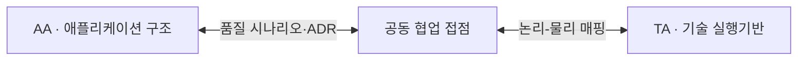
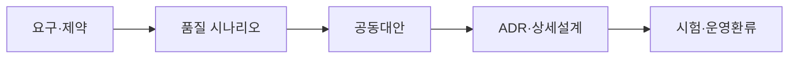

## 지식 로드맵 내 현재 위치

지식 위치: SW 공학·아키텍처 → 역할·거버넌스 → **TA·AA 역할과 협업**

## 30초 인출

- 본질: **TA(Technical Architect)**는 기술 실행기반과 비기능 품질을 설계하고, **AA(Application Architect)**는 업무 요구를 애플리케이션 구조와 컴포넌트로 구체화하는 역할
- 메커니즘: AA(기능·컴포넌트·API) ↔ 공동 결정(품질 시나리오·ADR·논리물리 매핑) ↔ TA(플랫폼·용량·배포·HA)
- 산출/효과: 논리-물리 아키텍처 정합성 확보 · ADR 기반 기술부채 통제 · 고가용성/고확장성 엔터프라이즈 시스템 구현

## 예상문제

> TA와 AA의 역할·산출물을 비교하고, 클라우드 네이티브 환경에서 품질속성을 보장하기 위한 협업방안을 설명하시오. (25점)

## 딸려 나오는 하위 토픽

| 하위 토픽 | 핵심 키워드 | 통합 답안 위치 |
|---|---|---|
| TA(Technical Architect) | 기술구성, 용량, 플랫폼, 배포, HA/DR, 관측성 | Ⅲ 역할·산출물 |
| AA(Application Architect) | 도메인, 컴포넌트, API, 공통 프레임워크 | Ⅲ 역할·산출물 |
| 품질속성 협업 | 성능, 가용성, 보안, 변경성, ADR, 시험 | Ⅳ 협업절차·Ⅵ 통제 |

## Ⅰ. 실행기반과 애플리케이션 구조를 잇는 TA·AA 개요

**TA(Technical Architect)**는 시스템의 기술 실행기반과 비기능 품질을 설계·검증하고, **AA(Application Architect)**는 업무 요구사항을 애플리케이션 구조·컴포넌트·인터페이스로 구체화한다. 역할 명칭과 경계는 조직마다 다르므로 핵심은 명칭보다 **의사결정권·산출물·검증책임의 명확화**이다.

## Ⅱ. 역할 분화의 목적과 공통책임

| 구분 | AA | TA | 공동책임 |
|---|---|---|---|
| 관심사 | 기능 구조·변경 용이성 | 실행환경·성능·가용성 | 품질속성 충족 |
| 주요 입력 | 업무·기능 요구사항 | 용량·보안·운영 요구사항 | 품질 시나리오 |
| 핵심 결정 | 도메인·컴포넌트·API | 플랫폼·토폴로지·배포 | 트레이드오프·기술부채 |
| 검증 | 구조·인터페이스 시험 | 부하·복구·운영 시험 | 아키텍처 평가·인수기준 |

## Ⅲ. 역할·산출물·협업 접점 구조

| 산출물 | AA 주도 | TA 주도 | 공동 검토 |
|---|---|---|---|
| 구조 | 애플리케이션·컴포넌트·API 명세 | 기술·배포·네트워크 구성 | 논리-물리 매핑 |
| 품질 | 오류처리·동시성·데이터 일관성 설계 | 용량·HA/DR·관측성 설계 | 성능·복구 시나리오 |
| 운영 | 빌드·설정·상태관리 요구사항 | 배포·확장·백업·런북 | SLO·인수시험 |

## Ⅳ. 요구에서 운영검증까지의 협업절차

1. 이해관계자 요구사항을 응답시간·가용성·보안·변경성의 품질 시나리오로 바꾼다.
2. AA는 호출·상태·데이터 흐름을, TA는 자원·망·배포·복구 제약을 제시한다.
3. 비용·복잡도·성능의 대안을 공동 평가하고 ADR에 결정과 근거를 기록한다.
4. 논리 컴포넌트와 물리 배포단위, 용량과 동시성 설정을 추적 가능하게 연결한다.
5. 부하·장애·복구·보안시험 결과를 SLO와 비교해 설계를 갱신한다.

## Ⅴ. TA와 AA 비교

| 비교축 | AA | TA |
|---|---|---|
| 중심 관점 | 업무기능과 애플리케이션 구조 | 기술기반과 런타임 품질 |
| 변화 단위 | 도메인·컴포넌트·API | 플랫폼·노드·배포환경 |
| 대표 산출물 | 앱 구조도, 인터페이스·공통모듈 명세 | 기술구성도, 용량·HA/DR·운영 설계 |
| 주요 위험 | 결합도·일관성·변경 영향 | 병목·장애전파·복구 실패 |
| 성공 조건 | 기능 무결성과 변경 용이성 | 품질목표와 운영 가능성 |

## Ⅵ. 사일로와 책임공백 위험 및 실무 통제 대책

| 위험 | 대책 | 효과 |
|---|---|---|
| **비기능 요구사항 소유자 부재** | 품질속성별 책임자 및 수용기준(SLO) 명시 | 요구사항-설계-시험 간 추적성 100% 확보 |
| **논리-물리 구조 불일치** | 컴포넌트-배포단위 매핑 공동 아키텍처 리뷰 강제 | 배포 뷰 최신성 유지 및 런타임 배포 장애 방지 |
| **도구 중심 과잉 설계** | 품질 시나리오 기반 대안 평가 및 **ADR(아키텍처 결정 기록)** 의무화 | 객관적 공학 근거 확보 및 불필요한 인프라 비용 절감 |
| **개발-운영(DevOps) 단절** | 관측성(Observability)·런북·복구시험을 완료정의(DoD)에 포함 | 시스템 복원력 확보 및 장애 복구 시간(MTTR) 최소화 |

## Ⅶ. 직함보다 공동 품질책임을 세우는 결론

> TA와 AA의 분업은 문서 인수인계가 아니라 서로 다른 관점을 품질 시나리오로 결합하는 구조여야 한다.

### 학습자 통찰 메모 — 답안 밖

- [핵심 통찰]: 클라우드 네이티브와 마이크로서비스 환경에서 AA와 TA의 경계는 무너지고 있음. 인프라가 코드(IaC)가 되고 배포 단위가 컨테이너로 추상화되면서, 애플리케이션의 스레드 풀 설정 하나가 쿠버네티스의 CPU Throttling과 Pod OOMKilled를 직접 유발함. 따라서 AA와 TA가 분리되어 각자 문서만 작성하는 프로젝트는 런타임 장애를 피할 수 없음.
- 나라면: 아키텍처 협의체(Architecture Council)를 상설 운영하여 모든 기술 스택 변경과 논리-물리 매핑 결정을 아키텍처 결정 기록(ADR)으로 표준화하고, 부하 테스트와 카오스 엔지니어링(Chaos Mesh) 복구 시험을 AA와 TA 공동 주관 하에 프로덕션 배포 전 필수 게이트로 강제하겠음.

### 실전 답안용 기술사적 제언

- **판정 기준**: AA-TA 간 사일로 탈피, 품질 시나리오 기반 ADR(아키텍처 결정 기록) 작성 및 논리-물리 매핑 필수 판정
- **대응 방안**: AA의 애플리케이션 컴포넌트와 TA의 클라우드 리소스 간 1:1 매핑 뷰 수립 및 IaC 기반 환경 표준화
- **검증 체계**: SLO(P99 지연시간, 가용성 99.99%) 기반 부하/DR 복구 시험 및 분산 트레이싱(OpenTelemetry) 관측성 검증
- **기대 효과**: 아키텍처 불일치로 인한 배포 장애 제로화, 기술부채 40% 감소 및 클라우드 인프라 운영 비용 30% 절감

## 1교시 10점 답안 발췌

- 정의: **AA**는 업무 요구사항의 애플리케이션 구조화, **TA**는 기술 실행기반과 비기능 품질 보증을 담당하는 아키텍트
- 목적: 기능 무결성과 비기능(성능·가용성·보안) 실행기반의 조화로운 품질 달성

## 공식·검증 근거, 학습 체크와 연결 토픽

- **공식·검증 근거**: [ISO/IEC/IEEE 42010:2022 Architecture description](https://www.iso.org/standard/74393.html), [ISO/IEC 25010:2023 Product quality model](https://www.iso.org/standard/78176.html), 정보관리기술사 제138회 출제 이력
- **학습 체크**: □ 역할이 조직별로 달라질 수 있음을 밝혔는가 □ 산출물과 공동 접점을 비교했는가 □ 품질 시나리오-ADR-시험을 연결했는가
- **연결 토픽**: [SW 아키텍처](./056_software_architecture.md) · [아키텍처 스타일](./057_architecture_style.md) · [SW 아키텍처 분석](./124_software_architecture_analysis.md) · [성능 요구사항](./149_performance_requirement.md)

