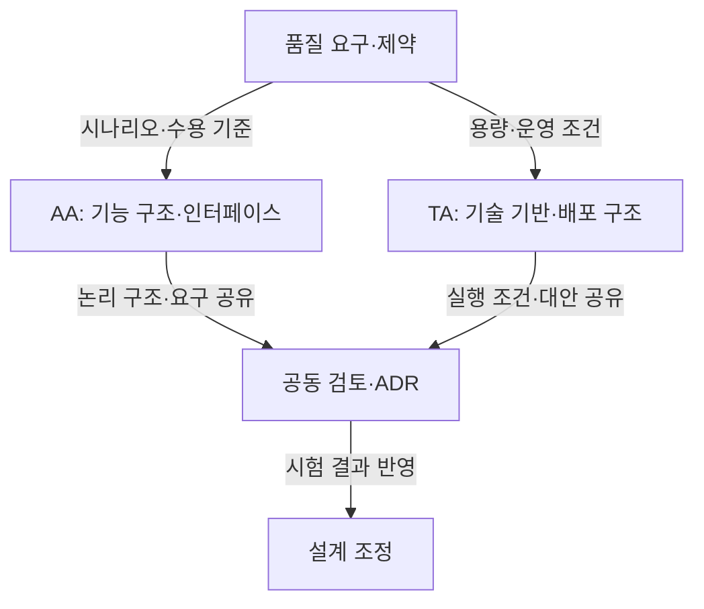
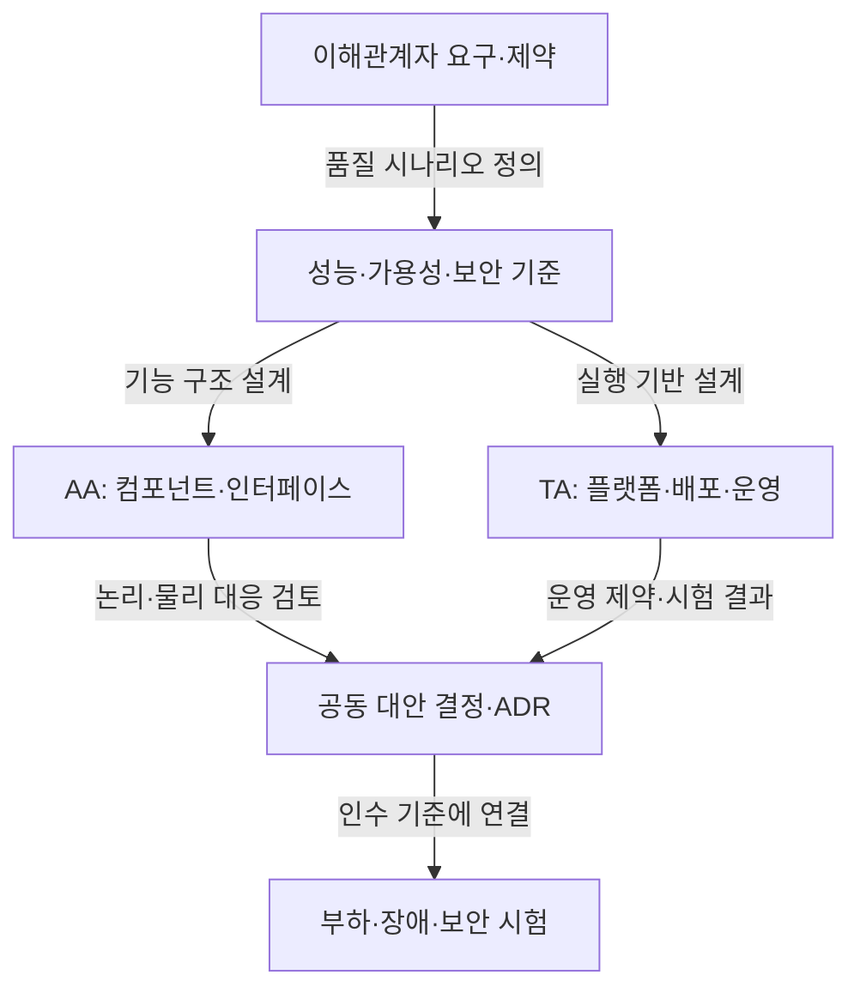

## 지식 로드맵 내 현재 위치

지식 위치: 소프트웨어 공학 → 아키텍처 설계·역할 → 기술·애플리케이션 아키텍트 협업

## 30초 인출

- 본질: **AA(Application Architect)**는 애플리케이션의 기능 구조를, **TA(Technical Architect)**는 기술 실행 기반을 설계하는 역할
- 메커니즘: 품질 요구 합의 → 논리 구조와 기술 환경의 연결 → 공동 검토·시험
- 핵심: 직함보다 의사결정 책임과 산출물 사이의 접점 명확화

핵심 용어

- **AA(Application Architect)**: 업무 요구를 애플리케이션 구성요소와 인터페이스로 구체화하는 역할
- **TA(Technical Architect)**: 애플리케이션을 실행할 기술 기반과 운영 품질을 설계하는 역할
- **ADR(Architecture Decision Record)**: 아키텍처 결정과 배경·대안·결과를 남기는 기록
- **품질 시나리오**: 특정 자극·환경에서 요구 품질과 측정 가능한 응답을 설명한 시나리오
- **논리·물리 매핑**: 애플리케이션 구성요소를 배포·실행 환경의 구성에 연결한 대응 관계

---

## 1교시 예상문제 (10점)

> AA와 TA의 역할을 비교하고 품질 요구를 반영한 협업 방법을 설명하시오. (예상)

---

## 1교시 10점 답안

### Ⅰ. 개요

| 구분 | 핵심 |
|---|---|
| 정의 | **AA와 TA 역할 분담**은 애플리케이션 구조와 기술 실행 기반의 설계 책임을 구분하고 공동 의사결정 지점을 정하는 아키텍처 협업 방식 |
| 목적 | 기능 구조와 성능·보안·가용성 등 품질 요구의 정합성 확보 |

### Ⅱ. 역할 비교

| 관점 | AA | TA |
|---|---|---|
| 중심 관심 | 기능·도메인·컴포넌트·인터페이스 | 플랫폼·배포환경·네트워크·운영 조건 |
| 주요 산출물 | 애플리케이션 구조와 인터페이스 설계 | 기술 구성과 실행·운영 설계 |
| 공동 검토 | 논리 구조가 품질 요구를 지원하는지 확인 | 기술 기반이 구조·부하·운영 요구를 수용하는지 확인 |

### Ⅲ. 품질 요구 기반 협업

제언: 품질 요구와 논리·물리 설계를 공동 검토하는 책임자·기록의 사전 지정.

---

## 2~4교시 예상문제 (25점)

> AA와 TA의 역할·산출물을 비교하고, 클라우드 네이티브 환경에서 품질속성을 설계·검증하기 위한 협업 방안을 제시하시오. (예상)

---

## 2~4교시 25점 답안

## Ⅰ. 개요

| 구분 | 핵심 |
|---|---|
| 정의 | **AA와 TA 역할 분담**은 애플리케이션 구조와 기술 실행 기반의 설계 책임을 구분하고 공동 의사결정 지점을 정하는 아키텍처 협업 방식 |
| 목적 | 기능 구조와 성능·보안·가용성 등 품질 요구의 정합성 확보 |

역할 명칭과 경계는 조직마다 다를 수 있으므로, 책임·의사결정권·산출물의 합의가 우선.

## Ⅱ. 역할과 산출물의 경계

| 구분 | AA | TA | 공동 확인 |
|---|---|---|---|
| 설계 범위 | 업무 기능·도메인·컴포넌트·API | 실행 플랫폼·네트워크·배포 단위 | 논리 구조와 실행 환경의 대응 |
| 품질 관점 | 기능 정확성·변경성·데이터 흐름 | 성능·가용성·보안·운영성 | 품질 시나리오와 수용 기준 |
| 대표 산출물 | 애플리케이션 구조·인터페이스 설계 | 기술 구성도·배포·운영 설계 | ADR·공동 시험 기준 |

## Ⅲ. 요구에서 운영 검증까지의 협업

## Ⅳ. 클라우드 네이티브 주요 공동 결정

| 설계 쟁점 | AA 검토 | TA 검토 | 공동 판단 |
|---|---|---|---|
| 서비스 경계 | 업무 책임·데이터 소유 | 배포·통신·운영 경계 | 분리 이득과 통신 복잡도 |
| 확장성 | 상태·세션·요청 특성 | 자원 한도·자동 확장 조건 | 부하 조건과 확장 시험 |
| 장애 대응 | 오류 처리·중복 요청 영향 | 격리·복구·가용성 구성 | 장애 시나리오와 복구 기준 |
| 보안 | 역할·데이터 흐름·기능 권한 | 네트워크·비밀정보·실행환경 | 위협 경계와 통제 위치 |

## Ⅴ. 협업 실패 위험과 대응

| 위험 | 대응 |
|---|---|
| 품질 요구의 담당자·수용 기준 부재 | 요구별 책임자와 시험 가능한 수용 기준 합의 |
| 애플리케이션 구조와 배포 구성이 서로 어긋남 | 구성요소와 배포 단위의 대응 관계를 설계 검토에서 확인 |
| 기술 선택 근거가 담당자 변경 때 사라짐 | 대안·제약·결정을 ADR에 기록 |
| 설계 후 운영 검증이 늦게 발견됨 | 부하·장애·보안 검증을 인수 조건에 포함하고 결과를 설계에 반영 |

## Ⅵ. 기술사적 제언 — 품질 시나리오별 공동 승인

| 한계 | 해결 방안 |
|---|---|
| AA의 논리 설계와 TA의 실행 설계가 각각 승인되어 품질 요구의 end-to-end 책임이 비어 있을 가능성 | 품질 시나리오별 AA·TA 공동 책임자를 지정하고, ADR에 논리·물리 대응과 시험 결과를 함께 남기는 공동 승인 절차 운영 |

## 출제 이력과 검증 출처

- 공식 문제지 원문에서 확인한 직접 기출 없음
- [ISO/IEC/IEEE 42010:2022, Architecture Description](https://www.iso.org/standard/74393.html)
- [ISO/IEC 25010:2023, Product Quality Model](https://www.iso.org/standard/78176.html)

## 연결 토픽

- 연관 토픽: [소프트웨어 아키텍처](./056_software_architecture.md), [아키텍처 스타일](./057_architecture_style.md)
- 다음 토픽: [소프트웨어 아키텍처](./056_software_architecture.md)
