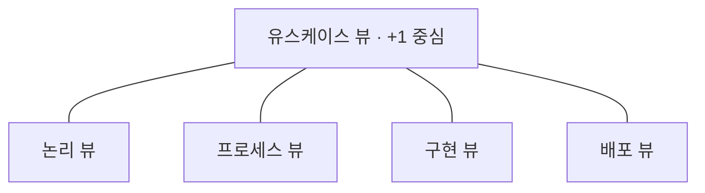

## 지식 로드맵 내 현재 위치

지식 위치: 소프트웨어 공학 → 아키텍처 설계 → **소프트웨어 아키텍처**

## 30초 인출

- 본질: **소프트웨어 아키텍처(Software Architecture)**는 시스템의 소프트웨어 구성요소(Component), 상호작용(Connector), 제약조건(Constraints)을 포함하는 시스템의 근본적인 구조적 틀이자 나중에 바꾸기 가장 어려운 최고 수준의 공학적 의사결정 집합
- 메커니즘: **3대 구성요소(컴포넌트 · 커넥터 · 제약조건)** + **Kruchten 4+1 View(유스케이스 · 논리 · 프로세스 · 구현 · 배포)** + **평가(ATAM/CBAM)**
- 산출/효과: 아키텍처 기술서(SAD) · 비기능 품질속성(성능/가용성/보안) 달성 · 아키텍처 침식(Erosion) 방지 및 진화형 구조 확립

핵심 용어

- **Component & Connector**: 연산을 수행하는 단위(컴포넌트)와 이들 간의 데이터 전달 및 제어를 담당하는 매개체(커넥터)
- **Kruchten 4+1 View**: 복잡한 아키텍처를 이해관계자 관점별로 분리하여 기술하는 모델(유스케이스, 논리, 구현, 프로세스, 배포 뷰)
- **Architecture Erosion(아키텍처 침식)**: 개발 및 운영 중 초기 설계 원칙을 위반한 임의 코딩으로 시스템 결합도가 상승하고 구조가 붕괴되는 현상
- **Fitness Function(아키텍처 피트니스 함수)**: 아키텍처 특성(결합도, 순환 참조, 성능)의 유지 여부를 빌드 시 코드로 자동 측정하는 목적 함수
- **ATAM(Architecture Tradeoff Analysis Method)**: 품질속성 시나리오를 바탕으로 아키텍처의 민감점과 절충점(Trade-off)을 평가하는 기법

## 예상문제

> 시스템의 근본적인 구조적 틀을 형성하는 소프트웨어 아키텍처(Software Architecture)의 개념과 구성요소를 설명하고, Kruchten 4+1 View 모델의 구조 및 아키텍처 침식(Erosion) 방지를 위한 통제 방안을 제시하시오. (25점)

## Ⅰ. 시스템 근본 구조와 품질 통제, 소프트웨어 아키텍처의 개요

> 아키텍처는 나중에 변경하기 가장 어려운 중요한 결정들의 집합이며, 시스템의 성패를 가르는 뼈대이다.

- 정의: 소프트웨어 구성요소(Component), 구성요소 간의 관계(Connector), 그리고 이를 설계하고 진화시키는 원칙과 지침을 포함하는 시스템의 최고 수준 근본 구조적 틀 (ISO/IEC/IEEE 42010)
- 필요성:
  - **이해관계자 공통 의사소통 기준**: 개발자, 발주자, 운영자 간의 서로 다른 관점을 단일 진실원천(SSOT)으로 정렬
  - **비기능 품질속성 보장**: 성능(TPS/응답시간), 가용성(99.99%), 보안성, 변경용이성을 구조적으로 달성
  - **아키텍처 침식 방지**: 초기 설계 원칙을 확립하여 장기적 시스템 노후화와 스파게티 코드 전락을 차단

## Ⅱ. 아키텍처 3대 핵심 구성요소 및 Kruchten 4+1 View 체계

> 복잡한 시스템 아키텍처는 단일 도면으로 표현할 수 없으므로, 다차원 뷰로 관점을 분리해야 한다.

### 1. 아키텍처 3대 핵심 구성요소

1. **컴포넌트 (Components)**: 연산을 수행하거나 상태를 캡슐화한 시스템의 기본 실행 단위 (모듈, 서비스, 클래스)
2. **커넥터 (Connectors)**: 컴포넌트 간 상호작용과 데이터 흐름을 매개하는 메커니즘 (REST API, 메시지 큐, RPC, 공유 메모리)
3. **제약조건 (Constraints)**: 시스템이 준수해야 하는 구조적 토폴로지, 통신 프로토콜, 비기능 속성 및 운영 환경 한계

### 2. Kruchten 4+1 View 체계

| 뷰 | 관점·이해관계자 | 주요 기술 대상 |
|---|---|---|
| 유스케이스 뷰 (+1) | 최종 사용자·발주자 | 기능 요구 명세·시나리오 검증 · 모든 뷰의 검증 기준 |
| 논리 뷰 (Logical) | 설계자·분석가 | 클래스·패키지·인터페이스 분할 및 도메인 상호작용 |
| 프로세스 뷰 (Process) | 시스템 통합자 | 런타임 동시성·스레드 제어·성능·확장성·IPC 통신 |
| 구현 뷰 (Implementation) | 프로그래머 | 소스코드 모듈화·컴포넌트 라이브러리 패키징·정적 의존성 |
| 배포 뷰 (Deployment) | 시스템 엔지니어·운영자 | 물리 서버 노드·네트워크 토폴로지·K8s 파드 배치 |

## Ⅲ. 아키텍처 모델 유형 및 평가 체계

> 적합한 모델 패턴 선택과 정량적 아키텍처 평가는 시스템의 수명을 결정짓는다.

### 1. 대표적 아키텍처 모델 유형

- **데이터 흐름 모델**: 파이프 앤 필터(Pipe-and-Filter), 배치 순차(Batch Sequential)
- **데이터 중심 모델**: 저장소(Repository), 칠판(Blackboard) 패턴
- **계층화 모델**: 3-Tier 계층형, 헥사고날(Ports and Adapters), 클린 아키텍처
- **독립 컴포넌트 모델**: 이벤트 기반(EDA), 마이크로서비스(MSA), 브로커 패턴

### 2. 아키텍처 평가 체계 (ATAM & CBAM)

- **ATAM (Architecture Tradeoff Analysis Method)**: 품질속성 시나리오를 통해 아키텍처의 민감점(Sensitivity Point)과 절충점(Trade-off Point)을 정성/정량 분석
- **CBAM (Cost Benefit Analysis Method)**: ATAM 분석 결과에 경제적 비용 대 편익(ROI)을 결합하여 아키텍처 개선 우선순위 확정

## Ⅳ. 아키텍처 침식 위험 및 실무 통제 대책

> 개발 일정 압박으로 인한 무단 지름길 코딩은 아키텍처 침식을 유발하여 시스템 유지보수성을 파괴한다.

| 위험 | 대책 | 효과 |
|---|---|---|
| **아키텍처 침식 (계층 위반 스파게티화)** | **ArchUnit 기반 정적 테스트**를 CI 빌드 파이프라인에 의무화 | 비인가 계층 참조 0건 차단 및 모듈 결합도 50% 개선 |
| **설계 맥락 상실 (5년 후 추적 불가)** | 경량 **ADR (Architecture Decision Record)** Git 마크다운 관리 | 아키텍처 결정 배경, 대안, 트레이드오프 100% 영구 보존 |
| **품질속성 미달 (오픈 직전 TPS 파탄)** | 조기 PoC 수행 및 **ATAM 기반 품질 시나리오** 사전 평가 | 런타임 성능 결함 90% 조기 색출 및 전면 재구축 방지 |

## Ⅴ. 진화형 아키텍처와 피트니스 함수 관점의 기술사적 제언

> 아키텍처는 한 번 그리고 덮어두는 정적 도면이 아니라, 비즈니스 변화에 맞춰 지속적으로 진화해야 한다.

### 학습자 통찰 메모 — 답안 밖

- [핵심 통찰]: 전통적인 폭포수 아키텍처의 가장 큰 맹점은 초기에 수백 쪽의 아키텍처 설계서(SAD)를 작성하고는 개발 중에 코드가 어떻게 변질되든 방치한다는 점임. 현대 엔터프라이즈 환경에서는 '진화형 아키텍처(Evolutionary Architecture)'가 필수적임. 아키텍처의 핵심 원칙(예: 특정 모듈 간 직접 호출 금지, 응답 시간 1초 이내, 라이브러리 취약점 제로)을 코드로 작성된 '아키텍처 피트니스 함수(Fitness Function)'로 정의하고, 매 Git PR마다 CI에서 자동 검증해야 아키텍처가 표류하지 않음.
- 나라면: 신규 플랫폼 구축 시 ArchUnit으로 계층 위반을 빌드 타임에 차단하고, k6 기반 부하 테스트를 야간 CI로 실행하여 응답 지연을 모니터링하며, 모든 구조적 변경은 ADR 작성을 필수로 강제하는 아키텍처 거버넌스를 구축하겠음.

### 실전 답안용 기술사적 제언

- **판정 기준**: Kruchten 4+1 View 다관점 뷰 일치 및 CI 내 아키텍처 피트니스 함수(Fitness Function) 통과 판정
- **대응 방안**: ArchUnit 기반 계층 위반 차단, ADR 버전 관리 및 ATAM 품질속성 시나리오 정량 평가 수행
- **검증 체계**: CI 빌드 파이프라인 계층 의존성 위반 0건 확인 및 야간 부하 PoC(k6) 기반 SLO 준수율 검증
- **기대 효과**: 아키텍처 침식(Erosion) 원천 방지, 유지보수 비용 50% 절감 및 클라우드 진화형 시스템 완성

## 1교시 10점 답안 발췌

### 1. 정의·목적

- 정의: **소프트웨어 아키텍처(Software Architecture)**는 시스템의 소프트웨어 구성요소(Component), 관계(Connector), 제약조건(Constraints)을 포함하는 근본 구조적 틀
- 목적: 이해관계자 공통 이해, 비기능 품질속성(성능/보안/가용성) 보장, 아키텍처 침식 방지

### 2. Kruchten 4+1 View 체계 요약

### 3. 핵심 통제

- **ArchUnit 피트니스 함수**: 계층 규칙 위반을 CI 빌드 타임에 자동 차단
- **ADR 버전 관리**: 아키텍처 결정 배경과 트레이드오프를 Git으로 영구 추적

## 출제 이력과 검증 출처

- 제120회 정보관리기술사 1교시: 소프트웨어 아키텍처 4대 모델 유형
- ISO/IEC/IEEE 42010:2022 Systems and software engineering - Architecture description
- Philippe Kruchten, Architectural Blueprints - The "4+1" View Model of Software Architecture

## 학습 체크

- [ ] 소프트웨어 아키텍처의 3대 핵심 구성요소(컴포넌트, 커넥터, 제약조건)를 설명할 수 있는가?
- [ ] Kruchten 4+1 View의 각 뷰별 주 이해관계자와 주요 관심사를 매핑할 수 있는가?
- [ ] 아키텍처 침식(Erosion)의 원인과 이를 방지하기 위한 피트니스 함수(ArchUnit) 통제 방안을 제시할 수 있는가?

## 연결 토픽

- 이전 토픽: [TA vs AA](./055_ta_vs_aa.md)
- 연관 토픽: [아키텍처 스타일](./057_architecture_style.md), [SW 아키텍처 평가](./124_software_architecture_analysis.md), [품질 요구사항](./149_performance_requirement.md)
- 다음 토픽: [아키텍처 스타일](./057_architecture_style.md)
