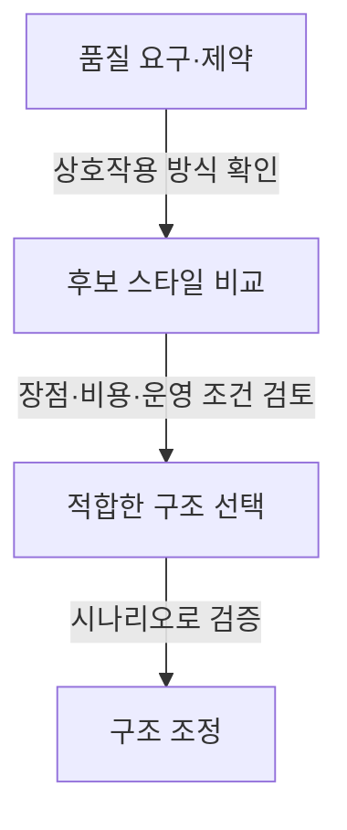
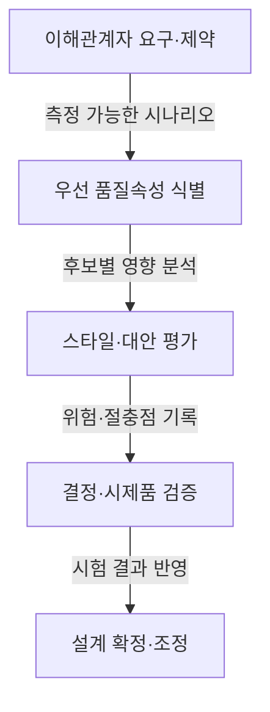

## 지식 로드맵 내 현재 위치

지식 위치: 소프트웨어 공학 → 아키텍처 설계 → 아키텍처 스타일

## 30초 인출

- 본질: **아키텍처 스타일**은 구성요소의 종류와 관계·제약을 정해 시스템의 큰 구조를 잡는 재사용 가능한 설계 방식
- 메커니즘: 데이터 흐름·호출과 반환·독립 컴포넌트·공유 데이터 등 상호작용 구조 선택
- 선택 기준: 품질 요구와 제약에 비추어 장점·비용·운영 복잡도를 비교

핵심 용어

- **아키텍처 스타일(Architecture Style)**: 구성요소의 유형·관계·제약을 규정해 시스템 구조를 정하는 설계 방식
- **파이프와 필터(Pipes and Filters)**: 데이터를 변환하는 필터를 파이프로 연결하는 데이터 흐름 스타일
- **계층형 아키텍처(Layered Architecture)**: 책임을 계층으로 나누고 정한 의존 규칙에 따라 계층 간 상호작용을 제한하는 스타일
- **이벤트 주도 아키텍처(EDA, Event-Driven Architecture)**: 이벤트 발행과 구독으로 컴포넌트 간 비동기 상호작용을 구성하는 스타일
- **저장소 스타일(Repository Style)**: 여러 컴포넌트가 공유 데이터 저장소를 통해 정보를 교환하는 스타일
- **ATAM(Architecture Tradeoff Analysis Method)**: 품질 시나리오를 이용해 아키텍처 위험·민감점·절충점을 분석하는 방법

---

## 1교시 예상문제 (10점)

> 아키텍처 스타일의 정의와 목적, 대표 유형을 설명하시오. (예상)

---

## 1교시 10점 답안

### Ⅰ. 개요

| 구분 | 핵심 |
|---|---|
| 정의 | **아키텍처 스타일**은 구성요소의 유형·관계·제약을 규정해 시스템 구조를 정하는 설계 방식 |
| 목적 | 반복되는 구조 선택을 재사용하고 품질 요구에 맞는 설계 대안 비교 지원 |

### Ⅱ. 대표 스타일 유형

| 구조 계열 | 스타일 | 주요 관계 |
|---|---|---|
| 데이터 흐름 | 파이프와 필터 | 필터 간 데이터 전달·변환 |
| 호출과 반환 | 계층형·클라이언트/서버 | 요청과 응답, 계층별 책임 |
| 독립 컴포넌트 | 이벤트 주도 | 이벤트 발행·구독 |
| 공유 데이터 | 저장소 | 공통 데이터 저장소를 통한 교환 |

### Ⅲ. 스타일 선택

제언: 우선 품질 요구와 운영 제약을 정리한 뒤 후보 스타일의 절충점을 기록.

---

## 2~4교시 예상문제 (25점)

> 아키텍처 스타일의 정의와 목적을 설명하고, 대표 유형의 구조적 차이를 서술하시오. (예상)

---

## 2~4교시 25점 답안

## Ⅰ. 개요

| 구분 | 핵심 |
|---|---|
| 정의 | **아키텍처 스타일**은 구성요소의 유형·관계·제약을 규정해 시스템 구조를 정하는 설계 방식 |
| 목적 | 반복되는 구조 선택을 재사용하고 품질 요구에 맞는 설계 대안 비교 지원 |

## Ⅱ. 대표 구조 계열

| 계열 | 대표 스타일 | 연결 원리 |
|---|---|---|
| 데이터 흐름 | 파이프와 필터 | 한 구성요소의 출력 데이터를 다음 구성요소의 입력으로 전달 |
| 호출과 반환 | 계층형·클라이언트/서버 | 요청에 대한 호출과 응답, 계층별 책임 |
| 독립 컴포넌트 | 이벤트 주도 | 발행자가 이벤트를 내고 구독자가 관심 이벤트를 처리 |
| 공유 데이터 | 저장소 | 여러 구성요소가 공통 저장소에 접근 |

## Ⅲ. 대표 스타일의 적용 특성

| 스타일 | 이점 | 고려할 비용·제약 |
|---|---|---|
| 파이프와 필터 | 변환 단계를 분리하고 재사용하기 쉬움 | 단계 간 데이터 형식·오류 처리 필요 |
| 계층형 | 책임과 변경 경계를 구분하기 쉬움 | 계층 규칙 위반·불필요한 중계로 변경·성능 부담 가능 |
| 이벤트 주도 | 발행자와 소비자의 직접 의존을 줄이고 비동기 처리 가능 | 전달·순서·중복·실패 처리와 관측 복잡성 |
| 저장소 | 공유 데이터의 중앙 관리와 공통 접근 지원 | 저장소 가용성·동시성·스키마 변경 영향 집중 |

## Ⅳ. 품질 요구에 따른 선택 과정

ATAM은 이해관계자가 중요하게 보는 품질 시나리오에 따라 위험과 절충점을 검토하는 평가 방법.

## Ⅴ. 오적용 위험과 통제

| 위험 | 통제 |
|---|---|
| 유행만으로 분산·비동기 스타일 선택 | 요구 부하·변경 빈도·운영 역량에 맞춘 대안 비교 |
| 이벤트 소비자의 실패·중복 처리가 누락 | 재시도·중복 처리·오류 격리 기준과 운영 관측 설계 |
| 계층 의존 규칙이 구현에서 무너짐 | 의존 규칙을 설계 검토와 자동 구조 검사에 반영 |
| 공유 저장소 변경이 다수 구성요소에 전파 | 데이터 소유·스키마 변경·호환성 책임 합의 |

## Ⅵ. 기술사적 제언 — 품질 시나리오에 따른 스타일 결정

| 문제 | 해결 방안 |
|---|---|
| 아키텍처 스타일을 먼저 정한 뒤 품질 요구를 사후 정당화해 운영 비용과 구조적 제약을 놓칠 가능성 | 성능·가용성·변경성 등 우선 품질 시나리오와 운영 제약을 먼저 합의하고, 후보 스타일의 위험·절충점을 비교한 뒤 선택 근거를 결정 기록에 남김 |

## 출제 이력과 검증 출처

- 제120회 정보관리기술사 1교시: 소프트웨어 아키텍처 모델 유형
- Mary Shaw and David Garlan, *Software Architecture: Perspectives on an Emerging Discipline*
- [ISO/IEC/IEEE 42010:2022, Architecture Description](https://www.iso.org/standard/74393.html)

## 연결 토픽

- 이전 토픽: [소프트웨어 아키텍처](./056_software_architecture.md)
- 연관 토픽: [MSA](./035_msa.md), [이벤트 주도 아키텍처](./078_event_driven_architecture.md)
- 다음 토픽: [인스펙션](./058_inspection.md)
