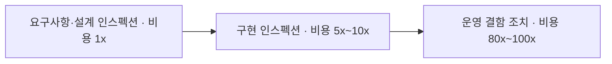
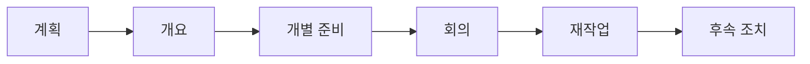
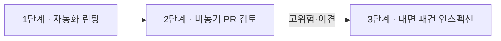

## 지식 로드맵 내 현재 위치

지식 위치: 소프트웨어공학 → 소프트웨어 테스트 및 품질 → 정적 테스트 → **인스펙션(Inspection)**
---

## 30초 인출

- 본질: 코드를 실행하지 않고 개발 산출물의 결함을 조기 적출하여 결함 수정 비용을 최소화하는 정형 검토 (마이클 패건 6단계)
- 절차·역할: 중재자(Moderator·총괄 진행) · 작성자(Author) · 낭독자(Reader) · 기록자(Recorder) · 검토자(Inspector)의 5대 역할이 계획(Planning) → 개요(Overview) → 개별준비(Preparation) → 회의(Meeting) → 재작업(Rework) → 후속조치(Follow-up)의 6단계 절차를 수행
- 핵심 원칙: 해결책 논의 금지(Find, not Solve) · 작성자 평가 배제 · 진입/종료 기준(Entry/Exit Criteria) 강제
---

| 핵심 용어 | 핵심 정의 및 특징 |
|---|---|
| **마이클 패건 (Michael Fagan)** | 1976년 IBM에서 제안한 가장 엄격하고 정형화된 정적 결함 적출 기법의 창시자 |
| **중재자 (Moderator)** | 인스펙션 전 주기를 주관하며, 해결책 논의 차단 및 회의 진행을 통제하는 핵심 관리자 |
| **낭독자 (Reader)** | 회의 시 산출물을 자신의 언어로 해석·낭독하여 작성자의 인지적 편향을 제거하는 역할 |
| **진입/종료 기준 (Entry/Exit Criteria)** | 회의 준비 미흡 시 직권 취소(Entry) 및 크리티컬 결함 완결 검증 후 승인(Exit) 조건 |
| **결함 수정 비용 곡선 (Boehm's Cost of Change)** | 개발 초기 단계 결함 제거가 유지보수 단계 대비 비용을 1/10~1/80 절감한다는 공학적 원리 |
---

## 1교시 예상문제 (10점)

> 인스펙션(Inspection)의 정의와 목적, 핵심 구조와 작동 원리를 설명하시오. (예상)

---

## 1교시 10점 답안

- **인스펙션(Inspection)**은 마이클 패건(Michael Fagan)이 정립한 가장 엄격한 수준의 정형 검토(Formal Review) 기법으로, 중재자(Moderator), 작성자(Author), 낭독자(Reader), 기록자(Recorder), 검토자(Inspector)의 5대 역할 분담 하에 계획, 개요, 개별준비, 회의, 재작업, 후속조치의 6단계 프로세스로 진행된다.
- 회의 중 **해결책 논의를 철저히 배제(Find, not Solve)**하고 결함 식별에만 집중하며, 진입 기준(사전 준비 미흡 시 취소)과 종료 기준(중대 결함 조치 승인)을 엄격히 적용하여 소프트웨어 생명주기 초기 단계에서 결함 수정 비용을 극소화한다.
---

### 핵심 관계

---

## 2~4교시 예상문제 (25점)

> "소프트웨어 품질 향상을 위한 정적 검토 기법 중 마이클 패건(Michael Fagan) 인스펙션의 6단계 절차 및 5대 핵심 역할을 설명하고, IEEE 1028 4대 리뷰 기법과의 비교 및 현대적 CI/CD 파이프라인과 결합된 비동기 하이브리드 인스펙션 전략을 제시하시오."

---

> (25점, 예상)

---

## 2~4교시 25점 답안

### Ⅰ. 결함 조기 적출의 정형 검토 체계, 인스펙션의 개요

#### 1. 인스펙션의 정의
- 1976년 IBM의 마이클 패건(Michael Fagan)이 고안한 가장 정형화된 **동료 검토(Peer Review) 기법**으로, 사전에 정의된 규칙과 체크리스트에 따라 결함을 조기에 적출하는 정적 테스트 활동.

#### 2. 인스펙션의 공학적 목적 및 경제적 가치
- **결함 조기 격리**: 요구사항 사양서, 설계서, 소스코드 단계에서 결함을 차단하여 테스트 단계 전이를 방지.
- **비용 절감 효과**: 배리 보엠(Barry Boehm)의 결함 수정 비용 곡선에 따라 동적 테스트 대비 결함 조치 비용을 1/10~1/80 수준으로 절감.

마이클 패건 6단계 프로세스를 통한 결함 조기 적출로 결함 전이 비용을 최소화한다.
---

### Ⅱ. 마이클 패건 6단계 절차 및 5대 핵심 역할

#### 1. 인스펙션 6단계 프로세스 및 5대 역할 메커니즘

| 단계 | 주요 활동 내용 | 산출물 및 관리 기준 |
|---|---|---|
| **1. 계획 (Planning)** | 검토 대상 산출물 선정, 5대 역할 배정, 인스펙션 일정 수립 | 인스펙션 계획서, 역할 정의서 |
| **2. 개요 (Overview)** | 작성자가 검토자들에게 시스템 배경, 핵심 요구사항, 산출물 맥락 브리핑 | 개요 설명 자료 (필요시 생략 가능) |
| **3. 개별 준비 (Preparation)** | 검토자가 표준 체크리스트 기반으로 산출물을 정독하며 의심 결함 사전 도출 | 사전 결함 리스트, 준비 시간 기록 |
| **4. 인스펙션 회의 (Meeting)** | 낭독자가 문서를 낭독하고 중재자 통제하에 결함 식별 및 로그 기록 (해결책 논의 금지) | 공식 인스펙션 결함 로그(Defect Log) |
| **5. 재작업 (Rework)** | 작성자가 결함 로그에 기록된 결함을 수정 및 보완 | 수정된 산출물, 결함 조치 내역서 |
| **6. 후속 조치 (Follow-up)** | 중재자가 모든 치명적(Critical)/주요(Major) 결함의 수정 여부를 최종 확인 후 승인 | 인스펙션 종료 보고서, 재인스펙션 결정 |

#### 2. 인스펙션 5대 핵심 역할과 책임 매트릭스

| 역할 | 담당자 | 핵심 책임 및 행동 수칙 |
|---|---|---|
| **중재자 (Moderator)** | 검토 주관자 | 일정 조율, 진입/종료 기준 판정, 회의 중 해결책 논쟁 차단 및 시간 통제 (가장 핵심) |
| **작성자 (Author)** | 산출물 개발자 | 질문에 답변하되 방어적 태도 배제, 회의 후 지적된 결함의 전면적 재작업(Rework) 수행 |
| **낭독자 (Reader)** | 제3자 엔지니어 | 자신의 언어로 산출물을 한 줄씩 해석하며 낭독 (작성자의 주관적 편향 및 묵시적 건너뛰기 차단) |
| **기록자 (Recorder)** | 팀원 중 1인 | 회의 중 식별된 모든 결함의 위치, 유형, 심각도를 결함 로그에 객관적으로 기록 |
| **검토자 (Inspector)** | 도메인/기술 전문가 | 체크리스트 기반 사전 분석 및 회의 중 잠재 결함 적출 (작성자에 대한 평가 금지) |
---

### Ⅲ. IEEE 1028 4대 리뷰 기법의 심층 비교

| 비교 항목 | 비공식 검토 (Informal) | 워크스루 (Walkthrough) | 기술 검토 (Technical Review) | 인스펙션 (Inspection) |
|---|---|---|---|---|
| **정형성 수준** | 최저 (자유 형식) | 낮음 ~ 중간 | 중간 ~ 높음 | **최고 (공식 정형 검토)** |
| **회의 주도자** | 동료 상호 간 | **작성자 (Author)** | 기술 리더 / 설계자 | **독립된 중재자 (Moderator)** |
| **핵심 목적** | 빠른 피드백, 아이디어 공유 | 지식 공유, 팀원 교육, 조기 검증 | 기술적 적합성 평가, 의사결정 | **결함 조기 적출, 품질 기준 강제** |
| **낭독자 유무** | 없음 | 작성자가 설명 | 발표자가 설명 | **별도의 제3자 낭독자(Reader)** |
| **체크리스트** | 미사용 | 선택적 사용 | 사용 권장 | **표준 체크리스트 필수 사용** |
| **수행 메커니즘** | 페어 프로그래밍, 즉석 검토 | 시나리오 기반 단계별 실행 모의 | 아키텍처/상세 설계 타당성 회의 | 마이클 패건 6단계 엄격 적용 |
| **적용 시점** | 개발 초기, 단순 기능 개발 | 초기 설계, 복합 비즈니스 로직 | 마일스톤 완료, 핵심 모듈 설계 | 규제 준수 산출물, 핵심 알고리즘, 릴리즈 직전 |
---

### Ⅳ. 인스펙션 수행 시 발생 위험 및 단계별 대응 전략

| 위험 | 대책 | 효과 |
|---|---|---|
| **사전 준비 부족으로 인한 회의 지연 및 형식화** | 중재자 직권의 엄격한 진입 기준(Entry Criteria: 사전 결함 리포트 미제출 시 회의 자동 취소) 적용 | 검토자 사전 준비율 100% 확보 및 회의 집중도 극대화 |
| **해결책(How to fix) 논쟁으로 인한 회의 파행** | 회의 중 '결함 식별(Find)'에만 집중하고 해결책 논의는 주차장(Parking Lot) 안건으로 격리 | 회의 소요 시간 50% 단축 및 시간당 결함 적출률 3배 향상 |
| **작성자 비난 문화 형성 및 심리적 안전감 저하** | '산출물 검토'와 '작성자 평가' 분리 원칙 공표 및 인사 평가 연동 절대 금지 제도화 | 솔직한 결함 공개 문화 정착 및 팀 내 심리적 안전감 확보 |
| **대면 회의 소집 비용 과다 및 일정 충돌** | GitHub PR 및 SonarQube 정적 분석 연동 비동기 사전 검토 80% + 핵심 안건 30분 대면 회의 전환 | 인스펙션 주기 단축 및 엔지니어링 리소스 40% 절감 |
---

### Ⅴ. 기술사적 제언: 현대적 비동기 PR과 결합된 하이브리드 인스펙션 거버넌스

### 학습자 통찰 메모 — 답안 밖

- [핵심 통찰]: 인스펙션의 생명은 '낭독자(Reader)'의 제3자 시각과 '해결책 논의 금지'라는 엄격한 룰임. 개발자들은 본능적으로 결함을 발견하면 "이렇게 고치자"며 회의가 산으로 가기 십상함. 현대 CI/CD 환경에서는 1단계 정적 린터(SonarQube), 2단계 비동기 GitHub PR 동료 검토, 3단계 고위험/미합의 안건 대상 30분 마이클 패건 집중 인스펙션의 하이브리드 3계층 방어선 구축이 핵심임.
- 나라면: 실전 답안에서 단순히 6단계 절차만 나열하지 않고, '낭독자'의 주관 배제 효과와 'Entry/Exit Criteria'의 통제력을 강조하겠음. 또한 현대적 확장 모델로서 Shift-Left 자동화와 비동기 PR 거버넌스를 결합한 파이프라인을 제시하겠음.

### 실전 답안용 기술사적 제언
- **판정 기준**: 정적 분석 도구의 품질 게이트(Quality Gate) 실패율 및 핵심 아키텍처/보안 도메인 코드 변경 발생 여부를 기준으로 전수 비동기 PR 검토 대상과 동기식 대면 인스펙션 대상을 자동 분류함.
- **대응 방안**: 1단계 정적 도구 자동화(Shift-Left)로 기계적 결함을 90% 이상 사전 차단하고, 2단계 비동기 PR 리뷰를 기본 운영하되, 고위험 모듈은 3단계 마이클 패건 6단계 회의(중재자 통제, 30분 제한)로 즉각 에스컬레이션함.
- **검증 체계**: 중재자 직권의 회의 진입 기준(체크리스트 미작성 시 회의 자동 취소)과 종료 기준(Critical 결함 100% 수정 확인 및 회귀 테스트 통과)을 시스템화하여 검증 누락 방지.
- **기대 효과**: 정형 인스펙션 대면 소집 비용을 60% 이상 절감하면서도 미션 크리티컬 결함 누출률 0%를 달성하고, 결함 전이 비용(Boehm 곡선 1x vs 80x)을 극소화함.

---

## 출제 이력 및 기출 분석

- **정보관리기술사**: 84회, 98회, 107회, 118회 단골 출제 (소프트웨어 검토 기법, IEEE 1028 비교, 패건 6단계 절차)
- **컴퓨터시스템응용기술사**: 95회, 112회 출제 (정적 분석 및 코드 검토, 워크스루와 인스펙션의 비교)
- **출제 경향성**: 단순 절차 나열을 넘어 IEEE 1028의 4대 리뷰 기법과의 정형성 비교, 현대 애자일 환경에서 GitHub PR과 결합된 비동기 하이브리드 운영 전략을 3단락에서 서술할 때 최고 득점이 부여됨.
---

## 실전 작성 팁 & 감점 방지

- **5대 역할의 누락 주의**: 중재자, 작성자뿐만 아니라 **'낭독자(Reader)'**와 **'기록자(Recorder)'**의 존재 이유(작성자의 주관적 편향 차단 및 회의 객관성 확보)를 반드시 명시해야 함.
- **핵심 수칙 누락 감점 방지**: 회의 시간 내 '해결책 토론 금지' 원칙과 '작성자에 대한 인사 평가 금지'라는 심리적 안전 장치를 명시하지 않으면 점수가 깎임.
- **경제성 지표 서술**: 배리 보엠(Barry Boehm)의 결함 비용 곡선 수치(초기 인스펙션 1x vs 운영 80x~100x)를 도식과 함께 제시할 것.
---

## 연결 토픽

- [품질 보증(QA)](./060_quality_assurance.md) : 인스펙션을 통한 프로세스 품질 보증 체계
- [소프트웨어 테스트 원리](./070_software_testing_principles.md) : 결함 집중 및 조기 테스팅(Shift-Left)의 원리
- [동적 테스트](./072_dynamic_testing.md) : 정적 인스펙션과의 상호보완적 검증 체계
