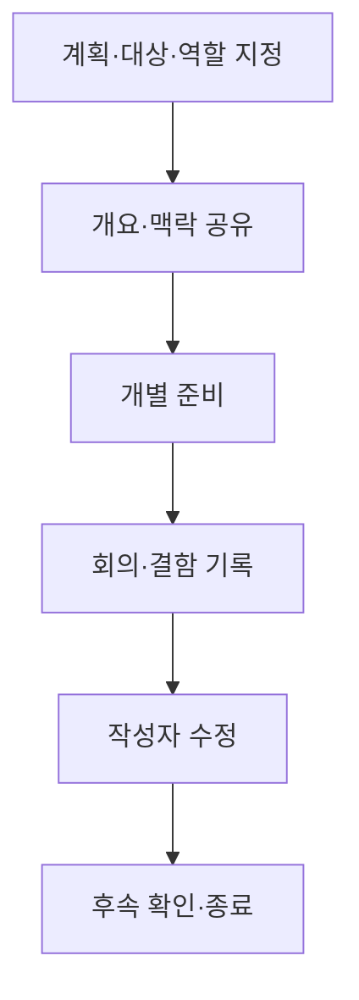
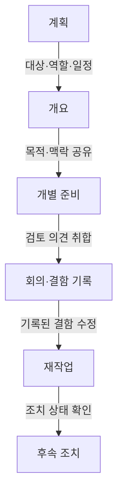

## 지식 로드맵 내 현재 위치

지식 위치: 소프트웨어 공학 → 소프트웨어 테스트·품질 → 정적 검토 → 인스펙션

## 30초 인출

- 본질: **인스펙션**은 작성자 외의 검토자가 산출물을 체계적으로 읽어 결함을 찾는 정형 동료 검토
- 메커니즘: 계획·개요·개별 준비·회의·재작업·후속 조치의 순서로 결함 기록과 수정 상태 확인
- 핵심: 회의에서는 결함 식별에 집중하고 해결책 논의와 작성자 평가는 분리

핵심 용어

- **인스펙션(Inspection)**: 정해진 역할·절차에 따라 산출물의 결함을 찾는 정형 검토
- **중재자(Moderator)**: 절차·회의를 진행하고 검토 규칙 준수를 관리하는 역할
- **낭독자(Reader)**: 검토 대상의 내용을 검토팀에 따라가며 제시하는 역할
- **결함 기록(Defect Log)**: 검토 중 발견한 결함의 위치·내용을 남기는 기록
- **진입·종료 기준(Entry·Exit Criteria)**: 검토 시작 가능 여부와 완료 여부를 판단하는 조건
- **IEEE 1028**: 소프트웨어 검토·감사 유형과 절차를 다룬 IEEE 표준

---

## 1교시 예상문제 (10점)

> 인스펙션의 정의와 목적, 핵심 역할 및 절차를 설명하시오. (예상)

---

## 1교시 10점 답안

### Ⅰ. 개요

| 구분 | 핵심 |
|---|---|
| 정의 | **인스펙션**은 작성자 외의 검토자가 정해진 역할·절차에 따라 산출물의 결함을 찾는 정형 검토 |
| 목적 | 실행 전 결함 발견과 검토 결과의 기록·수정을 통한 산출물 품질 향상 |

### Ⅱ. 주요 역할

| 역할 | 책임 |
|---|---|
| 중재자 | 검토 계획·회의 진행과 절차 준수 |
| 작성자 | 검토 대상 설명과 발견 결함 수정 |
| 낭독자 | 검토 대상 내용을 순서대로 제시 |
| 기록자 | 발견 결함을 기록 |
| 검토자 | 개별 준비와 결함 식별 |

### Ⅲ. 절차와 기본 원칙

회의에서는 결함을 식별하고 기록하며, 해결책 토론과 작성자 개인 평가는 별도 절차로 분리.

제언: 검토 대상·진입 조건·결함 후속 책임을 회의 전에 합의.

---

## 2~4교시 예상문제 (25점)

> 마이클 패건 인스펙션의 목적, 역할 및 기본 수행 절차를 설명하시오. (예상)

---

## 2~4교시 25점 답안

## Ⅰ. 개요

| 구분 | 핵심 |
|---|---|
| 정의 | **인스펙션**은 작성자 외의 검토자가 정해진 역할·절차에 따라 산출물의 결함을 찾는 정형 검토 |
| 목적 | 실행 전 결함 발견과 검토 결과의 기록·수정을 통한 산출물 품질 향상 |

인스펙션은 코드뿐 아니라 요구사항·설계 등 실행하지 않고 검토할 수 있는 산출물에도 적용 가능.

## Ⅱ. 수행 절차

## Ⅲ. 참여 역할과 책임

| 역할 | 수행 책임 | 구분할 점 |
|---|---|---|
| 중재자 | 절차·회의 진행, 규칙과 기준 관리 | 검토 내용의 작성자 평가 금지 |
| 작성자 | 산출물 맥락 설명, 기록된 결함 수정 | 방어보다 결함의 명확한 이해에 집중 |
| 낭독자 | 산출물 내용을 순서대로 제시 | 검토자의 독립적 확인 지원 |
| 기록자 | 결함 위치·내용·유형 기록 | 해결 의견과 결함 사실을 구분 |
| 검토자 | 개별 준비와 결함 탐색 | 산출물 기준의 객관적 검토 |

## Ⅳ. 검토 유형의 구분

| 유형 | 주된 목적·진행 특성 |
|---|---|
| 관리 검토 | 계획·진척·관리 상태와 의사결정 검토 |
| 기술 검토 | 기술적 적합성과 대안 검토 |
| 인스펙션 | 정해진 절차에 따른 결함 식별 |
| 워크스루 | 작성자가 주도해 내용을 설명하고 피드백·이해 공유 |
| 감사 | 기준·절차 준수 여부의 독립적 확인 |

IEEE 1028-2008은 위 다섯 유형의 검토·감사를 규정하며, 인스펙션은 그중 정형 동료 검토 유형.

## Ⅴ. 수행 위험과 통제

| 위험 | 대응 |
|---|---|
| 준비 부족으로 회의가 산출물 낭독에 그침 | 검토 자료·체크리스트 사전 배포와 진입 조건 확인 |
| 해결책 논쟁으로 결함 식별 시간이 줄어듦 | 회의 목적을 결함 기록에 한정하고 해결 논의는 후속 작업으로 분리 |
| 작성자에 대한 비난으로 결함 보고 위축 | 사람 대신 산출물·기준을 대상으로 검토 |
| 발견한 결함이 수정됐는지 추적되지 않음 | 담당자·조치 상태·후속 확인을 결함 기록에 연결 |

## Ⅵ. 기술사적 제언 — 위험 기반 검토 깊이 설정

| 문제 | 해결 방안 |
|---|---|
| 모든 산출물에 같은 회의 강도를 적용해 검토 자원이 분산될 가능성 | 영향도·변경 범위·안전·보안 중요도를 기준으로 대상과 검토 깊이를 정하고, 고위험 산출물은 정형 회의와 후속 확인 대상으로 지정 |

## 출제 이력과 검증 출처

- 공식 문제지 원문에서 확인한 직접 기출 없음
- [IEEE SA, IEEE 1028-2008: Software Reviews and Audits](https://standards.ieee.org/ieee/1028/4402/)
- Michael E. Fagan, “Design and Code Inspections to Reduce Errors in Program Development,” *IBM Systems Journal*, 1976

## 연결 토픽

- 연관 토픽: [품질 보증](./060_quality_assurance.md), [소프트웨어 테스트 원리](./070_software_testing_principles.md)
- 다음 토픽: [빠른 정렬](./059_quick_sort.md)
