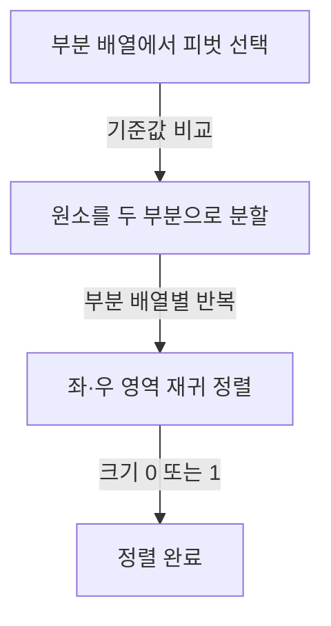
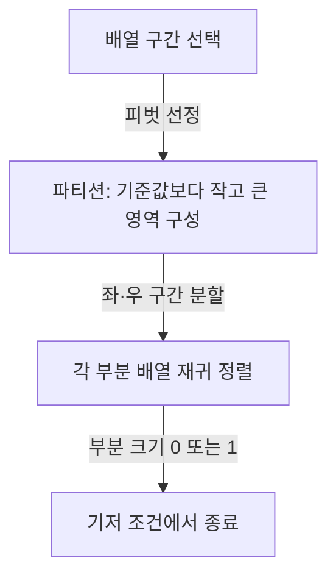

## 지식 로드맵 내 현재 위치

지식 위치: 소프트웨어 공학 → 자료구조·알고리즘 → 정렬 알고리즘 → 퀵 정렬

## 30초 인출

- 본질: **퀵 정렬**은 피벗을 기준으로 원소를 분할하고 부분 배열을 재귀 정렬하는 분할 정복 알고리즘
- 메커니즘: 피벗 선택 → 분할 → 좌·우 부분 문제 정렬
- 핵심: 평균 시간 O(n log n), 나쁜 분할이 반복되면 최악 O(n²), 피벗 선택과 재귀 깊이 관리가 중요

핵심 용어

- **퀵 정렬(Quick Sort)**: 피벗 기준 분할을 재귀 적용해 원소를 정렬하는 알고리즘
- **피벗(Pivot)**: 분할할 때 원소를 비교하는 기준값
- **파티션(Partition)**: 피벗 기준으로 원소를 두 부분으로 나누는 과정
- **호어 파티션(Hoare Partition)**: 양방향 포인터로 잘못 놓인 원소를 교환하며 분할 경계를 찾는 방식
- **로무토 파티션(Lomuto Partition)**: 한 방향으로 순회하며 피벗보다 작은 원소 영역을 유지하는 방식
- **인트로소트(Introsort)**: 퀵 정렬을 시작으로 재귀 깊이가 한계를 넘으면 힙 정렬로 전환하는 하이브리드 알고리즘

---

## 1교시 예상문제 (10점)

> 퀵 정렬의 정의와 목적, 동작 절차 및 시간복잡도를 설명하시오. (예상)

---

## 1교시 10점 답안

### Ⅰ. 개요

| 구분 | 핵심 |
|---|---|
| 정의 | **퀵 정렬**은 피벗 기준 분할을 재귀 적용해 원소를 정렬하는 분할 정복 알고리즘 |
| 목적 | 비교 기반 정렬을 수행하며 일반 입력에서 효율적인 평균 실행시간 제공 |

### Ⅱ. 분할·정복 절차

### Ⅲ. 시간 특성

| 경우 | 시간복잡도 | 원인 |
|---|---|---|
| 평균·균형 분할 | O(n log n) | 재귀 깊이가 로그 수준이고 각 단계에서 원소 비교·이동 |
| 최악·편향 분할 반복 | O(n²) | 한쪽 부분 배열만 거의 전체 크기로 남음 |

제언: 피벗 선택과 재귀 깊이 관리로 반복적인 편향 분할 방지.

---

## 2~4교시 예상문제 (25점)

> 퀵 정렬의 동작 원리와 Hoare·Lomuto 파티션을 비교하고, 평균·최악 복잡도 및 최악 수행시간을 관리하는 방법을 설명하시오. (예상)

---

## 2~4교시 25점 답안

## Ⅰ. 개요

| 구분 | 핵심 |
|---|---|
| 정의 | **퀵 정렬**은 피벗 기준 분할을 재귀 적용해 원소를 정렬하는 분할 정복 알고리즘 |
| 목적 | 비교 기반 정렬을 수행하며 일반 입력에서 효율적인 평균 실행시간 제공 |

## Ⅱ. 분할 정복 동작

피벗 자체의 최종 위치는 파티션 방식에 따라 다를 수 있으며, 호어 파티션의 반환 경계를 피벗 위치와 동일시하지 않음.

## Ⅲ. Hoare·Lomuto 파티션 비교

| 구분 | Hoare 방식 | Lomuto 방식 |
|---|---|---|
| 순회 | 양쪽에서 안쪽으로 이동하는 두 포인터 | 한쪽 방향 순회와 경계 포인터 |
| 교환 | 분할 기준의 반대편에 있는 원소를 교환 | 기준보다 작은 원소를 앞쪽 영역에 배치 |
| 결과 | 분할 경계를 반환하며 피벗이 그 위치에 있다는 보장은 방식 정의에 따름 | 일반 구현에서 피벗을 경계 위치에 배치 |
| 특징 | 불필요한 이동을 줄일 수 있으나 경계 규칙에 주의 | 구현이 비교적 단순하나 입력·구현에 따라 교환이 많아질 수 있음 |

## Ⅳ. 시간·공간복잡도

| 경우 | 재귀 형태 | 시간복잡도 |
|---|---|---|
| 균형 분할 | T(n)=2T(n/2)+Θ(n) | Θ(n log n) |
| 평균적 분할 | 두 하위 배열 크기가 매번 같지는 않음 | Θ(n log n) |
| 최악 분할 | T(n)=T(n−1)+Θ(n) | Θ(n²) |

퀵 정렬은 대체로 배열 안에서 교환하는 제자리 방식이며, 추가 공간은 재귀 호출 스택에 필요. 평균 재귀 깊이는 O(log n), 최악 깊이는 O(n).

## Ⅴ. 입력 특성에 따른 최악 수행 관리

| 상황 | 고려 방법 | 한계·주의 |
|---|---|---|
| 특정 위치 피벗의 반복 편향 | 무작위 피벗 또는 중앙값 기반 선택 | 최악 입력 가능성을 낮추지만 일반적으로 최악복잡도 보장 자체는 아님 |
| 재귀 깊이의 과도한 증가 | 재귀 깊이 한계 설정 후 힙 정렬로 전환하는 인트로소트 | 전환 기준은 구현 설계에 맞게 설정 |
| 동등 원소가 많은 입력 | 3-way partition 검토 | 분할 규칙·피벗 동등 영역 처리 필요 |
| 동점 원소의 기존 순서 보존 필요 | 안정 정렬 알고리즘 선택 | 기본 퀵 정렬은 안정 정렬이 아님 |

## Ⅵ. 기술사적 제언 — 입력에 대한 성능 상한 확보

| 한계 | 해결 방안 |
|---|---|
| 사용자 입력에 따라 피벗 분할이 반복해서 치우치면 실행시간과 재귀 깊이가 증가할 가능성 | 피벗 선택을 무작위화하거나 분할 편향을 감시하고, 재귀 깊이가 설정 한계에 도달하면 힙 정렬로 전환하는 하이브리드 전략 적용 |

## 출제 이력과 검증 출처

- 공식 문제지 원문에서 확인한 직접 기출 없음
- Charles A. R. Hoare, “Quicksort,” *The Computer Journal*, 1962
- [Open Data Structures, Quicksort](https://opendatastructures.org/ods-java/11_Quicksort.html)

## 연결 토픽

- 연관 토픽: [정렬 알고리즘 종합](./043_sort_algorithm.md), [선형 구조](./053_linear_structure.md)
