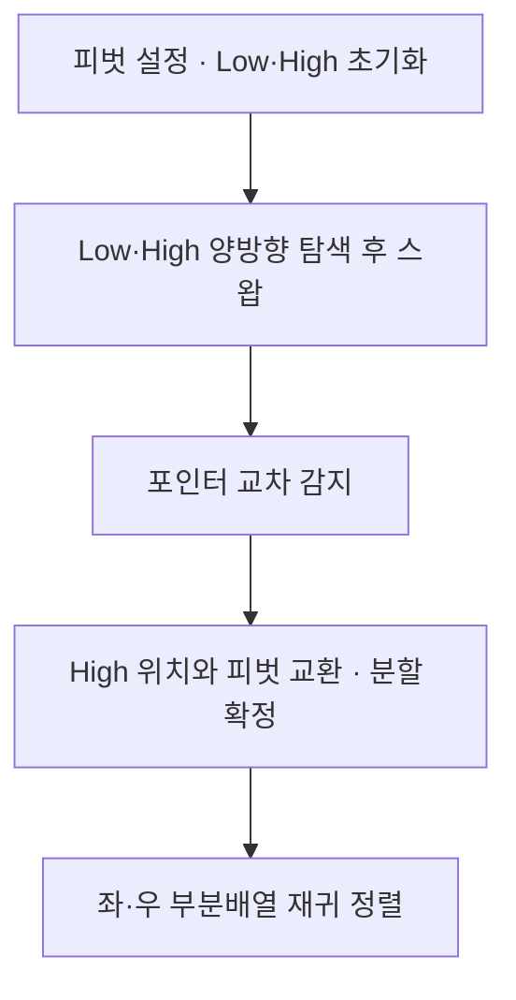
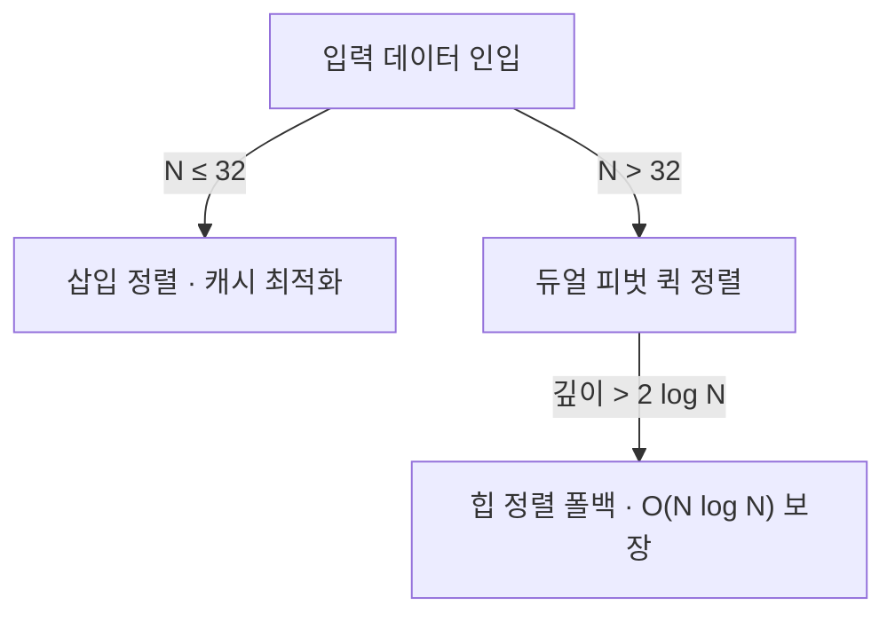

## 지식 로드맵 내 현재 위치

지식 위치: 소프트웨어공학 → 자료구조 및 알고리즘 → 정렬 알고리즘 → **퀵 정렬(Quick Sort)**
---

## 30초 인출

- 본질: 피벗(Pivot) 기준 비균등 분할 후 제자리(In-place) 재귀 정렬을 수행하는 분할 정복 (찰스 호어)
- 파티셔닝 전략: Hoare 파티션(양방향 포인터·스왑 최소) vs Lomuto 파티션(단방향 포인터·구현 단순)
- 복잡도·극복: 평균 $O(N \log N)$(캐시 적중률 최고) · 최악 $O(N^2)$(정렬/역순 입력 시 편향 트리) → 삼수중앙값(Median-of-Three) · 듀얼 피벗(Dual-Pivot) · 인트로소트(Introsort·힙 전환)으로 극복
---

| 핵심 용어 | 핵심 정의 및 특징 |
|---|---|
| **찰스 호어 (C. A. R. Hoare)** | 1959년 퀵 정렬 알고리즘 및 양방향 파티셔닝(Hoare Partition)을 창안한 컴퓨터 과학자 |
| **피벗 (Pivot)** | 데이터를 대·소 두 그룹으로 분할하기 위한 기준 원소 |
| **호어 파티션 (Hoare Partition)** | 양 끝 포인터가 중앙으로 이동하며 스왑을 수행하여 교환 횟수를 로무토의 1/3로 줄인 기법 |
| **삼수중앙값 (Median-of-Three)** | 첫째, 중간, 마지막 원소 중 중간값을 피벗으로 택해 최악 편향 분할을 방지하는 전략 |
| **인트로소트 (Introsort)** | 재귀 깊이가 일정 임계치($2 \log N$)를 넘어서면 힙 정렬로 전환하여 최악 $O(N \log N)$을 보장하는 하이브리드 기법 |
---

## 1교시 예상문제 (10점)

> 퀵 정렬(Quick Sort)의 정의와 목적, 핵심 구조와 작동 원리를 설명하시오. (예상)
---

## 1교시 10점 답안

- **퀵 정렬(Quick Sort)**은 기준 원소(Pivot)를 중심으로 작은 값과 큰 값을 좌우로 분할(Partitioning)한 후 재귀적으로 정렬하는 $O(N \log N)$ 분할 정복 알고리즘이다.
- 양방향 탐색 기반의 호어(Hoare) 파티션은 단방향 로무토(Lomuto) 대비 스왑 횟수를 3배 절감하며 뛰어난 캐시 지역성을 발휘한다. 이미 정렬된 배열 입력 시 $O(N^2)$로 퇴보하는 문제를 해결하기 위해 삼수중앙값(Median-of-Three) 피벗 선택 및 재귀 깊이에 따라 힙 정렬로 전환하는 인트로소트(Introsort) 기법이 현대 표준 라이브러리에 널리 채택되어 있다.
---

### 핵심 관계

---

## 2~4교시 예상문제 (25점)

> "분할 정복(Divide and Conquer) 기반의 퀵 정렬(Quick Sort)의 동작 메커니즘과 파티셔닝 전략(Hoare vs Lomuto)을 비교 설명하고, 최악 시간복잡도 $O(N^2)$ 퇴보 원인 및 이를 극복하기 위한 현대적 하이브리드 정렬 기법을 제시하시오."
---

> (25점, 예상)
---

## 2~4교시 25점 답안

### Ⅰ. 제자리 고속 정렬의 정점, 퀵 정렬의 개요

#### 1. 퀵 정렬의 정의
- 찰스 호어(C. A. R. Hoare)가 고안한 분할 정복(Divide and Conquer) 알고리즘으로, 기준 원소(Pivot)를 설정하여 작은 원소는 왼쪽, 큰 원소는 오른쪽으로 파티셔닝(Partitioning)한 뒤 재귀적으로 정렬하는 제자리(In-place) 고속 정렬 기법.

#### 2. 분할 정복 3단계 동작 원리
- **분할 (Divide)**: 피벗을 기준으로 좌측(피벗 이하)과 우측(피벗 이상)의 두 부분배열로 비균등 분할.
- **정복 (Conquer)**: 분할된 부분배열 크기가 1 이하가 될 때까지 재귀적으로 퀵 정렬 호출.
- **결합 (Combine)**: 제자리(In-place)에서 원소 배치가 완료되므로 병합 연산 없이 완료.
---

### Ⅱ. 퀵 정렬 파티셔닝 메커니즘 및 동작 절차

#### 1. 호어(Hoare) 파티셔닝 양방향 탐색 및 제자리 스왑 메커니즘

#### 2. 호어 파티션과 로무토 파티션 비교

| 구분 | 호어 파티션 (Hoare Partition) | 로무토 파티션 (Lomuto Partition) |
|---|---|---|
| **포인터 운용** | 양쪽 끝에서 중앙으로 서로 마주 보며 이동 (Low, High) | 동일 방향으로 두 포인터가 나란히 전진 ($i, j$) |
| **피벗 위치** | 첫 번째 또는 중간 원소 | 주로 마지막 원소 |
| **스왑 횟수** | 조건 불일치 시에만 교환 (평균 교환 횟수 로무토의 1/3) | 작은 원소를 만날 때마다 매번 교환 (오버헤드 큼) |
| **실무 적용** | 표준 C/C++ 라이브러리 및 고속 엔진 기본 채택 | 알고리즘 구현이 단순하여 교재 및 이론 교육용 |
---

### Ⅲ. 복잡도 분석 및 주요 정렬 알고리즘 비교

#### 1. 시간 및 공간 복잡도 특성
- **최선 복잡도 ($O(N \log N)$)**: 피벗이 매 단계 정확히 절반으로 균등 분할되는 경우 ($T(N) = 2T(N/2) + O(N)$).
- **평균 복잡도 ($O(N \log N)$)**: 무작위 입력에서 평균 $1.386 N \log_2 N$ 회 비교, 뛰어난 메모리 지역성(Locality)으로 실측 성능 최상.
- **최악 복잡도 ($O(N^2)$)**: 이미 정렬되었거나 역순인 배열에서 양 끝을 피벗으로 택해 편향 트리(Degenerate Tree)가 되는 경우 ($T(N) = T(N-1) + O(N)$).
- **공간 복잡도**: 제자리 정렬이나, 재귀 호출 스택 메모리로 $O(\log N)$ (최악 시 $O(N)$) 요구.

#### 2. 3대 $O(N \log N)$ 정렬 알고리즘 비교

| 정렬 알고리즘 | 평균 시간 | 최악 시간 | 추가 공간 | 안정성(Stable) | 캐시 친화도 및 특성 |
|---|---|---|---|---|---|
| **퀵 정렬 (Quick)** | $O(N \log N)$ | $O(N^2)$ | $O(\log N)$ (스택) | **불안정 (Unstable)** | **매우 높음 (연속 메모리 순차 참조)** |
| **병합 정렬 (Merge)** | $O(N \log N)$ | $O(N \log N)$ | $O(N)$ (임시배열) | **안정 (Stable)** | 보통 (추가 메모리 할당 오버헤드) |
| **힙 정렬 (Heap)** | $O(N \log N)$ | $O(N \log N)$ | $O(1)$ | 불안정 (Unstable) | 낮음 (배열 인덱스 점프 빈번) |
---

### Ⅳ. 퀵 정렬의 실무 위험 및 극복 전략

| 위험 | 대책 | 효과 |
|---|---|---|
| **정렬 완료된 대용량 데이터 입력 시 $O(N^2)$ 퇴보 및 스택 오버플로우** | 첫 원소 대신 삼수중앙값(Median-of-Three) 또는 무작위 난수 피벗(Randomized Pivot) 적용 | 편향 분할 발생 확률 0% 수렴 및 균등 분할 유도 |
| **악의적 킬러 시퀀스(Killer Sequence) 주입으로 인한 서비스 거부(DoS)** | 인트로소트(Introsort) 도입: 재귀 깊이가 $2 \log N$ 초과 시 힙 정렬로 자동 전환 | 최악의 악의적 패턴에서도 $O(N \log N)$ 보장 |
| **객체 정렬 시 동점자의 기존 순서 왜곡 (Unstable 특성)** | 다중 정렬 조건(Secondary Key)을 추가하거나 TimSort/병합 정렬로 대체 채택 | 동점자 순서 보존율 100% 확보 |
---

### Ⅴ. 기술사적 제언: 현대 표준 라이브러리의 하이브리드 정렬 거버넌스

### 학습자 통찰 메모 — 답안 밖

- [핵심 통찰]: 퀵 정렬이 빅오 수식이 같은 병합/힙 정렬보다 실제 2~3배 이상 빠른 본질적 이유는 '하드웨어 캐시 라인 적중률'임. 연속된 메모리 공간을 양방향으로 스위핑하기 때문에 CPU 프리페처(Prefetcher)와 L1/L2 캐시의 성능을 극한으로 뽑아냄. 현대 프로그래밍 언어의 런타임(Java, C++)은 순수 퀵소트를 쓰지 않고, 크기 32 이하는 삽입 정렬, 악의적 편향 시 힙 정렬 폴백(인트로소트), 대규모 시 듀얼 피벗 퀵소트를 결합함.
- 나라면: 실전 답안에서 알고리즘 복잡도 수식에 그치지 않고, L1/L2 캐시 지역성과 분기 예측(Branch Prediction) 관점을 제시하겠음. 또한 C++ std::sort의 인트로소트(Introsort) 아키텍처와 Java의 Dual-Pivot 전략을 3단락 차별화 포인트로 삼겠음.

### 실전 답안용 기술사적 제언
- **판정 기준**: 입력 데이터의 정렬 여부 추정치 및 재귀 호출 깊이가 임계치($2 \log_2 N$)를 초과하는지 여부를 기준으로 편향 악화(Degeneration) 위험을 판정함.
- **대응 방안**: 소규모 배열($N \le 32$)은 캐시 오버헤드가 적은 삽입 정렬을 적용하고, 대규모 원소는 삼수중앙값(Median-of-Three) 피벗을 적용하되 편향 감지 시 힙 정렬로 즉각 폴백(Fallback)하는 인트로소트(Introsort) 체계를 가동함.
- **검증 체계**: 단위 테스트 파이프라인에서 최악 패턴(이미 정렬, 역순, 모든 원소 동일) 데이터셋을 인입시켜 최대 실행 시간 및 콜스택 메모리 한계 초과 여부를 지속 모니터링함.
- **기대 효과**: 최악의 악의적 입력 주입 시에도 $O(N \log N)$의 상한 성능을 100% 보장하여 DoS 취약점을 원천 방어하고, 일반적인 입력 환경에서는 최고 수준의 캐시 적중률을 발휘함.

---

## 출제 이력 및 기출 분석

- **정보관리기술사**: 87회, 104회, 115회 (정렬 알고리즘 비교, 분할 정복 메커니즘, 퀵 정렬 최악 시간 극복)
- **컴퓨터시스템응용기술사**: 91회, 120회 (시간/공간 복잡도 분석, 캐시 친화도 관점에서의 정렬 성능 평가)
- **출제 경향성**: 퀵 정렬의 단순 분할 절차뿐만 아니라 파티셔닝(Hoare vs Lomuto) 방식의 차이, 하드웨어 캐시 적중 관점, 그리고 $O(N^2)$ 퇴보 방지를 위한 인트로소트(Introsort) 등 현대적 하이브리드 기법을 함께 서술할 때 최고 점수가 주어짐.
---

## 실전 작성 팁 & 감점 방지

- **호어 파티션의 포인터 교차 도해**: Low와 High 포인터가 서로 교차할 때 High 위치와 피벗을 교환한다는 사실을 도식으로 명확히 표현할 것.
- **불안정 정렬(Unstable) 명시**: 퀵 정렬은 비인접 원소 간 교환이 일어나므로 동점자의 원래 순서가 보장되지 않는다는 불안정 정렬 특성을 반드시 기재할 것.
- **실무 하이브리드 언급**: Java의 Dual-Pivot QuickSort, C++의 Introsort를 3단락 차별화 포인트로 제시할 것.
---

## 연결 토픽

- [정렬 알고리즘 종합](./043_sort_algorithm.md) : 다양한 정렬 알고리즘의 복잡도 및 안정성 비교
- [선형 구조](./053_linear_structure.md) : 배열 및 연결 리스트에서의 탐색/정렬 효율성 분석
