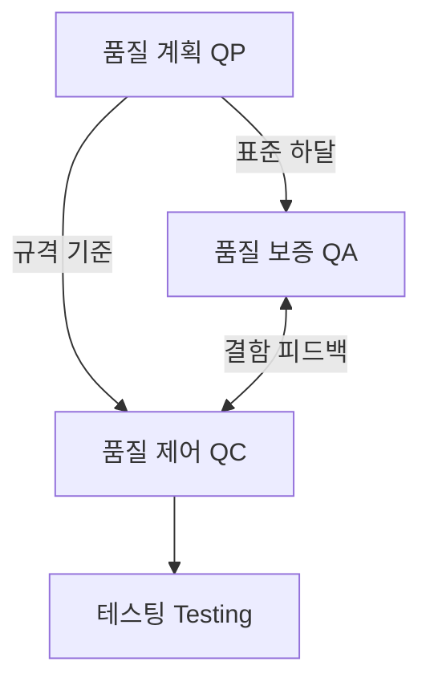
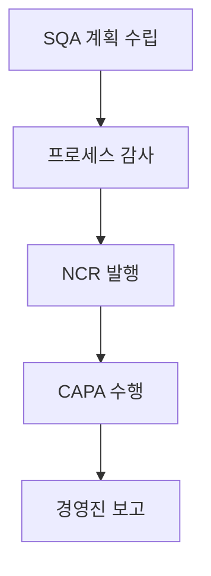

## 지식 로드맵 내 현재 위치

지식 위치: 소프트웨어공학 → 소프트웨어 테스트 및 품질 → 품질 경영 및 관리 → **소프트웨어 품질보증(SQA)**
---

## 30초 인출

- 본질: **소프트웨어 품질보증(SQA)**은 개발 전 생애주기에 걸쳐 정의된 프로세스와 표준의 준수를 독립된 제3자가 감사해 결함을 사전에 예방하는 활동
- 메커니즘: 품질 계획(QP) 수립 → 프로세스 감사 → 부적합 보고서(NCR) 발행 → 시정·예방 조치(CAPA) → 경영진 보고
- 판정 기준: PM이 아닌 최고경영진 직속 독립 편제와 배포 거부권(Veto Power) 확보 여부

핵심 용어

- **소프트웨어 품질보증(SQA: Software Quality Assurance)**: 생애주기 전반에 걸쳐 정의된 프로세스와 표준의 준수 여부를 체계적으로 감사·예방하는 활동
- **품질 경영 3대 축(QP · QA · QC)**: 품질 목표를 수립(QP)하고, 프로세스를 감사·보증(QA)하며, 최종 산출물의 규격을 검증(QC)하는 프레임워크
- **부적합 보고서(NCR: Non-Conformance Report)**: 프로세스 감사 또는 제품 검토 중 발견된 표준 미준수 및 중대 결함을 공식 통보하는 문서
- **시정 및 예방 조치(CAPA: Corrective and Preventive Action)**: 근본 원인 분석(RCA)을 바탕으로 결함을 시정하고 동종 결함의 재발을 차단하는 개선 체계
- **조직적 독립성(Organizational Independence)**: PM의 통제에서 벗어나 CTO 직속으로 배포 거부권(Veto Power)을 행사하는 체계

---

## 1교시 예상문제 (10점)

> 소프트웨어 품질보증(SQA)의 정의와 목적, 핵심 구조와 작동 원리를 설명하시오. (예상)
---

## 1교시 10점 답안

- **소프트웨어 품질보증(SQA)**은 소프트웨어 전 생애주기 동안 정의된 프로세스와 표준이 적절히 준수되는지 감시하여 결함을 사전에 예방(Prevention)하는 활동이다.
- 산출물의 규격 합격을 검사하는 **품질 제어(QC)** 및 코드를 동적으로 실행해 결함을 찾는 **테스팅(Testing)**과 명확히 구분되며, SQA 계획 수립 $\rightarrow$ 프로세스 감사 $\rightarrow$ 부적합 보고서(NCR) $\rightarrow$ 시정/예방 조치(CAPA)의 절차로 순환한다. 성공적인 SQA를 위해서는 PM으로부터 독립된 CTO 직속 편제와 배포 거부권(Veto Power)이 보장되어야 한다.
---

### 핵심 관계

---

## 2~4교시 예상문제 (25점)

> "소프트웨어 품질보증(SQA)의 개념과 품질 경영 3대 축(QP, QA, QC)의 상호 관계를 설명하고, QA, QC, Testing의 차이점 및 SQA 조직의 독립성 확보 전략과 현대적 CI/CD 파이프라인 기반 품질 게이트(Quality Gate) 구현 방안을 제시하시오."
---

> (25점, 예상)
---

## 2~4교시 25점 답안

### Ⅰ. 프로세스 중심 결함 예방 체계, 소프트웨어 품질보증(SQA)의 개요

#### 1. SQA의 정의
- 소프트웨어 제품이 명시된 요구사항을 만족하고 고품질을 달성할 수 있도록, **소프트웨어 개발 전 생애주기 동안 정의된 표준, 절차, 방법론이 적절히 준수되는지 독립된 제3자의 시각에서 체계적으로 감시·평가하고 개선하는 활동**.

#### 2. SQA의 핵심 철학과 필요성
- **결함 예방(Prevention) 중심**: 사후 테스트 중심의 결함 제거 한계를 극복하고 초기 공정부터 프로세스 품질을 통제.
- **철학적 기반**: "좋은 프로세스가 좋은 제품을 만든다(Good Process produces Good Product)".
---

### Ⅱ. 품질 경영 3대 축 및 QA vs QC vs Testing 비교

#### 1. 품질 경영 3대 축(QP, QA, QC)의 유기적 연계 및 피드백 구조

#### 2. QA vs QC vs Testing 3자 명확한 비교

| 비교 항목 | 품질 보증 (QA: Assurance) | 품질 제어 (QC: Control) | 소프트웨어 테스팅 (Testing) |
|---|---|---|---|
| **통제 대상** | **프로세스 (Process)** | **산출물/제품 (Product)** | **실행 코드 (Running Software)** |
| **핵심 목적** | 결함 생성 **사전 예방 (Prevention)** | 규격 불일치 **사후 검출 (Detection)** | 동적 결함 **식별 및 보고 (Identification)** |
| **수행 주체** | 독립된 SQA 조직 / 품질 감사관 | 프로젝트 개발팀 / 피어 리뷰어 | 전문 테스터 / QA 엔지니어 |
| **핵심 활동** | 프로세스 감사, CMMI/SPICE 심사 | 코드 인스펙션, 산출물 정적 검토 | 단위/통합/시스템/성능 테스트 수행 |
| **철학적 질문** | *"올바른 방법으로 만들고 있는가?"* | *"규격에 맞는 산출물이 작성되었는가?"* | *"요구한 기능과 성능대로 동작하는가?"* |
---

### Ⅲ. SQA 핵심 5단계 프로세스 및 조직적 독립성

#### 1. SQA 수행 5단계 절차

1. **SQA 계획 수립 (SQA Planning)**: 품질 목표, 감사 일정, 모니터링 대상 공정, 정량적 품질 지표(Metric) 확정.
2. **프로세스 및 산출물 감사 (Auditing)**: 개발 단계별 산출물이 표준 템플릿과 방법론 절차를 준수하는지 정기/수시 감사.
3. **부적합 보고서 발행 (NCR: Non-Conformance Report)**: 프로세스 위반 사항 및 품질 미달 항목 공식 발행.
4. **시정 및 예방 조치 (CAPA)**: 근본 원인 분석(RCA, 5-Whys)을 통해 재발 방지 대책을 수립하고 이행 검증.
5. **경영진 보고 및 종결 (Reporting & Closeout)**: 미결 부적합 사안을 최고경영진에게 보고하고 완결 확인 후 종료.

#### 2. SQA 조직의 위상 및 독립성 확보 체계
- **보고 체계 분리**: 프로젝트 관리자(PM) 하위가 아닌, **최고경영진(CEO/CTO) 직속 독립 조직**으로 편제.
- **배포 거부권(Veto Power)**: 품질 기준 미달 산출물에 대해 운영 환경 배포를 즉각 중단시킬 수 있는 법적·제도적 전결 권한 부여.
---

### Ⅳ. 소프트웨어 품질보증 추진 시 발생 위험 및 대응 전략

| 위험 | 대책 | 효과 |
|---|---|---|
| **PM의 납기 우선 압박으로 인한 QA 승인 강제 및 결함 은폐** | CTO 직속 독립 SQA 조직 편제 및 배포 거부권(Veto Power) 공식화 | 납기 압박에 따른 품질 타협 차단 |
| **수작업 종이 문서 중심 감사로 인한 형식적 '문서 경찰' 전락** | CI/CD 파이프라인 기반 자동 품질 게이트(SonarQube 등) 구축 | 감사 마찰 축소 및 실질 코드 품질 확보 |
| **부적합 사항에 대한 땜질식 처방으로 동종 결함 반복 재발** | 5-Whys 기반 근본 원인 분석(RCA) 및 CAPA 프로세스 의무화 | 동일 유형 부적합 재발 차단 |
| **애자일 스프린트 속도를 SQA 심사 절차가 따라가지 못하는 병목** | Shift-Left 테스트 자동화 및 개발자를 위한 '품질 코칭' 조직 전환 | 배포 리드타임 유지 및 품질 내재화 동시 달성 |
---

### Ⅴ. 기술사적 제언: 현대적 DevQualOps 및 자동화 품질 게이트 거버넌스

### 학습자 통찰 메모 — 답안 밖

- `[핵심 통찰]`: SQA의 본질은 "프로세스가 올바르면 제품 결함은 자연히 최소화된다"는 예방(Prevention) 철학이다. 과거 SQA가 '문서 경찰' 취급을 받으며 개발자와 대립했던 이유는 실질 코드 품질보다 종이 산출물 준수 여부에 매몰되었기 때문이며, 현대 SQA는 CI/CD 품질 게이트와 CTO 직속 배포 거부권(Veto Power)이 결합될 때 실효성을 갖는다.
- `나라면`: 실전 답안에서 QA(프로세스·예방) vs QC(제품·검출) vs Testing(동적 실행·적출)의 3자 책임 매트릭스를 선명히 대조하고, 최근 136회에 부각된 PM 종속 탈피(CTO 직속 배포 거부권)와 자동화 품질 게이트를 핵심 해법으로 제시하겠다.

### 실전 답안용 기술사적 제언
- **판정 기준**: CI/CD 파이프라인 상 정적 분석 품질 게이트(테스트 커버리지, Blocker/Critical 취약점 기준) 통과 여부 및 SQA 부적합 보고서(NCR) 미결 상태를 기준으로 배포 적합성을 판정함.
- **대응 방안**: PM 조직과 분리된 CTO 직속 독립 SQA 체계를 가동하여 미결 NCR 발생 시 배포 거부권(Veto Power)을 발동하고, 5-Whys 기반 CAPA(시정/예방 조치) 완료 후 재심사 절차를 진행함.
- **검증 체계**: 개발 단계별 산출물 표준 준수 감사와 SonarQube/Snyk 연동 정량 지표 대시보드를 이원화하여 프로세스 감사와 코드 품질 검증을 상시 동기화함.
- **기대 효과**: 형식적 문서 위주 감사 마찰을 줄이고, 출시 후 운영 결함 누출을 억제하며 조직 내 결함 은폐 문화를 차단함.
---

## 출제 이력 및 기출 분석

- **정보관리기술사**: 92회, 108회, 120회, 136회 (SQA 조직의 독립성, 감사 프로세스 NCR/CAPA, QA vs QC vs Testing 비교)
- **컴퓨터시스템응용기술사**: 100회, 114회, 128회 (품질 경영 3축, 프로세스 품질 모델 CMMI/SPICE 연계)
- **출제 경향성**: 단순 SQA 정의 나열을 넘어 QA/QC/Testing의 3자 책임 매트릭스 비교, 최근 136회에 강조된 SQA 조직의 독립적 위상과 배포 거부권, 그리고 CI/CD 품질 게이트와의 연계 방안을 제시해야 고득점 획득 가능.
---

## 실전 작성 팁 & 감점 방지

- **QA와 QC의 혼용 방지**: QA는 '프로세스/예방', QC는 '산출물/검출'이라는 명확한 키워드 대비표를 반드시 제시할 것.
- **NCR과 CAPA 누락 주의**: 프로세스 감사의 핵심 실무 산출물인 부적합 보고서(NCR)와 원인 분석 기반 재발 방지책(CAPA)을 절차도에 반드시 포함할 것.
- **조직적 독립성 강조**: PM 종속 탈피와 최고경영진 직속 보고 라인의 필요성을 3단락 또는 4단락에서 반드시 언급할 것.
---

## 연결 토픽

- [인스펙션(Inspection)](./058_inspection.md) : 프로세스 품질 준수를 검증하는 정형 검토 기법
- [소프트웨어 테스트 원리](./070_software_testing_principles.md) : 테스팅의 7대 원칙 및 결함 예방 원리
- [GS인증](./080_good_software_certification.md) : ISO/IEC 25023 기반 공인 소프트웨어 제품 품질 인증
