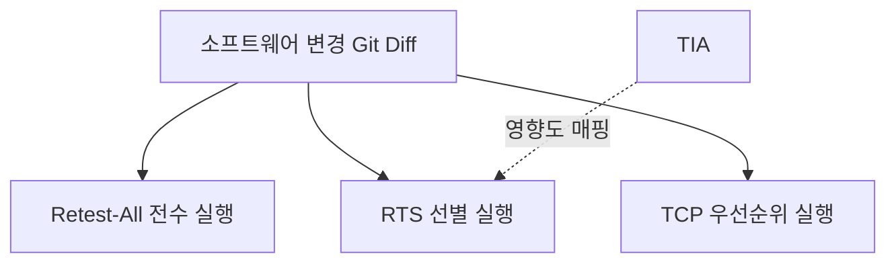
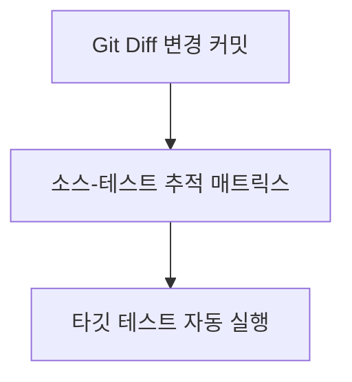

## 지식 로드맵 내 현재 위치

지식 위치: 소프트웨어공학 → 소프트웨어 테스트 및 품질 → 소프트웨어 테스팅 → **회귀테스트(Regression Test)**
---

## 30초 인출

- 본질: **회귀테스트(Regression Test)**는 코드 수정·리팩토링 후 기존 정상 기능에 부작용(Side Effect)이 생기지 않았음을 검증하는 반복 테스트
- 메커니즘: 변경 커밋 → 테스트 영향도 분석(TIA)으로 변경 연관 테스트 도출 → 전수·선별·우선순위 전략 중 선택 실행
- 판정 기준: 재테스트(결함 수정 확인)와 회귀(사이드 이펙트 검증)의 구분 및 전략별 비용·누락 위험 트레이드오프

핵심 용어

- **회귀테스트(Regression Test)**: 소프트웨어 변경 후 기존 정상 기능에 부작용(Side Effect)이 발생하지 않았음을 검증하는 반복 테스트
- **재테스트(Retest / Confirmation Test)**: 발견된 특정 결함이 올바르게 수정되었는지를 직접 확인하기 위해 해당 테스트를 다시 실행하는 활동
- **RTS(Regression Test Selection)**: 코드 변경점의 영향 범위(Impact Domain)를 분석하여 관련된 테스트 케이스만 선별 실행하는 전략
- **TCP(Test Case Prioritization)**: 제한된 시간 내 결함 검출 효율을 극대화하기 위해 위험도와 실패 이력 순으로 테스트를 정렬 실행하는 기법
- **테스트 영향도 분석(TIA: Test Impact Analysis)**: Git Diff, 정적 구문 트리(AST), 코드 커버리지를 연계하여 변경된 코드에 매핑된 테스트만 도출하는 기술

---

## 1교시 예상문제 (10점)

> 회귀테스트(Regression Test)의 정의와 목적, 핵심 구조와 작동 원리를 설명하시오. (예상)

---

## 1교시 10점 답안

- **회귀테스트(Regression Test)**는 코드 수정이나 환경 변화 후 기존 정상 동작 기능에 부작용(Side Effect)이 발생하지 않았음을 검증하기 위해 기존 테스트 케이스를 재수행하는 활동이다.
- 특정 결함의 수정 여부를 직접 확인하는 **재테스트(Retest)**와 구분되며, 전체를 다시 수행하는 **Retest-All**, 변경 연관분만 선별하는 **RTS**, 위험도 높은 순으로 정렬 실행하는 **TCP** 전략이 있다. 최근에는 Git Diff와 AST 기반의 테스트 영향도 분석(TIA)을 CI/CD에 접목하여 수분 내에 회귀 검증을 완결하는 자동화 체계가 필수적이다.
---

### 핵심 관계

---

## 2~4교시 예상문제 (25점)

> "소프트웨어 변경 및 리팩토링 과정에서 품질 저하를 방지하기 위한 회귀테스트(Regression Test)의 개념과 재테스트(Retest)와의 차이점을 비교하고, 회귀테스트 3대 전략(Retest-All, RTS, TCP)과 TIA 기반의 지속적 회귀 테스트 파이프라인 구축 방안을 제시하시오."

---

> (25점, 예상)

---

## 2~4교시 25점 답안

### Ⅰ. 부작용(Side Effect) 차단의 방파제, 회귀테스트의 개요

#### 1. 회귀테스트의 정의
- 기능 추가, 결함 수정(Bug Fix), 환경 변경 또는 리팩토링 후, **이전에 정상 작동하던 기존 기능에 의도치 않은 오류나 부작용(Side Effect)이 발생하지 않았음을 입증하기 위해 기존 테스트 케이스를 재수행하는 활동**.

#### 2. 재테스트(Retest) vs 회귀테스트(Regression Test) 비교

| 비교 항목 | 재테스트 (Retest / Confirmation) | 회귀테스트 (Regression Test) |
|---|---|---|
| **주요 목적** | 특정 결함의 수정 여부 확인 | 수정으로 인한 다른 정상 기능의 부작용(Side Effect) 유무 검증 |
| **테스트 대상** | 결함이 발견되었던 특정 코드 및 모듈 | 결함 수정 모듈과 직간접 의존성이 있는 전체/연관 시스템 |
| **테스트 케이스** | 결함을 적출했던 특정 실패 테스트 케이스 | 이전에 성공 통과했던 기존 테스트 케이스 스위트 |
| **수행 시점** | 개발자가 결함 조치 완료를 통보한 직후 | 결함 조치 통과 후, 통합 빌드 및 릴리즈 전 주기적 수행 |
---

### Ⅱ. 3대 회귀테스트 전략 및 구조적 비교

#### 1. 회귀테스트 3대 전략(Retest-All, RTS, TCP) 메커니즘

#### 2. 회귀테스트 3대 전략 상세 비교

| 전략명 | 핵심 메커니즘 | 장점 | 단점 및 리스크 | 주 적용 환경 |
|---|---|---|---|---|
| **Retest-All (전수 실행)** | 기존 구축된 테스트 스위트 전체를 재실행 | 결함 누락 위험 최소, 품질 신뢰도 최고 | 테스트 규모 증가 시 실행 시간/비용 마비 | 메이저 릴리즈, 주말/야간 정기 빌드 |
| **RTS (선택적 실행)** | 변경 코드와 연관된 테스트 케이스만 선별 실행 | 실행 시간 획기적 단축, 빠른 피드백 | 의존성 추적 누락 시 잠재 결함 유출 위험 | 일상 PR 검증, CI 파이프라인 |
| **TCP (우선순위화)** | 결함 검출률, 위험도, 최근 실패율 순으로 정렬 실행 | 타임박스(Timebox) 제약 내 최대 결함 적출 | 정렬 알고리즘 비용 발생, 후순위 결함 지연 | 긴급 핫픽스, 배포 직전 스모크 테스트 |
---

### Ⅲ. 테스트 영향도 분석(TIA) 메커니즘

1. **정적 TIA (Static Test Impact Analysis)**: 추상 구문 트리(AST)를 분석하여 변경된 클래스/함수를 직간접 호출하는 상위 의존성 그래프를 추적.
2. **동적 TIA (Dynamic Test Impact Analysis)**: 이전 테스트 실행 시 바이트코드 레벨에서 수집된 코드 커버리지 데이터를 바탕으로, 변경된 라인을 통과하는 테스트를 역추적(Reverse Mapping).
3. **CI/CD 파이프라인 연계**: 전체 테스트 스위트 중 변경 연관 테스트만 자동 실행하여 개발 피드백 루프를 극대화.
---

### Ⅳ. 회귀테스트 운용 시 발생 위험 및 대응 전략

| 위험 | 대책 | 효과 |
|---|---|---|
| **버그 수정 후 타 모듈 연쇄 장애로 운영 사고 발생** | 핵심 비즈니스 크리티컬 패스(Golden Path)에 대한 자동화 회귀 테스트 게이트 의무화 | 운영 환경 회귀 결함 유출 차단 |
| **테스트 케이스 누적으로 빌드 시간이 수 시간으로 폭증** | 테스트 피라미드 재편(단위 중심 비중 재조정) 및 TIA 기반 RTS 적용 | PR 빌드 검증 시간 대폭 단축 |
| **코드 변경이 없음에도 간헐적 실패(Flaky Test) 빈발** | 비동기 네트워크 지연 격리를 위한 Testcontainers 모킹 및 격리 쿼런틴(Quarantine) 운영 | 가짜 경보(False Positive) 제거 및 CI 신뢰성 회복 |
| **잦은 UI 변경으로 인한 E2E 회귀 테스트 유지보수 한계** | 페이지 객체 모델(POM) 패턴 적용 및 비즈니스 로직 검증의 API 레이어 하향 이관 | 테스트 스크립트 수정 공수 절감 |
---

### Ⅴ. 기술사적 제언: 하이브리드 회귀 테스트 거버넌스 및 CI/CD 파이프라인

### 학습자 통찰 메모 — 답안 밖

- `[핵심 통찰]`: 소프트웨어 수정 장애의 상당수는 "고쳤더니 엉뚱한 다른 기능이 깨지는" 부작용(Side Effect)에서 발생한다. 그러나 모든 커밋마다 전체 테스트를 실행할 수는 없으므로, 일상 PR 검증에는 TIA 기반 RTS(선별 실행), 야간에는 Retest-All(전수 검증), 긴급 핫픽스에는 TCP(우선순위 실행)를 조합하는 3계층 하이브리드 전략이 핵심이다.
- `나라면`: 실전 답안에서 재테스트(Retest)와 회귀테스트(Regression)의 차이를 1단락에서 엄밀히 규정하고, 2단락에서 Retest-All vs RTS vs TCP의 비용적 트레이드오프를 도식화한 후, 현대 CI/CD 환경에서의 TIA(Test Impact Analysis) 도구 연동과 Flaky Test 쿼런틴 격리 방안을 결론으로 제언하겠다.

### 실전 답안용 기술사적 제언
- **판정 기준**: 커밋 및 PR의 변경 코드 범위(Git Diff), 변경 모듈의 위험 등급(결제/보안 등 Core 여부), 파이프라인 타임박스 제약 시간을 기준으로 회귀 테스트 전략을 자동 라우팅함.
- **대응 방안**: 일상 PR 생성 시 TIA 기반 RTS(Regression Test Selection)로 빠른 피드백을 완료하고, 주말/야간에는 컴퓨팅 자원을 집중 투입하여 Retest-All 전수 회귀를 돌리며, 핫픽스 상황에는 TCP(Test Case Prioritization)로 위험도 상위 테스트를 우선 수행함.
- **검증 체계**: 간헐적 타이밍 이슈로 발생하는 가짜 경보(Flaky Test)를 감지하여 쿼런틴(Quarantine) 샌드박스로 즉시 격리하고, 비동기 호출 모킹 및 Testcontainers를 통해 신뢰도를 검증함.
- **기대 효과**: CI 파이프라인 빌드 대기 시간을 단축하면서도, 운영 환경 회귀 결함 유출을 억제함.
---

## 출제 이력 및 기출 분석

- **정보관리기술사**: 81회, 96회, 110회, 125회 (회귀테스트 정의, 3대 전략 Retest-All/RTS/TCP 비교, 테스트 자동화)
- **컴퓨터시스템응용기술사**: 102회, 118회 (회귀테스트와 재테스트 비교, TIA 및 CI/CD 파이프라인 연계)
- **출제 경향성**: 재테스트와의 개념 대비를 서두에 명확히 하고, RTS/TCP의 수학적·공학적 트레이드오프, 그리고 실무적인 빌드 시간 단축을 위한 TIA(Test Impact Analysis) 도구 연계 모델을 제시할 때 최고 득점으로 연결됨.
---

## 실전 작성 팁 & 감점 방지

- **재테스트와의 구별 명확화**: 재테스트(결함 해결 확인)와 회귀테스트(부작용 검증)를 혼동하여 서술하면 큰 감점 요인이 됨.
- **3대 전략의 명칭 암기**: Retest-All, RTS(Selection), TCP(Prioritization)의 3대 영문 약어와 매커니즘을 정확히 기재할 것.
- **Flaky Test 해결책 제시**: 3단락에서 회귀 테스트 자동화의 가장 큰 적인 간헐적 실패(Flaky Test)에 대한 격리(Quarantine) 대책을 제시하면 기술사적 식견이 돋보임.
---

## 연결 토픽

- [변이 테스트(Mutation Testing)](./084_mutation_test.md) : 회귀 테스트 스위트의 결함 검출 능력을 평가하는 기법
- [소프트웨어 테스트 원리](./070_software_testing_principles.md) : 결함 집중 및 살충제 패러독스 극복 원리
- [동적 테스트](./072_dynamic_testing.md) : 블랙박스 및 화이트박스 기반의 테스트 실행 체계
