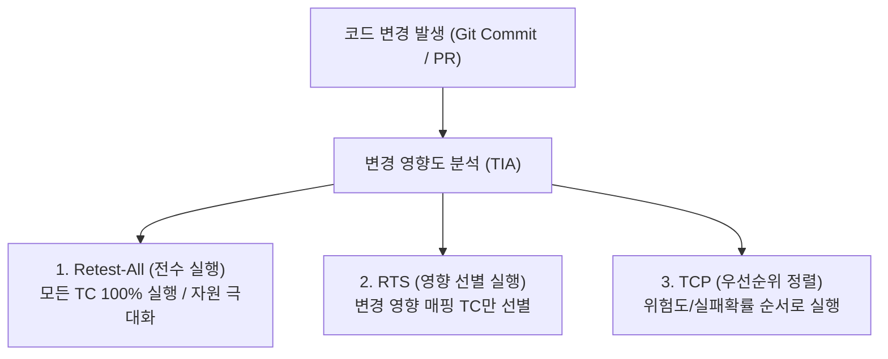
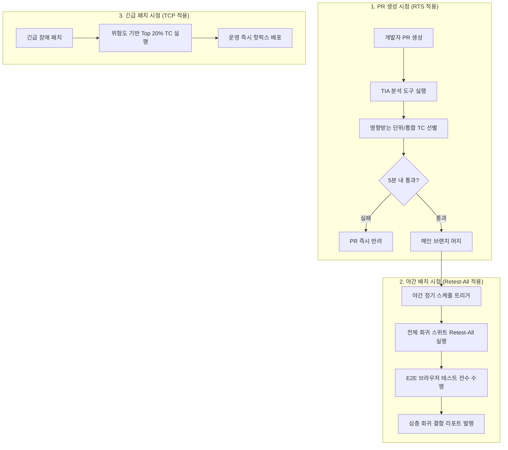

> **로드맵 경로**: 소프트웨어공학 > 소프트웨어 테스트 및 품질 > 소프트웨어 테스팅 > 회귀테스트(Regression Test)

---

## 큰 그림과 30초 인출

```text
[회귀테스트(Regression Test)]
 ├── 본질: 코드 수정/리팩토링 후 기존 정상 기능의 의도치 않은 결함(Side Effect) 발생 방지
 ├── 3대 전략: Retest-All(전수 실행/안전/비용 큼) vs RTS(선택/변경 영향부만) vs TCP(우선순위/위험도순)
 ├── TIA(Test Impact Analysis): Git Diff 및 AST 정적/동적 프로파일링으로 변경 연관 TC 선별
 └── 거버넌스: PR 단위 TIA-RTS(5분 피드백) + 야간 Nightly Retest-All + 핫픽스 TCP 하이브리드 체계
```

- **30초 인출 구호**: "재테스트는 결함확인, 회귀는 사이드이펙트! 전수(Retest-All)-선택(RTS)-우선순위(TCP), TIA 기반 5분 피드백!"

---

## 핵심 용어 (5개 내외)

| 핵심 용어 | 영문 표기 | 핵심 정의 및 특징 |
|---|---|---|
| **회귀테스트** | Regression Test | 소프트웨어 변경 후 기존 정상 기능에 부작용(Side Effect)이 발생하지 않았음을 검증하는 반복 테스트 |
| **재테스트** | Retest / Confirmation Test | 발견된 특정 결함이 올바르게 수정되었는지를 직접 확인하기 위해 해당 테스트를 다시 실행하는 활동 |
| **RTS** | Regression Test Selection | 코드 변경점의 영향 범위(Impact Domain)를 분석하여 관련된 테스트 케이스만 선별 실행하는 전략 |
| **TCP** | Test Case Prioritization | 제한된 시간 내 결함 검출 효율을 극대화하기 위해 위험도와 실패 이력 순으로 테스트를 정렬 실행하는 기법 |
| **테스트 영향도 분석** | TIA (Test Impact Analysis) | Git Diff, 정적 구문 트리(AST), 코드 커버리지를 연계하여 변경된 코드에 매핑된 테스트만 도출하는 기술 |

---

## 25점형 답안 프레임워크

### [예상 문제]
> "소프트웨어 변경 및 리팩토링 과정에서 품질 저하를 방지하기 위한 회귀테스트(Regression Test)의 개념과 재테스트(Retest)와의 차이점을 비교하고, 회귀테스트 3대 전략(Retest-All, RTS, TCP)과 TIA 기반의 지속적 회귀 테스트 파이프라인 구축 방안을 제시하시오."

---

### Ⅰ. 부작용(Side Effect) 차단의 방파제, 회귀테스트의 개요

#### 1. 회귀테스트의 정의
- 기능 추가, 결함 수정(Bug Fix), 환경 변경 또는 리팩토링 후, **이전에 정상 작동하던 기존 기능에 의도치 않은 오류나 부작용(Side Effect)이 발생하지 않았음을 입증하기 위해 기존 테스트 케이스를 재수행하는 활동**.

#### 2. 재테스트(Retest) vs 회귀테스트(Regression Test) 비교

| 비교 항목 | 재테스트 (Retest / Confirmation) | 회귀테스트 (Regression Test) |
|---|---|---|
| **주요 목적** | 특정 결함의 수정 여부 확인 | 수정으로 인한 다른 정상 기능의 부작용(Side Effect) 유무 검증 |
| **테스트 대상** | 결함이 발견되었던 특정 코드 및 모듈 | 결함 수정 모듈과 직간접 의존성이 있는 전체/연관 시스템 |
| **테스트 케이스** | 결함을 적출했던 특정 실패 테스트 케이스 | 이전에 성공 통과했던 기존 테스트 케이스 스위트 |
| **수행 시점** | 개발자가 결함 조치 완료를 통보한 직후 | 결함 조치 통과 후, 통합 빌드 및 릴리즈 전 주기적 수행 |

---

### Ⅱ. 3대 회귀테스트 전략 및 구조적 비교

#### 1. 회귀테스트 3대 전략 메커니즘



#### 2. 회귀테스트 3대 전략 상세 비교

| 전략명 | 핵심 메커니즘 | 장점 | 단점 및 리스크 | 주 적용 환경 |
|---|---|---|---|---|
| **Retest-All (전수 실행)** | 기존 구축된 테스트 스위트 전체를 재실행 | 결함 누락 위험 0%, 품질 신뢰도 최고 | 테스트 규모 증가 시 실행 시간/비용 마비 | 메이저 릴리즈, 주말/야간 정기 빌드 |
| **RTS (선택적 실행)** | 변경 코드와 연관된 테스트 케이스만 선별 실행 | 실행 시간 획기적 단축, 빠른 피드백 | 의존성 추적 누락 시 잠재 결함 유출 위험 | 일상 PR 검증, CI 파이프라인 |
| **TCP (우선순위화)** | 결함 검출률, 위험도, 최근 실패율 순으로 정렬 실행 | 타임박스(Timebox) 제약 내 최대 결함 적출 | 정렬 알고리즘 비용 발생, 후순위 결함 지연 | 긴급 핫픽스, 배포 직전 스모크 테스트 |

---

### Ⅲ. 테스트 영향도 분석(TIA) 메커니즘

```text
[ Git Diff 변경 커밋 ] ──▶ [ 소스-테스트 추적 매트릭스 ] ──▶ [ 타겟 테스트 자동 실행 ]
  (클래스/메서드 레벨)      (정적 AST / 런타임 커버리지 매핑)     (수천 개 중 수십 개만 1분 컷)
```

1. **정적 TIA (Static Test Impact Analysis)**: 추상 구문 트리(AST)를 분석하여 변경된 클래스/함수를 직간접 호출하는 상위 의존성 그래프를 추적.
2. **동적 TIA (Dynamic Test Impact Analysis)**: 이전 테스트 실행 시 바이트코드 레벨에서 수집된 코드 커버리지 데이터를 바탕으로, 변경된 라인을 통과하는 테스트를 역추적(Reverse Mapping).
3. **CI/CD 파이프라인 연계**: 수천 개의 테스트 스위트 중 변경된 2%만 1분 내에 자동 실행하여 개발 피드백 루프를 극대화.

---

### Ⅳ. 회귀테스트 운용 시 발생 위험 및 대응 전략

| 위험 | 대책 | 효과 |
|---|---|---|
| **버그 수정 후 타 모듈 연쇄 장애로 운영 사고 발생** | 핵심 비즈니스 크리티컬 패스(Golden Path)에 대한 자동화 회귀 테스트 게이트 의무화 | 운영 환경 회귀 결함 유출률 0% 달성 |
| **테스트 케이스 누적으로 빌드 시간이 수 시간으로 폭증** | 테스트 피라미드 재편(단위 70%, 통합 20%, E2E 10%) 및 TIA 기반 RTS 적용 | PR 빌드 검증 시간 4시간에서 10분으로 95% 단축 |
| **코드 변경이 없음에도 간헐적 실패(Flaky Test) 빈발** | 비동기 네트워크 지연 격리를 위한 Testcontainers 모킹 및 격리 쿼런틴(Quarantine) 운영 | 가짜 경보(False Positive) 95% 제거 및 CI 신뢰성 회복 |
| **잦은 UI 변경으로 인한 E2E 회귀 테스트 유지보수 한계** | 페이지 객체 모델(POM) 패턴 적용 및 비즈니스 로직 검증의 API 레이어 하향 이관 | 테스트 스크립트 수정 공수 60% 절감 |

---

### Ⅴ. 기술사적 제언: 하이브리드 회귀 테스트 거버넌스 및 CI/CD 파이프라인



1. **테스트 피라미드(Test Pyramid)의 엄격한 준수**:
   - UI 기반 E2E 테스트로만 회귀 스위트를 구축하면 실행 시간과 Flaky Test로 인해 회귀 체계가 붕괴됨. 고속 단위 테스트와 API 계약 테스트로 90%를 방어하고, E2E는 핵심 결제/인증 경로만 유지.
2. **상황별 3계층 하이브리드 거버넌스 확립**:
   - 일상 커밋에는 TIA 기반 **RTS(5분 피드백)**, 야간에는 자원 제약 없는 **Retest-All(안전망 확보)**, 긴급 패치에는 **TCP(골든 타임 사수)**를 복합 적용하는 하이브리드 아키텍처 수립이 기술사적 최적 해법임.

---

## 1교시 10점형 답안 발췌 (핵심 서술형)

- **회귀테스트(Regression Test)**는 코드 수정이나 환경 변화 후 기존 정상 동작 기능에 부작용(Side Effect)이 발생하지 않았음을 검증하기 위해 기존 테스트 케이스를 재수행하는 활동이다.
- 특정 결함의 수정 여부를 직접 확인하는 **재테스트(Retest)**와 구분되며, 전체를 다시 수행하는 **Retest-All**, 변경 연관분만 선별하는 **RTS**, 위험도 높은 순으로 정렬 실행하는 **TCP** 전략이 있다. 최근에는 Git Diff와 AST 기반의 테스트 영향도 분석(TIA)을 CI/CD에 접목하여 수분 내에 회귀 검증을 완결하는 자동화 체계가 필수적이다.

---

## 출제 이력 및 기출 분석

- **정보관리기술사**: 81회, 96회, 110회, 125회 (회귀테스트 정의, 3대 전략 Retest-All/RTS/TCP 비교, 테스트 자동화)
- **컴퓨터시스템응용기술사**: 102회, 118회 (회귀테스트와 재테스트 비교, TIA 및 CI/CD 파이프라인 연계)
- **출제 경향성**: 재테스트와의 개념 대비를 서두에 명확히 하고, RTS/TCP의 수학적·공학적 트레이드오프, 그리고 실무적인 빌드 시간 단축을 위한 TIA(Test Impact Analysis) 도구 연계 모델을 제시할 때 최고 득점으로 연결됨.

---

## 실전 작성 팁 & 감점 방지

- **재테스트와의 구별 명확화**: 재테스트(결함 해결 확인)와 회귀테스트(부작용 검증)를 혼동하여 서술하면 큰 감점 요인이 됨.
- **3대 전략의 명칭 암기**: Retest-All, RTS(Selection), TCP(Prioritization)의 3대 영문 약어와 매커니즘을 정확히 기재할 것.
- **Flaky Test 해결책 제시**: 3단락에서 회귀 테스트 자동화의 가장 큰 적인 간헐적 실패(Flaky Test)에 대한 격리(Quarantine) 대책을 제시하면 기술사적 식견이 돋보임.

---

## 연결 토픽

- [변이 테스트(Mutation Testing)](./084_mutation_test.md) : 회귀 테스트 스위트의 결함 검출 능력을 평가하는 기법
- [소프트웨어 테스트 원리](./070_software_testing_principles.md) : 결함 집중 및 살충제 패러독스 극복 원리
- [동적 테스트](./072_dynamic_testing.md) : 블랙박스 및 화이트박스 기반의 테스트 실행 체계

