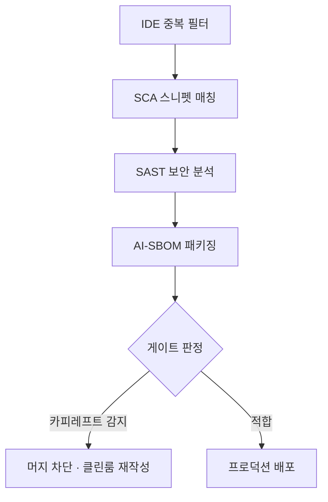

## 지식 로드맵 내 현재 위치

지식 위치: 소프트웨어공학 → 소프트웨어 개발 환경 및 도구 → 생성형 AI 개발 → **AI 생성코드·오픈웨이트 라이선스 컴플라이언스**
---

## 30초 인출

- 본질: **AI 생성코드·오픈웨이트 라이선스 컴플라이언스**는 LLM 코딩 도구·오픈웨이트 모델 활용 시 발생하는 저작권 침해·카피레프트 오염·용도 제한 위반을 통제하는 거버넌스
- 메커니즘: IDE 중복 필터 → CI 단계 **SCA** 스니펫 매칭 → SAST 보안 분석 → **AI-SBOM** 생성으로 공급망 전반 검증
- 판정 기준: 가중치만 공개하고 용도 제한(AUP)을 두는 오픈웨이트를 전통 오픈소스(OSI 공인)와 구별하는가

핵심 용어

- **오픈웨이트 모델(Open-weight Model)**: 모델 가중치는 공개하나 상업적 용도 제한이나 허용 사용 정책(AUP)을 부과하는 준개방형 AI 모델
- **카피레프트 오염(Copyleft Contamination)**: AI 도구가 생성한 코드에 GPL/AGPL 코드가 포함되어 전체 독점 소프트웨어의 공개 의무가 발생하는 위험
- **소프트웨어 구성 분석(SCA: Software Composition Analysis)**: 코드 토큰 및 지문(Fingerprint) 매칭을 통해 오픈소스 라이선스 위반 및 취약점을 식별하는 기술
- **허용 사용 정책(AUP: Acceptable Use Policy)**: 특정 산업군 활용 금지, 경쟁 모델 학습 금지, MAU 한도 등 오픈웨이트 모델에 부과된 법적 제한 조항
- **AI-SBOM(AI Software Bill of Materials)**: 모델 가중치, 학습 데이터셋, 의존 패키지, 생성 프롬프트 계보를 명시한 차세대 소프트웨어 자재명세서

---

## 1교시 예상문제 (10점)

> AI 생성코드·오픈웨이트 라이선스 컴플라이언스의 정의와 목적, 핵심 구조와 작동 원리를 설명하시오. (예상)
---

## 1교시 10점 답안

- **AI 생성코드 및 오픈웨이트 라이선스 컴플라이언스**는 LLM 코딩 도구 및 오픈웨이트 모델 활용 시 발생하는 저작권 침해, 카피레프트(GPL) 오염, 허용 사용 정책(AUP) 위반을 예방·통제하는 거버넌스 활동이다.
- 오픈웨이트는 소스 전체와 무차별 이용을 보장하는 전통 오픈소스(OSI)와 달리 가중치만 공개하고 용도 제한을 두는 준개방형 모델이다. 기업은 IDE 중복 차단 필터, CI 단계의 SCA 스니펫 정밀 매칭, 그리고 모델 가중치와 프롬프트 계보를 명시하는 **AI-SBOM(CycloneDX 표준)** 파이프라인을 구축하여 법적 리스크를 통제해야 한다.
---

### 핵심 관계

---

## 2~4교시 예상문제 (25점)

> "최근 LLM 기반 코딩 어시스턴트 도입과 오픈웨이트(Open-weight) 모델 활용이 급증함에 따라 발생하는 라이선스 및 지식재산권 리스크를 분석하고, 전통적 오픈소스와의 차이점 및 CI/CD 파이프라인과 결합된 기업용 통합 컴플라이언스 거버넌스 체계를 제시하시오."
---

> (25점, 예상)
---

## 2~4교시 25점 답안

### Ⅰ. 생성형 AI 개발 패러다임과 라이선스 컴플라이언스의 대두

#### 1. AI 생성코드 및 오픈웨이트 모델의 정의
- **AI 생성코드**: LLM 기반 코딩 도구가 방대한 공개 저장소를 학습하여 자동 완성 또는 프롬프트 기반으로 생성한 코드.
- **오픈웨이트 모델**: 사전 학습된 가중치 파라미터를 대중에 공개하되, 상업적 사용 제한(AUP) 조건을 수반하는 모델 (예: Meta Llama 계열).

#### 2. 대두되는 3대 법적·공학적 리스크
- **저작권 침해 및 표절**: 원저작자의 라이선스 고지문이 탈락된 채 원본 코드가 그대로 복제되어 생성되는 리스크.
- **카피레프트(GPL/AGPL) 전파 위험**: 상용 독점 코드에 강력한 카피레프트 스니펫이 유입되어 소스코드 공개 의무 발생.
- **상업적 이용 제한 위반**: 월간 활성 사용자(MAU 7억 명 이상 라이선스 재협약 등) 초과 또는 경쟁 모델 학습 금지 조항 위반.
---

### Ⅱ. 전통 오픈소스 vs 오픈웨이트 vs AI 생성코드 3자 비교

| 비교 항목 | 전통적 오픈소스 (OSI OSD) | 오픈웨이트 모델 (Open-weight) | AI 생성 코드 (LLM Generated) |
|---|---|---|---|
| **라이선스 성격** | OSI 공식 인증 라이선스 (MIT, Apache, GPL) | 개별 기업 자체 라이선스 (Llama Community License 등) | 명시적 라이선스 부재 (프롬프트 결과물) |
| **공개 자산** | 소스코드 전체, 빌드 스크립트 | 사전 학습 가중치 파라미터 (학습 데이터 제외) | 생성된 코드 스니펫 텍스트 |
| **사용 제약** | 특정 분야/사용자 차별 금지 (OSD 원칙) | 용도 제한(AUP), 특정 경쟁 모델 재학습 금지 | 학습 데이터의 원저작권 및 침해 가능성 종속 |
| **카피레프트 영향** | GPL 계열 사용 시 파생 저작물 소스코드 공개 강제 | 모델 파생물(파인튜닝)에 대한 라이선스 조건 상속 | 카피레프트 코드 무단 복제 시 독점 코드 오염 전파 |
| **점검 핵심** | 라이선스 고지 의무, 의존성 라이선스 양립성 | MAU 상한선, 상업적 허용 범위, 파인튜닝 가중치 배포 조건 | 공개 저장소 스니펫 일치율, 라이선스 고지 누락 여부 |
---

### Ⅲ. CI/CD 연계 컴플라이언스 자동화 검증 파이프라인

1. **IDE 레벨 1차 방어**: GitHub Copilot의 퍼블릭 코드 매칭 차단(Duplication Filter) 기능을 강제 활성화하여 150자 이상 일치 코드 유입 차단.
2. **CI 단계 정밀 SCA 스캔**: FOSSID, Black Duck 등을 통해 토큰 기반 지문(Fingerprint) 매칭으로 GPL 계열 카피레프트 코드 혼입 여부 전수 검사.
3. **정적 보안 분석(SAST) 연계**: SonarQube, Snyk를 활용하여 AI가 생성한 레거시 API 및 SQL 인젝션 패턴 사전 적출.
4. **AI-SBOM 자동 패키징**: SPDX 또는 CycloneDX 표준 포맷으로 사용된 기본 모델(Foundation Model), 가중치 라이선스, 의존성 메타데이터 패키징.
---

### Ⅳ. AI 생성코드 및 오픈웨이트 활용 시 발생 위험 및 대응 전략

| 위험 | 대책 | 효과 |
|---|---|---|
| **AI 생성 코드에 GPL 카피레프트 스니펫 유입으로 상용 소스 강제 공개 위험** | PR 단계 SCA(FOSSID/Black Duck) 스니펫 정밀 스캔 게이트 의무화 | 카피레프트 오염 코드의 프로덕션 유입 차단 |
| **오픈웨이트 모델 상업 배포 후 MAU 초과로 인한 라이선스 위반 소송** | 모델 도입 전 OSRB(오픈소스 심의회) 사전 스크리닝 및 순수 Apache 2.0 모델 우선 채택 | 비즈니스 중단 및 라이선스 위반 분쟁 원천 해소 |
| **검증되지 않은 오픈소스 학습 코드로 인한 보안 취약점 대량 유입** | CI 파이프라인 내 SAST 및 시큐어 코딩 룰셋을 AI 생성 코드에 엄격 적용 | 보안 취약점의 배포 전 사전 차단 |
| **AI 생성 산출물의 저작권 귀속 불명확성으로 인한 지식재산권 분쟁** | 개발 도구 사용 정책 수립 및 프롬프트-출력 로그 아카이빙 체계 구축 | 법적 증빙 체계 확보 및 감사 대응력 강화 |
---

### Ⅴ. 기술사적 제언: 전략적 오픈(Strategic Openness) 대응 및 AI-SBOM 거버넌스

### 학습자 통찰 메모 — 답안 밖

- `[핵심 통찰]`: 오픈웨이트(Open-weight)는 진정한 오픈소스(OSD)가 아니라, 빅테크 기업이 생태계를 장악하면서도 법적 통제권(경쟁 모델 학습 금지, MAU 한도, 용도 제한)을 쥐려는 '전략적 오픈'이다. AI 코딩 도구가 생성한 코드는 원본 저장소의 GPL 라이선스가 고지문 없이 복제되어 상용 코드를 오염시킬 수 있으므로, OSRB 법률 검토·SCA 스니펫 매칭·AI-SBOM(CycloneDX) 계보 관리가 필수다.
- `나라면`: 실전 답안에서 전통 오픈소스(OSI 공인)와 오픈웨이트의 본질적 차이(OSD 5, 6조 차별금지 위배 사실)를 명시하고, CI/CD에 결합된 자동화 검증 파이프라인(IDE 필터 → SCA → SAST → AI-SBOM → Gate)을 제시하겠다.

### 실전 답안용 기술사적 제언
- **판정 기준**: CI 파이프라인 상 SCA 스니펫 일치율(GPL/AGPL 카피레프트 코드 조각 검출 여부), 오픈웨이트 모델 라이선스의 상업적 제한(MAU 한도 및 AUP 용도 제한), 보안 취약점 심각도(Critical/High)를 기준으로 통과 여부를 판정함.
- **대응 방안**: 카피레프트 오염 감지 시 PR 머지를 자동 차단하고 클린룸(Clean-room) 환경에서 독립 재작성을 수행하며, 오픈웨이트 모델은 도입 전 OSRB 심의를 통해 순수 허용형(Apache 2.0/MIT) 모델 우선 채택 정책을 유지함.
- **검증 체계**: CycloneDX 1.6+ 표준 기반 AI-SBOM을 자동 생성하여 기본 모델 버전, 가중치 체크섬, 학습 데이터 출처, 생성 프롬프트 계보를 소프트웨어 공급망 자산에 동기화함.
- **기대 효과**: 상용 프로덕션 코드의 카피레프트 오염 위험을 차단하고, 글로벌 AI 규제(EU AI Act 등) 감사 및 지식재산권 분쟁에 대한 법적 소명력을 확보함.
---

## 출제 이력 및 기출 분석

- **정보관리기술사**: 134회, 140회 (오픈소스 라이선스 컴플라이언스, AI 생성코드의 저작권 문제, 오픈웨이트 모델의 특성과 리스크)
- **컴퓨터시스템응용기술사**: 131회, 137회 (소프트웨어 공급망 보안, SBOM 표준 체계, 생성형 AI 도구 도입 거버넌스)
- **출제 경향성**: 단순 오픈소스 라이선스 분류(MIT vs GPL)를 넘어, 최근 오픈웨이트 모델(Llama 등)의 AUP 조항 및 AI 생성 코드의 카피레프트 오염 방지를 위한 CI/CD 자동화(SCA, AI-SBOM) 실무 방안을 융합하여 서술해야 합격권 득점이 가능함.
---

## 실전 작성 팁 & 감점 방지

- **오픈웨이트와 순수 오픈소스의 명확한 구별**: 오픈웨이트를 단순 오픈소스로 오인하여 작성하면 치명적인 감점을 받으므로, OSI 10대 원칙(OSD 5, 6조 차별 금지) 위배 사실을 반드시 기재할 것.
- **SCA 스니펫 매칭 기술 명시**: 파일 단위 검사를 넘어 코드 조각(Snippet) 및 토큰 지문(Fingerprint) 매칭 기술을 제시할 것.
- **AI-SBOM의 구체적 표준 언급**: SPDX, CycloneDX 1.6 이상의 AI 확장 규격을 언급하여 기술적 차별성을 확보할 것.
---

## 연결 토픽

- [AI 네이티브 개발 플랫폼](./046_ai_native_dev_platform.md) : AI 도구와 개발 파이프라인의 통합 생태계
- [소프트웨어 품질보증(SQA)](./060_quality_assurance.md) : 프로세스 감사 및 CI/CD 품질 게이트 체계
- [스크래핑(Scraping)](./071_scraping.md) : AI 학습 데이터 수집 과정의 법적·윤리적 쟁점
