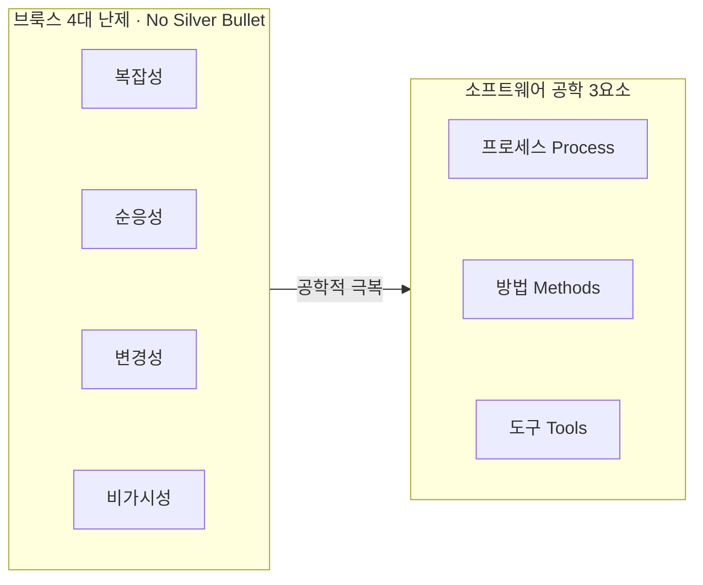

## 지식 로드맵 내 현재 위치

지식 위치: 소프트웨어공학 → 소프트웨어공학 기초 → **소프트웨어 공학 개요 및 좋은 SW의 조건**
---

## 30초 인출

- 본질: **소프트웨어 공학**은 납기 지연·비용 폭증·품질 저하의 소프트웨어 위기를 극복하기 위해 전 생애주기에 체계적·수량화된 공학 원리를 적용하는 규율(IEEE 610.12)
- 메커니즘: 도구(Tools)·방법(Methods)·프로세스(Process) 3요소로 브룩스의 4대 본질적 난제를 제어
- 판정 기준: 솜머빌의 좋은 SW 4대 조건(유지보수성·신뢰성·효율성·수용성) 충족과 4P 관리 균형

핵심 용어

- **소프트웨어 공학(Software Engineering)**: 소프트웨어 개발·운용·유지보수에 체계적이고 수량화된 공학적 원리를 적용하는 학문 (IEEE 610.12)
- **소프트웨어 위기(Software Crisis)**: 하드웨어 발전 대비 소프트웨어의 복잡도 급증으로 비용 폭증, 납기 지연, 품질 저하가 일상화된 현상
- **브룩스의 은총알 없음(No Silver Bullet)**: 복잡성, 순응성, 변경성, 비가시성이라는 본질적 난제로 인해 획기적인 단일 해결책은 존재하지 않는다는 주장
- **좋은 SW의 4대 조건(Ian Sommerville)**: 유지보수성(Maintainability), 신뢰성(Dependability), 효율성(Efficiency), 수용성(Acceptability)
- **개발 영향 4P(People, Product, Process, Project)**: 성공적인 소프트웨어 프로젝트 완수를 좌우하는 핵심 관리 영역 4대 요소

---

## 1교시 예상문제 (10점)

> 소프트웨어 공학 개요·좋은 SW의 조건의 정의와 목적, 핵심 구조와 작동 원리를 설명하시오. (예상)

---

## 1교시 10점 답안

- **소프트웨어 공학(Software Engineering)**은 소프트웨어 위기(비용 폭증, 납기 지연, 품질 저하)를 극복하기 위해 소프트웨어 전 생애주기에 걸쳐 도구, 방법, 프로세스를 체계적으로 적용하는 학문이다.
- 프레더릭 브룩스(F. Brooks)는 소프트웨어의 4대 본질적 난제로 **복잡성, 순응성, 변경성, 비가시성**을 규정하였으며, 이언 솜머빌(Ian Sommerville)은 현대 좋은 소프트웨어의 조건으로 **유지보수성, 신뢰성/보안성, 효율성, 수용성**을 제시하였다. 프로젝트 성공을 위해서는 사람(People), 제품(Product), 프로세스(Process), 프로젝트(Project)의 4P 요소를 유기적으로 관리해야 한다.
---

### 핵심 관계

---

## 2~4교시 예상문제 (25점)

> "소프트웨어 위기(Software Crisis)를 극복하기 위한 소프트웨어 공학(Software Engineering)의 정의와 브룩스(F. Brooks)가 제시한 4대 본질적 난제를 설명하고, 이언 솜머빌(Ian Sommerville)의 좋은 소프트웨어 4대 조건과 프로젝트 성공을 결정하는 4P 관리 전략을 제시하시오."

---

> (25점, 예상)

---

## 2~4교시 25점 답안

### Ⅰ. 소프트웨어 위기 극복의 규율, 소프트웨어 공학의 개요

#### 1. 소프트웨어 공학의 정의
- 소프트웨어의 개발, 운용, 유지보수 및 폐기에 이르는 전 생애주기(SDLC)에 체계적이고 규율화된 수량화 가능한 접근법을 적용하여 **고품질, 저비용, 적기 납기(QCD)**를 달성하는 공학적 학문 및 실무 체계 (IEEE 610.12).

#### 2. 소프트웨어 위기(Software Crisis)의 본질과 발전 계보
- **발생 배경**: 하드웨어 성능 급성장 대비 소프트웨어 규모와 복잡성이 폭발적으로 증가하며 개발 통제 불능 상태 봉착.
- **공학의 발전 흐름**: 장인식 코딩 $\rightarrow$ 구조적 공학(DFD, 폭포수) $\rightarrow$ 객체지향/컴포넌트 공학(CBD, UML) $\rightarrow$ 모던/애자일 공학(DevOps, MSA, AI 네이티브).
---

### Ⅱ. 브룩스의 4대 본질적 난제와 공학 3대 요소

#### 1. 브룩스(F. Brooks)의 4대 본질적 난제 (No Silver Bullet)

| 난제 특성 | 본질적 한계 및 공학적 의미 |
|---|---|
| **복잡성** Complexity | 동일 규모의 하드웨어보다 상태 수가 무한에 가까워 사람의 인지 한계를 초과함 |
| **순응성** Conformity | 자연 법칙이 아닌 인간의 법률, 제도, 타 시스템의 변경 규칙에 강제로 적응해야 함 |
| **변경성** Changeability | 물리적 마모가 없음에도 비즈니스 환경 변화에 따라 끊임없이 수정과 진화를 요구받음 |
| **비가시성** Invisibility | 기하학적 형상이 없어 내부 구조와 진행 상황을 물리적으로 시각화하기 극히 어려움 |

#### 2. 소프트웨어 공학 3대 구성요소 및 난제 극복 아키텍처

- **도구 (Tools)**: 개발 전 주기의 자동화를 지원 (IDE, Git, CI/CD, SonarQube, Docker).
- **방법 (Methods)**: 소프트웨어 구축을 위한 기술적 지침과 모델링 (OOAD, DDD, TDD, 클린 아키텍처).
- **프로세스 (Process)**: 도구와 방법을 통합하여 적기에 인도하기 위한 생애주기 절차 (Scrum, Kanban, ISO 12207).
---

### Ⅲ. 좋은 소프트웨어의 조건과 개발 영향 4P

#### 1. 좋은 소프트웨어(Good Software)의 4대 핵심 조건 (Ian Sommerville)

| 4대 조건 | 핵심 정의 및 구현 실천 방안 |
|---|---|
| **유지보수성** Maintainability | 비즈니스 변경에 맞춰 쉽고 안전하게 진화 가능한 성질 (결합도 최소화, 응집도 최대화, 리팩토링) |
| **신뢰성/보안성** Dependability | 장애, 오류, 침해 공격에도 지속 운영 가능한 성질 (결함 허용, 예외 처리, 암호화, 시큐어 코딩) |
| **효율성** Efficiency | CPU, 메모리, 네트워크, 전력 등 물리 자원을 최적 소비하는 성질 (비동기 I/O, 캐싱, 쿼리 튜닝) |
| **수용성** Acceptability | 사용자가 거부감 없이 직관적으로 채택하고 만족하는 성질 (직관적 UX/UI, 웹 접근성, 응답성) |

#### 2. 프로젝트 성공을 좌우하는 4P 관리 매트릭스

| 요소 | 관리 핵심 및 실패 시 리스크 | 대응 거버넌스 |
|---|---|---|
| **People (사람)** | 프로젝트 성패를 좌우하는 제1요인 (개발자 역량, 팀워크, 사기) | 심리적 안전감 보장, 페어 프로그래밍, 품질 코칭 |
| **Product (제품)** | 구축 대상 시스템의 기능/비기능 요구사항 범위 및 기술 난이도 | 요구사항 추적 매트릭스(RTM), 아키텍처 타당성 평가 |
| **Process (프로세스)** | 도구와 방법을 규율화하여 품질을 담보하는 개발 방법론 | CMMI 기반 프로세스 테일러링, 애자일 스프린트 |
| **Project (프로젝트)** | 제약된 일정, 예산, 자원을 통제하는 프로젝트 관리 활동 | WBS 기반 진척 관리, 위험 관리 대장, 형상 관리 |
---

### Ⅳ. 소프트웨어 개발 현장의 위험 및 공학적 극복 전략

| 위험 | 대책 | 효과 |
|---|---|---|
| **단기 납기 우선으로 인한 스파게티 코드 양산 및 유지보수 비용 폭증** | CI 파이프라인 내 SonarQube 정적 분석 및 테스트 커버리지 품질 게이트 강제 | 코드 중복률 억제 및 유지보수 공수 절감 |
| **소프트웨어 비가시성으로 인한 후반부 요구사항 불일치 및 전면 재작업** | 2주 단위 스프린트 동작 소프트웨어 시연 및 사용자 피드백 루프 단축 | 요구사항 누락 감소 및 재작업 비용 차단 |
| **대규모 동시 접속 시 자원 고갈로 인한 시스템 다운 (효율성 결여)** | 비동기 논블로킹 아키텍처 전환 및 배포 전 k6 기반 성능 부하 테스트 수행 | 시스템 가용성 확보 및 자원 점유율 안정화 |
| **문서 중심 형식주의로 인한 개발팀 소진 및 비즈니스 민첩성 저하** | 코드가 곧 명세가 되는 TDD/BDD 및 코드형 인프라(IaC) 중심 경량 공학 전환 | 문서화 오버헤드 축소 및 배포 주기 단축 |
---

### Ⅴ. 기술사적 제언: AI 네이티브 시대의 현대 소프트웨어 공학 거버넌스

### 학습자 통찰 메모 — 답안 밖

- `[핵심 통찰]`: 브룩스가 간파했듯 소프트웨어는 본질적으로 '비가시적'이고 '변경 가능'하기 때문에 은총알(단일 만병통치약)이 없다. 과거의 공학이 무거운 문서와 감리 위주의 관료주의로 흘렀다면, 현대의 좋은 소프트웨어는 살아있는 테스트 명세(TDD)와 자동화된 파이프라인(DevOps)을 통해 입증된다. 생성형 AI 시대에는 아키텍처 설계·보안 거버넌스·품질 가드레일이라는 소프트웨어 공학의 '본질적 규율'이 생사를 가르는 차별화 요소가 된다.
- `나라면`: 실전 답안에서 브룩스의 4대 난제(복·순·변·비)와 솜머빌의 4대 조건(유·신·효·수)을 1~2단락에서 균형 있게 서술하고, 3단락에서 관리 4P 중 People(사람)의 심리적 안전감과 AI 네이티브 공학 가드레일을 결합한 현대적 발전 모델을 제시하겠다.

### 실전 답안용 기술사적 제언
- **판정 기준**: 소프트웨어 산출물의 유지보수성 지수, 핵심 결함 전이율, 비가시성 극복을 위한 동작 소프트웨어 스프린트 검증 여부를 기준으로 공학적 품질을 종합 판정함.
- **대응 방안**: 도구(CI/CD, AI 어시스턴트), 방법(DDD, TDD), 프로세스(애자일, CMMI)의 3요소를 프로젝트 특성에 맞춰 테일러링하고, 관리 4P 중 People 중심의 엔지니어링 문화(심리적 안전감, 품질 코칭)를 제도화함.
- **검증 체계**: 코드가 곧 명세가 되는 자동화 테스트 스위트 및 IaC 형상 관리를 의무화하여 문서 중심 형식주의를 배제하고 소프트웨어 가시성을 상시 확보함.
- **기대 효과**: 소프트웨어 위기로 인한 납기 지연 및 예산 초과 리스크를 감축하고, 기술 부채 누적으로 인한 시스템 노후화를 사전에 차단함.
---

## 출제 이력 및 기출 분석

- **정보관리기술사**: 80회, 95회, 112회, 123회, 132회 (소프트웨어 공학 정의, 브룩스의 본질적 난제, 좋은 소프트웨어의 특성, 프로젝트 관리 4P)
- **컴퓨터시스템응용기술사**: 88회, 105회, 127회 (소프트웨어 위기 출현 배경, 공학의 발전 계보, 품질 특성과 유지보수성)
- **출제 경향성**: 고전적인 소프트웨어 공학 이론(Brooks, Sommerville)을 현대 클라우드 네이티브, DevOps, 그리고 최신 생성형 AI 코딩 도구 도입 환경의 공학 규율로 재해석하여 3단락에 제시할 때 최고 득점으로 연결됨.
---

## 실전 작성 팁 & 감점 방지

- **브룩스의 4대 난제 정확한 표기**: 복잡성, 순응성, 변경성, 비가시성의 영문(Complexity, Conformity, Changeability, Invisibility)과 개념을 정확히 매칭할 것.
- **솜머빌 4대 조건 누락 방지**: 단순 기능 동작이 아닌 유지보수성, 신뢰성, 효율성, 수용성을 4대 축으로 작성할 것.
- **4P의 관리적 관점 부각**: People(사람)이 기술보다 프로젝트 성공에 가장 큰 영향을 미친다는 사실을 명시할 것.
---

## 연결 토픽

- [요구공학 개요](./040_requirements_engineering.md) : 소프트웨어 비가시성을 극복하기 위한 요구사항 분석 체계
- [소프트웨어 아키텍처](./056_software_architecture.md) : 좋은 소프트웨어 품질 속성을 구현하는 구조적 설계
- [소프트웨어 품질보증(SQA)](./060_quality_assurance.md) : 프로세스 표준 준수 및 품질 거버넌스
