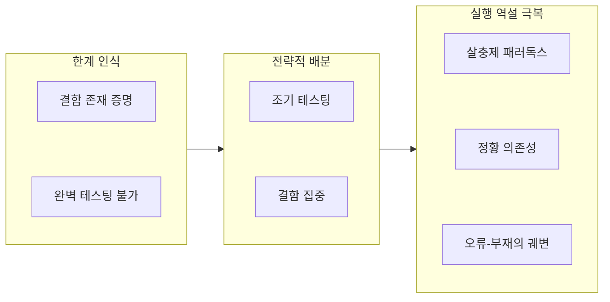

## 지식 로드맵 내 현재 위치

지식 위치: 소프트웨어공학 → 소프트웨어 테스트 및 품질 → 소프트웨어 테스팅 → **소프트웨어 테스트 7대 원리**
---

## 30초 인출

- 본질: **소프트웨어 테스트 7대 원리**는 무한한 입력·경로 앞에서 유한한 시간·예산으로 품질을 달성하기 위한 ISTQB의 7가지 공학적 공리
- 메커니즘: 한계 인식(결함 존재 증명·완벽 테스팅 불가) → 전략적 배분(조기 테스팅·결함 집중) → 실행 역설 극복(살충제 패러독스·정황 의존성·오류-부재의 궤변)
- 판정 기준: 결함 부재를 증명하지 못함을 전제로 **리스크 기반 테스팅(RBT)**으로 잔존 위험을 관리하는가

핵심 용어

- **결함 존재 증명(Testing Shows Defects)**: 테스트는 결함이 있음을 보일 뿐, 결함이 전혀 없음을 증명할 수는 없다는 공리
- **조기 테스팅(Early Testing / Shift-Left)**: 요구사항 및 설계 단계부터 테스트를 개시하여 결함 전이 비용을 최소화하는 원리
- **결함 집중(Defect Clustering)**: 파레토 원칙(80:20)에 따라 소수의 복잡하고 결합도 높은 모듈에 결함이 편중되는 현상
- **살충제 패러독스(Pesticide Paradox)**: 동일한 테스트 케이스를 반복 실행하면 내성이 생겨 신규 결함을 잡지 못하므로 케이스를 갱신해야 한다는 원리
- **오류-부재의 궤변(Absence-of-Errors Fallacy)**: 요구사항 정의서대로 구현되어 결함이 0건이라도 사용자의 실제 목적을 충족하지 못하면 무가치하다는 역설

---

## 1교시 예상문제 (10점)

> 소프트웨어 테스트 7대 원리의 정의와 목적, 핵심 구조와 작동 원리를 설명하시오. (예상)

---

## 1교시 10점 답안

- **소프트웨어 테스트 7대 원리**는 ISTQB에서 정의한 테스팅의 기본 공리로, 결함 존재 증명, 완벽한 테스팅 불가, 조기 테스팅(Shift-Left), 결함 집중(파레토 80:20), 살충제 패러독스, 정황 의존성, 오류-부재의 궤변으로 구성된다.
- 테스트는 결함이 없음을 증명할 수 없으므로, 위험도와 복잡도에 따라 자원을 집중하는 **리스크 기반 테스팅(RBT)**을 적용해야 한다. 또한 고정된 테스트 케이스 반복으로 인한 내성(살충제 패러독스)을 방지하기 위해 탐색적 테스팅과 뮤테이션 테스팅을 병행하여 지속적으로 테스트 스위트를 갱신해야 한다.
---

### 핵심 관계

---

## 2~4교시 예상문제 (25점)

> "ISTQB 소프트웨어 테스트 7대 원리의 개념과 공학적 의미를 설명하고, 3대 핵심 역설(살충제 패러독스, 결함 집중, 오류-부재의 궤변)의 극복 방안 및 리스크 기반 테스팅(RBT)과 Shift-Left 기반의 테스트 거버넌스 모델을 제시하시오."

---

> (25점, 예상)

---

## 2~4교시 25점 답안

### Ⅰ. 한정된 자원 내 품질 극대화의 공리, 테스트 7대 원리의 개요

#### 1. 테스트 7대 원리의 정의
- 무한한 소프트웨어 입력 조합과 실행 경로 속에서, 유한한 시간과 예산으로 최적의 품질을 달성하기 위해 테스터와 엔지니어가 반드시 준수해야 하는 **ISTQB의 7가지 기본 공학적 공리**.

#### 2. 7대 원리의 3단계 유기적 연계 및 극복 구조

---

### Ⅱ. ISTQB 테스트 7대 원리 상세 분석

| 원리 | 공학적 메커니즘 | 실무 적용 및 관리 방안 |
|---|---|---|
| **1. 결함 존재 증명** Testing shows defect | 테스트는 잠재 결함을 들추어낼 뿐, 결함 부재를 입증하지 못함 | "버그 0건"을 출시 기준으로 삼지 않고 잔존 위험률(Residual Risk) 평가 |
| **2. 완벽 테스팅 불가** Exhaustive testing impossible | 모든 입력과 상태 조건의 전수 검사는 수학적/비용상 불가능 | 동등 분할, 경계값 분석, 리스크 기반 테스팅(RBT)으로 표본 추출 |
| **3. 조기 테스팅** Early testing (Shift-Left) | 개발 초기(요구분석, 아키텍처)에 착수할수록 결함 수정 비용 지수적 감소 | 정적 분석, 요구사항 인스펙션, BDD 인수 조건 사전 정의 |
| **4. 결함 집중** Defect clustering | 파레토 원칙(80:20) 성립. 복잡도 높은 20% 모듈에 결함 80% 밀집 | 복잡도(McCabe) 및 변경 빈도가 높은 모듈에 테스트 자원 집중 |
| **5. 살충제 패러독스** Pesticide paradox | 동일 테스트 스위트만 반복 실행 시 시스템 내성 발생 | 정기적 테스트 케이스 리팩토링, 탐색적 테스팅, 뮤테이션 테스팅 |
| **6. 정황 의존성** Context dependent | 비즈니스 도메인 및 안전성 등급에 따라 테스트 전략이 달라짐 | 전자상거래(UX/가용성) vs 의료/자동차(ISO 26262 기능안전) |
| **7. 오류-부재의 궤변** Absence-of-errors fallacy | 사양서대로 완벽히 구현되어 결함이 0건이라도 현업이 외면하면 실패 | 단순 검증(Verification)을 넘어 고객 가치 확인(Validation) 병행 |
---

### Ⅲ. 3대 핵심 역설과 공학적 극복 전략

#### 1. 살충제 패러독스 vs 결함 집중 vs 오류-부재의 궤변 비교

| 핵심 역설 | 발생 원인 | 현장 문제점 | 공학적 극복 대책 |
|---|---|---|---|
| **살충제 패러독스** | 자동화 회귀 스위트의 무비판적 반복 실행 | 신규 기능 및 경계 엣지 케이스 탐지 실패 | **탐색적 테스팅 병행 + 뮤테이션 테스트 기반 케이스 쇄신** |
| **결함 집중** | 모듈 간 복잡도 및 의존성 불균형 | 자원을 전체 모듈에 균등 분배하여 주요 결함 누락 | **복잡도 지표(McCabe, Chidamber) 기반 RBT 집중 테스트** |
| **오류-부재의 궤변** | 개발자 중심의 기능 사양서 매몰 | 시스템 오픈 후 사용자의 실질적 인수 거부 | **현업 주도 BDD(행위 주도 개발) 및 조기 사용자 인수 테스트(UAT)** |
---

### Ⅳ. 소프트웨어 테스팅 현장의 위험 및 대응 전략

| 위험 | 대책 | 효과 |
|---|---|---|
| **자동화 회귀 테스트 전수 Pass 맹신으로 운영 배포 후 대형 장애 발생** | 고정 테스트 외에 전문 테스터 주관의 탐색적 테스팅(Exploratory Testing) 편성 | 엣지 케이스 결함 적출률 향상 |
| **일정 부족으로 인한 후반부 테스트 생략 및 불완전 출시** | 시스템 실패 가능성과 비즈니스 영향도 기반 리스크 기반 테스팅(RBT) 적용 | 핵심 비즈니스 크리티컬 패스 테스트 커버리지 확보 |
| **사양서 일치 검증에만 매몰되어 오픈 후 현업 사용 거부 (오류 부재 궤변)** | 개발 초기부터 현업이 참여하는 BDD(Gherkin) 인수 기준 수립 및 조기 UAT | 요구사항 불일치 결함 사전 예방 |
| **개발 후반부 동적 테스트 단계에서 아키텍처 결함 발견으로 일정 마비** | 요구사항 및 설계 단계부터 정적 인스펙션을 수행하는 Shift-Left 체계 구축 | 결함 수정 비용 절감 및 일정 준수율 확보 |
---

### Ⅴ. 기술사적 제언: Shift-Left와 리스크 기반 테스팅(RBT) 통합 거버넌스

### 학습자 통찰 메모 — 답안 밖

- `[핵심 통찰]`: 테스트 7대 원리는 단순한 암기 사항이 아니라 "완벽한 테스팅은 불가능하므로(1,2)" → "요구사항부터 시작해 위험한 모듈에 자원을 몰아주고(3,4)" → "반복 실행의 내성을 깨며 도메인과 비즈니스 목적에 부합해야 한다(5,6,7)"의 논리적 폐루프다. 실무에서 '버그 제로'를 외치는 것은 공학에 대한 무지이며, 남아있는 잔존 위험(Residual Risk)을 RBT(위험 기반 테스팅)로 관리하고 탐색적 테스팅으로 내성을 깨는 것이 참된 품질 거버넌스다.
- `나라면`: 실전 답안에서 7개 원리를 단순 열거하지 않고 [한계 인식 - 전략적 배분 - 실행 역설 극복]의 3단계로 구조화하고, 3단락에서 살충제 패러독스를 깨는 탐색적 테스팅(ET)과 Shift-Left 기반 RBT 프레임워크를 연계하겠다.

### 실전 답안용 기술사적 제언
- **판정 기준**: 모듈 복잡도(McCabe), 비즈니스 장애 영향도(재무/생명 직결 여부), 테스트 스위트의 뮤테이션 스코어를 기준으로 테스팅 자원 집중 여부를 판정함.
- **대응 방안**: 전수 검사의 비현실성을 극복하기 위해 RBT(리스크 기반 테스팅)로 위험 상위 모듈에 테스트 엔지니어링 역량을 집중하고, Shift-Left(정적 인스펙션 및 단위 TDD)를 전면 강제함.
- **검증 체계**: 고정 회귀 스위트의 살충제 패러독스를 타파하기 위해 상당 비율의 테스트 시간을 시나리오 없는 탐색적 테스팅(Exploratory Testing)에 배정하고, 뮤테이션 테스트를 통해 TC 검출력을 상시 실증함.
- **기대 효과**: 결함 전이 비용을 절감하고 핵심 비즈니스 장애 누출을 억제하며, 오류-부재의 궤변을 극복하여 실제 고객 만족도 및 시스템 인수 성공률을 높임.
---

## 출제 이력 및 기출 분석

- **정보관리기술사**: 85회, 99회, 114회, 126회 (소프트웨어 테스팅 7대 원리, 살충제 패러독스 극복 방안, Verification과 Validation의 차이)
- **컴퓨터시스템응용기술사**: 93회, 108회, 122회 (결함 집중과 RBT 연계, Shift-Left 테스팅 전략, 탐색적 테스팅)
- **출제 경향성**: 7개 원리의 단순 암기식 나열은 5점대에 머무르며, 원리들을 '한계-전략-실행'의 3단계로 유기적 그룹핑하고, 실무 안티패턴(살충제 패러독스, 오류 부재의 궤변)에 대한 구체적 해결책(RBT, 탐색적 테스팅, BDD)을 도식과 함께 제시할 때 7점 이상 획득 가능.
---

## 실전 작성 팁 & 감점 방지

- **7개 원리 명칭의 정확성**: '살충제 패러독스(Pesticide Paradox)', '오류-부재의 궤변(Absence-of-Errors Fallacy)' 등 공인 명칭을 누락 없이 작성할 것.
- **오류-부재의 궤변 의미 혼동 방지**: "버그가 없다는 궤변"이 아니라, "버그가 0건이라도 사용자 요구를 충족하지 못하면 쓸모없다"는 Validation 관점의 오류임을 명확히 서술할 것.
- **Shift-Left 곡선 도해**: 1교시 또는 2교시 답안 작성 시 배리 보엠의 결함 수정 비용 곡선 도식을 함께 제시할 것.
---

## 연결 토픽

- [인스펙션(Inspection)](./058_inspection.md) : 조기 테스팅(Shift-Left)을 실천하는 정형 검토 기법
- [회귀테스트](./061_regression_test.md) : 살충제 패러독스를 경계해야 하는 지속적 회귀 검증
- [동적 테스트](./072_dynamic_testing.md) : 명세 기반 및 구조 기반 동적 테스트 기법
- [변이 테스트(Mutation Testing)](./084_mutation_test.md) : 테스트 케이스의 내성을 검증하고 살충제 패러독스를 극복하는 기법
