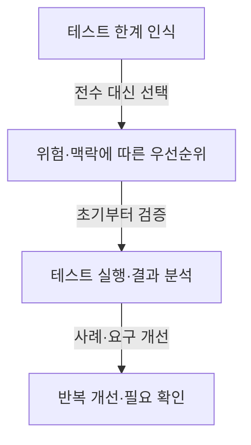
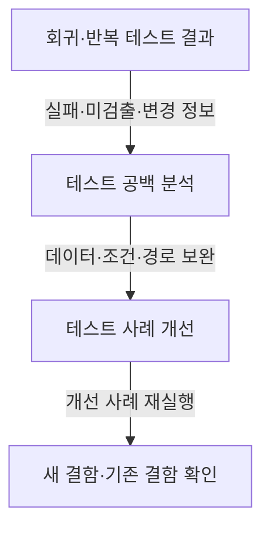

## 지식 로드맵 내 현재 위치

지식 위치: 소프트웨어 공학 → 소프트웨어 테스트·품질 → 테스트 원리

## 30초 인출

- 본질: **테스팅 7대 원리**는 테스트 범위·효과·한계를 이해하고 시험 활동을 계획하는 기본 지침
- 메커니즘: 한계 인식 → 위험·맥락에 따른 시험 → 반복 개선과 사용자 필요 확인
- 핵심: 테스트 통과는 결함 부재의 증명이 아니며 시험은 위험과 목적에 맞춰야 함

핵심 용어

- **테스팅 7대 원리**: ISTQB의 기초 테스팅 지침으로 결함·범위·시기·맥락·목표에 관한 일곱 원리
- **ISTQB(International Software Testing Qualifications Board)**: 소프트웨어 테스팅 자격·용어·교육 체계를 제공하는 국제 조직
- **결함 집중(Defect Clustering)**: 결함이나 운영 실패가 일부 구성요소에 상대적으로 많이 나타날 수 있다는 관찰
- **살충제 역설(Pesticide Paradox)**: 같은 테스트만 반복하면 새 결함 발견 효과가 낮아질 수 있다는 원리
- **오류 부재의 궤변(Absence-of-Errors Fallacy)**: 결함이 적더라도 제품이 실제 필요를 충족하지 못하면 성공으로 볼 수 없다는 원리
- **위험 기반 테스팅(Risk-Based Testing)**: 실패 가능성과 영향을 고려해 시험 우선순위·범위를 정하는 접근

---

## 1교시 예상문제 (10점)

> 소프트웨어 테스팅 7대 원리를 설명하고 각 원리가 테스트 계획에 주는 의미를 쓰시오. (예상)

---

## 1교시 10점 답안

### Ⅰ. 개요

| 구분 | 핵심 |
|---|---|
| 정의 | **테스팅 7대 원리**는 테스트 범위·효과·한계를 이해하고 시험 활동을 계획하는 기본 지침 |
| 목적 | 제한된 자원에서 결함 위험과 이해관계자의 필요에 맞는 시험 수행 |

### Ⅱ. 일곱 원리

| 원리 | 테스트 계획의 의미 |
|---|---|
| 테스트는 결함의 존재를 보일 뿐 부재를 증명하지 못함 | 통과 결과를 위험 잔존 여부와 함께 판단 |
| 완벽한 테스팅은 불가능 | 우선순위와 시험 기법을 선택 |
| 조기 테스팅은 시간·비용을 줄임 | 요구·설계 단계부터 정적·동적 시험 활동 시작 |
| 결함은 일부 영역에 집중될 수 있음 | 복잡·변경 빈도·영향이 큰 부분에 시험 집중 |
| 살충제 역설 | 반복 시험에 더해 테스트 조건·사례를 개선 |
| 테스팅은 맥락에 의존 | 제품 위험·규제·사용 환경에 맞게 접근 조정 |
| 오류 부재의 궤변 | 사양 준수와 실제 사용자 필요 충족을 함께 확인 |

### Ⅲ. 원리의 적용 관계

제언: 테스트 통과 건수보다 위험도·시험 범위·사용자 필요 충족을 함께 검토.

---

## 2~4교시 예상문제 (25점)

> ISTQB 테스팅 7대 원리의 핵심 내용과 공학적 의미를 설명하고, 결함 집중·살충제 역설·오류 부재의 궤변에 대한 적용 방안을 제시하시오. (예상)

---

## 2~4교시 25점 답안

## Ⅰ. 개요

| 구분 | 핵심 |
|---|---|
| 정의 | **테스팅 7대 원리**는 테스트 범위·효과·한계를 이해하고 시험 활동을 계획하는 기본 지침 |
| 목적 | 제한된 자원에서 결함 위험과 이해관계자의 필요에 맞는 시험 수행 |

## Ⅱ. 일곱 원리의 의미

| 원리 | 의미 | 계획·수행에 주는 영향 |
|---|---|---|
| 테스트는 결함의 존재를 보일 뿐 부재를 증명하지 못함 | 테스트는 실행한 조건에서 확인한 결과 제공 | 통과를 완전성의 증거로 오해하지 않음 |
| 완벽한 테스팅은 불가능 | 모든 입력·상태·조합 확인은 현실적으로 제한 | 기법·우선순위·표본 선택 |
| 조기 테스팅 | 결함을 개발 초기에 찾으면 후속 영향 축소 가능 | 요구·설계·코드 단계에서 검토·시험 시작 |
| 결함 집중 | 일부 모듈에 결함·실패가 모일 수 있음 | 결함·변경·복잡도 정보를 이용한 집중 시험 |
| 살충제 역설 | 반복하는 시험은 같은 유형의 결함만 잡을 수 있음 | 테스트 데이터·조건·사례 주기적 검토 |
| 맥락 의존성 | 적합한 시험은 제품·위험·제약에 따라 달라짐 | 안전·규제·업무 중요도에 맞춘 접근 |
| 오류 부재의 궤변 | 결함이 적어도 제품이 사용 목적에 맞지 않을 수 있음 | 요구 적합성과 사용자 가치 확인 병행 |

## Ⅲ. 결함 집중과 위험 기반 배분

| 근거 | 적용 방법 | 주의점 |
|---|---|---|
| 과거 결함·운영 실패 | 반복 문제 영역에 시험 집중 | 과거 데이터가 미래 위험을 완전히 대표하지 않음 |
| 복잡도·변경 빈도 | 구조 변경과 영향이 큰 모듈 우선 검토 | 단일 지표로 품질을 단정하지 않음 |
| 업무 영향·실패 가능성 | 위험도에 따라 시험 깊이·순서 조정 | 낮은 순위 영역의 잔존 위험도 기록 |

## Ⅳ. 반복 테스트 개선과 살충제 역설 대응

자동화된 회귀 스위트 유지와 탐색적 시험·새 조건 분석을 병행해 반복 시험의 공백 보완.

## Ⅴ. 오류 부재의 궤변과 맥락 기반 확인

| 확인 관점 | 질문 | 증거 |
|---|---|---|
| 사양 적합성 | 합의된 요구대로 동작하는가 | 요구-테스트 연결·실행 결과 |
| 목적 적합성 | 사용자의 실제 작업을 지원하는가 | 사용자 시나리오·인수 검토 |
| 맥락 적합성 | 운영·규제·위험 조건을 반영했는가 | 운영·보안·규제 검토 기록 |

## Ⅵ. 기술사적 제언 — 잔존 위험을 드러내는 시험 우선순위

| 한계 | 해결 방안 |
|---|---|
| 테스트 통과를 제품의 결함 부재나 사용자 적합성의 증거로 과대해석할 가능성 | 위험·시험 범위·미검증 조건·사용자 확인 결과를 함께 기록하고, 배포 결정 때 담당자가 잔존 위험을 검토하는 절차 운영 |

## 출제 이력과 검증 출처

- 공식 문제지 원문에서 확인한 직접 기출 없음
- [ISTQB Certified Tester Foundation Level Syllabus v4.0.1](https://istqb.org/wp-content/uploads/2024/11/ISTQB_CTFL_Syllabus_v4.0.1.pdf)

## 연결 토픽

- 연관 토픽: [인스펙션](./058_inspection.md), [회귀테스트](./061_regression_test.md), [동적 테스트](./072_dynamic_testing.md)
- 다음 토픽: [스크래핑](./071_scraping.md)
