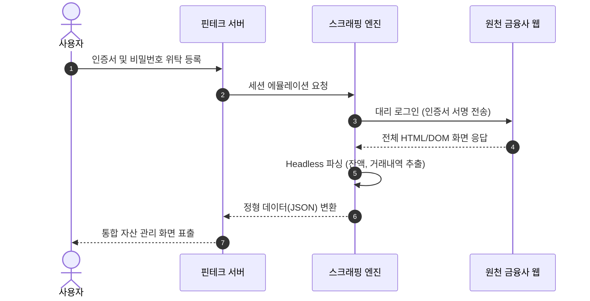
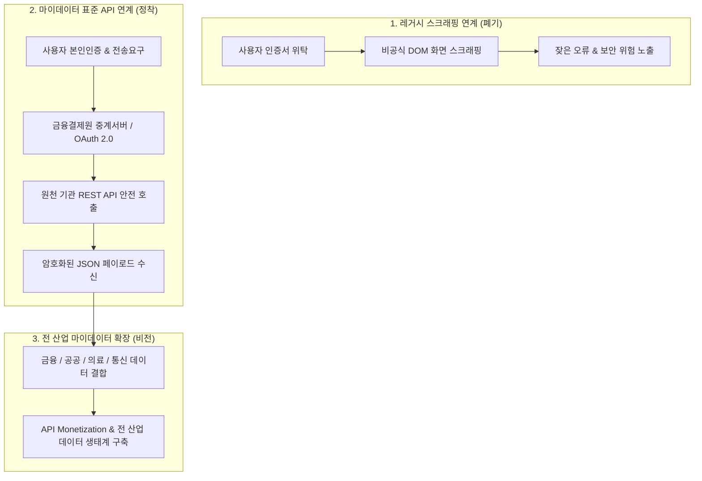

> **로드맵 경로**: 소프트웨어공학 > 시스템 연계 및 인터페이스 > 데이터 수집 및 연계 > 스크래핑(Scraping)

---

## 큰 그림과 30초 인출

```text
[스크린 스크래핑(Screen Scraping)]
 ├── 정의: 공식 API 부재 시 웹 화면(HTML/DOM)을 자동 파싱하여 특정 데이터 필드만 추출하는 기술
 ├── 기술 요소: Headless Browser(Puppeteer) + DOM/XPath 파서 + 인증 에뮬레이터 + ETL 정제기
 ├── 구조적 한계: 사용자 인증정보 위탁 보관(보안 취약), UI 변경 시 파서 마비, 원천 서버 과부하
 └── 패러다임 전환: 스크래핑 금지 → OAuth 2.0 기반 마이데이터 표준 API 의무화 (데이터 주권 확립)
```

- **30초 인출 구호**: "헤드리스 브라우저-DOM 파싱-인증 대리, 보안 취약과 UI 변경 취약, 마이데이터 표준 API로 전환!"

---

## 핵심 용어 (5개 내외)

| 핵심 용어 | 영문 표기 | 핵심 정의 및 특징 |
|---|---|---|
| **스크린 스크래핑** | Screen Scraping | 공식 API 없이 원천 웹 서버의 HTML/DOM 구조를 소프트웨어가 자동 탐색하여 데이터를 추출하는 기술 |
| **헤드리스 브라우저** | Headless Browser | GUI 화면 표시 없이 백그라운드에서 브라우저 자바스크립트 렌더링을 에뮬레이션하는 도구 (Puppeteer 등) |
| **XPath / DOM 파서** | XPath / DOM Parser | 웹 페이지의 트리 구조를 탐색하여 특정 태그, 클래스, 속성에 위치한 텍스트를 파싱하는 엔진 |
| **마이데이터 표준 API** | MyData Standard API | 사용자 동의하에 OAuth 2.0 인가 토큰을 통해 정형화된 JSON 데이터를 전송하는 합법적 연계 체계 |
| **데이터 주권** | Data Sovereignty | 개인이 자신의 개인정보에 대한 전송요구권을 행사하여 데이터 통제권을 되찾는 법적·기술적 개념 |

---

## 25점형 답안 프레임워크

### [예상 문제]
> "초기 핀테크 및 전자정부 연계에 널리 활용된 스크린 스크래핑(Screen Scraping)의 개념과 동작 메커니즘을 설명하고, 스크래핑의 보안·운영상 한계점과 이를 대체하는 마이데이터 표준 API(OAuth 2.0)로의 전환 전략 및 거버넌스를 제시하시오."

---

### Ⅰ. 비공식 화면 데이터 추출 기술, 스크래핑의 개요

#### 1. 스크래핑의 정의
- 원천 시스템에서 공식 연계 API를 제공하지 않는 환경에서, 사용자 화면에 렌더링되는 **HTML/DOM 구조를 소프트웨어가 자동 파싱하여 필요한 특정 데이터 항목만을 추출·가공하는 기술**.

#### 2. 등장 배경 및 기술적 위상
- **등장 배경**: 초기 금융사·공공기관의 폐쇄적 데이터 정책과 표준 API 인프라 부재 속에서 핀테크 자산관리 및 민원 자동화 서비스의 데이터 수집 수단으로 활용.
- **기술적 위상 변화**: 인증정보 수탁에 따른 대형 보안 사고 위험과 잦은 파서 오류로 인해, 마이데이터 제도 도입과 함께 표준 API로 전면 대체되는 추세.

---

### Ⅱ. 스크래핑 동작 메커니즘 및 핵심 기술 요소

#### 1. 스크린 스크래핑 동작 흐름도



#### 2. 스크래핑 핵심 기술 요소

| 기술 요소 | 기능 및 역할 | 주요 도구 및 라이브러리 |
|---|---|---|
| **헤드리스 브라우저** | GUI 화면 없이 백그라운드에서 JS 실행 및 비동기 DOM 렌더링 에뮬레이션 | Puppeteer, Playwright, Selenium |
| **DOM / XPath 파서** | HTML 계층 트리를 탐색하여 지정된 태그, 속성, 텍스트 노드 추출 | Beautiful Soup, Cheerio, lxml, CSS Selector |
| **인증 에뮬레이터** | 로그인 세션 쿠키, 토큰, 공인인증서 전자서명 과정을 코드로 대리 수행 | 전자서명 모듈, 세션 관리자, CAPTCHA 우회기 |
| **데이터 정제기 (ETL)** | 비정형 HTML 텍스트에서 불필요한 태그를 제거하고 정형 JSON 스키마로 변환 | Regex, Data Mapping Engine, Schema Validator |

---

### Ⅲ. 스크린 스크래핑 vs 마이데이터 표준 API 비교

| 비교 항목 | 스크린 스크래핑 (Screen Scraping) | 마이데이터 표준 API (OAuth 2.0) |
|---|---|---|
| **연계 방식** | 비공식 화면(DOM) 캡처 및 파싱 | 공식 RESTful 인터페이스 규격 (JSON) |
| **보안 메커니즘** | 사용자 인증정보(ID/PW, 인증서) 직접 위탁 보관 (취약) | OAuth 2.0 인가 토큰 기반 (최소 권한 원칙, 안전) |
| **시스템 부하** | 대용량 HTML, 이미지, CSS 동시 요청으로 원천 서버 과부하 | 순수 데이터(Payload)만 송수신하여 트래픽 최소화 |
| **변경 안정성** | UI/CSS 변경 시 즉시 파싱 마비 (유지보수 비용 극심) | API 시맨틱 버저닝 관리로 하위 호환성 보장 |
| **법적·제도적 위상** | 마이데이터 사업자 사용 전면 금지 (법적 규제) | 신용정보법 및 전자금융거래법상 공식 표준 연계 방식 |

---

### Ⅳ. 스크래핑 운용 시 발생 위험 및 대응 전략

| 위험 | 대책 | 효과 |
|---|---|---|
| **원천 포털 UI/클래스명 개편으로 인한 파서 마비 및 서비스 중단** | XPath 상대 경로 자동 치유(Auto-Healing) 엔진 도입 및 마이데이터 표준 API로 전환 | 파서 장애 복구 시간 90% 단축 및 연계 안정성 확보 |
| **스크래핑 봇의 무차별 동시 요청으로 원천 서버 다운 및 IP 차단** | 호출 주기 제어(Rate Limiting), 분산 캐싱, 웹소켓 변경 알림 기반 증분 수집 | 원천 서버 네트워크 부하 85% 감축 및 IP 차단 차단 |
| **사용자 금융 인증서 중앙 서버 보관에 따른 대규모 유출 사고 위험** | 사용자 단말 로컬에서 구동되는 클라이언트 스크래핑 적용 또는 OAuth 2.0 전환 | 서버 측 자격증명 저장 0건화로 개인정보 침해 사고 원천 차단 |
| **무단 스크래핑으로 인한 데이터 저작권 및 부정경쟁방지법 위반 분쟁** | robots.txt 규약 준수, 법적 동의 절차 정비, 공인 마이데이터 중계망 활용 | 데이터 수집의 법적 적법성 100% 확보 |

---

### Ⅴ. 기술사적 제언: 마이데이터 표준 API 전환 및 전 산업 데이터 주권 거버넌스



1. **데이터 소유권의 패러다임 전환 (데이터 주권)**:
   - 스크래핑 금지와 표준 API 의무화는 단순 기술 전환이 아니라, 데이터의 통제권이 기업의 독점에서 정보주체(개인)에게로 이전되는 **데이터 주권(Data Sovereignty)**의 기술적 실현임.
2. **전 산업 마이데이터 표준 인프라 확장**:
   - 금융권에서 검증된 OAuth 2.0 기반 표준 API 아키텍처를 공공, 통신, 의료(PHR), 유통 전 산업으로 확장 적용하고, API 호출 과금 모델(Monetization) 및 서비스 수준 협약(SLA)을 제도화하여 지속 가능한 API 경제 생태계를 구축해야 함.

---

## 1교시 10점형 답안 발췌 (핵심 서술형)

- **스크래핑(Scraping)**은 공식 API가 없는 환경에서 웹 화면(HTML/DOM)을 소프트웨어가 자동 탐색하여 필요한 특정 데이터를 추출·가공하는 기술이다.
- 헤드리스 브라우저와 DOM/XPath 파서를 기반으로 동작하지만, 사용자 인증정보(인증서/비밀번호)를 서비스 서버에 위탁해야 하는 보안 취약점과 UI 변경 시 수집이 마비되는 안정성 한계를 지닌다. 최근에는 정보주체의 전송요구권에 기반하여 OAuth 2.0 토큰으로 암호화된 JSON 데이터를 안전하게 송수신하는 **마이데이터 표준 API**로 전면 대체되었다.

---

## 출제 이력 및 기출 분석

- **정보관리기술사**: 118회, 122회, 128회 (스크린 스크래핑의 개념 및 문제점, 마이데이터 표준 API와의 비교, OAuth 2.0 연계)
- **컴퓨터시스템응용기술사**: 120회, 131회 (웹 크롤링과 스크래핑 비교, 핀테크 보안 위험, RESTful API 거버넌스)
- **출제 경향성**: 스크래핑 기술의 단순 동작 원리를 넘어, 금융 인증정보 보관에 따른 보안 사고 위험과 마이데이터 사업에서의 스크래핑 금지 규제 배경, 그리고 OAuth 2.0 기반 표준 API 아키텍처와의 명확한 대비를 서술할 때 최고 득점으로 연결됨.

---

## 실전 작성 팁 & 감점 방지

- **웹 크롤링과 스크래핑의 차이 명시**: 웹 크롤링은 '모든 링크를 탐색하여 인덱싱하는 것'이고, 스크래핑은 '특정 웹 페이지의 정밀한 데이터 필드를 추출하는 것'임을 구분하여 서술할 것.
- **마이데이터 법적 배경 언급**: 신용정보법 개정 및 본인신용정보 전송요구권에 따라 스크래핑이 법적으로 금지되고 표준 API가 의무화되었음을 명시할 것.
- **OAuth 2.0 토큰 기반 도해**: 2단락 또는 3단락에서 ID/PW 위탁 방식과 OAuth 2.0 인가 토큰 방식의 차이를 다이어그램으로 표현할 것.

---

## 연결 토픽

- [SOAP](./037_soap.md) : 전통적 XML 기반 웹 서비스 연계 규격
- [API 게이트웨이](./075_api_gateway.md) : 마이데이터 표준 API의 트래픽 제어 및 인증 관문
- [AI 컴플라이언스](./063_ai_generated_code_license_compliance.md) : 웹 스크래핑 데이터를 통한 AI 모델 학습 시 저작권 이슈

