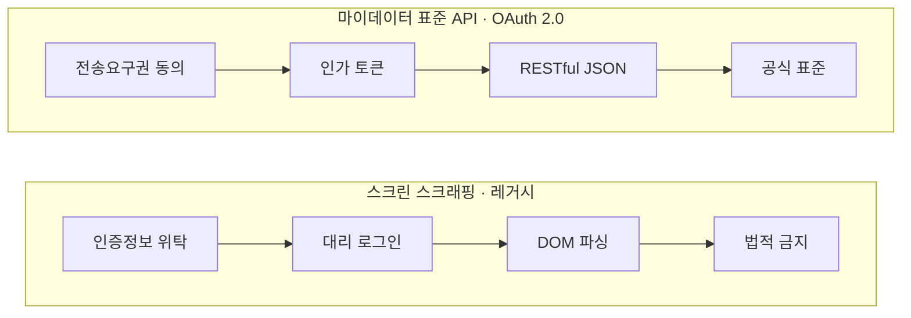

## 지식 로드맵 내 현재 위치

지식 위치: 소프트웨어공학 → 시스템 연계 및 인터페이스 → 데이터 수집 및 연계 → **스크래핑(Scraping)**
---

## 30초 인출

- 본질: **스크래핑(Scraping)**은 공식 API가 없을 때 웹 화면(HTML/DOM)을 자동으로 긁어 데이터를 추출하는 과도기적 수집 기술
- 메커니즘: 헤드리스 브라우저 렌더링 → 인증 대리 로그인 → DOM/XPath 파싱 → ETL 정제로 JSON 변환
- 판정 기준: 인증정보 위탁 보관·UI 변경 취약으로 인해 OAuth 2.0 기반 **마이데이터 표준 API**로 대체되는가

핵심 용어

- **스크린 스크래핑(Screen Scraping)**: 공식 API 없이 원천 웹 서버의 HTML/DOM 구조를 소프트웨어가 자동 탐색하여 데이터를 추출하는 기술
- **헤드리스 브라우저(Headless Browser)**: GUI 화면 표시 없이 백그라운드에서 브라우저 자바스크립트 렌더링을 에뮬레이션하는 도구 (Puppeteer 등)
- **XPath · DOM 파서(XPath / DOM Parser)**: 웹 페이지의 트리 구조를 탐색하여 특정 태그, 클래스, 속성에 위치한 텍스트를 파싱하는 엔진
- **마이데이터 표준 API(MyData Standard API)**: 사용자 동의하에 OAuth 2.0 인가 토큰을 통해 정형화된 JSON 데이터를 전송하는 합법적 연계 체계
- **데이터 주권(Data Sovereignty)**: 개인이 자신의 개인정보에 대한 전송요구권을 행사하여 데이터 통제권을 되찾는 법적·기술적 개념

---

## 1교시 예상문제 (10점)

> 스크래핑(Scraping)의 정의와 목적, 핵심 구조와 작동 원리를 설명하시오. (예상)
---

## 1교시 10점 답안

- **스크래핑(Scraping)**은 공식 API가 없는 환경에서 웹 화면(HTML/DOM)을 소프트웨어가 자동 탐색하여 필요한 특정 데이터를 추출·가공하는 기술이다.
- 헤드리스 브라우저와 DOM/XPath 파서를 기반으로 동작하지만, 사용자 인증정보(인증서/비밀번호)를 서비스 서버에 위탁해야 하는 보안 취약점과 UI 변경 시 수집이 마비되는 안정성 한계를 지닌다. 최근에는 정보주체의 전송요구권에 기반하여 OAuth 2.0 토큰으로 암호화된 JSON 데이터를 안전하게 송수신하는 **마이데이터 표준 API**로 전면 대체되었다.
---

### 핵심 관계

---

## 2~4교시 예상문제 (25점)

> "초기 핀테크 및 전자정부 연계에 널리 활용된 스크린 스크래핑(Screen Scraping)의 개념과 동작 메커니즘을 설명하고, 스크래핑의 보안·운영상 한계점과 이를 대체하는 마이데이터 표준 API(OAuth 2.0)로의 전환 전략 및 거버넌스를 제시하시오."
---

> (25점, 예상)
---

## 2~4교시 25점 답안

### Ⅰ. 비공식 화면 데이터 추출 기술, 스크래핑의 개요

#### 1. 스크래핑의 정의
- 원천 시스템에서 공식 연계 API를 제공하지 않는 환경에서, 사용자 화면에 렌더링되는 **HTML/DOM 구조를 소프트웨어가 자동 파싱하여 필요한 특정 데이터 항목만을 추출·가공하는 기술**.

#### 2. 등장 배경 및 기술적 위상
- **등장 배경**: 초기 금융사·공공기관의 폐쇄적 데이터 정책과 표준 API 인프라 부재 속에서 핀테크 자산관리 및 민원 자동화 서비스의 데이터 수집 수단으로 활용.
- **기술적 위상 변화**: 인증정보 수탁에 따른 대형 보안 사고 위험과 잦은 파서 오류로 인해, 마이데이터 제도 도입과 함께 표준 API로 전면 대체되는 추세.
---

### Ⅱ. 스크래핑 동작 메커니즘 및 핵심 기술 요소

#### 1. 스크린 스크래핑 vs 마이데이터 표준 API 연계 메커니즘 비교

#### 2. 스크래핑 핵심 기술 요소

| 기술 요소 | 기능 및 역할 | 주요 도구 및 라이브러리 |
|---|---|---|
| **헤드리스 브라우저** | GUI 화면 없이 백그라운드에서 JS 실행 및 비동기 DOM 렌더링 에뮬레이션 | Puppeteer, Playwright, Selenium |
| **DOM / XPath 파서** | HTML 계층 트리를 탐색하여 지정된 태그, 속성, 텍스트 노드 추출 | Beautiful Soup, Cheerio, lxml, CSS Selector |
| **인증 에뮬레이터** | 로그인 세션 쿠키, 토큰, 공인인증서 전자서명 과정을 코드로 대리 수행 | 전자서명 모듈, 세션 관리자, CAPTCHA 우회기 |
| **데이터 정제기 (ETL)** | 비정형 HTML 텍스트에서 불필요한 태그를 제거하고 정형 JSON 스키마로 변환 | Regex, Data Mapping Engine, Schema Validator |
---

### Ⅲ. 스크린 스크래핑 vs 마이데이터 표준 API 비교

| 비교 항목 | 스크린 스크래핑 (Screen Scraping) | 마이데이터 표준 API (OAuth 2.0) |
|---|---|---|
| **연계 방식** | 비공식 화면(DOM) 캡처 및 파싱 | 공식 RESTful 인터페이스 규격 (JSON) |
| **보안 메커니즘** | 사용자 인증정보(ID/PW, 인증서) 직접 위탁 보관 (취약) | OAuth 2.0 인가 토큰 기반 (최소 권한 원칙, 안전) |
| **시스템 부하** | 대용량 HTML, 이미지, CSS 동시 요청으로 원천 서버 과부하 | 순수 데이터(Payload)만 송수신하여 트래픽 최소화 |
| **변경 안정성** | UI/CSS 변경 시 즉시 파싱 마비 (유지보수 비용 극심) | API 시맨틱 버저닝 관리로 하위 호환성 보장 |
| **법적·제도적 위상** | 마이데이터 사업자 사용 전면 금지 (법적 규제) | 신용정보법 및 전자금융거래법상 공식 표준 연계 방식 |
---

### Ⅳ. 스크래핑 운용 시 발생 위험 및 대응 전략

| 위험 | 대책 | 효과 |
|---|---|---|
| **원천 포털 UI/클래스명 개편으로 인한 파서 마비 및 서비스 중단** | XPath 상대 경로 자동 치유(Auto-Healing) 엔진 도입 및 마이데이터 표준 API로 전환 | 파서 장애 복구 시간 단축 및 연계 안정성 확보 |
| **스크래핑 봇의 무차별 동시 요청으로 원천 서버 다운 및 IP 차단** | 호출 주기 제어(Rate Limiting), 분산 캐싱, 웹소켓 변경 알림 기반 증분 수집 | 원천 서버 부하 감축 및 IP 차단 회피 |
| **사용자 금융 인증서 중앙 서버 보관에 따른 대규모 유출 사고 위험** | 사용자 단말 로컬에서 구동되는 클라이언트 스크래핑 적용 또는 OAuth 2.0 전환 | 서버 측 자격증명 저장 제거로 개인정보 침해 사고 원천 차단 |
| **무단 스크래핑으로 인한 데이터 저작권 및 부정경쟁방지법 위반 분쟁** | robots.txt 규약 준수, 법적 동의 절차 정비, 공인 마이데이터 중계망 활용 | 데이터 수집의 법적 적법성 확보 |
---

### Ⅴ. 기술사적 제언: 마이데이터 표준 API 전환 및 전 산업 데이터 주권 거버넌스

### 학습자 통찰 메모 — 답안 밖

- `[핵심 통찰]`: 스크린 스크래핑은 표준 API가 없던 시절 핀테크를 태동시킨 '과도기적 징검다리' 기술이었다. 그러나 고객의 인증서와 비밀번호를 서비스 제공자가 위탁 보관하는 치명적 보안 결함과, UI 클래스명 하나만 바뀌어도 전체 파이프라인이 멈추는 취약성 때문에 법적으로 퇴출되었다. 마이데이터 표준 API(OAuth 2.0 + REST JSON)로의 전환은 기술적 업그레이드를 넘어 기업이 독점하던 고객 데이터를 개인에게 돌려주는 '데이터 주권(Data Sovereignty)'의 완성이다.
- `나라면`: 실전 답안에서 스크래핑의 핵심 구성요소(Headless Browser, XPath, 인증 에뮬레이터)를 명확히 제시하고, 2단락에서 인증정보 위탁 방식 vs OAuth 2.0 토큰 방식의 보안 대비를 도식화한 후, 3단락에서 전 산업(금융·의료·통신) 마이데이터 확장과 API 거버넌스를 제언하겠다.

### 실전 답안용 기술사적 제언
- **판정 기준**: 연계 대상 시스템의 공인 REST API 지원 여부, 개인 신용정보 전송요구권 적용 대상 여부, 데이터 연계 시 자격증명 위탁 필요 여부를 기준으로 연계 방식을 자동 판정함.
- **대응 방안**: 레거시 스크린 스크래핑을 전면 퇴출하고 금융결제원 중계망 연계 OAuth 2.0 기반 마이데이터 표준 API로 전환하며, 불가피한 웹 데이터 수집 시 robots.txt 규약 준수 및 클라이언트 측 분산 파싱을 적용함.
- **검증 체계**: mTLS(상호 인증) 암호화 통신, 토큰 유효기간 제한, API 시맨틱 버저닝을 의무화하여 트래픽 부하 및 변경 파손을 원천 검증함.
- **기대 효과**: 인증정보 중앙 보관에 따른 유출 리스크를 제거하고, 화면 변경에 따른 파서 마비 장애를 근절하며 전 산업 데이터 결합을 통한 초개인화 서비스 생태계를 구축함.
---

## 출제 이력 및 기출 분석

- **정보관리기술사**: 118회, 122회, 128회 (스크린 스크래핑의 개념 및 문제점, 마이데이터 표준 API와의 비교, OAuth 2.0 연계)
- **컴퓨터시스템응용기술사**: 120회, 131회 (웹 크롤링과 스크래핑 비교, 핀테크 보안 위험, RESTful API 거버넌스)
- **출제 경향성**: 스크래핑 기술의 단순 동작 원리를 넘어, 금융 인증정보 보관에 따른 보안 사고 위험과 마이데이터 사업에서의 스크래핑 금지 규제 배경, 그리고 OAuth 2.0 기반 표준 API 아키텍처와의 명확한 대비를 서술할 때 최고 득점으로 연결됨.
---

## 실전 작성 팁 & 감점 방지

- **웹 크롤링과 스크래핑의 차이 명시**: 웹 크롤링은 '모든 링크를 탐색하여 인덱싱하는 것'이고, 스크래핑은 '특정 웹 페이지의 정밀한 데이터 필드를 추출하는 것'임을 구분하여 서술할 것.
- **마이데이터 법적 배경 언급**: 신용정보법 개정 및 본인신용정보 전송요구권에 따라 스크래핑이 법적으로 금지되고 표준 API가 의무화되었음을 명시할 것.
- **OAuth 2.0 토큰 기반 도해**: 2단락 또는 3단락에서 ID/PW 위탁 방식과 OAuth 2.0 인가 토큰 방식의 차이를 다이어그램으로 표현할 것.
---

## 연결 토픽

- [SOAP](./037_soap.md) : 전통적 XML 기반 웹 서비스 연계 규격
- [API 게이트웨이](./075_api_gateway.md) : 마이데이터 표준 API의 트래픽 제어 및 인증 관문
- [AI 컴플라이언스](./063_ai_generated_code_license_compliance.md) : 웹 스크래핑 데이터를 통한 AI 모델 학습 시 저작권 이슈
