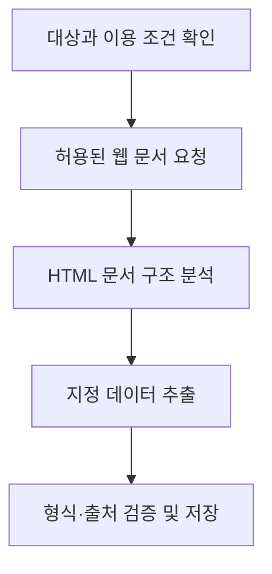
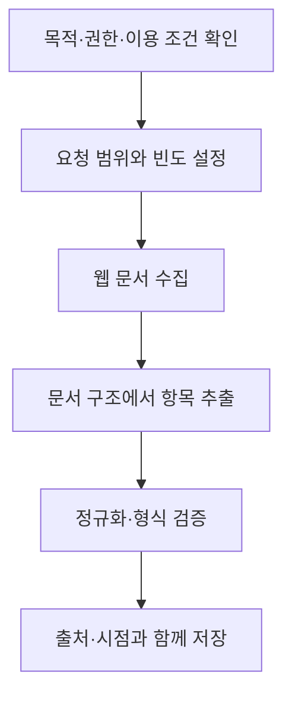

## 지식 로드맵 내 현재 위치

지식 위치: 소프트웨어공학 → 시스템 연계 및 인터페이스 → 데이터 수집 및 연계 → **스크래핑(Scraping)**
---

## 30초 인출

- 본질: **스크래핑(Scraping)은** 웹 문서에서 필요한 정보를 프로그램으로 추출하는 기술
- 메커니즘: 대상·이용 조건 확인 → 문서 수집 → 구조 분석 및 추출 → 검증·정제·저장
- 구분: 크롤링은 페이지와 링크를 찾아 수집하는 과정, 스크래핑은 수집한 문서에서 지정한 데이터를 추출하는 과정

핵심 용어

- **스크래핑(Scraping):** 웹 문서나 화면에서 지정한 데이터를 프로그램으로 찾아 추출하는 처리
- **웹 크롤링(Web Crawling):** 링크를 따라 웹 자원을 자동으로 찾아 요청·수집하는 처리
- **DOM(Document Object Model):** HTML 문서를 요소·속성·텍스트의 트리로 표현하는 객체 모델
- **XPath(XML Path Language):** XML·HTML 트리에서 노드나 속성을 지정해 찾는 경로 표현 언어
- **ETL(Extract, Transform, Load):** 데이터를 추출하고 변환한 뒤 목적지에 적재하는 처리 흐름
- **API(Application Programming Interface):** 프로그램이 정해진 요청·응답 규약에 따라 기능이나 데이터를 이용하는 인터페이스

---

## 1교시 예상문제 (10점)

> 스크래핑의 정의와 목적, 기본 추출 절차를 설명하시오. (예상)

---

## 1교시 10점 답안

### Ⅰ. 개요

| 구분 | 핵심 |
|---|---|
| 정의 | 웹 문서에서 지정한 정보를 프로그램으로 추출하는 기술 |
| 목적 | 허용된 웹 정보의 선택적 수집·분석·연계 |

### Ⅱ. 크롤링과 스크래핑의 구분

| 구분 | 주요 역할 | 결과 |
|---|---|---|
| 웹 크롤링 | 링크를 따라 자원 위치를 발견하고 문서를 수집 | 웹 자원·문서 집합 |
| 스크래핑 | 문서 구조에서 지정 항목을 식별해 추출 | 선별된 데이터 |

### Ⅲ. 기본 처리 흐름

제언: API 제공 여부와 수집 권한을 먼저 확인한 뒤 목적에 맞는 수집 방식을 선택

---

## 2~4교시 예상문제 (25점)

> 스크래핑의 정의와 목적을 설명하고, 웹 문서에서 필요한 정보를 추출하는 기본 구조와 절차를 서술하시오. (예상)

---

## 2~4교시 25점 답안

## Ⅰ. 정의와 적용 목적

### 1. 정의와 목적

| 구분 | 핵심 |
|---|---|
| 정의 | 웹 문서에서 지정한 정보를 프로그램으로 추출하는 기술 |
| 목적 | 허용된 웹 정보의 선택적 수집·분석·연계 |

### 2. 크롤링과의 관계

| 관점 | 크롤링 | 스크래핑 |
|---|---|---|
| 중심 작업 | 링크·주소를 탐색해 문서 수집 | 문서에서 지정 항목 추출 |
| 관계 | 스크래핑 대상 문서를 찾는 데 사용 가능 | 크롤러와 함께 쓰이거나 독립 수집 결과에 적용 |

## Ⅱ. 데이터 처리 절차와 기술 요소

### 1. 처리 절차

### 2. 기술 요소 선택

| 입력 문서 특성 | 적용 기술 | 고려 사항 |
|---|---|---|
| 정적 HTML | HTTP 요청, HTML 파서 | 응답 상태·인코딩·문서 구조 확인 |
| 자바스크립트 렌더링 결과가 필요 | 브라우저 자동화 도구 | 자원 사용량과 실제 서비스 허용 조건 고려 |
| 요소 위치가 문서 계층에 종속 | DOM 선택자 또는 XPath | 구조 변경에 따른 선택자 오류 감시 |
| 반복 수집·후처리 필요 | 작업 스케줄러와 ETL(Extract, Transform, Load) 처리 | 중복·누락·형식 오류 점검 |

## Ⅲ. 운영 위험과 통제

| 위험 | 통제 방안 |
|---|---|
| 문서 구조 변경으로 추출 누락·오류 | 필수 필드·자료형 검증, 오류 알림, 선택자 변경 이력 관리 |
| 과도한 요청으로 원천 서비스에 부담 | 요청 빈도·동시성 제한, 캐시, 서버가 제시한 이용 조건 준수 |
| 개인정보·저작물 등 권리 침해 | 수집 근거와 이용 목적 확인, 최소 수집, 보유·재이용 범위 관리 |
| 인증정보·수집 데이터 노출 | 인증정보 분리 보관, 접근 통제, 전송·저장 보호, 보유기간 설정 |

## Ⅳ. 연계 방식 선택

| 조건 | 우선 검토 방식 |
|---|---|
| 제공자가 공식 API를 제공하고 이용 요건을 충족 | 문서화된 API와 인증 규약 사용 |
| API가 없고 웹 수집이 허용된 공개 자료 | 범위를 제한한 수집과 출처·갱신 시점 기록 |
| 개인신용정보 전송요구권이 적용되는 금융 마이데이터 업무 | 제도상 표준 API와 관련 절차 적용 |

금융위원회는 금융 마이데이터 사업자가 2022년 1월 5일부터 API 방식으로 서비스를 제공하고 해당 업무의 스크래핑을 금지한다고 안내했다. 이 제한은 해당 금융 마이데이터 사업 범위에 관한 것이므로 모든 웹 스크래핑에 일반화하지 않음.

## Ⅴ. 기술사적 제언

| 한계 | 해결 방안 |
|---|---|
| 화면 구조에 의존하는 추출은 변경에 취약하고, 권리·이용 조건을 놓치면 서비스 위험 발생 | API를 우선 검토하고, 스크래핑이 필요한 경우 목적·권한·요청량·검증·보유기간을 수집 정책에 반영 |

---

## 참고 자료

- [금융위원회, 금융 마이데이터 전면시행 안내(2022-01-04)](https://www.fsc.go.kr/no010101/77182)
- [국가법령정보센터, 신용정보의 이용 및 보호에 관한 법률 제33조의2](https://www.law.go.kr/법령/신용정보의이용및보호에관한법률/제33조의2)
- [MDN, Introduction to the DOM](https://developer.mozilla.org/en-US/docs/Web/API/Document_Object_Model/Introduction)

---

## 연결 토픽

- [SOAP](./037_soap.md): XML 기반 웹 서비스 연계 방식
- [API 게이트웨이](./075_api_gateway.md): API 호출의 인증·정책·트래픽 관리
- [AI 컴플라이언스](./063_ai_generated_code_license_compliance.md): 데이터와 소프트웨어 이용 조건 검토
