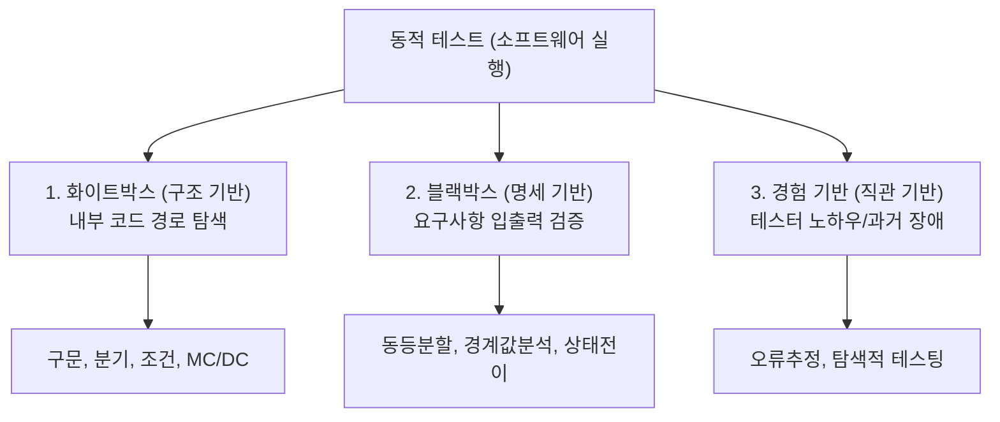

> **로드맵 경로**: 소프트웨어공학 > 소프트웨어 테스트 및 품질 > 소프트웨어 테스팅 > 동적 테스트(Dynamic Testing)

---

## 큰 그림과 30초 인출

```text
[동적 테스트(Dynamic Testing)]
 ├── 본질: 실제 런타임 환경에서 코드를 직접 실행(Execution)하여 결함 및 비기능 거동 검증
 ├── 3대 분류: 화이트박스(구조/코드 커버리지) + 블랙박스(명세/동등분할) + 경험기반(탐색적)
 ├── 필수 요소: 테스트 데이터 + 4대 테스트 오라클(참, 샘플링, 휴리스틱, 일관성)
 ├── 정적 vs 동적: 정적(결함 원인/싸게 조기 차단) vs 동적(런타임 고장 입증/실행 필수)
 └── 거버넌스: SonarQube(정적) → JUnit/Testcontainers(동적 단위·통합) → k6/DAST(동적 성능·보안)
```

- **30초 인출 구호**: "실행 기반 런타임 고장 검출! 구조(화이트)와 명세(블랙), 4대 테스트 오라클, 정적-동적 연속 파이프라인!"

---

## 핵심 용어 (5개 내외)

| 핵심 용어 | 영문 표기 | 핵심 정의 및 특징 |
|---|---|---|
| **동적 테스트** | Dynamic Testing | 소프트웨어를 실제 구동 환경에서 실행하며 입력 대비 실제 출력과 기대값을 비교하는 테스트 |
| **테스트 오라클** | Test Oracle | 테스트 실행 결과의 성공/실패 여부를 판단하기 위해 사전에 정의된 참값 및 판별 메커니즘 |
| **화이트박스 테스팅** | White-box Testing | 소프트웨어 내부 소스코드의 제어 흐름과 데이터 경로를 직접 분석하여 검증하는 구조 기반 기법 |
| **블랙박스 테스팅** | Black-box Testing | 내부 구현 코드를 보지 않고 요구사항 명세서 기반으로 입출력의 유효성을 검증하는 명세 기반 기법 |
| **테스트컨테이너** | Testcontainers | 임시 데이터베이스 및 메시지 브로커를 컨테이너로 띄워 동적 테스트의 환경 독립성과 멱등성을 보장하는 기술 |

---

## 25점형 답안 프레임워크

### [예상 문제]
> "소프트웨어 동적 테스트(Dynamic Testing)의 개념과 정적 테스트(Static Testing)와의 차이점을 비교하고, 동적 테스트의 3대 분류 체계(화이트박스, 블랙박스, 경험기반) 및 4대 테스트 오라클의 유형과 CI/CD 파이프라인 내 컨테이너 기반 동적 테스트 자동화 전략을 제시하시오."

---

### Ⅰ. 실제 실행 기반의 런타임 품질 검증, 동적 테스트의 개요

#### 1. 동적 테스트의 정의
- 소프트웨어를 **실제 컴퓨터 환경에서 실행(Execution)하면서 입력값에 따른 실제 출력값과 기대 결과를 비교하여 결함을 검출하고 비기능 품질 속성을 평가하는 테스트 기법**.

#### 2. 동적 테스트의 공학적 필요성
- **런타임 고장(Failure) 검출**: 정적 분석만으로는 식별할 수 없는 동시성 교착상태(Deadlock), 메모리 누수, 응답 지연 등 동적 거동 검증.
- **실행 인프라 정합성 확인**: OS, DB, 네트워크 등 실제 운영 런타임 환경과의 상호작용 검증.

---

### Ⅱ. 정적 테스트 vs 동적 테스트 심층 비교

| 비교 항목 | 정적 테스트 (Static Testing) | 동적 테스트 (Dynamic Testing) |
|---|---|---|
| **실행 여부** | **소프트웨어를 실행하지 않음** (Non-Execution) | **소프트웨어를 직접 실행함** (Execution) |
| **대상 산출물** | 요구사항 명세서, 아키텍처 설계서, 소스코드 텍스트 | 컴파일된 바이너리, 실행 모듈, 컨테이너 인스턴스 |
| **수행 기법** | 워크스루, 인스펙션, 동료검토, SAST 정적 린트 | 화이트박스/블랙박스 테스트, DAST, 성능 부하 테스트 |
| **검출 결함** | 코딩 표준 위반, 문법 오류, 논리적 결함, 설계 누락 | 런타임 메모리 누수, 무한 루프, 동시성 경합, 성능 병목 |
| **결함 수정 비용** | **매우 저렴 (개발 초기 즉시 수정, Shift-Left)** | 상대적으로 고비용 (환경 구축 및 런타임 디버깅 필요) |
| **테스트 오라클** | 불필요 (사전 정의된 체크리스트 대조) | **필수 (기대 결과와 실제 출력값의 비교 기준)** |

---

### Ⅲ. 동적 테스트의 3대 분류 체계 및 4대 테스트 오라클

#### 1. 동적 테스트 3대 분류 체계



| 분류 | 검증 대상 | 핵심 기법 | 주요 적용 단계 |
|---|---|---|---|
| **화이트박스 (구조 기반)** | 내부 소스코드 및 제어 흐름 경로 | 구문, 분기, 조건, MC/DC 커버리지 | 단위 테스트 (Unit Test) |
| **블랙박스 (명세 기반)** | 기능 요구사항 명세서의 입출력 관계 | 동등 분할(EP), 경계값 분석(BVA), 페어와이즈 | 통합 및 시스템 테스트 |
| **경험 기반 (직관 기반)** | 명세화되지 않은 엣지 케이스 및 휴리스틱 | 오류 추정(Error Guessing), 탐색적 테스팅 | 인수 테스트, 버그 바운티 |

#### 2. 4대 테스트 오라클(Test Oracle)의 유형
- **참 오라클 (True Oracle)**: 모든 입력에 대해 완벽한 기대 결과를 제공하는 전수 검증 오라클 (미션 크리티컬 항공/원전 시스템).
- **샘플링 오라클 (Sampling Oracle)**: 무한한 입력 중 주요 표본값에 대해서만 사전에 기대 결과를 도출해 검증하는 오라클.
- **휴리스틱 오라클 (Heuristic Oracle)**: 특정 입력값에 대한 근사치나 휴리스틱 알고리즘을 활용해 결과의 유효성을 확률적으로 판단.
- **일관성 오라클 (Consistent Oracle)**: 이전 버전의 실행 결과 또는 경쟁 시스템의 결과와 현재 시스템의 출력을 상호 비교 (회귀 테스트).

---

### Ⅳ. 동적 테스트 운용 시 발생 위험 및 대응 전략

| 위험 | 대책 | 효과 |
|---|---|---|
| **정적 분석 100% 통과 후 실운영 환경에서 OOM 및 자원 고갈 다운** | k6 부하 생성기와 APM 프로파일러를 연동한 24시간 내구 동적 테스트(Soak Test) 수행 | 런타임 메모리 누수 배포 전 100% 사전 색출 |
| **외부 연계망 통신 두절로 인한 동적 통합 테스트 파이프라인 중단** | WireMock 및 Testcontainers 기반 독립적 격리 모킹(Mocking) 환경 구축 | 외부 환경 종속 없는 동적 테스트 멱등성 100% 확보 |
| **GUI 수동 동적 테스트 의존으로 인한 배포 리드타임 수 주 지연** | 테스트 피라미드 재편(단위 동적 테스트 70%, API 20%, E2E 10% 자동화) | 회귀 동적 검증 소요 시간 수 주에서 15분으로 단축 |
| **테스트 기대 결과 산출 불가로 인한 테스트 오라클 부재 문제** | 메타모픽 테스팅(Metamorphic Testing) 및 변이 테스트 연계 검증 | 복잡 알고리즘 및 AI 모델의 동적 검증 가능성 확보 |

---

### Ⅴ. 기술사적 제언: 정적-동적 연속 품질 파이프라인 및 Testcontainers 거버넌스


1. **정적-동적 테스트의 상호보완적 결합**:
   - 정적 테스트는 "결함의 원인(Fault)"을 조기에 적은 비용으로 잡고, 동적 테스트는 "런타임 고장(Failure)"을 증명함. **정적 분석(SonarQube) $\rightarrow$ 동적 단위 테스트(JUnit) $\rightarrow$ 동적 성능/보안 테스트(k6/DAST)**로 이어지는 연속적 품질 파이프라인을 구축해야 함.
2. **컨테이너 기반 동적 테스트 멱등성 보장**:
   - 동적 테스트의 성패는 "언제 어디서 실행해도 동일한 결과를 내는 결정론적 환경"에 달려 있음. **Testcontainers**를 통해 DB, 캐시, 메시지 큐를 도커 컨테이너로 동적 생성·실행·폐기함으로써 공유 개발 환경의 데이터 오염을 원천 방지해야 함.

---

## 1교시 10점형 답안 발췌 (핵심 서술형)

- **동적 테스트(Dynamic Testing)**는 소프트웨어를 실제 런타임 환경에서 실행(Execution)하면서 입력 대비 출력값을 기대 결과(Test Oracle)와 비교하여 기능 및 비기능 결함을 검출하는 활동이다.
- 코드를 실행하지 않는 **정적 테스트(인스펙션, SAST)**와 달리 메모리 누수, 교착상태 등 실제 런타임 거동을 검증하며, 구조 기반의 **화이트박스**, 명세 기반의 **블랙박스**, 직관 기반의 **경험기반 테스트**로 분류된다. 최근에는 Testcontainers 기술을 결합하여 격리된 컨테이너 환경에서 동적 테스트를 100% 자동화하는 추세이다.

---

## 출제 이력 및 기출 분석

- **정보관리기술사**: 86회, 101회, 117회, 137회 (정적 테스트와 동적 테스트의 비교, 화이트박스 커버리지, 동적 테스트 기법 융합)
- **컴퓨터시스템응용기술사**: 97회, 115회, 129회 (동적 테스팅 분류 체계, 테스트 오라클의 4대 유형, 성능/부하 테스트)
- **출제 경향성**: 137회 2교시 기출과 같이 정적/동적 테스트의 단순 대비를 넘어, SDLC 각 단계별 최적 매핑 전략 및 런타임 동적 테스트를 위한 테스트 오라클 해결 방안, CI/CD 자동화 도구 연계 모델을 제시할 때 최고 득점으로 연결됨.

---

## 실전 작성 팁 & 감점 방지

- **정적-동적 테스트 대비표 필수**: 1단락 또는 2단락에서 실행 여부, 대상, 검출 결함, 수정 비용 등 6개 이상의 비교축을 가진 표를 반드시 제시할 것.
- **4대 테스트 오라클 언급**: 참, 샘플링, 휴리스틱, 일관성 오라클의 개념을 명확히 구분하여 작성할 것.
- **현대적 도구 명시**: 화이트박스 커버리지 도구(JaCoCo), 컨테이너 격리 도구(Testcontainers), 부하 도구(k6) 등 구체적인 툴셋을 명시할 것.

---

## 연결 토픽

- [인스펙션(Inspection)](./058_inspection.md) : 소프트웨어를 실행하지 않는 대표적 정형 정적 테스트
- [회귀테스트](./061_regression_test.md) : 변경 후 동적 회귀 결함을 차단하는 자동화 테스트 기법
- [소프트웨어 테스트 원리](./070_software_testing_principles.md) : ISTQB 7대 기본 공리와 결함 집중의 원리
- [메타모픽 테스팅](./030_metamorphic_test.md) : 테스트 오라클 부재 문제를 극복하는 특수 동적 테스팅 기법

