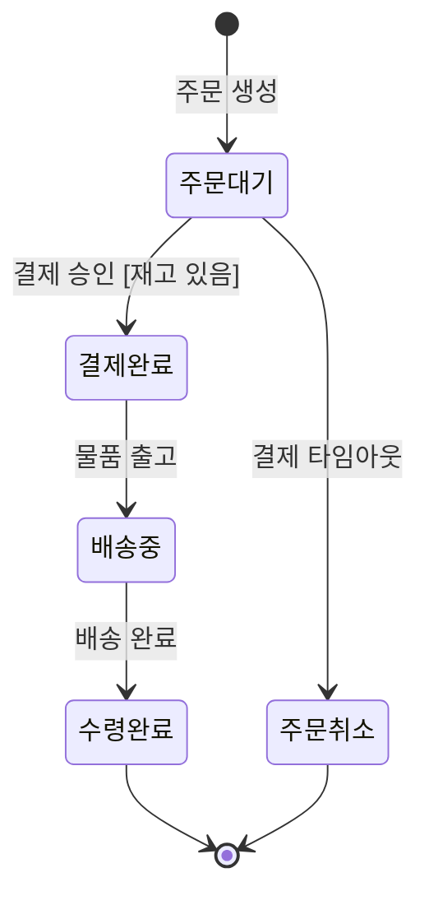

## 지식 로드맵 내 현재 위치

지식 위치: 소프트웨어공학 → 소프트웨어 분석 및 설계 → UML 모델링 → **상태 다이어그램(State Diagram)**
---

## 30초 인출

- 본질: **상태 다이어그램**은 단일 객체가 외부 이벤트에 반응해 상태가 변하는 생애주기를 유한 상태 머신(FSM)으로 모델링한 UML 행위 다이어그램
- 메커니즘: 이벤트 발생 → 가드 조건 `[조건]` 판정 → 상태 전이 → 액션(Entry/Do/Exit) 실행
- 판정 기준: 상태 폭발은 복합 상태·직교 영역·이력 상태(H)로 압축하고 불법 전이는 전이 규칙으로 원천 차단

핵심 용어

- **유한 상태 머신(FSM: Finite State Machine)**: 객체가 가질 수 있는 유한한 개수의 상태와 외부 입력에 따른 전이를 수학적으로 모델링한 기법
- **가드 조건(Guard Condition)**: 상태 전이가 실행되기 위해 반드시 참(True)으로 평가되어야 하는 전이 사전 조건 (`[조건]`)
- **상태 폭발(State Explosion)**: 도메인의 복잡도 증가에 따라 상태와 전이의 조합 수가 기하급수적으로 폭증하는 현상
- **복합 상태(Composite State)**: 상태 폭발을 방지하기 위해 여러 하위 상태를 묶어 계층화한 슈퍼 상태(Super-state)
- **이력 상태(History State, H)**: 복합 상태를 벗어났다가 재진입할 때 이전에 머물렀던 마지막 활성 하위 상태를 복원하는 의사 상태

---

## 1교시 예상문제 (10점)

> 상태 다이어그램(State Diagram)의 정의와 목적, 핵심 구조와 작동 원리를 설명하시오. (예상)

---

## 1교시 10점 답안

- **상태 다이어그램(State Diagram)**은 유한 상태 머신(FSM) 이론에 기반하여 단일 객체가 생애주기 동안 외부 이벤트에 반응하여 변화하는 상태와 전이 규칙을 모델링한 UML 행위 다이어그램이다.
- 상태(State), 전이(Transition), 이벤트(Event), 가드 조건(Guard), 액션(Action)의 5대 요소로 구성되며, 상태 수가 기하급수적으로 폭증하는 상태 폭발 문제는 **복합 상태, 직교 영역, 이력 상태($H$)** 기법으로 해결한다. 실무에서는 boolean 플래그 남발을 지양하고 GoF State 패턴이나 Spring State Machine 프레임워크를 적용하여 런타임 불법 전이를 원천 차단한다.
---

### 핵심 관계

---

## 2~4교시 예상문제 (25점)

> "UML 2.x 행위 다이어그램 중 상태 다이어그램(State Diagram)의 개념과 핵심 구성요소를 설명하고, 상태 폭발(State Explosion) 문제의 해결 기법 및 GoF State 디자인 패턴과 Spring State Machine을 연계한 실무 구현 전략을 제시하시오."

---

> (25점, 예상)

---

## 2~4교시 25점 답안

### Ⅰ. 단일 객체 생애주기 모델링의 정수, 상태 다이어그램의 개요

#### 1. 상태 다이어그램의 정의
- UML 행위(Behavior) 다이어그램의 일종으로, **단일 객체(또는 시스템)가 생애주기 동안 겪는 모든 가능한 상태(State)와 외부 이벤트(Event)에 의한 상태 전이(Transition) 및 동작 규칙을 유한 상태 머신(FSM) 이론에 기반하여 시각화한 모델링 도구**.

#### 2. 핵심 도입 필요성
- **상태 의존적 복합 로직 제어**: 주문, 결제, 장비 제어 등 현재 상태에 따라 허용되는 행위가 달라지는 도메인의 불법 전이 원천 방지.
- **조건문 지옥(Anti-pattern) 탈피**: 수십 개의 if-else 및 boolean 플래그 변수로 뒤엉킨 스파게티 코드를 정형화된 전이 규칙으로 추상화.
---

### Ⅱ. 상태 다이어그램 구성요소 및 전이 구조

#### 1. 주문(Order) 도메인 상태 다이어그램 구조도

#### 2. 5대 핵심 구성요소

| 구성요소 | 표기법 및 표기 형식 | 의미 및 동작 규칙 |
|---|---|---|
| **상태 (State)** | 모서리가 둥근 사각형 | 객체가 특정 조건을 만족하거나 활동을 수행하는 기간 (Entry, Do, Exit 기술) |
| **전이 (Transition)** | 실선 화살표 | 특정 이벤트 발생 시 객체가 한 상태에서 다른 상태로 이동하는 경로 |
| **이벤트 (Event)** | 전이선 위 텍스트 | 전이를 촉발하는 외부 자극 (메서드 호출, 신호 수신, 타임아웃) |
| **가드 조건 (Guard)** | `[Boolean 식]` | 전이가 성립하기 위해 반드시 참(True)이어야 하는 조건 (거짓이면 전이 차단) |
| **액션 (Action)** | `/ action_name()` | 전이 시점이나 상태 진입/탈출 시 중단 없이 원자적(Atomic)으로 실행되는 연산 |
---

### Ⅲ. UML 3대 행위 다이어그램 비교 및 상태 폭발 해결 방안

#### 1. UML 3대 행위 다이어그램 비교

| 비교 항목 | 유스케이스 다이어그램 (Use-Case) | 활동 다이어그램 (Activity) | 상태 다이어그램 (State) |
|---|---|---|---|
| **모델링 관점** | 시스템 외부 요구사항 (What) | 비즈니스 업무 처리 흐름 (How Flow) | **단일 객체의 생애주기 (How Life-cycle)** |
| **핵심 초점** | 액터와 시스템 간의 기능적 상호작용 | 처리 단계(Step), 분기, 병렬 동기화 | **이벤트에 따른 내부 상태 변화 및 가드 조건** |
| **적용 단위** | 전체 시스템 범위 | 비즈니스 프로세스, 알고리즘 로직 | **상태 의존적인 핵심 도메인 객체 단위** |
| **주요 산출물** | 유스케이스 명세서, 기능 요구사항서 | 업무 흐름도, 트랜잭션 흐름 설계서 | 상태 전이표, 상태 머신 도메인 클래스 |

#### 2. 상태 폭발(State Explosion) 문제의 3대 해결 기법
1. **복합 상태 (Composite State)**: 연관된 하위 상태들을 묶어 슈퍼 상태(Super-state)로 계층화하여 전이선의 복잡도 축소.
2. **직교 영역 (Orthogonal Region)**: 독립적으로 병렬 동작하는 서브 상태들을 점선으로 구획하여 동시성 표현 ($M \times N$ 조합을 $M + N$으로 압축).
3. **이력 상태 (History State, $H$)**: 복합 상태를 일시 탈출했다가 재진입할 때, 초기 상태 대신 이전에 머물렀던 마지막 활성 하위 상태를 기억하여 복원.
---

### Ⅳ. 상태 다이어그램 운용 시 발생 위험 및 대응 전략

| 위험 | 대책 | 효과 |
|---|---|---|
| **환불 처리 중인 주문이 배송 완료로 잘못 전이되는 불법 전이 발생** | 상태 다이어그램 전이 매트릭스 도출 및 Spring State Machine 기반 불법 전이 예외화 | 불법 상태 전이로 인한 비즈니스 사고 차단 |
| **주문 상태를 다수의 boolean 플래그로 관리하여 조건문 충돌 발생** | GoF State 디자인 패턴을 적용하여 상태별 행위를 독립 클래스로 캡슐화 | 조건문 복잡도 감소 및 코드 가독성 확보 |
| **사용자의 결제창 방치로 인한 재고 락(Lock) 고갈 및 타 고객 구매 불가** | 상태 진입 시 타이머를 가동하는 Entry 액션과 타임아웃 이벤트 명세 | 방치 주문 자동 취소 및 재고 즉시 회수 |
| **설계서의 상태 다이어그램과 소스코드의 상태 구현 불일치** | XState 또는 상태 머신 엔진을 활용하여 다이어그램을 소스코드로 직접 컴파일 | 모델-코드 간 정합성 유지 |
---

### Ⅴ. 기술사적 제언: 실행 가능한 상태 머신(Executable State Machine) 및 분산 사가 거버넌스

### 학습자 통찰 메모 — 답안 밖

- `[핵심 통찰]`: 실무에서 상태 다이어그램 없이 주문/결제 도메인을 짜면 수십 개의 boolean 플래그와 if-else 조건문 지옥에 빠진다. 상태 다이어그램은 단순한 문서가 아니라 '허용되지 않은 불법 전이를 컴파일/런타임에 원천 차단'하는 강력한 방화벽이며, 상태 폭발은 복합 상태(계층화)와 직교 영역(동시성), 이력 상태(H)로 압축해야 한다. 현대 MSA 환경에서는 이벤트 기반의 사가(Saga) 오케스트레이터와 보상 트랜잭션 전이 경로로 확장된다.
- `나라면`: 실전 답안에서 5대 핵심 요소(상태-전이-이벤트-가드-액션)의 표준 표기 형식을 정확히 도해하고, 2단락에서 유스케이스(외부) vs 활동(프로세스) vs 상태(객체 생애주기)의 관점 차이를 비교한 뒤, 3단락에서 Spring State Machine 및 MSA 사가(Saga) 보상 트랜잭션 전이 모델을 제시하겠다.

### 실전 답안용 기술사적 제언
- **판정 기준**: 도메인 객체의 생애주기 상태 전이 시 가드 조건(재고, 결제 유효성) 충족 여부 및 비정상 이벤트 유입 시 불법 전이 예외 발생 여부를 기준으로 전이 타당성을 판정함.
- **대응 방안**: 소스코드 레벨에서 if-else 플래그를 전면 제거하고 GoF State 패턴 및 Spring State Machine 프레임워크를 적용하여 상태별 행위 캡슐화와 전이 검증을 런타임 엔진에 위임함.
- **검증 체계**: 상태 폭발 방지를 위한 직교 영역 및 복합 상태 계층을 검증하고, MSA 분산 사가 오케스트레이터와 결합하여 장애 시 보상 트랜잭션(Compensating Transaction) 전이 경로를 자동 검증함.
- **기대 효과**: 비정상적 상태 전이로 인한 재고/결제 정산 사고를 차단하고, 분산 트랜잭션 환경에서 궁극적 일관성(Eventual Consistency)을 확보함.
---

## 출제 이력 및 기출 분석

- **정보관리기술사**: 88회, 106회, 121회, 137회 (UML 3대 행위 다이어그램 비교, 상태 다이어그램 구성요소, 상태 폭발 해결 방안)
- **컴퓨터시스템응용기술사**: 94회, 119회 (FSM 상태 전이 모델링, GoF State 디자인 패턴과의 매핑, 임베디드 제어 상태 설계)
- **출제 경향성**: 단순 상태 표기법 나열을 넘어, 137회 기출과 같이 유스케이스 및 활동 다이어그램과의 관점 비교, 상태 폭발 해결 3대 기법, 그리고 MSA 환경의 분산 사가 오케스트레이션과 연계된 실행 가능한 상태 머신 설계를 제시할 때 최고 득점으로 연결됨.
---

## 실전 작성 팁 & 감점 방지

- **5대 구성요소 표기법 준수**: 상태(둥근 사각), 전이(화살표), 가드(`[조건]`), 액션(`/액션`)의 표준 표기법을 명확히 작성할 것.
- **상태 폭발 해결책 3가지 명시**: 복합 상태(계층화), 직교 영역(동시성), 이력 상태(복원)의 영문과 기호를 누락 없이 서술할 것.
- **실제 도메인 사례 적용**: 주문/결제 또는 통신 세션 등 명확한 도메인 시나리오를 바탕으로 상태 다이어그램을 도해할 것.
---

## 연결 토픽

- [클래스 다이어그램](./045_class_diagram.md) : 객체의 정적 구조와 관계를 모델링하는 구조 다이어그램
- [소프트웨어 아키텍처](./056_software_architecture.md) : 컴포넌트 간 상호작용과 상태 거버넌스
- [이벤트 주도 아키텍처(EDA)](./078_event_driven_architecture.md) : 상태 전이 이벤트를 비동기로 중계하는 분산 아키텍처
