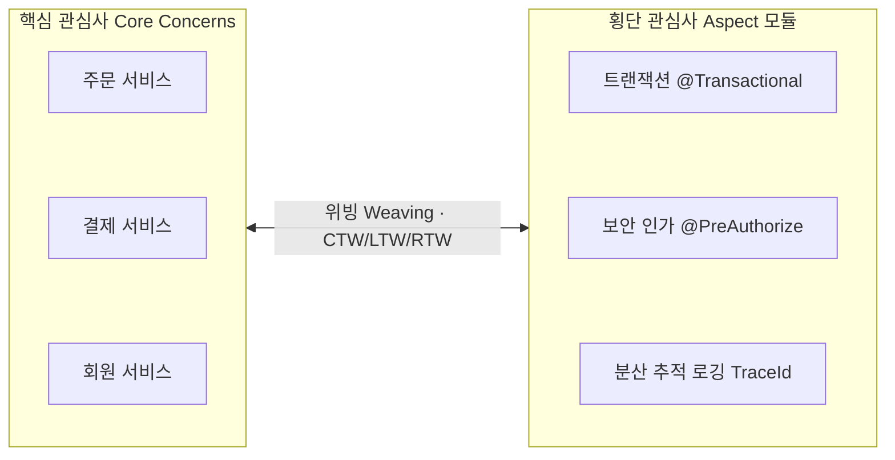

> **로드맵 경로**: 소프트웨어공학 > 소프트웨어 아키텍처 및 구현 > 프로그래밍 패러다임 > AOP(Aspect Oriented Programming)
---

## 30초 인출

- 본질: **AOP(Aspect Oriented Programming)**는 트랜잭션·로깅·보안 같은 횡단 관심사를 핵심 비즈니스 로직에서 분리해 독립 모듈(Aspect)로 만드는 프로그래밍 패러다임
- 메커니즘: Pointcut이 Joinpoint를 선별 → Advice를 위빙(CTW/LTW/RTW) → Spring AOP는 프록시(JDK Dynamic·CGLIB)로 런타임 결합
- 판정 기준: 인프라 관심사만 AOP에 두고, 내부 호출(Self-invocation) 우회 여부와 `@Order` 실행 순서를 검증 기준으로 삼음
---

핵심 용어

- **횡단 관심사(Cross-cutting Concerns)**: 로깅, 트랜잭션, 보안 등 여러 모듈에 공통으로 분산되어 비즈니스 로직을 오염시키는 부가 기능
- **애스펙트(Aspect)**: 횡단 관심사를 모듈화한 단위로, 부가 기능 코드(Advice)와 적용 위치(Pointcut)를 결합한 모듈
- **포인트컷(Pointcut)**: 프로그램 내 수많은 조인포인트(Joinpoint) 중 실제로 어드바이스를 적용할 위치를 선별하는 표현식
- **어드바이스(Advice)**: 타깃 객체의 조인포인트에 삽입되어 실제로 동작하는 부가 기능 코드 (@Before, @Around 등)
- **위빙(Weaving)**: 포인트컷으로 지정된 타깃 지점에 애스펙트(Advice)를 결합하는 프로세스 (CTW, LTW, RTW)
- **CTW(Compile-Time Weaving)**: AspectJ 컴파일러가 컴파일 시점에 바이트코드를 직접 변조하는 위빙
- **LTW(Load-Time Weaving)**: 클래스 로딩 시점에 에이전트가 바이트코드를 동적으로 조작하는 위빙
- **RTW(Runtime Weaving)**: 런타임에 프록시 객체로 타깃을 감싸 결합하는 위빙 (Spring AOP 방식)

---

## 1교시 예상문제 (10점)

> AOP(Aspect Oriented Programming)의 정의와 목적, 핵심 구조와 작동 원리를 설명하시오. (예상)
---

## 1교시 10점 답안

- **AOP(Aspect Oriented Programming)**는 시스템 전반에 분산된 횡단 관심사(트랜잭션, 로깅, 보안 등)를 핵심 비즈니스 로직으로부터 분리하여 독립된 모듈(Aspect)로 관리하는 프로그래밍 패러다임이다.
- Aspect, Joinpoint, Pointcut, Advice, Target의 5대 구성요소를 기반으로 동작하며, 컴파일 타임(CTW), 로드 타임(LTW), 런타임 프록시(RTW, Spring AOP)의 3대 위빙 방식으로 결합된다. 실무에서는 프록시 기반 AOP의 한계인 내부 호출(Self-invocation) 문제를 방지하기 위해 빈을 구조적으로 분리하고, `@Order`로 다중 애스펙트의 실행 순서를 엄격히 통제해야 한다.
---

### 핵심 관계

---

## 2~4교시 예상문제 (25점)

> "객체지향 프로그래밍(OOP)의 횡단 관심사 분리 한계를 극복하기 위한 관점 지향 프로그래밍(AOP)의 개념과 5대 핵심 구성요소를 설명하고, 3대 위빙(Weaving) 방식 비교 및 Spring AOP 프록시 메커니즘과 내부 호출(Self-invocation) 문제 해결 방안을 제시하시오."
---

> (25점, 예상)
---

## 2~4교시 25점 답안

### Ⅰ. 모듈성 극대화와 횡단 관심사 분리, AOP의 개요

#### 1. AOP의 정의
- 시스템 전반에 걸쳐 분산되어 나타나는 **횡단 관심사(Cross-cutting Concerns: 트랜잭션, 보안, 로깅, 성능 측정 등)를 핵심 비즈니스 로직(Core Concerns)으로부터 분리하여 독립된 모듈(Aspect)로 작성하고 결합하는 프로그래밍 패러다임**.
- OOP(객체지향)를 대체하는 것이 아니라, OOP의 캡슐화 한계를 보완하는 **보완적 프로그래밍 패러다임**.

#### 2. 대두 배경: 코드 엉킴(Tangling)과 흩어짐(Scattering) 해소
- 핵심 업무 메서드마다 수십 줄의 트랜잭션 시작/커밋, 권한 체크, 예외 처리 코드가 반복 삽입되어 단일 책임 원칙(SRP)이 훼손되는 문제 해결.
---

### Ⅱ. AOP 핵심 구성요소 및 상호작용 메커니즘

#### 1. 핵심 관심사와 횡단 관심사의 분리 및 위빙(Weaving) 구조

#### 2. AOP 5대 핵심 구성요소 상세 분석

| 구성요소 | 개념 및 역할 | Spring / AspectJ 구현 예시 |
|---|---|---|
| **Aspect (관점)** | 여러 객체에 걸친 횡단 관심사를 모듈화한 독립 단위 | `@Aspect`, XML `<aop:aspect>` |
| **Joinpoint (결합점)** | Advice가 삽입될 수 있는 실행 지점 (스프링은 메서드 실행에 한정) | 메서드 호출, 생성자 호출, 필드 접근 |
| **Pointcut (선별식)** | 수많은 Joinpoint 중 실제 Advice를 적용할 타깃 지점을 선별하는 규칙 | `execution(* com.service.*.*(..))`, `@annotation(...)` |
| **Advice (조언/동작)** | 조인포인트에서 실제 실행되는 부가 기능 코드 | `@Before`, `@AfterReturning`, `@AfterThrowing`, `@Around` |
| **Target (타깃 객체)** | 핵심 비즈니스 로직을 담고 있으며 Advice가 적용되는 대상 객체 | 주문 서비스 구현체(`OrderServiceImpl`) |
---

### Ⅲ. 3대 위빙(Weaving) 방식 및 Spring AOP 프록시 메커니즘

#### 1. 3대 위빙(Weaving) 방식 비교

| 비교 항목 | 컴파일 타임 위빙 (CTW) | 로드 타임 위빙 (LTW) | 런타임 프록시 위빙 (RTW) |
|---|---|---|---|
| **적용 시점** | 소스코드 컴파일 시점 | JVM 클래스 로더 로딩 시점 | 애플리케이션 런타임 실행 시점 |
| **수행 도구** | AspectJ 전용 컴파일러(ajc) | AspectJ ClassLoader Agent | Spring AOP 프레임워크 |
| **바이트코드 조작** | 원본 .class 바이너리 직접 변조 | 메모리 로딩 시 바이트코드 동적 조작 | 원본 바이트코드 불변 (프록시 래핑) |
| **적용 가능 범위** | 메서드, 생성자, 필드, static | 메서드, 생성자, 필드, static | **오직 스프링 빈의 public 메서드 실행** |
| **실행 성능** | 최고 (프록시 오버헤드 0%) | 최고 (초기 로딩 시 1회 오버헤드) | 호출 시 프록시 체인 오버헤드 미세 발생 |

#### 2. Spring AOP의 프록시 메커니즘 (JDK Dynamic vs CGLIB)
- **JDK Dynamic Proxy**: 타깃 객체가 인터페이스를 구현하고 있을 때 사용하며, `java.lang.reflect.Proxy`를 통해 동적 인터페이스 프록시 생성.
- **CGLIB (Code Generation Library)**: 타깃 객체가 인터페이스가 없거나 구체 클래스일 때 타깃을 상속받는 서브클래스 바이트코드를 동적으로 생성 (Spring Boot 2.0+ 기본값 채택).
---

### Ⅳ. AOP 운용 시 발생 위험 및 대응 전략

| 위험 | 대책 | 효과 |
|---|---|---|
| **동일 클래스 내 메서드 호출 시 트랜잭션 롤백 누락 (Self-invocation 문제)** | 별도 서비스 빈으로 책임을 분리(SRP)하거나 AspectJ LTW 도입 | 프록시 우회 호출로 인한 데이터 불일치 차단 |
| **광범위한 포인트컷으로 인한 전사 API 응답 지연 및 자원 낭비** | 패키지 와일드카드 지양 및 커스텀 어노테이션 기반 타깃 정밀 지정(`@annotation`) | 프록시 체인 호출 오버헤드 절감 |
| **다중 Aspect 적용 시 실행 순서 꼬임으로 보안 인가 실패** | `@Order` 어노테이션을 통해 Aspect 간 실행 순서(보안 $\rightarrow$ 트랜잭션 $\rightarrow$ 로깅) 명시 | AOP 실행 순서 충돌 방지 |
| **비즈니스 로직을 Aspect에 과도하게 은폐하여 디버깅 불가 (Black Magic)** | AOP는 인프라 관심사로만 한정하고 비즈니스 연쇄 행위는 스프링 도메인 이벤트로 이관 | 코드 추적성 및 유지보수성 확보 |
---

### Ⅴ. 기술사적 제언: 인프라 AOP와 비즈니스 도메인 이벤트의 역할 분담 거버넌스

### 학습자 통찰 메모 — 답안 밖

- `[핵심 통찰]`: AOP는 OOP를 버리는 것이 아니라 OOP의 캡슐화를 완성하는 날개다. 횡단 관심사를 비즈니스 코드에서 걷어내야 SRP(단일 책임 원칙)가 구현되지만, 비즈니스 후속 작업까지 AOP에 넣으면 코드가 어디서 도는지 알 수 없는 '블랙 매직(Black Magic)'에 빠진다. 인프라 관심사는 AOP에 맡기고 비즈니스 부가 기능은 도메인 이벤트로 명시하는 역할 분담이 핵심이다.
- `나라면`: 1단락에서 핵심 관심사와 횡단 관심사의 분리 모델을 도해하고, 2단락에서 5대 구성요소와 3대 위빙(CTW·LTW·RTW)을 대조한 뒤, 3단락에서 Self-invocation(내부 호출) 프록시 우회 한계의 원인과 대책을 제시하겠다.

### 실전 답안용 기술사적 제언
- **판정 기준**: 관심사의 성격(인프라 기술 관심사 vs 비즈니스 도메인 연쇄 행위) 및 호출 경로(동일 빈 내부 호출 여부)를 기준으로 AOP 적용 적합성을 판정함.
- **대응 방안**: 트랜잭션, 인가, 분산 트레이싱 등 인프라 공통 기능에 한해 Spring AOP(CGLIB 프록시)를 적용하고, 비즈니스 후속 흐름은 ApplicationEventPublisher 기반 도메인 이벤트로 전환하며, 동일 클래스 내부 호출 문제는 별도 서비스 빈으로 분리함.
- **검증 체계**: 다중 애스펙트 적용 시 `@Order` 어노테이션을 통한 실행 순서(보안 인가 $\rightarrow$ 트랜잭션 $\rightarrow$ 로깅) 강제 및 커스텀 어노테이션 기반 정밀 포인트컷을 검증함.
- **기대 효과**: 비즈니스 코드의 순수성과 단일 책임 원칙(SRP)을 확보하고, 불필요한 프록시 체인 호출 오버헤드를 절감함.
---

## 출제 이력 및 기출 분석

- **정보관리기술사**: 82회, 103회, 115회, 129회 (AOP의 개념과 5대 구성요소, 3대 위빙 방식 비교, Spring AOP 프록시 메커니즘)
- **컴퓨터시스템응용기술사**: 91회, 118회 (횡단 관심사 분리, 디자인 패턴 프록시/데코레이터와의 연계, AspectJ와 Spring AOP 비교)
- **출제 경향성**: 5대 핵심 용어의 정의를 완벽히 도해하고, 3대 위빙(CTW, LTW, RTW)의 바이트코드 조작 관점 비교와 실무 현장의 고질적 장애인 '동일 클래스 내부 호출(Self-invocation) 시 트랜잭션 누락' 원인 및 대책을 제시할 때 합격선 점수를 획득함.
---

## 실전 작성 팁 & 감점 방지

- **5대 구성요소 영문 약어 매핑**: Aspect, Joinpoint, Pointcut, Advice, Target을 누락 없이 정확한 개념으로 1:1 매핑할 것.
- **Self-invocation 원인 도해**: 3단락 또는 실무 문제점에서 `this.innerMethod()` 호출 시 프록시 객체를 거치지 않아 AOP가 동작하지 않는 원리를 그림으로 표현할 것.
- **JDK Dynamic vs CGLIB 차이 명시**: 인터페이스 유무 및 서브클래싱 바이트코드 조작 방식을 명확히 구분하여 서술할 것.
---

## 연결 토픽

- [의존성 주입(DI)](./042_dependency_injection.md) : AOP와 함께 스프링 IoC 컨테이너를 지탱하는 핵심 메커니즘
- [SOLID 원칙](./082_solid.md) : 단일 책임 원칙(SRP)과 개방 폐쇄 원칙(OCP)을 실천하는 AOP의 기반 원리
- [객체지향 프로그래밍(OOP)](./083_oop.md) : AOP가 보완하고자 하는 핵심 프로그래밍 패러다임
