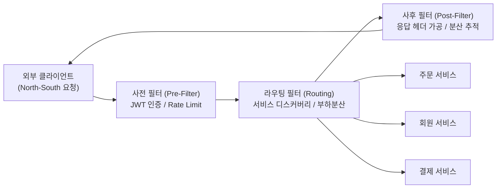
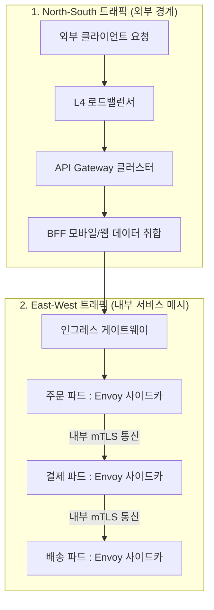

> **로드맵 경로**: 소프트웨어공학 > 분산 시스템 및 아키텍처 > 마이크로서비스(MSA) > API Gateway

---

## 큰 그림과 30초 인출

```text
[API Gateway(단일 진입점 역방향 프록시)]
 ├── 본질: 클라이언트와 백엔드 마이크로서비스 간의 단일 진입점(Single Point of Entry)
 ├── 5대 기능: 동적 라우팅/LB · 인증/인가(JWT/OAuth) · 유량제어(Rate Limiting) · 서킷브레이커 · 관측성(TraceId)
 ├── 3자 비교: API Gateway(North-South 외부경계) vs BFF(클라이언트별 데이터 취합) vs Service Mesh(East-West 내부보안)
 ├── 안티패턴: 게이트웨이에 DB 연동 및 비즈니스 로직 삽입 금지 (과거 무거운 ESB로의 퇴보 차단)
 └── 거버넌스: API Gateway(North-South 라우팅/보안) + Service Mesh(East-West mTLS) 2계층 아키텍처
```

- **30초 인출 구호**: "단일 진입점 역방향 프록시, 라우팅-인증-유량제어-서킷브레이커, North-South는 게이트웨이, East-West는 서비스메시!"

---

## 핵심 용어 (5개 내외)

| 핵심 용어 | 영문 표기 | 핵심 정의 및 특징 |
|---|---|---|
| **API 게이트웨이** | API Gateway | 모든 클라이언트 요청의 단일 진입점 역할을 수행하며 라우팅, 인증, 유량 제어를 총괄하는 리버스 프록시 |
| **BFF** | Backend for Frontend | 모바일, 웹 등 특정 클라이언트의 UI/UX 화면 요구에 맞춰 API 응답 데이터를 최적 조합(Aggregation)하는 계층 |
| **유량 제어** | Rate Limiting | Token Bucket 또는 Leaky Bucket 알고리즘을 활용하여 클라이언트별 초당 요청 수(TPS)를 제한하는 메커니즘 |
| **North-South 트래픽** | North-South Traffic | 외부 클라이언트로부터 데이터센터 또는 VPC 내부 서비스로 유입되는 인그레스(Ingress) 트래픽 |
| **서비스 메시** | Service Mesh | 마이크로서비스 간의 내부 통신(East-West)을 사이드카(Sidecar) 프록시로 중계하여 mTLS와 추적성을 제공하는 인프라 |

---

## 25점형 답안 프레임워크

### [예상 문제]
> "마이크로서비스 아키텍처(MSA) 환경에서 API Gateway의 개념과 필요성을 설명하고, 핵심 기능 및 API Gateway, BFF, Service Mesh 간의 역할 비교와 대용량 트래픽 처리를 위한 2계층 트래픽 거버넌스 구축 전략을 제시하시오."

---

### Ⅰ. 분산 마이크로서비스의 단일 관문, API Gateway의 개요

#### 1. API Gateway의 정의
- 클라이언트(웹, 모바일, 서드파티)와 백엔드 마이크로서비스 사이에 위치하여, **모든 외부 API 요청의 단일 진입점(Single Point of Entry) 역할을 수행하며 라우팅, 인증/인가, 유량 제어, 로깅, 프로토콜 변환을 일괄 대행하는 역방향 프록시(Reverse Proxy) 기반 인프라 컴포넌트**.

#### 2. 핵심 도입 필요성
- **클라이언트-서비스 간 결합도 해소**: 클라이언트가 수십 개 마이크로서비스의 내부 IP, 포트, 분할 구조를 알 필요 없이 단일 도메인으로 호출.
- **공통 횡단 관심사 중앙 집중화**: JWT 검증, SSL 종료(Termination), CORS, Rate Limiting을 게이트웨이에서 일괄 통제.
- **내부 보안 및 캡슐화**: 사설망(Private VPC) 내부 서비스를 외부에 직접 노출하지 않고 안전하게 보호.

---

### Ⅱ. API Gateway의 핵심 아키텍처 및 5대 주요 기능

#### 1. API Gateway 필터 파이프라인 구조도



#### 2. API Gateway의 5대 주요 기능

| 기능 영역 | 세부 역할 및 핵심 기술 | 실무 구현 사례 |
|---|---|---|
| **동적 라우팅 및 로드밸런싱** | 요청 경로/헤더에 따라 백엔드 인스턴스로 분기, 서비스 디스커버리(Eureka/K8s) 연계 | Spring Cloud Gateway, Kong, Envoy |
| **인증 및 인가 (Security)** | 클라이언트의 JWT 검증, API Key 유효성 체크, OAuth 2.0 토큰 인트로서펙션 | Keycloak 연동, OAuth 2.0 Resource Server |
| **유량 제어 (Rate Limiting)** | 클라이언트/IP/API별 초당 호출 수(TPS) 제한, 서비스 과부하 차단 | Token Bucket 알고리즘, Redis 분산 카운터 |
| **복원력 (Resilience)** | 백엔드 장애 시 빠른 실패(Fast Fail) 및 대체 응답(Fallback) 반환 | Resilience4j Circuit Breaker 연계 |
| **통합 관측성 (Observability)** | 전사 트랜잭션 추적을 위한 TraceId 발급 및 메트릭 수집 | OpenTelemetry, Prometheus, W3C TraceContext |

---

### Ⅲ. API Gateway vs BFF vs Service Mesh 비교

| 비교 항목 | API Gateway | BFF (Backend for Frontend) | Service Mesh |
|---|---|---|---|
| **통신 트래픽 방향** | **North-South (외부 $\rightarrow$ 내부 인그레스)** | North-South (특정 UI $\rightarrow$ 내부 연계) | **East-West (내부 서비스 $\leftrightarrow$ 내부 서비스)** |
| **배치 위치** | 시스템 최외곽 DMZ 망 (클라우드 관문) | API Gateway와 마이크로서비스 사이 계층 | 각 마이크로서비스 파드(Pod) 내 사이드카 |
| **주요 초점** | 전사 보안, 글로벌 라우팅, Rate Limit | **클라이언트(모바일/웹)별 화면 데이터 취합** | 서비스 간 상호 mTLS 보안, 카나리 배포, 추적 |
| **비즈니스 로직** | **절대 배제 (Stateless dumb pipe)** | 일부 허용 (DTO 변환, 비동기 응답 조인) | 절대 배제 (인프라 네트워크 계층) |
| **담당 주체** | 플랫폼 인프라 / DevOps 팀 | 각 프론트엔드 전담 개발팀 | 인프라 / SRE 팀 |

---

### Ⅳ. API Gateway 운용 시 발생 위험 및 대응 전략

| 위험 | 대책 | 효과 |
|---|---|---|
| **단일 장애점(SPOF) 발생으로 게이트웨이 다운 시 전사 서비스 마비** | L4 로드밸런서 하단 무상태(Stateless) 게이트웨이 오토스케일링 및 Netty 비동기 논블로킹 엔진 적용 | 시스템 가용성 99.999% 달성 및 초당 5만 TPS 탄력 처리 |
| **특정 마이크로서비스 지연이 게이트웨이 스레드 고갈 및 연쇄 마비 유발** | 서비스별 벌크헤드(Bulkhead) 격리 및 3초 타임아웃 기반 서킷 브레이커 설정 | 연쇄 장애 차단 및 타 서비스 정상 응답 100% 보장 |
| **게이트웨이에 비즈니스 로직이 누적되어 과거 '무거운 ESB'로 퇴보** | 게이트웨이는 순수 인프라 라우팅만 담당하고 화면 데이터 조합은 BFF 계층으로 분리 | 게이트웨이 무중단 유지 및 프론트엔드 배포 속도 4배 향상 |
| **대규모 분산 환경에서 요청 경로 유실로 인한 장애 추적 불가** | W3C 표준 TraceId/SpanId 헤더를 인그레스 단계에서 자동 채번하여 전파 | 전사 분산 트랜잭션 추적성 100% 확보 |

---

### Ⅴ. 기술사적 제언: North-South와 East-West의 2계층 트래픽 거버넌스



1. **스마트 엔드포인트 & 멍청한 파이프(Smart Endpoints & Dumb Pipes)**:
   - 마이크로서비스의 성공을 위해서는 게이트웨이 내부에 데이터베이스를 연결하거나 비즈니스 판단 로직을 넣는 안티패턴을 철저히 배제해야 함. 게이트웨이는 오직 무상태(Stateless) 라우팅과 보안에 집중하고, 복잡한 데이터 조합은 BFF에 위임해야 함.
2. **2계층 트래픽 아키텍처의 정립**:
   - 최외곽의 보안, 인증, 전사 유량 제어는 **API Gateway(Spring Cloud Gateway, Kong)**가 담당하고, 내부 서비스 간의 세밀한 mTLS 암호화, 동적 라우팅, 카나리 배포, 결함 주입은 **서비스 메시(Istio/Envoy)**가 전담하도록 트래픽 경계를 명확히 이원화해야 함.

---

## 1교시 10점형 답안 발췌 (핵심 서술형)

- **API Gateway**는 클라이언트와 백엔드 마이크로서비스 사이에 위치하여 단일 진입점(Single Point of Entry) 역할을 수행하는 역방향 프록시(Reverse Proxy)이다.
- 동적 라우팅, 인증/인가(JWT/OAuth 2.0), 유량 제어(Rate Limiting), 서킷 브레이커, 분산 로깅의 공통 횡단 관심사를 일괄 처리한다. 외부에서 내부로 들어오는 North-South 트래픽을 관장하며, 클라이언트 맞춤형 데이터 취합을 담당하는 **BFF** 및 내부 서비스 간 East-West 통신을 제어하는 **Service Mesh**와 상호보완적으로 연계된다.

---

## 출제 이력 및 기출 분석

- **정보관리기술사**: 110회, 117회, 123회, 133회 (API Gateway의 필요성과 주요 기능, MSA 패턴, Service Mesh와의 비교)
- **컴퓨터시스템응용기술사**: 115회, 125회 (리버스 프록시 아키텍처, Rate Limiting 알고리즘, 클라우드 인그레스 거버넌스)
- **출제 경향성**: 단순 기능 나열을 넘어 단일 장애점(SPOF) 극복을 위한 비동기 논블로킹 엔진(Netty) 채택, 과거 무거운 ESB로의 퇴보 방지(BFF 분리), 그리고 Service Mesh와의 North-South vs East-West 트래픽 역할 분담을 명확히 제시해야 고득점 달성.

---

## 실전 작성 팁 & 감점 방지

- **필터 파이프라인 도해**: Pre-filter(인증/유량제어), Routing-filter(로드밸런싱), Post-filter(로깅/헤더가공)의 3단계 처리 흐름을 도식으로 명시할 것.
- **ESB와의 차이점 강조**: ESB는 무거운 비즈니스 변환을 내장했으나, API Gateway는 경량 무상태(Stateless) 라우팅에 집중한다는 점을 대비할 것.
- **BFF 및 Service Mesh와의 3자 매트릭스**: 3단락에서 트래픽 방향, 위치, 목적, 비즈니스 로직 허용 여부를 표로 명확히 정리할 것.

---

## 연결 토픽

- [마이크로서비스 아키텍처(MSA)](./035_msa.md) : API Gateway를 단일 진입점으로 사용하는 분산 아키텍처
- [스크래핑(Scraping)](./071_scraping.md) : 비공식 화면 스크래핑을 대체하는 API 게이트웨이 기반 표준 연계
- [이벤트 주도 아키텍처(EDA)](./078_event_driven_architecture.md) : 게이트웨이 배후에서 비동기 메시지를 처리하는 백엔드 아키텍처

